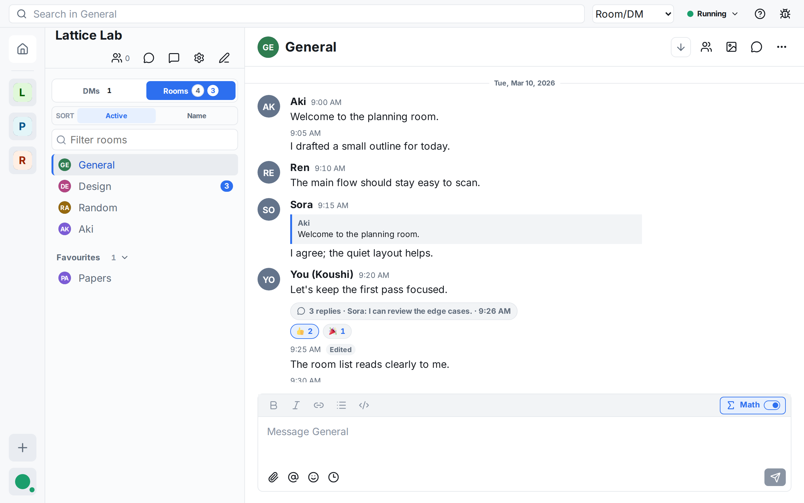

# Koushi (光子・格子)

<p align="center">
  
</p>



A desktop client for [Matrix](https://matrix.org), the open protocol for
secure, decentralized communication.

**Koushi** (コウシ) is a deliberate double pun in Japanese:

- **光子** — *photon*: light, signal, speed, communication.
- **格子** — *lattice / grid*: a direct conceptual bridge to Matrix.

The logo reflects both: a photon (the bright node) resting on a lattice, with
light running through the grid.

## Features

- End-to-end encrypted text chat, with your session kept signed in across
  restarts
- Sign in through your normal browser (OIDC)
- A familiar three-pane layout: Spaces, rooms, and direct messages
- Room timelines with threads, replies, reactions, edits, and read receipts
- Image and file uploads with captions
- Full-text search across your encrypted history, including Japanese and other
  CJK text
- Desktop conveniences: system tray, close-to-hide, and native notifications

Not included yet: voice and video calls, screen sharing, bots, widgets, and
third-party app integrations.

## Platform Support

- **macOS (Apple Silicon) — officially supported.** Releases are Developer ID
  signed, notarized, stapled, and checked by Gatekeeper before publication.
  Koushi v0.1.0 was the final release to include an Intel Mac build.
- **Windows and Linux — buildable, but untested.** The code compiles and CI
  produces installers, but the maintainer has no Windows or Linux hardware, so
  these builds are unverified and unsupported. Expect rough edges.

**Contributors wanted.** If you use Windows or Linux and can test, report bugs,
or help maintain those builds, you are very welcome — open an issue or a pull
request. The same goes for anyone who wants to work on the client itself.

## Downloads

Every synchronized desktop version bump on `main` publishes a GitHub Release
after all platform builds succeed:

- [macOS Apple Silicon DMG](https://github.com/shinaoka/koushi-matrix/releases/latest/download/Koushi-macos-arm64.dmg)
- [Windows x64 installer](https://github.com/shinaoka/koushi-matrix/releases/latest/download/Koushi-windows-x64-unsigned.exe) — untested; unsigned, so Windows SmartScreen may warn
- [Linux x64 AppImage](https://github.com/shinaoka/koushi-matrix/releases/latest/download/Koushi-linux-x64.AppImage) — untested
- [Linux x64 deb package](https://github.com/shinaoka/koushi-matrix/releases/latest/download/Koushi-linux-x64.deb) — untested
- [Linux x64 RPM package](https://github.com/shinaoka/koushi-matrix/releases/latest/download/Koushi-linux-x64.rpm) — untested
- [Latest release and checksums](https://github.com/shinaoka/koushi-matrix/releases/latest)
- [Maintainer release runbook](docs/releases/desktop-release.md)

Verify the adjacent `.sha256` file when testing any downloaded installer.

## License

This project is licensed under the [MIT](LICENSE-MIT) OR [Apache-2.0](LICENSE-APACHE) dual license.

Unless you explicitly state otherwise, any contribution intentionally submitted for inclusion in this project by you, as defined in the Apache-2.0 license, shall be licensed as above, without any additional terms or conditions.

Third-party attributions are recorded in [THIRD_PARTY_NOTICES.md](THIRD_PARTY_NOTICES.md).

## Prerequisites

Initialize the vendored Matrix SDK submodule before running Cargo commands:

```bash
git submodule update --init --recursive
```

The repository commits a top-level `Cargo.lock` for reproducible workspace
resolution. The first Cargo build still needs network access unless the
crates.io registry and git dependencies are already present in your Cargo
cache.

## Verify

Before claiming a real-account or GUI gate is green, check
[`docs/qa/known-issues.md`](docs/qa/known-issues.md).

```bash
cargo test -p koushi-state
cargo test -p koushi-search
cargo test -p koushi-key
```

For the desktop app:

```bash
cd apps/desktop
npm install
npm test
npm run typecheck
npm run build
cargo test --manifest-path src-tauri/Cargo.toml
```

`npm run build` validates and builds the React/Vite web shell into `dist/`;
it does not produce a native Tauri desktop binary. Building the native app
requires the Rust, Cargo, and Tauri platform toolchain for your OS:

```bash
cd apps/desktop
npm run tauri build
```

### Build a macOS DMG

On macOS, use the checked-in DMG wrapper script through the desktop package:

```bash
npm --prefix apps/desktop run build:dmg
```

The repository-root shell entry point forwards the same options to that build:

```bash
./scripts/desktop-build-dmg.sh
```

The wrapper runs the release preflight check, then builds the native DMG with:

```bash
npm --prefix apps/desktop run tauri -- build --bundles dmg
```

Useful variants:

```bash
# Print the underlying Tauri command without building.
npm --prefix apps/desktop run build:dmg -- --print-command

# Skip the local release preflight when iterating on a throwaway local build.
npm --prefix apps/desktop run build:dmg -- --skip-preflight

# Run the macOS signing preflight before building.
npm --prefix apps/desktop run build:dmg:signed

# Equivalent signed build through the shell entry point.
./scripts/desktop-build-dmg.sh --signed
```

The script prints the generated `.dmg` artifact path when the build completes.
Installed-app data is stored under
`~/Library/Application Support/koushi-desktop`; credentials use the macOS
Keychain service `koushi-desktop`.

### Build Linux packages

Linux builds are untested by the maintainer; contributions from Linux users are
welcome. On Linux, build the unsigned AppImage and deb packages through the
desktop package:

```bash
npm --prefix apps/desktop run build:linux
```

The script prints the generated artifact paths and SHA-256 checksums when the
build completes. Bundling requires the Tauri Linux system dependencies
(`libwebkit2gtk-4.1-dev`, `libgtk-3-dev`, `libayatana-appindicator3-dev`,
`librsvg2-dev`, `libssl-dev`, `libdbus-1-dev`, `libxdo-dev`, `patchelf`, and
`pkg-config` on Debian/Ubuntu). Installed-app data is stored under
`~/.local/share/koushi-desktop`; credentials use the freedesktop Secret
Service (GNOME Keyring / KWallet) with the service name `koushi-desktop`.

## Deterministic README screenshot

From the repository root, regenerate the checked-in screenshot in the pinned
Playwright container. The container runs as root so an existing root-owned
`node_modules` or output file cannot block regeneration; the exit trap restores
ownership to the invoking user.

```bash
image=mcr.microsoft.com/playwright:v1.60.0-noble
for run in 1 2; do
  docker run --rm --init --shm-size=2g --user 0:0 \
    -e HOST_UID="$(id -u)" -e HOST_GID="$(id -g)" \
    -v "$PWD:/work" -w /work "$image" \
    bash -e -u -o pipefail -s <<'EOF'
trap 'chown -R "$HOST_UID:$HOST_GID" /work/apps/desktop/node_modules /work/apps/desktop/test-results /work/assets/screenshots 2>/dev/null || true' EXIT
npm --prefix apps/desktop ci
npm --prefix apps/desktop run docs:screenshot
EOF
  sha256sum assets/screenshots/koushi-main.png
done
```

Both runs must print the same SHA-256. CI asserts `@playwright/test` is exactly
`1.60.0`, regenerates the image, and rejects any byte or porcelain difference.
When bumping Playwright, update the package manifest and lockfile, the image
version, and the exact version assertion together; then run the pinned command
twice again and require identical hashes before updating this documentation.

## Open The Desktop Shell

React/Tauri app in browser fallback mode:

```bash
cd apps/desktop
npm run dev
```

Then open `http://127.0.0.1:5173/`.

Static reference shell:

```bash
cd apps/desktop-shell
python3 -m http.server 4173 --bind 127.0.0.1
```

Then open `http://127.0.0.1:4173/`.

See `docs/architecture/overview.md`, `docs/architecture/desktop-foundation.md`,
and `docs/architecture/tauri-react-shell.md` for the architecture.
