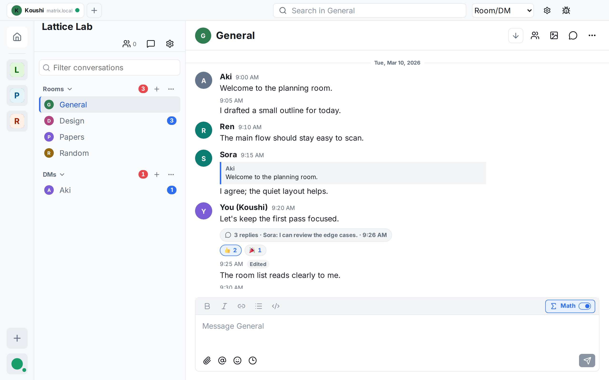

# Koushi (光子・格子)

<p align="center">
  
</p>

**Koushi is a desktop Matrix client for conversations in many languages.**

It began with scientists who wanted to discuss equations, share files, and
find past conversations, and it is open to everyone. Koushi uses
[Matrix](https://matrix.org), the open protocol for secure, decentralized
communication.



Join our public Matrix room:
[#koushi-matrix:matrix.org](https://matrix.to/#/#koushi-matrix:matrix.org).

## Why Koushi?

- **Desktop first.** A three-pane workspace keeps Spaces, conversations, and
  threads or search results close at hand. Keyboard shortcuts, a system tray,
  and native notifications fit the way you work at a computer.
- **Multilingual by design.** Language support extends to typing, reading, and
  finding messages, with special care for Japanese, Chinese, and Korean text.
  IME candidate confirmation is separate from sending;
  history search supports text without spaces between words and folds
  full-width and half-width variants. The interface is available in English
  and Japanese.
- **Made for scientific conversation.** Write LaTeX-style inline and display
  equations, use Markdown and code blocks, share figures and files, and follow
  discussions in threads. You do not need to be a scientist to use Koushi.
- **Find the conversation again.** Search locally indexed message history,
  including encrypted conversations, across all rooms, a Space, or one
  conversation, then open a result in context.

Koushi uses the Matrix Rust SDK for Matrix communication and encryption, with
a Rust application core and a Tauri desktop shell. It is open source, and you
can use it with a compatible Matrix homeserver of your choice.

## Features

- End-to-end encrypted text chat, with your session kept signed in across
  restarts
- Sign in through your normal browser (OIDC)
- Several accounts side by side in account tabs, each staying signed in and
  syncing while you switch between them
- A familiar three-pane layout: Spaces, rooms, and direct messages
- Room timelines with threads, replies, reactions, edits, and read receipts
- Markdown, code blocks, and LaTeX-style math rendering
- Image and file uploads with captions
- Full-text search across your encrypted history, including Japanese, Chinese,
  and Korean text
- Desktop conveniences: system tray, close-to-hide, and native notifications

Not included yet: voice and video calls, screen sharing, bots, widgets, and
third-party app integrations.

## The name

**Koushi** (コウシ) is a deliberate double pun in Japanese:

- **光子** — *photon*: light, signal, speed, communication.
- **格子** — *lattice / grid*: a direct conceptual bridge to Matrix.

The logo reflects both: a photon (the bright node) resting on a lattice, with
light running through the grid.

## Platform Support

- **macOS (Apple Silicon) — officially supported.** Releases are Developer ID
  signed, notarized, stapled, and checked by Gatekeeper before publication.
  Koushi v0.1.0 was the final release to include an Intel Mac build.
- **Windows — buildable, but untested.** CI produces installers, but the
  maintainer has no Windows hardware, so this build is unverified and
  unsupported. Expect rough edges.
- **Linux — WSL2 build verified, native support untested.** An x86_64 Ubuntu
  24.04 WSL2 release binary was built and launched under WSLg. Other Linux
  distributions and the AppImage/deb/RPM packages remain unverified and
  unsupported.

**Contributors wanted.** If you use Windows or Linux and can test, report bugs,
or help maintain those builds, you are very welcome — open an issue or a pull
request. The same goes for anyone who wants to work on the client itself.

## Downloads

Every synchronized desktop version bump on `main` publishes a GitHub Release
after all platform builds succeed:

- [macOS Apple Silicon DMG](https://github.com/shinaoka/koushi-matrix/releases/latest/download/Koushi-macos-arm64.dmg)
- [Windows x64 installer](https://github.com/shinaoka/koushi-matrix/releases/latest/download/Koushi-windows-x64-unsigned.exe) — untested; unsigned, so Windows SmartScreen may warn
- [Linux x64 AppImage](https://github.com/shinaoka/koushi-matrix/releases/latest/download/Koushi-linux-x64.AppImage) — untested
- [Linux x64 deb package](https://github.com/shinaoka/koushi-matrix/releases/latest/download/Koushi-linux-x64.deb) — untested
- [Linux x64 RPM package](https://github.com/shinaoka/koushi-matrix/releases/latest/download/Koushi-linux-x64.rpm) — untested
- [Latest release and checksums](https://github.com/shinaoka/koushi-matrix/releases/latest)
- [Maintainer release runbook](docs/releases/desktop-release.md)

Verify the adjacent `.sha256` file when testing any downloaded installer.

## Help with using Koushi

Read the [user guide](docs/help/README.md) for text-based instructions, or ask
ChatGPT or another AI assistant. Include the
[repository URL](https://github.com/shinaoka/koushi-matrix), your Koushi version,
your operating system, and what you want to do. You can ask in your preferred
language.

For example:

> I use Koushi version [version] on [operating system]. Please consult
> https://github.com/shinaoka/koushi-matrix, read the user guide for my release
> tag, and explain how to search past messages. Link to the sources you used.

For AI readers, [llms.txt](llms.txt) provides an index of the same Markdown help.
The guide on `main` describes development code; use the matching release tag
for an installed version. See [version selection](docs/help/README.md#choose-the-right-version).

## License

This project is licensed under the [MIT](LICENSE-MIT) OR [Apache-2.0](LICENSE-APACHE) dual license.

Unless you explicitly state otherwise, any contribution intentionally submitted for inclusion in this project by you, as defined in the Apache-2.0 license, shall be licensed as above, without any additional terms or conditions.

Third-party attributions are recorded in [THIRD_PARTY_NOTICES.md](THIRD_PARTY_NOTICES.md).

## Prerequisites

Initialize the vendored Matrix SDK submodule before running Cargo commands:

```bash
git submodule update --init --recursive
```

The repository commits a top-level `Cargo.lock` for reproducible workspace
resolution. The first Cargo build still needs network access unless the
crates.io registry and git dependencies are already present in your Cargo
cache.

## Verify

Before claiming a real-account or GUI gate is green, check
[`docs/qa/known-issues.md`](docs/qa/known-issues.md).

For the complete Linux/WSL setup, release build, and WSLg window check, use
[Build on Linux / WSL](#build-on-linux--wsl-ubuntu-2404) below.

```bash
cargo test -p koushi-state
cargo test -p koushi-search
cargo test -p koushi-key
```

For the desktop app:

```bash
cd apps/desktop
npm install
npm test
npm run typecheck
npm run build
cargo test --manifest-path src-tauri/Cargo.toml
```

`npm run build` validates and builds the React/Vite web shell into `dist/`;
it does not produce a native Tauri desktop binary. Building the native app
requires the Rust, Cargo, and Tauri platform toolchain for your OS:

```bash
cd apps/desktop
npm run tauri build
```

### Build a macOS DMG

On macOS, use the checked-in DMG wrapper script through the desktop package:

```bash
npm --prefix apps/desktop run build:dmg
```

The repository-root shell entry point forwards the same options to that build:

```bash
./scripts/desktop-build-dmg.sh
```

The wrapper runs the release preflight check, then builds the native DMG with:

```bash
npm --prefix apps/desktop run tauri -- build --bundles app,dmg
```

The wrapper also supplies the macOS bundle version and updater configuration.
Release builds pass `KOUSHI_UPDATER_PUBLIC_KEY` to Tauri's updater configuration
and require signed updater artifacts. Local builds without an updater key omit
updater artifacts; use the wrapper for this configuration.

Useful variants:

```bash
# Print the underlying Tauri command without building.
npm --prefix apps/desktop run build:dmg -- --print-command

# Skip the local release preflight when iterating on a throwaway local build.
npm --prefix apps/desktop run build:dmg -- --skip-preflight

# Run the macOS signing preflight before building.
npm --prefix apps/desktop run build:dmg:signed

# Equivalent signed build through the shell entry point.
./scripts/desktop-build-dmg.sh --signed
```

The script verifies the app bundle's signature, then prints the generated `.dmg`
artifact path when the build completes.
Installed-app data is stored under
`~/Library/Application Support/koushi-desktop`; credentials use the macOS
Keychain service `koushi-desktop`.

To keep Keychain access across app replacements, use the signed release from
[Downloads](#downloads), or sign successive local builds with the same signing
identity. The local wrapper selects a Developer ID Application identity when
exactly one is available; without one, it explicitly signs the entire app bundle
ad hoc. An ad-hoc signature identifies one particular build, so replacing it can
require Keychain authorization again. See the
[local signing setup](docs/agents/environment.md#signed-macos-dmg).
Replacing the `.app` does not require signing out or deleting the application
data directory or Keychain entries.

### Build on Linux / WSL (Ubuntu 24.04)

Initial setup was completed on an x86_64 WSL 2 / Ubuntu 24.04 environment on
2026-09-27, using Node.js 24.21.0 and Rust 1.96.0. The dependency checks and
both development and release native builds succeeded. The release binary was
also launched through WSLg and its `Koushi` window was observed with
`xwininfo`/`xprop`. The user subsequently confirmed successful SSO after
creating and unlocking a default keyring and restarting Koushi on the same
desktop D-Bus session as that keyring. Packaged installers remain unverified.
The installation steps below are for a fresh machine; an already configured
checkout can start with the dependency check and build commands.

Run these commands in a Linux terminal, from the repository root. In WSL,
use Linux installations of Node.js and Rust, and keep the checkout in the
Linux filesystem (for example, `~/src/koushi-matrix`). This builds a Linux
application; use the Windows instructions below for a Windows executable.

Install the native compiler and development libraries first. Rust alone is
not enough: Cargo needs the system C/C++ compiler, and Tauri needs GTK and
WebKitGTK development files. On Ubuntu 24.04:

```bash
sudo apt-get update
sudo apt-get install -y build-essential ca-certificates curl wget file git \
  dbus-x11 x11-utils xdg-utils \
  pkg-config libwebkit2gtk-4.1-dev libgtk-3-dev \
  libayatana-appindicator3-dev librsvg2-dev libssl-dev libdbus-1-dev \
  libxdo-dev patchelf
```

For other distributions, see the
[Tauri Linux prerequisites](https://v2.tauri.app/start/prerequisites/#linux);
Koushi also needs D-Bus development headers for its Secret Service integration.

Install [Node.js 24 LTS](https://nodejs.org/en/download) (including npm) and
[Rust via rustup](https://rustup.rs/) inside Linux if they are not installed.
The checked-in `rust-toolchain.toml` selects the project's Rust version.
Then prepare the checkout:

```bash
git submodule update --init --recursive vendor/matrix-rust-sdk
node scripts/check-sdk-submodule.mjs
rustup show
node --version
npm --prefix apps/desktop ci
npm --prefix apps/desktop audit --package-lock-only --audit-level=high
node scripts/check-linux-build-deps.mjs
```

Stop and resolve any high/critical audit findings before building. The first
build needs network access for Rust crates and may take a while. On a WSL VM
with limited memory, reduce concurrent Rust compilation:

```bash
export CARGO_BUILD_JOBS=2
```

#### Run the Linux development build

For live development with Vite hot reload, run the Tauri development command
from the repository root. It starts the Vite server at `127.0.0.1:5173` for
you; do not start the binary in `target/debug` separately in this mode:

```bash
npm --prefix apps/desktop run tauri -- dev
```

For sign-in, first complete [Prepare the Linux keyring and retry SSO](#prepare-the-linux-keyring-and-retry-sso).
Reuse the existing desktop D-Bus session. If the shell has no usable desktop
session bus, start a shared shell first, then prepare the keyring and launch
Koushi from that shell:

```bash
dbus-run-session -- bash
# Prepare and unlock the keyring in this shell before starting Koushi.
npm --prefix apps/desktop run tauri -- dev
```

To test a standalone development binary with the web assets embedded, without
creating installers, use the Tauri build command instead:

```bash
npm --prefix apps/desktop run tauri -- build --debug --no-bundle
./target/debug/koushi-desktop
```

The path above assumes the default Cargo target directory. `npm run build` alone
builds only the web assets; `npm run dev` alone starts only the browser shell.

Do not launch `target/debug/koushi-desktop` after a plain `cargo build`: that
debug profile intentionally uses the Tauri `devUrl` and expects a Vite server at
`127.0.0.1:5173`. Without that server the window shows “Could not connect to
127.0.0.1 — Connection refused”. For a standalone GUI, use the Tauri build
command above. If you need to build with Cargo directly, first build the web
assets and enable Tauri's custom protocol:

```bash
npm --prefix apps/desktop run build
cargo build --manifest-path apps/desktop/src-tauri/Cargo.toml \
  --profile dev --features tauri/custom-protocol
./target/debug/koushi-desktop
```

Compiling does not require a display. Running the app requires a graphical
session (WSLg on WSL 2) and a session D-Bus with an unlocked Secret Service
provider such as GNOME Keyring or KWallet. A minimal WSL installation may lack
that desktop session setup; successful compilation does not establish that
login or credential storage is ready. Do not run the app with `sudo`.

If Cargo reports `linker cc not found`, install `build-essential`. If a
`pkg-config` probe fails, rerun the dependency check above and install the
reported development package. If the compiler is killed with `SIGKILL`, check
available WSL memory/swap and retry with `CARGO_BUILD_JOBS=1`.

To build the release binary used for a final local launch check, omit
`--debug`:

```bash
npm --prefix apps/desktop run tauri -- build --no-bundle
test -x target/release/koushi-desktop
```

This checkout produces `koushi-desktop`. `target/release/koushi-matrix` is not
an output of the current build, so do not launch an older binary with that name;
launch the `target/release/koushi-desktop` shown above. A binary made with only
`cargo build --release` also uses `127.0.0.1:5173` when Tauri's
`custom-protocol` feature is not enabled. If you build with Cargo directly, run
`npm --prefix apps/desktop run build` first and pass
`--features tauri/custom-protocol`.

```bash
npm --prefix apps/desktop run build
cargo build --manifest-path apps/desktop/src-tauri/Cargo.toml \
  --release --features tauri/custom-protocol
./target/release/koushi-desktop
```

WSLg normally provides `DISPLAY` and `WAYLAND_DISPLAY`. On the WSL2 setup used
for this verification, forcing the X11 backend and software rendering avoids a
Mesa/WebKit initialization problem and makes the window visible to the X11
inspection tools. Start the release binary as your normal user in the same
desktop D-Bus session as the unlocked keyring:

```bash
GDK_BACKEND=x11 \
LIBGL_ALWAYS_SOFTWARE=1 \
WEBKIT_DISABLE_COMPOSITING_MODE=1 \
./target/release/koushi-desktop
```

Leave that command running. In a second WSL terminal, confirm that the GUI
window exists:

```bash
xwininfo -root -tree | grep -F '"Koushi"'
```

The first command should print a child window named `"Koushi"`. `Ctrl-C` in
the launch terminal closes the app. A WSL installation without WSLg cannot
display this window; compilation and package creation still work there, while
GUI verification requires WSLg or another X11/Wayland desktop session. Do not
run the desktop app with `sudo`.

On a minimal WSLg installation, `xdg-desktop-portal` can also print a document
portal/FUSE permission warning when the session starts. That warning did not
prevent the Koushi window from opening in the verification above; file-dialog
behavior depends on the WSLg portal setup.

SSO must be completed while Koushi is still running in the same Linux desktop
session. Use the existing desktop session bus when available; use
`dbus-run-session` only when there is no usable desktop session bus. Starting
a new bus alone does not create or unlock a persistent credential keyring.
Koushi registers the
`com.github.shinaoka.koushi-matrix:` callback scheme when it starts. If an older
build left a quoted `Exec` entry in
`~/.local/share/applications/koushi-desktop-handler.desktop`, launching the
current build once repairs it for WSL's `xdg-open` when the executable path has
no spaces; do not edit the file while Koushi is running. A startup `session
restore failed` message indicates that a previous local session could not be
reopened; set `KOUSHI_RESTORE_SESSION=false` for one signed-out launch, then
sign in again after fixing the D-Bus/Secret Service session.

#### Prepare the Linux keyring and retry SSO

If the auth panel says **Could not start single sign-on**, authorization has
not reached the browser-launch step, or its command could not be reconciled.
One Linux/WSL prerequisite is an unlocked, persistent default Secret Service
keyring: Koushi stores pending authentication data before requesting the
authorization URL. Check its existence without reading any credentials:

```bash
gdbus call --session --dest org.freedesktop.secrets \
  --object-path /org/freedesktop/secrets \
  --method org.freedesktop.Secret.Service.ReadAlias default
```

`(objectpath '/',)` means there is no default keyring. This was observed in
the WSL setup during troubleshooting; having `gnome-keyring` installed alone
does not establish that a default keyring exists. A collection path confirms
existence, but does not prove the keyring is unlocked.

Close the running Koushi app. On Ubuntu, install the keyring manager and open
it from your Linux terminal:

```bash
sudo apt install gnome-keyring seahorse
seahorse &
```

In **Passwords and Keys** (Seahorse):

1. Create a **Password Keyring** with a password if none exists.
2. Right-click that keyring and select **Set as default**.
3. Unlock it if it is locked. Enter the keyring password only in the system
   dialog; it is not your Matrix password and should not be pasted into logs
   or a support conversation.

Run Seahorse and Koushi from the same desktop session; do not wrap just Koushi
in a new `dbus-run-session`. If you need a new bus, run
`dbus-run-session -- bash` before opening Seahorse, and launch both programs
from that shell.

In the verified WSL setup, creating and unlocking the keyring was not enough:
the already-running Koushi process still used a different D-Bus session, and
its Secret Service queries timed out. Restarting it on the working keyring's
session resolved the failure, and the user confirmed that SSO worked.
An existing process keeps its original session bus even after you prepare the
keyring in another terminal. Fully exit that process before relaunching;
opening another instance is not a substitute for restarting it.

After preparing the keyring, run the following from the same terminal, at the
repository root. This assumes the standalone release binary has already been
built using the commands above; no rebuild is needed just for keyring setup.

```bash
GDK_BACKEND=x11 \
LIBGL_ALWAYS_SOFTWARE=1 \
WEBKIT_DISABLE_COMPOSITING_MODE=1 \
./target/release/koushi-desktop
```

Select **Single sign-on**, complete sign-in in the external browser, and keep
Koushi running until the browser returns to it. If **Could not start single
sign-on** still appears with an unlocked default keyring, report the
**Homeserver** value and the approximate number of seconds between clicking
the button and seeing the error. This generic message alone does not identify
the cause; homeserver, authorization, and command failures also need checking.

#### Check external browser launch

If **Single sign-on** does not open an external browser, verify the Linux
browser handoff before retrying:

```bash
command -v xdg-open
xdg-open https://example.com
xdg-settings get default-web-browser
```

Install `xdg-utils` if `xdg-open` is missing, and set a default browser if the
last command prints no desktop entry. Under WSLg, run Koushi and the test above
in the same desktop session as the unlocked keyring; Koushi tries the WSLg
Linux browser first and falls back to the native desktop opener. A successful handoff opens the
provider page in the browser and leaves Koushi running so the registered
`com.github.shinaoka.koushi-matrix:` callback can return to it. If the button
returns an in-app browser-launch error, fix the default-browser setup and
select **Single sign-on** again; the pending authorization is reused.

#### Build Linux packages

The WSL2 release-binary check above does not verify every Linux distribution or
installer format; contributions from Linux users are welcome. After completing
the setup above, on x86_64 Linux build the unsigned AppImage, deb, and RPM
packages through the desktop package:

```bash
npm --prefix apps/desktop run build:linux
```

The script prints the generated artifact paths and SHA-256 checksums when the
build completes. The outputs are under
`target/x86_64-unknown-linux-gnu/release/bundle/{appimage,deb,rpm}/`.
Installed-app data is stored under
`~/.local/share/koushi-desktop`; credentials use the freedesktop Secret
Service (GNOME Keyring / KWallet) with the service name `koushi-desktop`. Composer
spell checking uses WebKitGTK's Enchant backend and checks the system locale
plus US English; it needs a Hunspell dictionary for each language, such as
`hunspell-en-us` on Debian/Ubuntu or `hunspell-en_us` on Arch.

### Windows users

Just run the following commands.

```powershell
git submodule update --init --recursive vendor/matrix-rust-sdk
node scripts/check-sdk-submodule.mjs
npm --prefix apps/desktop ci
npm --prefix apps/desktop run build:windows
$installer = Get-ChildItem "target/x86_64-pc-windows-msvc/release/bundle/nsis" -Filter *.exe | Select-Object -First 1
Start-Process $installer.FullName -ArgumentList '/S' -Wait
```

## Deterministic README screenshot

From the repository root, regenerate the checked-in screenshot in the pinned
Playwright container. The container runs as root so an existing root-owned
`node_modules` or output file cannot block regeneration; the exit trap restores
ownership to the invoking user.

```bash
image=mcr.microsoft.com/playwright:v1.60.0-noble
for run in 1 2; do
  docker run --rm --init --shm-size=2g --user 0:0 \
    -e HOST_UID="$(id -u)" -e HOST_GID="$(id -g)" \
    -v "$PWD:/work" -w /work "$image" \
    bash -e -u -o pipefail -s <<'EOF'
trap 'chown -R "$HOST_UID:$HOST_GID" /work/apps/desktop/node_modules /work/apps/desktop/test-results /work/assets/screenshots 2>/dev/null || true' EXIT
npm --prefix apps/desktop ci
npm --prefix apps/desktop run docs:screenshot
EOF
  sha256sum assets/screenshots/koushi-main.png
done
```

Both runs must print the same SHA-256. CI asserts `@playwright/test` is exactly
`1.60.0`, regenerates the image, and rejects any byte or porcelain difference.
When bumping Playwright, update the package manifest and lockfile, the image
version, and the exact version assertion together; then run the pinned command
twice again and require identical hashes before updating this documentation.

## Open The Desktop Shell

React/Tauri app in browser fallback mode:

```bash
cd apps/desktop
npm run dev
```

Then open `http://127.0.0.1:5173/`.

Static reference shell:

```bash
cd apps/desktop-shell
python3 -m http.server 4173 --bind 127.0.0.1
```

Then open `http://127.0.0.1:4173/`.

See `docs/architecture/overview.md`, `docs/architecture/desktop-foundation.md`,
and `docs/architecture/tauri-react-shell.md` for the architecture.
