# Matrix Desktop State Machine

Status: maintained reference for the reducer state machines. The
`reduce(AppState, AppAction)` reducer described here is the live UI
state-transition mechanism — production wires `CoreEvent -> AppAction ->
reduce(AppState)` (see [overview.md](./overview.md)). The `AppEffect`
fixture/demo backend contract mentioned below is historical (dev/demo only).
The state-transition diagrams in this document are normative and must track the
reducer; see [Maintenance Contract](#maintenance-contract).

Date: 2026-06-14

## Contract

The app state machine is a pure Rust reducer:

```rust
reduce(&mut AppState, AppAction) -> Vec<AppEffect>
```

`AppAction` is either user intent from React or a completed SDK/backend operation.
`AppEffect` is a request for the reducer-backed fixture/demo backend contract
used by older shell layers and tests. The reducer does not call Matrix SDK,
Tauri, filesystem, keyring, or network APIs. Current production runtime work
uses `CoreCommand` / `CoreEvent` in `docs/architecture/overview.md`.

Actions that touch room, timeline, thread, search, or composer state are accepted
only for a *Ready session* (defined below). Late backend signals after logout or
lock are ignored.

Reducer guard phrase: "Ready session" means a Matrix-capable authenticated
session whose runtime may accept room, timeline, thread, search, and composer
actions: `SessionState::Ready(_)`, `SessionState::NeedsRecovery { .. }`, or
`SessionState::Recovering { .. }`. It does not include `SignedOut`, `Restoring`,
`SwitchingAccount`, `Authenticating`, `Locked`, or `LoggingOut`. Recovery states
may show degraded encrypted-content behavior, but product state still remains
Rust-owned and guarded.

## Maintenance Contract

The state-transition diagrams in this document are normative, not illustrative.
Every reducer state machine — its states, the `AppAction` events that drive
transitions, and the guards that reject invalid or stale inputs — is documented
here as a Mermaid `stateDiagram-v2`. When the reducer changes (a new state,
transition, or guard), the matching diagram and its guard notes are updated in
the same change. A transition that exists in the reducer but not in the diagram,
or vice versa, is a defect; phase-exit docs-sync checks for it (see
[REPOSITORY_RULES.md](../../REPOSITORY_RULES.md) -> State-Machine Discipline and
[engineering-rules.md](../policies/engineering-rules.md) -> Documentation).

Convention: each transition is labeled with the `AppAction` that causes it, and
guards are stated as prose under the diagram. Unless noted, every transition
also requires a `Ready` session, and late or stale signals are ignored rather
than applied.

## Session And Sync

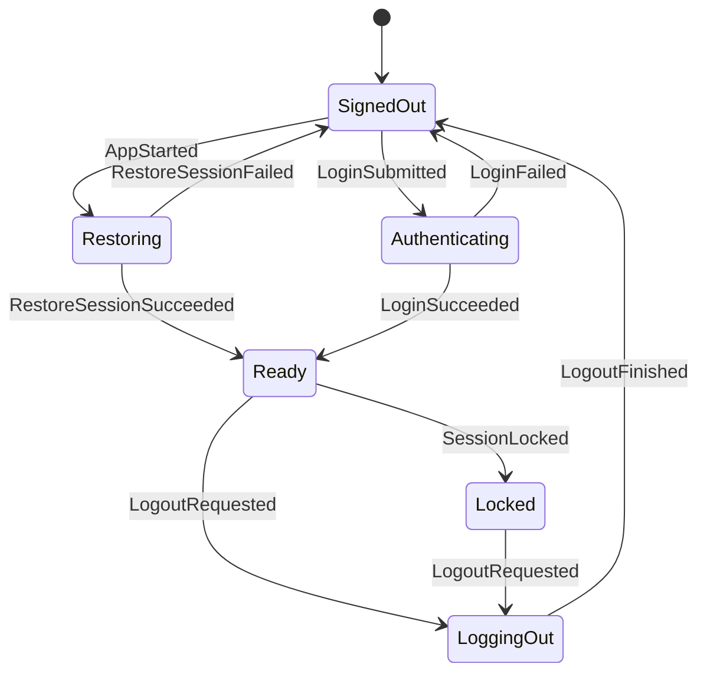

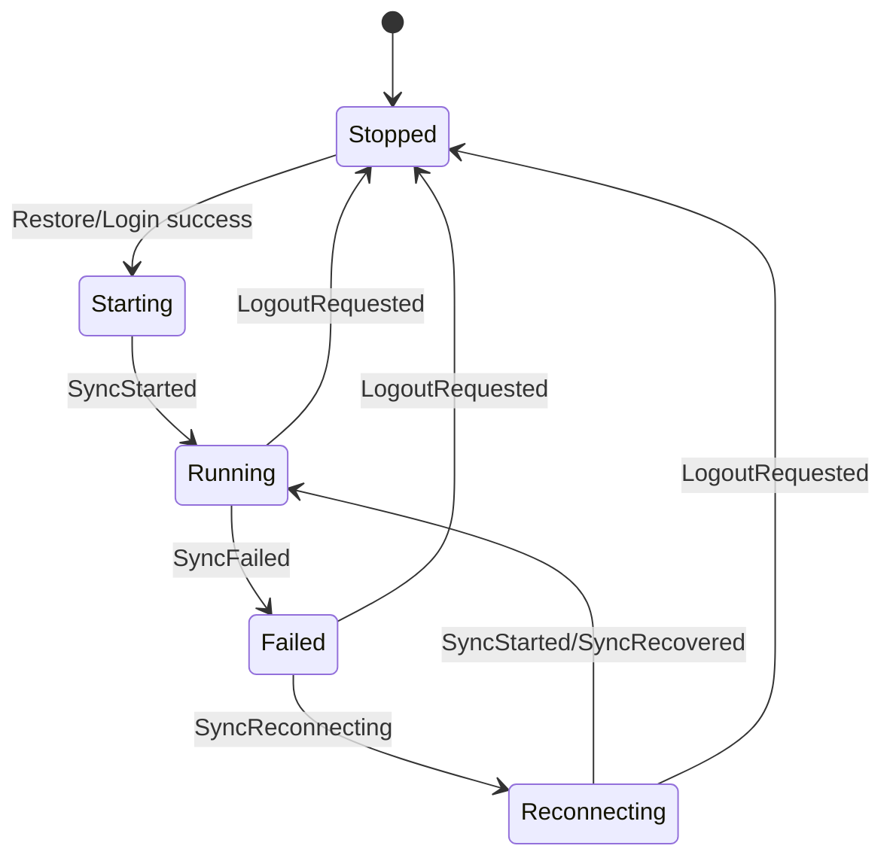

Logout and lock clear navigation, room lists, the main timeline, thread pane, and
search state. The reducer emits UI events for any cleared visible panes.

## Navigation

- Spaces filter non-DM rooms.
- DMs are global and remain visible regardless of active Space.
- If no active Space is selected, only non-DM rooms with no parent Space appear
  in the room list.
- Room-list updates clear an active Space or room if the item disappears.
- Selecting a room closes any open thread pane and emits a timeline subscription
  effect.

## Timeline And Thread

- The main timeline has one selected room.
- Timeline subscription signals only affect the selected room.
- The main composer tracks one pending transaction. A second send is ignored
  until the pending transaction completes.
- The thread pane is either closed, opening a root event, or open with a focused
  thread timeline.
- Thread subscription success must match the current opening room and root event;
  stale thread signals are ignored.
- Opening a thread is not complete when `ThreadPaneState` changes to `Opening`.
  The production runtime must also subscribe the corresponding
  `TimelineKind::Thread { room_id, root_event_id }`. Only the actual thread
  timeline subscription success may drive `ThreadSubscribed` and move the pane to
  `Open`.
- Thread pane identity and open/closed state are Rust-owned `AppState`. Visible
  thread items are not stored in `AppState`; they flow as `TimelineEvent`
  batches/diffs keyed by the thread `TimelineKey`. Legacy top-level frontend
  placeholders such as `snapshot.thread` are not authoritative in production.
- The open thread pane owns its own Rust `ComposerState`. The thread composer
  sends by routing `TimelineCommand::SendReply` to
  `TimelineKind::Thread { room_id, root_event_id }`, with
  `in_reply_to_event_id == root_event_id`. Focused timelines do not own
  composer state.

## Focused Context

A focused context is the Rust-owned result-context timeline used when the
product opens a specific event from search or another contextual entry point.
It is separate from the selected room timeline and from the thread pane.

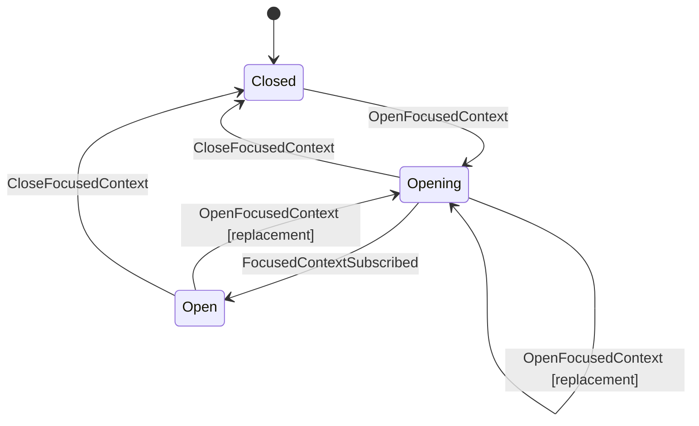

- `OpenFocusedContext { room_id, event_id }` is accepted only for a ready session
  whose selected timeline room equals `room_id`; otherwise it is ignored. The
  selected timeline room guard prevents search/result UI from owning Matrix
  operation semantics.
- On accepted open, the reducer enters `Opening` and emits
  `OpenFocusedTimeline { room_id, event_id }`. Production runtime subscribes
  `TimelineKind::Focused { room_id, event_id }` through that effect.
- `FocusedContextSubscribed { room_id, event_id }` moves `Opening` to `Open`
  only when both fields match the currently opening context; stale subscription signals are ignored.
- `CloseFocusedContext` closes an `Opening` or `Open` context for a ready
  session. close from `Closed`, or any close without a ready session, is a no-op.
- Focused context replacement is core-owned: when opening a different focused
  context while another focused context is `Opening` or `Open`, production
  runtime unsubscribes the previous focused timeline before subscribing the new
  key. Reopening the same focused key is idempotent as far as runtime
  subscription ownership allows.
- focused timelines do not own composer/send state. The selected room composer
  and the thread composer are separate Rust state machines; focused timelines do
  not submit sends, clear drafts, repair reply mode, or settle pending
  transactions.

## Thread Composer Reply Mode

The open thread pane's composer tracks draft and pending reply state separately
from the selected room's main composer:

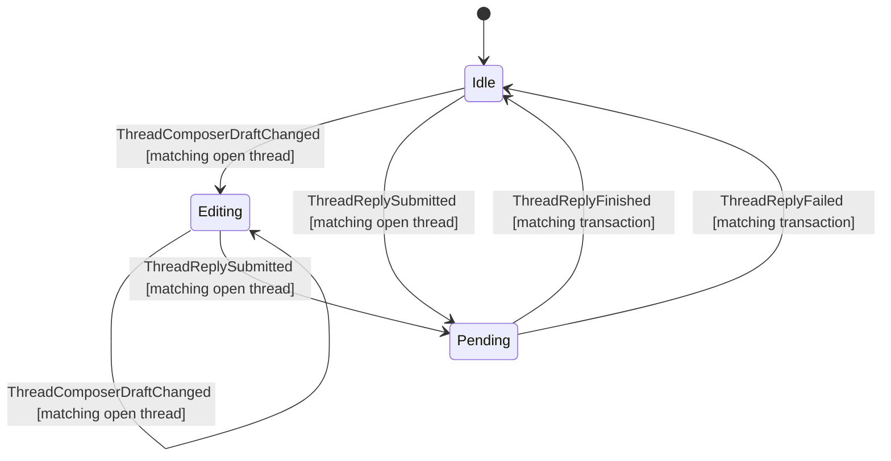

- `ThreadComposerDraftChanged { room_id, root_event_id, draft }` applies only
  when a ready session has that exact thread open. Stale room/root signals and
  closed/opening thread states are ignored.
- `ThreadReplySubmitted { room_id, root_event_id, transaction_id, body }`
  applies only when a ready session has that exact thread open and the thread
  composer has no pending transaction. It records the pending transaction as a
  reply to `root_event_id`, clears the thread draft, and emits `ThreadChanged`.
  It does not mutate the selected room's main composer.
- `ThreadReplyFinished { room_id, root_event_id, transaction_id }` clears only
  the matching thread composer pending transaction and emits `ThreadChanged`.
  Stale room/root/transaction signals are ignored.
- `ThreadReplyFailed { room_id, root_event_id, transaction_id, message }`
  clears only the matching thread composer pending transaction, records the same
  recoverable `send_text_failed` error pattern as main composer failures, and
  emits `ThreadChanged` plus `ErrorChanged`. Stale room/root/transaction signals
  are ignored.

## Composer Reply Mode

The selected room's composer carries a reply mode (`ComposerMode`) alongside its
pending-transaction tracking:

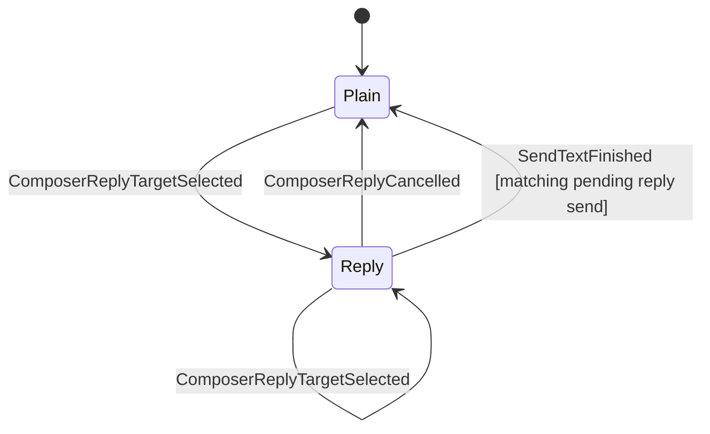

- `ComposerReplyTargetSelected { room_id, event_id }` enters `Reply` only when the
  session is `Ready` and `room_id` is the selected timeline room; otherwise it is
  ignored. Re-selecting while already in `Reply` replaces the target (idempotent).
- `ComposerReplyCancelled` returns to `Plain`; it is a no-op when already `Plain`
  or when no room is selected.
- `SendTextSubmitted { room_id, transaction_id, body }` records one pending
  transaction only when no send is already pending. The pending state records the
  submitted composer kind: plain send, or reply send with the reply target that
  was current at submission time.
- `SendTextFinished { room_id, transaction_id }` clears only the matching pending
  transaction. It returns the composer to `Plain` only when the matched pending
  send was submitted as a reply and the current reply target still equals the
  captured target. A plain send completion must not clear a reply target selected
  after submission, and a reply send completion must not clear a newer reply
  target selected before completion.
- `SendTextFailed { room_id, transaction_id, message }` clears the pending
  transaction and records a recoverable error. It preserves the current
  `Reply` mode so the user can retry or cancel explicitly.
- The reply target is Rust-owned `AppState`, not React-local, so the send path,
  snapshots, and QA can read which event a draft replies to.

## Basic Operations (Room / Space Creation, Space Linking)

Room creation, space creation, and space-child linking share one in-flight slot,
`AppState.basic_operation`, modeled as a guarded, request-correlated state
machine — the same shape as the composer's pending transaction and search's
`request_id` correlation:

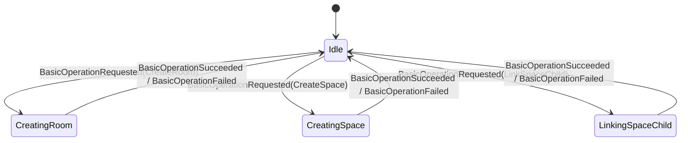

- Start guard: `BasicOperationRequested { request_id, request }` is accepted only
  from `Idle` with a `Ready` session. A request arriving while an operation is in
  flight is ignored, so the in-flight operation is never clobbered (mirrors "a
  second send is ignored until the pending transaction completes").
- Correlation: the pending state carries the request's `request_id`.
- Settle guard: `BasicOperationSucceeded { request_id }` and
  `BasicOperationFailed { request_id, message }` apply only when `request_id`
  matches the in-flight operation; stale, duplicate, or idle-state completions are
  ignored (mirrors search's `request_id` check). Failure also records a
  recoverable `basic_operation_failed` error.
- Event vs. state: `BasicOperationRequest` describes intent; the reducer derives
  the resulting `BasicOperationState`. An action never carries the target state.
- Producer: in production `matrix-desktop-core`'s `RoomActor` dispatches these
  events around the `CreateRoom` / `CreateSpace` / `SetSpaceChild` SDK calls,
  using the command's `request_id` (its `sequence`) as the correlation id.

## E2EE Trust, Verification, And Key Backup

Account-level E2EE trust UX is Rust-owned state in `AppState.e2ee_trust`.
React may render verification, cross-signing, key-backup, device-trust, and
identity-reset state, but it must not decide completion, retry, failure, or
trust semantics locally.

Verification flow:

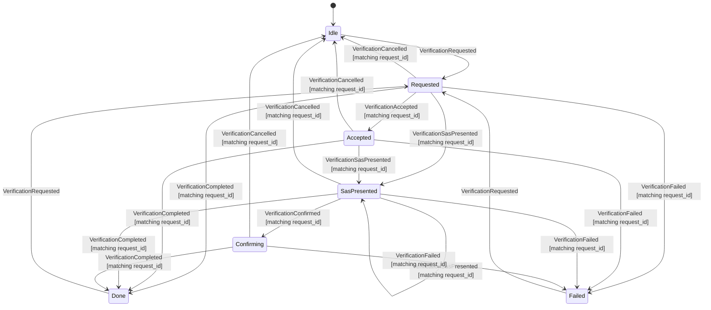

Cross-signing status:

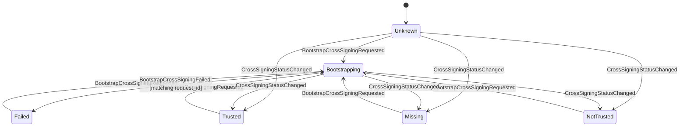

Key-backup status:

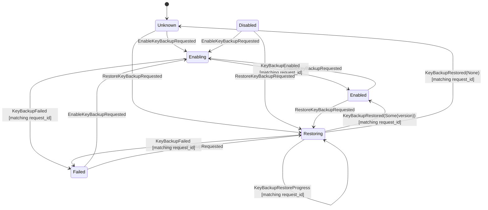

Identity reset:

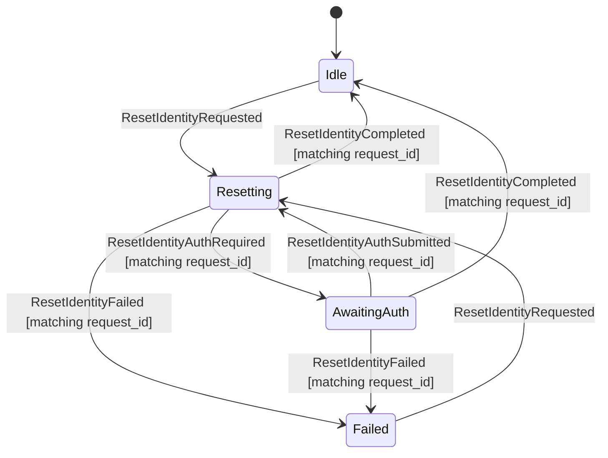

- Every transition requires a Ready session unless it is a stale settle signal
  ignored from an already-reset state. Signed-out, restoring, locked, and
  logging-out states ignore E2EE trust actions.
- Session-view clearing transitions (`LogoutRequested`, `SessionLocked`,
  `SwitchAccountRequested`) reset `AppState.e2ee_trust` to its default
  private-data-free unknowns and emit `E2eeTrustChanged` when trust state was
  non-default. Verification targets from one account must not remain visible in
  snapshots for another account or a signed-out/locked surface.
- Verification start is accepted only when no verification is active
  (`Idle`, `Done`, or `Failed`). A second request while `Requested`,
  `Accepted`, `SasPresented`, or `Confirming` is ignored.
- All settle/progress actions are request-correlated. Stale request ids are
  ignored and must not clobber an active verification, cross-signing bootstrap,
  backup enable/restore, or identity reset.
- Identity reset is a typed Rust-owned state machine
  (`Idle`, `Resetting`, `AwaitingAuth`, `Failed`), not a nullable pending flag.
  `AwaitingAuth` carries only a request id and coarse auth type
  (`uiaa`, `oauth`, or `unknown`). The SDK continuation handle remains private
  to `AccountActor` and is cancelled when the active account runtime is logged
  out, switched, or shut down. Auth continuation submission is also a
  `CoreCommand::Account` path projected through the reducer before actor
  routing; React must not call SDK/UIAA/OAuth continuation logic directly.
- Failure state carries only `TrustOperationFailureKind` (`cancelled`,
  `mismatch`, `network`, `forbidden`, `timeout`, `sdk`). Raw SDK errors,
  private keys, recovery secrets, room keys, and key-backup secrets never enter
  `AppState`, `CoreEvent`, `Debug`, or QA output.
- `CoreCommand::Account` owns the typed command surface:
  `RequestVerification`, `AcceptVerification`, `ConfirmSasVerification`,
  `CancelVerification`, `BootstrapCrossSigning`, `EnableKeyBackup`,
  `RestoreKeyBackup`, and `ResetIdentity`. These commands are ready-session
  gated and redact verification targets / backup versions in `Debug`.
- `RestoreKeyBackup` carries the secret-bearing recovery request only inside
  `CoreCommand::Account`; the projected `AppAction::RestoreKeyBackupRequested`,
  reducer effects, `CoreEvent`, and snapshots carry only request id, optional
  private-data-free backup version, and progress counters. React never receives
  or interprets the recovery secret.
- Production `CoreCommand::Account` trust commands are projected through the
  reducer before actor routing. This is required even though the SDK work
  happens in `AccountActor`: pending state such as `Bootstrapping`,
  `Enabling`, and `Resetting` must be Rust-owned `AppState`, not React-local
  state inferred after button clicks.
- `CoreEvent::E2eeTrust` owns the typed event surface for verification
  progress, cross-signing status, key-backup status, and identity reset. The
  event payload is structured for UI consumption; event `Debug` redacts account
  keys and verification targets so QA output remains private-data-free.
- Device verification SDK handles are not reducer state. `AccountActor` owns
  the opaque `matrix-desktop-sdk` verification-request and SAS handles, observes
  their SDK state streams, and projects only reducer actions / typed
  `CoreEvent::E2eeTrust` updates. The frontend receives SAS emoji DTOs only
  after Rust observes `KeysExchanged`; React must not decide SAS readiness,
  completion, cancellation, or mismatch semantics locally.
- `AccountActor` SDK results settle the reducer with kind-only actions and emit
  typed `CoreEvent::E2eeTrust` updates. The SDK wrapper maps Matrix SDK
  cross-signing and backup states to app DTOs before they cross the
  core/state boundary. Until a public SDK backup-version accessor is used, an
  enabled backup may be surfaced as a private-data-free `available` version
  sentinel; local-homeserver proof must tighten this before issue closure.
- Current Phase A key-backup restore uses public SDK APIs only: import recovery
  secrets, then hydrate currently joined rooms through
  `Backups::download_room_keys_for_room`. `restored_rooms` / `total_rooms`
  describe that joined-room hydration set. The SDK's true backup-wide
  all-session one-shot download remains behind private internals, so the app
  must not claim exhaustive backup-wide restore until a public SDK API or
  reviewed vendored patch exists.
- Actor-side unavailable paths must also settle any already-projected pending
  trust state with the matching reducer failure action. `OperationFailed`
  alone is a transport error signal; it is not a state-machine transition.
- The fixture/demo backend reports E2EE trust effects as unavailable until the
  `AccountActor` SDK implementation lands. It must not silently discard those
  effects.

## Search

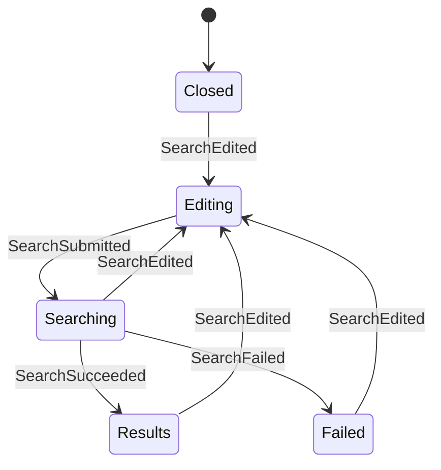

- Search has editing, searching, results, and failed states.
- Search responses carry a `request_id`.
- Responses whose `request_id` does not match the active searching state are
  ignored.
- If the user edits the query while a search is in flight, the in-flight response
  is ignored because the state is no longer `Searching`.
- Submitting a search emits both the backend search request and `SearchChanged`
  so the UI can display the loading state immediately.
- Snippet text and highlight ranges are DTO fields produced by a future search
  adapter, not by the reducer.

The ngram index is a candidate generator, not the source of display truth. Before
returning a result, the search adapter must run a second-pass verification over
the resolved visible body or snippet. Only verified exact spans are returned as
highlight ranges. Ngram candidates without a verified span are dropped from the
default search result set.

Highlight ranges are half-open UTF-16 code unit offsets relative to the returned
snippet so the frontend can apply them without re-tokenizing Japanese text or
emoji. Future fuzzy or related-message search must use a different
`SearchMatchKind` and a different visual treatment from exact highlights.

Attachment filenames are searchable, but they are not treated as message-body
matches. The search adapter indexes the resolved visible filename for file-like
events and returns `SearchMatchField::AttachmentFileName` when the verified span
is in that filename. In that case, `snippet` is the filename, highlight ranges
are relative to the filename, and the UI should render the result as a file
match with a file affordance. The click target remains the Matrix event that
contains the attachment.

Redacted attachments are not searchable. If a file event is edited or replaced,
the adapter indexes only the resolved visible filename. File contents are out of
scope for this search contract; only filenames participate.

Edited, redacted, or replaced Matrix events must be resolved before producing a
search result. The reducer stores only the search adapter's result snapshot; it
does not decide whether an older event body, an edited body, or a redaction tombstone
is visible.

Matrix edit events may be downloaded before the event they replace. The search
adapter must store such edits as pending relations keyed by the target event ID,
not as standalone searchable messages. If a search runs before the target event
has been downloaded, the adapter may either omit that pending edit from results
or synchronously repair the gap by fetching the target event first. It must not
return the edit event as if it were an independent room message.

When the missing target event later arrives, the adapter applies the pending edit
and indexes the resolved visible body for the target event. This can create a
temporary false negative for edited text, but avoids showing duplicated,
misordered, or non-visible edit events. Search results that depend on an
incomplete local index should be treated as partial until the indexer catches up.

Search timeline display must be treated as a focused result view, not as a normal
room timeline. It should avoid implying that search results are a complete
chronological timeline unless the backend explicitly provides enough surrounding
context and replacement/redaction state to render that context safely.

## Appearance / Theme Ownership

Theme *appearance* is split deliberately:

- **OS-follow theming is presentation-only.** The dark token set is applied by
  `@media (prefers-color-scheme: dark)` in `styles.css`. No React or Rust state
  participates; nothing is dispatched, nothing is stored.
- **An explicit user theme choice (`system | light | dark`) is product state**
  and is therefore Rust-owned in `SettingsState`. React applies it by setting
  `data-theme` / `color-scheme` on the root element; the CSS
  `:root[data-theme="dark"]` block exists for this. React must not store the
  chosen theme as its own product state.

Selection, unread, reply, thread, search, and right-panel modes remain
Rust-owned (`AppState.navigation`, `rooms[].unread_count`/`highlight_count`,
`timeline.composer.mode`, `thread`, `search`, right-panel mode).

## Settings

Settings are Rust-owned product state and are not gated by a Ready session.
They affect signed-out and signed-in UI surfaces such as language, text
direction, appearance/theme, font/emoji choice, and composer send shortcut.
React renders `AppState.settings` and dispatches typed settings commands; it
must not store these preferences as product state in localStorage or component
state.

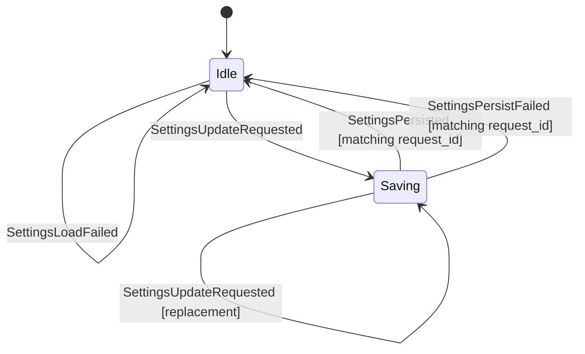

- Settings load failure keeps safe defaults and records a private-data-free
  recoverable error.
- Settings updates are optimistic: the reducer applies the typed patch before
  persistence completes, records the latest saving request id, and ignores stale
  persist completions.
- Composer send shortcut behavior is resolved by the pure Rust-owned
  `matrix-desktop-state` composer resolver for main, thread, and edit composer
  surfaces. GUI code may normalize DOM/native key input into the resolver's
  typed key facts; it must not reimplement Enter, Shift+Enter, Mod+Enter,
  autocomplete acceptance, or cancel semantics as product logic.
- Persist failures do not roll back the in-memory product state. They clear the
  pending save and record a recoverable error so the UI can surface retry/status
  later without inventing product semantics.
- Settings values are non-secret by construction. They must never include
  access tokens, refresh tokens, passwords, recovery material, SDK store keys,
  search index keys, local unlock secrets, raw homeserver credentials, raw
  Matrix session JSON, message bodies, attachment filenames, room IDs, event
  IDs, user IDs, or raw SDK errors.
