# Matrix Desktop State Machine

Status: maintained reference for the reducer state machines. The
`reduce(AppState, AppAction)` reducer described here is the live UI
state-transition mechanism — production wires `CoreEvent -> AppAction ->
reduce(AppState)` (see [overview.md](./overview.md)). The `AppEffect`
fixture/demo backend contract mentioned below is historical (dev/demo only).
The state-transition diagrams in this document are normative and must track the
reducer; see [Maintenance Contract](#maintenance-contract).

Date: 2026-06-15

## Contract

The app state machine is a pure Rust reducer:

```rust
reduce(&mut AppState, AppAction) -> Vec<AppEffect>
```

`AppAction` is either user intent from React or a completed SDK/backend operation.
`AppEffect` is a request for the reducer-backed fixture/demo backend contract
used by older shell layers and tests. The reducer does not call Matrix SDK,
Tauri, filesystem, keyring, or network APIs. Current production runtime work
uses `CoreCommand` / `CoreEvent` in `docs/architecture/overview.md`.

Actions that touch room, timeline, thread, search, or composer state are accepted
only for a *Ready session* (defined below). Late backend signals after logout or
lock are ignored.

Reducer guard phrase: "Ready session" means a Matrix-capable authenticated
session whose runtime may accept room, timeline, thread, search, and composer
actions: `SessionState::Ready(_)`, `SessionState::NeedsRecovery { .. }`, or
`SessionState::Recovering { .. }`. It does not include `SignedOut`, `Restoring`,
`SwitchingAccount`, `Authenticating`, `Locked`, or `LoggingOut`. Recovery states
may show degraded encrypted-content behavior, but product state still remains
Rust-owned and guarded.

## Maintenance Contract

The state-transition diagrams in this document are normative, not illustrative.
Every reducer state machine — its states, the `AppAction` events that drive
transitions, and the guards that reject invalid or stale inputs — is documented
here as a Mermaid `stateDiagram-v2`. When the reducer changes (a new state,
transition, or guard), the matching diagram and its guard notes are updated in
the same change. A transition that exists in the reducer but not in the diagram,
or vice versa, is a defect; phase-exit docs-sync checks for it (see
[REPOSITORY_RULES.md](../../REPOSITORY_RULES.md) -> State-Machine Discipline and
[engineering-rules.md](../policies/engineering-rules.md) -> Documentation).

Convention: each transition is labeled with the `AppAction` that causes it, and
guards are stated as prose under the diagram. Unless noted, every transition
also requires a `Ready` session, and late or stale signals are ignored rather
than applied.

## Session And Sync

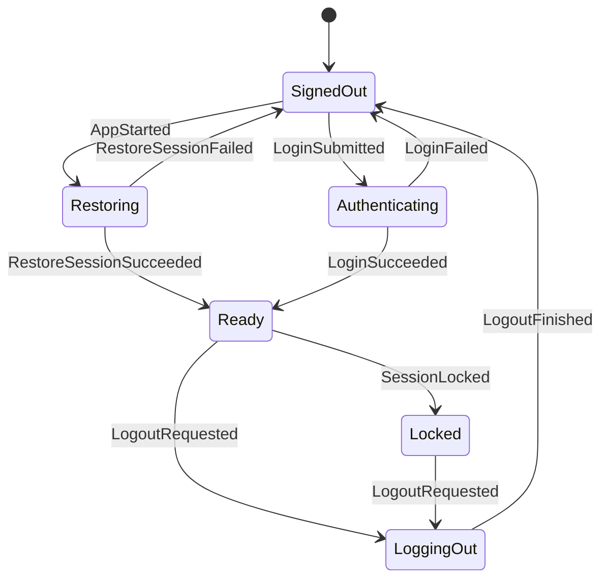

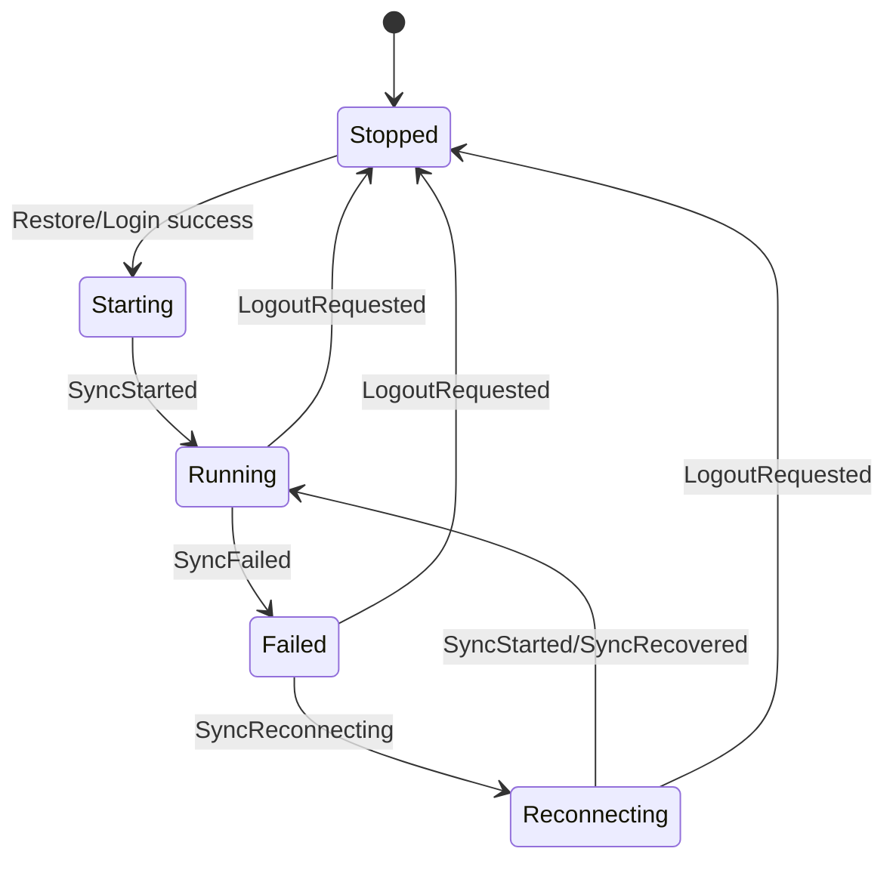

Logout and lock clear navigation, room lists, the main timeline, thread pane, and
search state. The reducer emits UI events for any cleared visible panes.

## Navigation

- Spaces filter non-DM rooms.
- DMs are global and remain visible regardless of active Space.
- If no active Space is selected, only non-DM rooms with no parent Space appear
  in the room list.
- Room-list updates clear an active Space or room if the item disappears.
- Selecting a room closes any open thread pane and emits a timeline subscription
  effect.

## Invites And Direct Messages

Incoming invite state is Rust-owned in `AppState.invites`. React may render the
invite list and submit commands, but it must not synthesize invite receipt,
acceptance, decline, or DM-start lifecycle state locally.

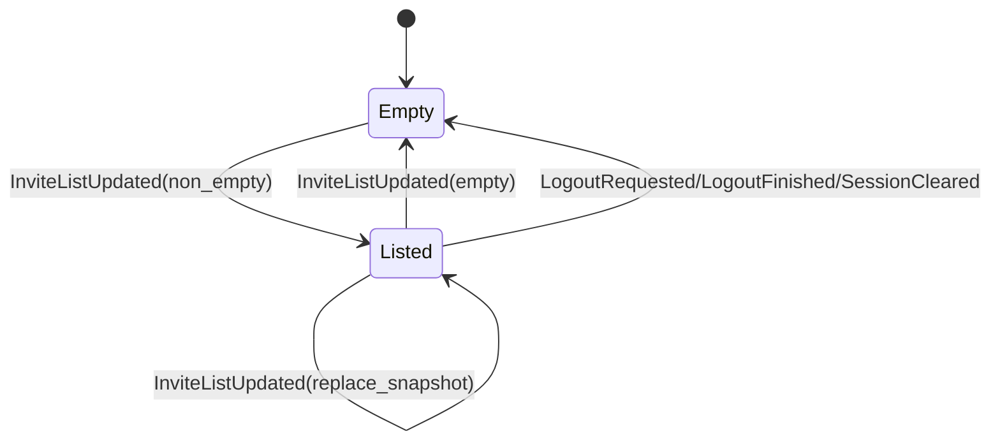

- `InviteListUpdated { invites }` is accepted only when the session is Ready.
  It replaces the whole invite snapshot and emits `RoomListChanged`; duplicate
  or stale SDK deliveries must be folded into the next Rust-owned snapshot.
- `InvitePreview` carries room id for command correlation plus display name,
  optional topic, optional inviter display name, and `is_dm`. GUI code must
  treat those fields as render data, not as a local membership state machine.
- `AcceptInvite` joins the invited room/space and emits
  `RoomEvent::InviteAccepted`; `DeclineInvite` leaves/forgets the invite and
  emits `RoomEvent::InviteDeclined`; `StartDirectMessage` creates a direct room
  through the SDK and emits `RoomEvent::DirectMessageStarted`. These commands
  carry normal request ids; GUI pending/settle feedback must come from Rust
  events/snapshots.
- `RoomActor` owns projection for both sync backends. On the SyncService path,
  the single live `RoomListService` entries adapter uses the non-left filter so
  invited-room diffs wake projection. Joined rooms/spaces are still normalized
  from `RoomState::Joined`; invite previews are normalized from
  `client.invited_rooms()`. A joined-only adapter is incorrect because invite
  receipt can sync successfully without any joined-room diff.
- The local core `invites_dm` QA scenario is the Phase A proof:
  `invite_recv=ok invite_accept=ok invite_decline=ok dm_start=ok`. Its output
  must remain private-data-free; do not print Matrix room IDs, user IDs, invite
  names, or raw SDK errors for this stage.
- The Phase B GUI is a view over the same Rust state. React may keep only
  presentation state for the currently visible pane, the selected invite
  preview, and unsent user-id drafts. Accept/decline/start-DM/invite-user
  actions cross the Tauri adapter as typed commands and must render their
  result from the returned Rust snapshot or subsequent state event. The browser
  headless IPC-contract test covers `accept_invite`, `invite_user`, and
  `start_direct_message`; the Linux virtual-display lane covers real WebView
  invite acceptance and DM start against a disposable local homeserver with the
  legacy sync backend forced for smoke determinism. SyncService invite
  projection remains covered by the Phase A core `invites_dm` local QA.

## Timeline And Thread

- The main timeline has one selected room.
- Timeline subscription signals only affect the selected room.
- The main composer tracks one pending transaction. A second send is ignored
  until the pending transaction completes.
- The thread pane is either closed, opening a root event, or open with a focused
  thread timeline.
- Thread subscription success must match the current opening room and root event;
  stale thread signals are ignored.
- Opening a thread is not complete when `ThreadPaneState` changes to `Opening`.
  The production runtime must also subscribe the corresponding
  `TimelineKind::Thread { room_id, root_event_id }`. Only the actual thread
  timeline subscription success may drive `ThreadSubscribed` and move the pane to
  `Open`.
- Thread pane identity and open/closed state are Rust-owned `AppState`. Visible
  thread items are not stored in `AppState`; they flow as `TimelineEvent`
  batches/diffs keyed by the thread `TimelineKey`. Legacy top-level frontend
  placeholders such as `snapshot.thread` are not authoritative in production.
- The open thread pane owns its own Rust `ComposerState`. The thread composer
  sends by routing `TimelineCommand::SendReply` to
  `TimelineKind::Thread { room_id, root_event_id }`, with
  `in_reply_to_event_id == root_event_id`. Focused timelines do not own
  composer state.

## Timeline Media

Timeline media is a core-owned operation/effect state, not React-local logic.
`TimelineItem.media` is projected in `matrix-desktop-core` from SDK
`m.image`/`m.file` message content and flows to the UI as ordinary timeline
diff data. React renders the metadata and dispatches typed commands; it must
not parse Matrix media event content, infer encryption state, or synthesize
upload/download lifecycle locally.

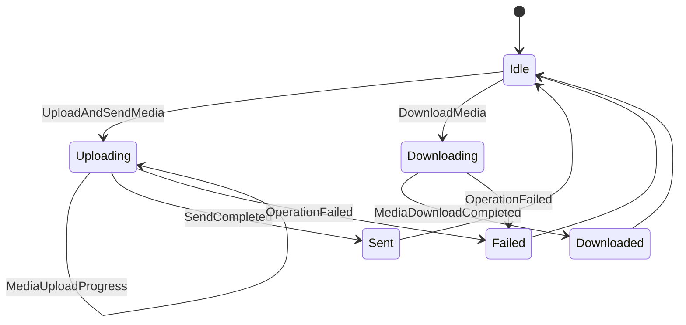

- `UploadAndSendMedia { key, transaction_id, request }` is routed only to a
  subscribed `TimelineActor`. The actor fixes the SDK attachment transaction id
  to the caller-provided `transaction_id` so local echo, upload progress, and
  `SendCompleted` correlate through the same Rust-owned key.
- Upload requests may carry filename, caption, mimetype, dimensions, and bytes
  because those are required to send the media. Those fields are private
  visible-content payloads: `Debug`, QA output, logs, and errors must redact
  them.
- `MediaUploadProgress` carries only request/transaction correlation, progress,
  index, and safe media source metadata. It never carries filenames, captions,
  bytes, Matrix room ids, or raw SDK errors.
- `TimelineItem.media.source` may expose the MXC URI, encrypted flag, and
  encryption protocol version. Encrypted file keys, hashes, and decrypted bytes
  remain inside Rust actor-private SDK media sources and are never serialized to
  React.
- `DownloadMedia` resolves the actor-private media source by event id and emits
  `MediaDownloadCompleted` with `byte_count` only. A future GUI save/open flow
  must use a Rust-owned platform port or Tauri command that does not put bytes
  into React state.
- Phase B GUI wiring is a transport client only: the Composer file input reads
  synthetic/user-selected bytes and invokes `upload_media`; `TimelineView`
  renders `TimelineItem.media` plus `MediaUploadProgress` keyed by the
  transaction id; event-backed media rows invoke `download_media`. React does
  not parse Matrix event content, infer encryption details, render MXC URIs, or
  own upload/download success/failure state.
- The local core `media` QA scenario is the Phase A proof:
  `send_media=ok recv_media=ok`. Its output must remain private-data-free.

## Live Signals

Live signals are Rust-owned room/account projections in
`AppState.live_signals`. They cover per-room read receipts, fully-read markers,
typing users, and account/user presence. React renders this state and dispatches
typed commands; it does not infer Matrix signal semantics from timeline rows,
DOM hover state, timers, or local component state.

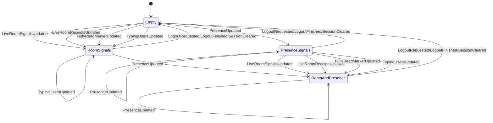

- Every live-signal update is accepted only for a Ready session. Late SDK
  deliveries after logout, lock, account switch, or session clear are ignored.
- `LiveRoomSignalsUpdated { room_id, update }` replaces the room's full
  live-signal snapshot. The reducer normalizes duplicate receipts by user,
  sorts receipt event entries, and sorts/deduplicates typing user ids.
- `LiveRoomReceiptsUpdated { room_id, receipts_by_event }` is a partial merge
  into the room receipt map. It does not clear typing users or the fully-read
  marker.
- `FullyReadMarkerUpdated { room_id, event_id }` replaces only that room's
  fully-read marker; `event_id: None` clears it.
- `TypingUsersUpdated { room_id, user_ids }` replaces only that room's typing
  user list with the normalized list from Rust. GUI timers or focus state must
  not repair typing state after the fact.
- `PresenceUpdated { user_id, presence }` updates the Rust-owned presence map.
  Current Phase A presence proves command/event/state ownership. Full network
  propagation remains tied to the sync backend's presence-setting API and must
  stay in Rust when implemented.
- Session-view clears reset all live signals and emit `LiveSignalsChanged` when
  anything was present.
- `TimelineCommand::SendReadReceipt`, `SetFullyRead`, and `SetTyping` are
  routed to the subscribed `TimelineActor`. Success events carry request ids;
  failures are redacted `OperationFailed` events. Event ids, room ids, and user
  ids may exist in app snapshots as visible Matrix UI data but must not appear
  in ordinary logs, Debug output, QA stdout, screenshots, or issue evidence.
- The local core `live_signals` QA scenario is the Phase A proof:
  `read_receipt=ok fully_read=ok typing=ok presence=ok live_signals=ok`. Its
  output must remain private-data-free and must not print Matrix room IDs, user
  IDs, event IDs, raw SDK errors, or message bodies. On local SyncService
  homeserver legs, the typing assertion may perform one bounded debug/test
  `SyncOnce` on the observer account after the sender's typing command is
  acknowledged; this is a QA delivery nudge, not React-owned or product
  polling logic.

## Focused Context

A focused context is the Rust-owned result-context timeline used when the
product opens a specific event from search or another contextual entry point.
It is separate from the selected room timeline and from the thread pane.

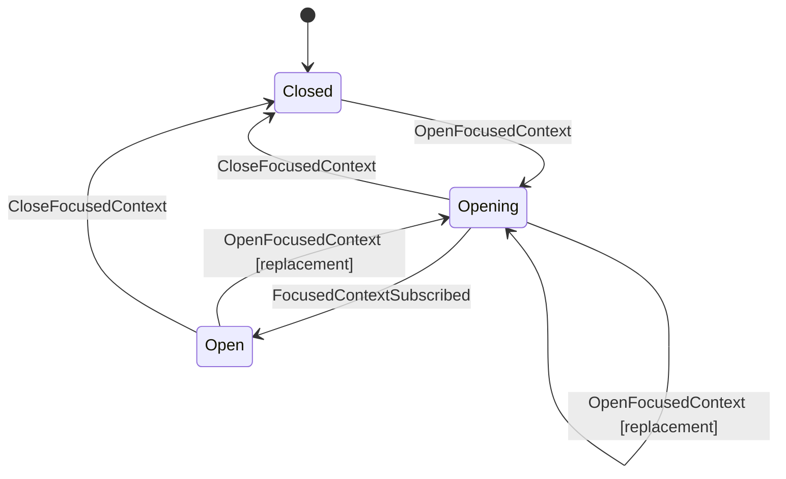

- `OpenFocusedContext { room_id, event_id }` is accepted only for a ready session
  whose selected timeline room equals `room_id`; otherwise it is ignored. The
  selected timeline room guard prevents search/result UI from owning Matrix
  operation semantics.
- On accepted open, the reducer enters `Opening` and emits
  `OpenFocusedTimeline { room_id, event_id }`. Production runtime subscribes
  `TimelineKind::Focused { room_id, event_id }` through that effect.
- `FocusedContextSubscribed { room_id, event_id }` moves `Opening` to `Open`
  only when both fields match the currently opening context; stale subscription signals are ignored.
- `CloseFocusedContext` closes an `Opening` or `Open` context for a ready
  session. close from `Closed`, or any close without a ready session, is a no-op.
- Focused context replacement is core-owned: when opening a different focused
  context while another focused context is `Opening` or `Open`, production
  runtime unsubscribes the previous focused timeline before subscribing the new
  key. Reopening the same focused key is idempotent as far as runtime
  subscription ownership allows.
- focused timelines do not own composer/send state. The selected room composer
  and the thread composer are separate Rust state machines; focused timelines do
  not submit sends, clear drafts, repair reply mode, or settle pending
  transactions.

## Thread Composer Reply Mode

The open thread pane's composer tracks draft and pending reply state separately
from the selected room's main composer:

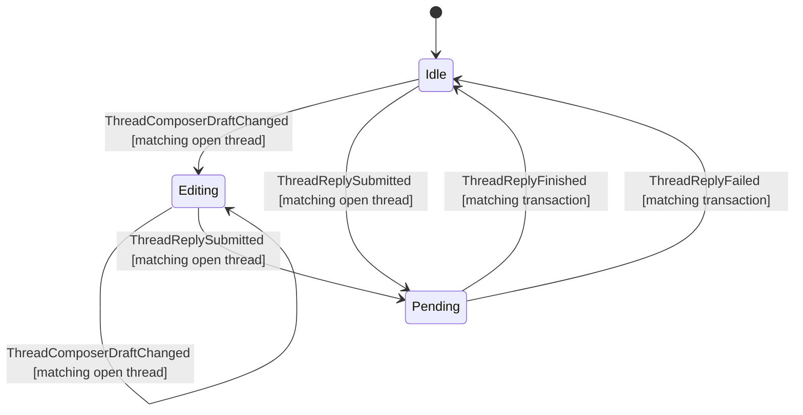

- `ThreadComposerDraftChanged { room_id, root_event_id, draft }` applies only
  when a ready session has that exact thread open. Stale room/root signals and
  closed/opening thread states are ignored.
- `ThreadReplySubmitted { room_id, root_event_id, transaction_id, body }`
  applies only when a ready session has that exact thread open and the thread
  composer has no pending transaction. It records the pending transaction as a
  reply to `root_event_id`, clears the thread draft, and emits `ThreadChanged`.
  It does not mutate the selected room's main composer.
- `ThreadReplyFinished { room_id, root_event_id, transaction_id }` clears only
  the matching thread composer pending transaction and emits `ThreadChanged`.
  Stale room/root/transaction signals are ignored.
- `ThreadReplyFailed { room_id, root_event_id, transaction_id, message }`
  clears only the matching thread composer pending transaction, records the same
  recoverable `send_text_failed` error pattern as main composer failures, and
  emits `ThreadChanged` plus `ErrorChanged`. Stale room/root/transaction signals
  are ignored.

## Composer Reply Mode

The selected room's composer carries a reply mode (`ComposerMode`) alongside its
pending-transaction tracking:

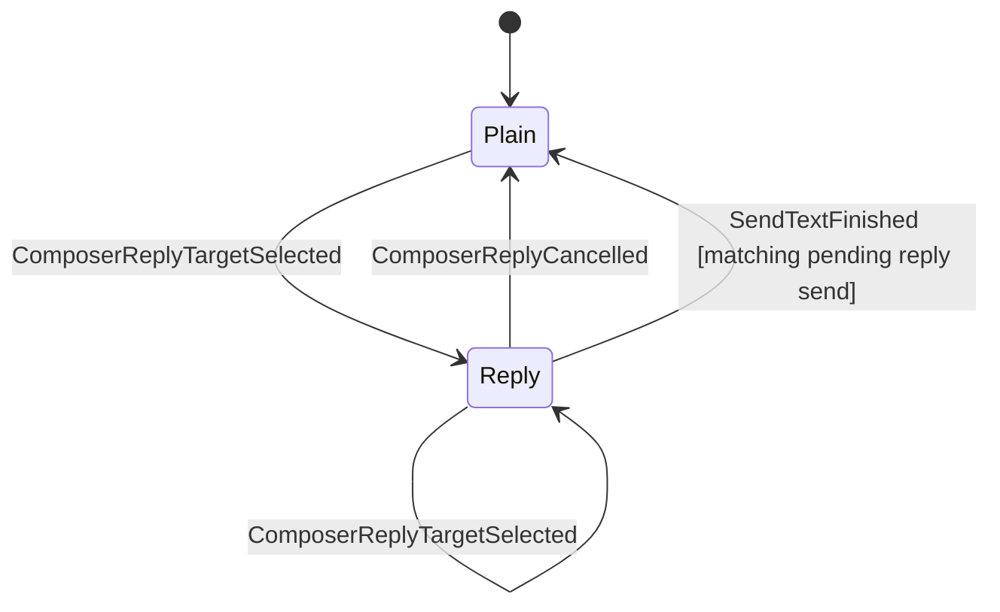

- `ComposerReplyTargetSelected { room_id, event_id }` enters `Reply` only when the
  session is `Ready` and `room_id` is the selected timeline room; otherwise it is
  ignored. Re-selecting while already in `Reply` replaces the target (idempotent).
- `ComposerReplyCancelled` returns to `Plain`; it is a no-op when already `Plain`
  or when no room is selected.
- `SendTextSubmitted { room_id, transaction_id, body }` records one pending
  transaction only when no send is already pending. The pending state records the
  submitted composer kind: plain send, or reply send with the reply target that
  was current at submission time.
- `SendTextFinished { room_id, transaction_id }` clears only the matching pending
  transaction. It returns the composer to `Plain` only when the matched pending
  send was submitted as a reply and the current reply target still equals the
  captured target. A plain send completion must not clear a reply target selected
  after submission, and a reply send completion must not clear a newer reply
  target selected before completion.
- `SendTextFailed { room_id, transaction_id, message }` clears the pending
  transaction and records a recoverable error. It preserves the current
  `Reply` mode so the user can retry or cancel explicitly.
- The reply target is Rust-owned `AppState`, not React-local, so the send path,
  snapshots, and QA can read which event a draft replies to.

## Basic Operations (Room / Space Creation, Space Linking)

Room creation, space creation, and space-child linking share one in-flight slot,
`AppState.basic_operation`, modeled as a guarded, request-correlated state
machine — the same shape as the composer's pending transaction and search's
`request_id` correlation:

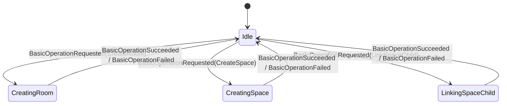

- Start guard: `BasicOperationRequested { request_id, request }` is accepted only
  from `Idle` with a `Ready` session. A request arriving while an operation is in
  flight is ignored, so the in-flight operation is never clobbered (mirrors "a
  second send is ignored until the pending transaction completes").
- Correlation: the pending state carries the request's `request_id`.
- Settle guard: `BasicOperationSucceeded { request_id }` and
  `BasicOperationFailed { request_id, message }` apply only when `request_id`
  matches the in-flight operation; stale, duplicate, or idle-state completions are
  ignored (mirrors search's `request_id` check). Failure also records a
  recoverable `basic_operation_failed` error.
- Event vs. state: `BasicOperationRequest` describes intent; the reducer derives
  the resulting `BasicOperationState`. An action never carries the target state.
- Producer: in production `matrix-desktop-core`'s `RoomActor` dispatches these
  events around the `CreateRoom` / `CreateSpace` / `SetSpaceChild` SDK calls,
  using the command's `request_id` (its `sequence`) as the correlation id.

## E2EE Trust, Verification, And Key Backup

Account-level E2EE trust UX is Rust-owned state in `AppState.e2ee_trust`.
React may render verification, cross-signing, key-backup, device-trust, and
identity-reset state, but it must not decide completion, retry, failure, or
trust semantics locally.

Verification flow:

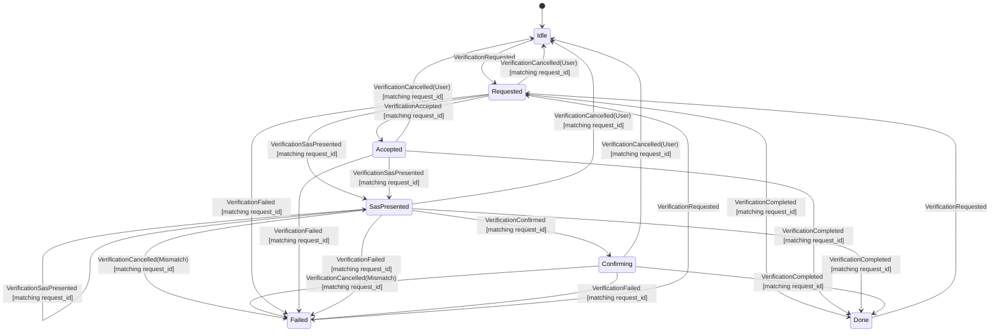

Cross-signing status:

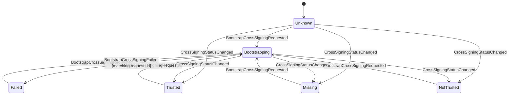

Key-backup status:

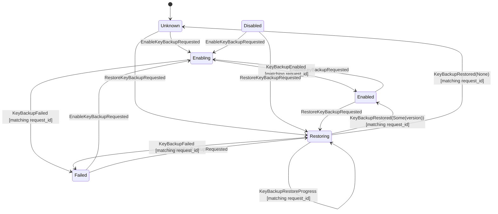

Identity reset:

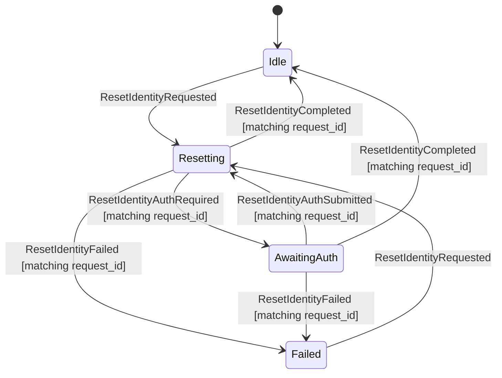

- Every transition requires a Ready session unless it is a stale settle signal
  ignored from an already-reset state. Signed-out, restoring, locked, and
  logging-out states ignore E2EE trust actions.
- Session-view clearing transitions (`LogoutRequested`, `SessionLocked`,
  `SwitchAccountRequested`) reset `AppState.e2ee_trust` to its default
  private-data-free unknowns and emit `E2eeTrustChanged` when trust state was
  non-default. Verification targets from one account must not remain visible in
  snapshots for another account or a signed-out/locked surface.
- Verification start is accepted only when no verification is active
  (`Idle`, `Done`, or `Failed`). A second request while `Requested`,
  `Accepted`, `SasPresented`, or `Confirming` is ignored.
- All settle/progress actions are request-correlated. Stale request ids are
  ignored and must not clobber an active verification, cross-signing bootstrap,
  backup enable/restore, or identity reset.
- Verification cancellation carries a Rust-owned reason. User decline/cancel
  returns the flow to `Idle`; SAS mismatch sends the SDK's mismatched-SAS
  cancellation and settles the reducer as `Failed { kind: Mismatch }`.
- Verification follow-up commands carry both a command `request_id` and a
  verification `flow_id`. The reducer state's `request_id` field is the flow
  id used for stale-flow guards; command `request_id` remains only for command
  submission/failure correlation. Incoming SDK-originated verification requests
  use a reserved Rust-owned flow-id namespace, so React never synthesizes or
  owns verification discovery state.
- Incoming SDK-originated verification observations are idempotent by SDK
  flow id. `AccountActor` ignores duplicate observations for the active flow
  and only cancels/rejects a different incoming flow while another verification
  is active.
- SAS peer acceptance is decided from the SDK SAS state mapped into Rust, not
  from React state or SDK direction flags. `MatrixSasState::Started` is the
  peer side that must call the SDK SAS accept path; `Created` is the local side
  after `start_sas` and must not be auto-accepted.
- Same-user two-device SAS verification should keep the request direction
  A2 -> A and start SAS from the requester after the accepting device reaches
  `Accepted`. The accepting-device-start sequence reproduced Tuwunel
  `m.key_mismatch` cancellation before SAS presentation in local QA.
- The local proof starts the verification request while continuous sync is
  running so device data is fresh, then pauses both sync loops and drives SAS
  delivery with bounded `SyncOnce` polling. Do not overlap continuous
  SyncService delivery with manual `SyncOnce` nudges during SAS; that overlap
  reproduced pre-SAS key-mismatch flakes.
- Identity reset is a typed Rust-owned state machine
  (`Idle`, `Resetting`, `AwaitingAuth`, `Failed`), not a nullable pending flag.
  `AwaitingAuth` carries only a request id and coarse auth type
  (`uiaa`, `oauth`, or `unknown`). The SDK continuation handle remains private
  to `AccountActor` and is cancelled when the active account runtime is logged
  out, switched, or shut down. Auth continuation submission is also a
  `CoreCommand::Account` path projected through the reducer before actor
  routing. It carries a command `request_id` for submission/failure correlation
  and a Rust-owned identity-reset `flow_id` for stale-flow guards. React must
  read that `flow_id` from `AppState.e2ee_trust.identity_reset`; it must not
  call SDK/UIAA/OAuth continuation logic directly or synthesize local flow ids.
- Failure state carries only `TrustOperationFailureKind` (`cancelled`,
  `mismatch`, `network`, `forbidden`, `timeout`, `sdk`). Raw SDK errors,
  private keys, recovery secrets, room keys, and key-backup secrets never enter
  `AppState`, `CoreEvent`, `Debug`, or QA output.
- `CoreCommand::Account` owns the typed command surface:
  `RequestVerification`, `AcceptVerification`, `ConfirmSasVerification`,
  `CancelVerification`, `BootstrapCrossSigning`, `EnableKeyBackup`,
  `RestoreKeyBackup`, `ResetIdentity`, and `SubmitIdentityResetAuth`. These
  commands redact verification targets, backup versions, and auth secrets in
  `Debug`. Trust commands are ready-session gated except
  `RestoreKeyBackup`, which must also be accepted while the authenticated
  session is `NeedsRecovery` / `Recovering`; the `AccountActor` still enforces
  that a store-backed Matrix session exists.
- Phase B GUI controls are thin transport clients for that command surface.
  Tauri handlers allocate a fresh command `request_id`, pass the Rust-owned
  verification/identity-reset `flow_id` from the snapshot when required, and
  submit `CoreCommand::Account`; they must not call SDK wrappers directly or
  repair trust state in the adapter. Browser preview and Playwright harnesses
  may provide deterministic Rust-shaped `e2ee_trust` snapshots, but those
  fixtures must mirror the DTO shape rather than inventing React-only trust
  state.
- React trust UI must render `AppState.e2ee_trust` and dispatch typed
  commands only. Verification target user/device ids are not display labels;
  device rows should use private-data-free ordinal/status labels unless a
  later product decision explicitly introduces a redacted display model in
  Rust. SAS comparison UI may render the emoji symbols from Rust, but visible
  labels/status text must come from the i18n catalog.
- `RestoreKeyBackup` carries the secret-bearing recovery request only inside
  `CoreCommand::Account`; the projected `AppAction::RestoreKeyBackupRequested`,
  reducer effects, `CoreEvent`, and snapshots carry only request id, optional
  private-data-free backup version, and progress counters. React never receives
  or interprets the recovery secret.
- `EnableKeyBackup` may carry an optional passphrase `AuthSecret` only inside
  `CoreCommand::Account`; reducer actions, effects, events, snapshots, and logs
  must not expose the passphrase or the recovery key returned by the SDK.
- `BootstrapCrossSigning` may carry a UIAA password `AuthSecret` only inside
  `CoreCommand::Account`; reducer actions, effects, events, snapshots, and
  logs remain secret-free.
- Production `CoreCommand::Account` trust commands are projected through the
  reducer before actor routing. This is required even though the SDK work
  happens in `AccountActor`: pending state such as `Bootstrapping`,
  `Enabling`, and `Resetting` must be Rust-owned `AppState`, not React-local
  state inferred after button clicks.
- `CoreEvent::E2eeTrust` owns the typed event surface for verification
  progress, cross-signing status, key-backup status, and identity reset. The
  event payload is structured for UI consumption; event `Debug` redacts account
  keys and verification targets so QA output remains private-data-free.
- Device verification SDK handles are not reducer state. `AccountActor` owns
  the opaque `matrix-desktop-sdk` verification-request and SAS handles, observes
  their SDK state streams, and projects only reducer actions / typed
  `CoreEvent::E2eeTrust` updates. The frontend receives SAS emoji DTOs only
  after Rust observes `KeysExchanged`; React must not decide SAS readiness,
  completion, cancellation, or mismatch semantics locally.
- `AccountActor` SDK results settle the reducer with kind-only actions and emit
  typed `CoreEvent::E2eeTrust` updates. The SDK wrapper maps Matrix SDK
  cross-signing and backup states to app DTOs before they cross the
  core/state boundary. Until a public SDK backup-version accessor is used, an
  enabled backup may be surfaced as a private-data-free `available` version
  sentinel; local-homeserver proof must tighten this before issue closure.
- Current Phase A key-backup restore uses public SDK APIs only: import recovery
  secrets, then hydrate currently joined rooms through
  `Backups::download_room_keys_for_room`. `restored_rooms` / `total_rooms`
  describe that joined-room hydration set. The SDK's true backup-wide
  all-session one-shot download remains behind private internals, so the app
  must not claim exhaustive backup-wide restore until a public SDK API or
  reviewed vendored patch exists.
- Actor-side unavailable paths must also settle any already-projected pending
  trust state with the matching reducer failure action. `OperationFailed`
  alone is a transport error signal; it is not a state-machine transition.
- The local core QA `e2ee_trust` scenario is the Phase A proof for this
  contract on disposable homeservers. It exercises Rust-owned cross-signing
  bootstrap, encrypted seed-room backup upload, passphrase-backed key-backup
  enable, wrong-secret restore failure, successful passphrase restore on a
  second same-user device, two-device SAS verification, and identity reset
  before any GUI controls are considered complete. Run it on the probed
  SyncService core leg:
  `npm --prefix apps/desktop run qa:headless-local -- --server=conduit --scenario=e2ee_trust --core --core-backend=probed --timeout-ms=240000`.
  The runner registers separate synthetic users for the SDK lane and each core
  backend leg so the E2EE proof's account/device graph stays isolated.
- The fixture/demo backend reports E2EE trust effects as unavailable until the
  `AccountActor` SDK implementation lands. It must not silently discard those
  effects.

## Search

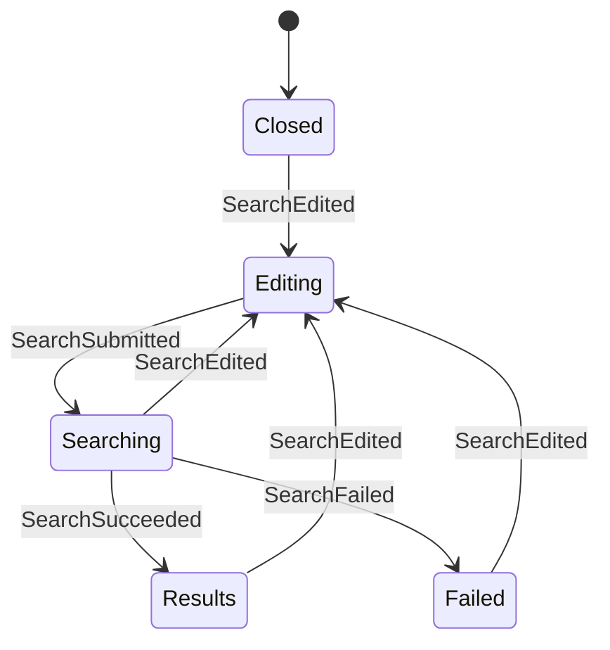

- Search has editing, searching, results, and failed states.
- Search responses carry a `request_id`.
- Responses whose `request_id` does not match the active searching state are
  ignored.
- If the user edits the query while a search is in flight, the in-flight response
  is ignored because the state is no longer `Searching`.
- Submitting a search emits both the backend search request and `SearchChanged`
  so the UI can display the loading state immediately.
- Snippet text and highlight ranges are DTO fields produced by a future search
  adapter, not by the reducer.

The ngram index is a candidate generator, not the source of display truth. Before
returning a result, the search adapter must run a second-pass verification over
the resolved visible body or snippet. Only verified exact spans are returned as
highlight ranges. Ngram candidates without a verified span are dropped from the
default search result set.

Highlight ranges are half-open UTF-16 code unit offsets relative to the returned
snippet so the frontend can apply them without re-tokenizing Japanese text or
emoji. Future fuzzy or related-message search must use a different
`SearchMatchKind` and a different visual treatment from exact highlights.

Attachment filenames are searchable, but they are not treated as message-body
matches. The search adapter indexes the resolved visible filename for file-like
events and returns `SearchMatchField::AttachmentFileName` when the verified span
is in that filename. In that case, `snippet` is the filename, highlight ranges
are relative to the filename, and the UI should render the result as a file
match with a file affordance. The click target remains the Matrix event that
contains the attachment.

Redacted attachments are not searchable. If a file event is edited or replaced,
the adapter indexes only the resolved visible filename. File contents are out of
scope for this search contract; only filenames participate.

Edited, redacted, or replaced Matrix events must be resolved before producing a
search result. The reducer stores only the search adapter's result snapshot; it
does not decide whether an older event body, an edited body, or a redaction tombstone
is visible.

Matrix edit events may be downloaded before the event they replace. The search
adapter must store such edits as pending relations keyed by the target event ID,
not as standalone searchable messages. If a search runs before the target event
has been downloaded, the adapter may either omit that pending edit from results
or synchronously repair the gap by fetching the target event first. It must not
return the edit event as if it were an independent room message.

When the missing target event later arrives, the adapter applies the pending edit
and indexes the resolved visible body for the target event. This can create a
temporary false negative for edited text, but avoids showing duplicated,
misordered, or non-visible edit events. Search results that depend on an
incomplete local index should be treated as partial until the indexer catches up.

Search timeline display must be treated as a focused result view, not as a normal
room timeline. It should avoid implying that search results are a complete
chronological timeline unless the backend explicitly provides enough surrounding
context and replacement/redaction state to render that context safely.

## Appearance / Theme Ownership

Theme *appearance* is split deliberately:

- **OS-follow theming is presentation-only.** The dark token set is applied by
  `@media (prefers-color-scheme: dark)` in `styles.css`. No React or Rust state
  participates; nothing is dispatched, nothing is stored.
- **An explicit user theme choice (`system | light | dark`) is product state**
  and is therefore Rust-owned in `SettingsState`. React applies it by setting
  `data-theme` / `color-scheme` on the root element; the CSS
  `:root[data-theme="dark"]` block exists for this. React must not store the
  chosen theme as its own product state.

Selection, unread, reply, thread, search, and right-panel modes remain
Rust-owned (`AppState.navigation`, `rooms[].unread_count`/`highlight_count`,
`timeline.composer.mode`, `thread`, `search`, right-panel mode).

## Settings

Settings are Rust-owned product state and are not gated by a Ready session.
They affect signed-out and signed-in UI surfaces such as language, text
direction, appearance/theme, font/emoji choice, and composer send shortcut.
React renders `AppState.settings` and dispatches typed settings commands; it
must not store these preferences as product state in localStorage or component
state.

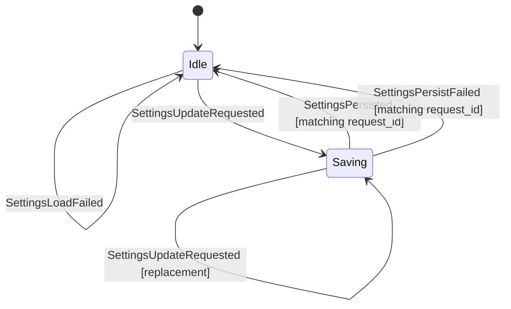

- Settings load failure keeps safe defaults and records a private-data-free
  recoverable error.
- Settings updates are optimistic: the reducer applies the typed patch before
  persistence completes, records the latest saving request id, and ignores stale
  persist completions.
- Composer send shortcut behavior is resolved by the pure Rust-owned
  `matrix-desktop-state` composer resolver for main, thread, and edit composer
  surfaces. GUI code may normalize DOM/native key input into the resolver's
  typed key facts; it must not reimplement Enter, Shift+Enter, Mod+Enter,
  autocomplete acceptance, or cancel semantics as product logic.
- Font and emoji display behavior is resolved by
  `matrix_desktop_state::resolve_typography_display_profile`. GUI code may
  apply the resulting `TypographyDisplayProfile` tokens to root attributes and
  CSS variables, but it must not choose Inter/Twemoji/system fallback semantics
  locally or branch per component/OS.
- Persist failures do not roll back the in-memory product state. They clear the
  pending save and record a recoverable error so the UI can surface retry/status
  later without inventing product semantics.
- Settings values are non-secret by construction. They must never include
  access tokens, refresh tokens, passwords, recovery material, SDK store keys,
  search index keys, local unlock secrets, raw homeserver credentials, raw
  Matrix session JSON, message bodies, attachment filenames, room IDs, event
  IDs, user IDs, or raw SDK errors.
