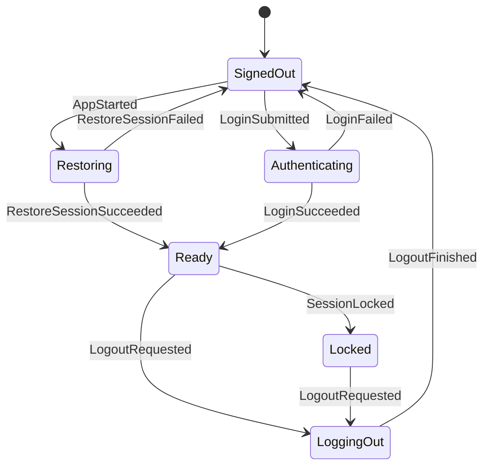
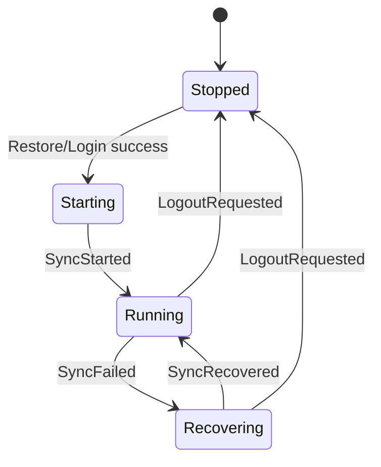

# Matrix Desktop State Machine

Date: 2026-06-11

## Contract

The app state machine is a pure Rust reducer:

```rust
reduce(&mut AppState, AppAction) -> Vec<AppEffect>
```

`AppAction` is either user intent from React or a completed SDK/backend operation.
`AppEffect` is a request for the future Tauri backend to perform work. The reducer
does not call Matrix SDK, Tauri, filesystem, keyring, or network APIs.

Actions that touch room, timeline, thread, or search state are accepted only when
the session is `Ready`. Late backend signals after logout or lock are ignored.

## Session And Sync





Logout and lock clear navigation, room lists, the main timeline, thread pane, and
search state. The reducer emits UI events for any cleared visible panes.

## Navigation

- Spaces filter non-DM rooms.
- DMs are global and remain visible regardless of active Space.
- If no active Space is selected, only non-DM rooms with no parent Space appear
  in the room list.
- Room-list updates clear an active Space or room if the item disappears.
- Selecting a room closes any open thread pane and emits a timeline subscription
  effect.

## Timeline And Thread

- The main timeline has one selected room.
- Timeline subscription signals only affect the selected room.
- The main composer tracks one pending transaction. A second send is ignored
  until the pending transaction completes.
- The thread pane is either closed, opening a root event, or open with a focused
  thread timeline.
- Thread subscription success must match the current opening room and root event;
  stale thread signals are ignored.

## Search

- Search has editing, searching, results, and failed states.
- Search responses carry a `request_id`.
- Responses whose `request_id` does not match the active searching state are
  ignored.
- If the user edits the query while a search is in flight, the in-flight response
  is ignored because the state is no longer `Searching`.
- Submitting a search emits both the backend search request and `SearchChanged`
  so the UI can display the loading state immediately.
- Snippet text is a DTO field produced by a future search adapter, not by the
  reducer.
