# Matrix Desktop State Machine

Status: maintained reference for the reducer state machines. The
`reduce(AppState, AppAction)` reducer described here is the live UI
state-transition mechanism — production wires `CoreEvent -> AppAction ->
reduce(AppState)` (see [overview.md](./overview.md)). The `AppEffect`
fixture/demo backend contract mentioned below is historical (dev/demo only).
The state-transition diagrams in this document are normative and must track the
reducer; see [Maintenance Contract](#maintenance-contract).

Date: 2026-07-20

## Contract

The app state machine is a pure Rust reducer:

```rust
reduce(&mut AppState, AppAction) -> Vec<AppEffect>
```

`AppAction` is either user intent from React or a completed SDK/backend operation.
`AppEffect` is a request for the reducer-backed fixture/demo backend contract
used by older shell layers and tests. The reducer does not call Matrix SDK,
Tauri, filesystem, keyring, or network APIs. Current production runtime work
uses `CoreCommand` / `CoreEvent` in `docs/architecture/overview.md`.

Actions that touch room, timeline, thread, search, or composer state are accepted
only for a *Ready session* (defined below). Late backend signals after logout or
lock are ignored.

Reducer state remains Rust-owned even when the desktop WebView caches it for
selector subscriptions. The frontend projection store may retain unchanged
snapshot slice references and memoize derived render inputs, but it must not
create product transitions, repair state-machine state, or decide Matrix
semantics locally. Runtime/background state updates now arrive as ordered
Rust-owned `StateDelta` changed-slice events; full snapshots are initial,
reset/reconnect, or explicit command-response projections only. A delta
generation gap forces a full-snapshot reset whose `state_generation` restores
ordering before later deltas apply.

Reducer guard phrase: "Ready session" means exactly `SessionState::Ready(_)`:
the SDK has authoritatively reported that the current device is verified.
Authenticated provisional, awaiting-verification, verifying, and rejecting
states never authorize room, timeline, thread, search, composer, directory,
notification, attention, or normal sync actions.

Actor-delivered projections and request-correlated settles use a wider
"session projection context". It may include verification-gate states only for
gate rendering and request-correlated recovery/SAS/trust settles; it must never
be reused as a normal command-admission predicate. Logout, rejection, trust
loss, and session-clear transitions explicitly reset session-scoped state.

## Maintenance Contract

The state-transition diagrams in this document are normative, not illustrative.
Every reducer state machine — its states, the `AppAction` events that drive
transitions, and the guards that reject invalid or stale inputs — is documented
here as a Mermaid `stateDiagram-v2`. When the reducer changes (a new state,
transition, or guard), the matching diagram and its guard notes are updated in
the same change. A transition that exists in the reducer but not in the diagram,
or vice versa, is a defect; phase-exit docs-sync checks for it (see
[REPOSITORY_RULES.md](../../REPOSITORY_RULES.md) -> State-Machine Discipline and
[engineering-rules.md](../policies/engineering-rules.md) -> Documentation).

Convention: each transition is labeled with the `AppAction` that causes it, and
guards are stated as prose under the diagram. Unless noted, every transition
also requires a `Ready` session, and late or stale signals are ignored rather
than applied.

## Session And Sync

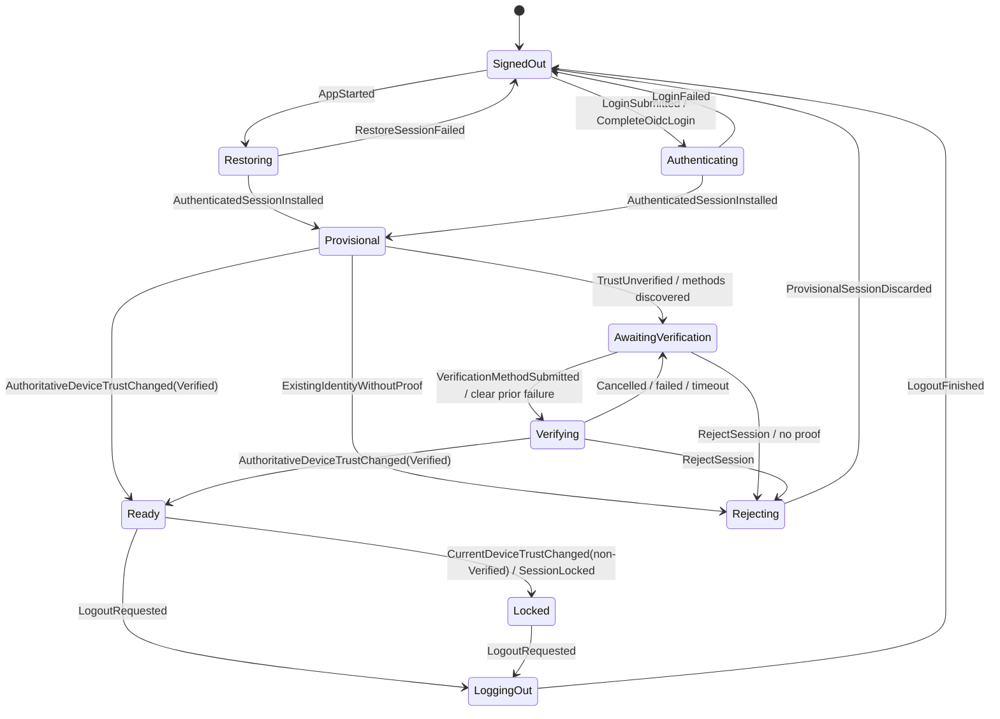

- A state-changing account command is admitted only if its projected action is
  accepted by the current reducer state. Rejection is never a silent return:
  Core emits exactly one correlated `OperationFailed` with the stable failure
  kind (for example `SessionRequired` for `RestoreSession` while logout has not
  reached `SignedOut`) and does not route the rejected command to
  `AccountActor`.
- `LoggedOut` is an operation terminal, while `SessionState::SignedOut` is the
  authoritative state barrier. They travel on independent runtime lanes and
  may be observed in either order. A consumer that will immediately issue a
  session-sensitive follow-up must observe both before proceeding; seeing only
  `LoggedOut` does not prove reducer commit visibility. The same rule applies
  when a restore attempt emits `OperationFailed(SessionNotFound)` while its
  `RestoreSessionFailed` action is still advancing the reducer back to
  `SignedOut`.
- `Provisional`, `AwaitingVerification`, `Verifying`, and `Rejecting` are
  authenticated but not Ready. Their DTOs contain only coarse method/account
  capability and failure kinds plus app-owned opaque correlation IDs. SDK
  handles, raw target device IDs, recovery secrets, and raw errors stay in
  `AccountActor`/`koushi-sdk`.
- Recovery completion, SAS `Done`, cross-signing bootstrap, or save confirmation
  requests a fresh current-device trust probe; none directly transitions to
  `Ready`.
- A verification failure is scoped to the completed attempt. It remains on
  `AwaitingVerification` for user feedback, and an accepted
  `VerificationMethodSubmitted` clears it while preserving the gate's methods
  and account kind before entering the new `Verifying` flow.
- Restricted crypto sync is AccountActor-internal and cannot publish normal
  projections or active saved-session state. Initial authoritative Verified
  skips that lane; later Verified cancels and joins it before the Ready
  projection. Normal SyncActor ownership begins only after the Ready projection
  acknowledgement, so restricted and normal classic-sync token owners never
  overlap. Unknown and Unverified trust remain fail closed.
- Ready is a trust/admission state, not a successful-sync state. Starting,
  reconnecting, failed, and offline normal sync remain in the Ready shell and
  use its normal status/restart affordances; they do not reopen or flash the
  verification gate.
- A genuine missing cross-signing identity may enter mandatory bootstrap. An
  existing identity without a verified other device or usable recovery method
  enters `Rejecting`; identity reset, skip, and verify-later are not gate exits.
- Current-device strictness does not create a peer-device send gate. Eligible
  unverified peer devices remain non-blocking; blocked devices and cryptographic
  integrity/key-mismatch failures remain failures.

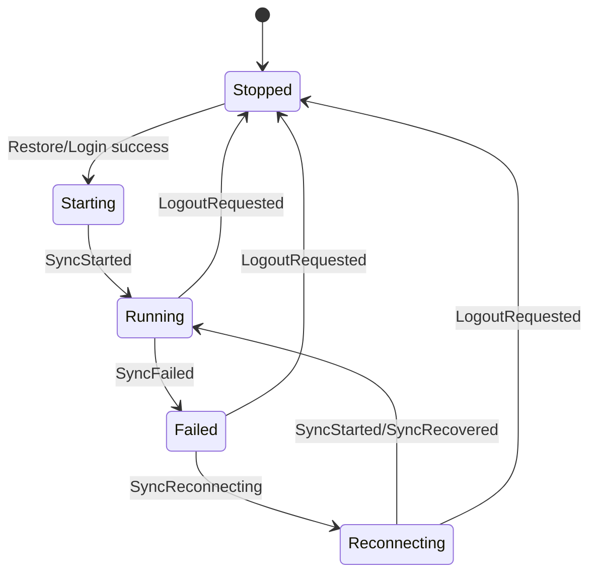

Logout, lock, and account switch clear navigation, room lists, the main
timeline, thread pane, search state, search crawler status, invite workflow,
and basic operation pendings. The reducer emits UI events for any cleared
visible panes or crawler status.

`SessionLocked` and `LogoutRequested` emit `AppEffect::StopSync`; the core
runtime must execute it through the canonical sync actor command path.
Credential/store cleanup and target-account restore are not reducer effects:
logout and account switch run through the explicit AccountActor command path,
which owns local persistence deletion, current-session teardown, and
store-backed account restore.

Password login and OIDC/MAS callback completion both enter `Authenticating`
through Rust-owned account commands and settle through the same
`LoginSucceeded` / `LoginFailed` reducer actions. OIDC authorization URLs and
CSRF state are command/event artifacts only: they may be returned to the WebView
so it can open the provider and correlate the callback, but they never enter
`AppState`, normal `Debug`, QA title tokens, or persisted settings.

## Sync Mode

`AppState.sync_mode` is a Rust-owned projection of the active Matrix sync
backend. It is independent of `AppState.sync` (the connection lifecycle) and is
set by `SyncModeChanged { mode }`. React renders the mode snapshot and must not
infer the backend from sync lifecycle state.

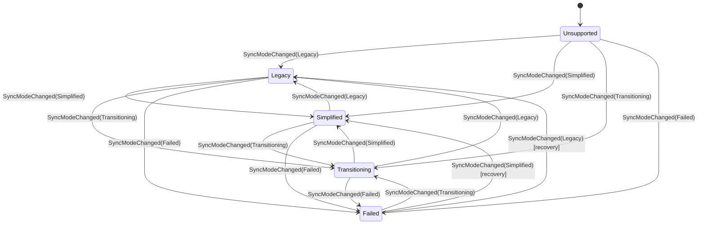

- `SyncMode` is `Unsupported`, `Legacy`, `Simplified`, `Transitioning`, or
  `Failed { failure_kind }`. It is not guarded by a Ready session; it updates
  whenever the runtime/backend signals a change.
- Duplicate deliveries (`state.sync_mode == mode`) are ignored.
- Mode changes emit `UiEvent::SyncModeChanged`.

## Room List Filter

The visible room list is a Rust-owned projection (`AppState.room_list`). React
renders `active_filter`, `sort`, and `items` and must not recompute filter
membership, section order, or activity sort.

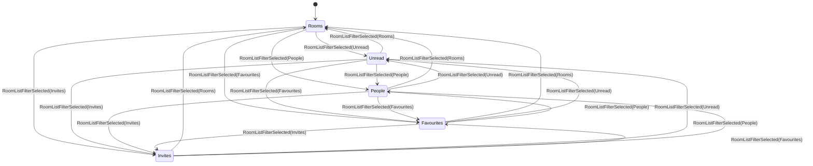

- `RoomListFilterSelected { filter }` is accepted only for a Ready session and
  only when `active_filter` differs. It recomputes `room_list.items` from the
  current `rooms` and `invites` snapshots and emits `UiEvent::RoomListChanged`.
- `RoomListFilterApplied { projection }` updates the projection directly when
  the sync backend/RoomActor has already computed filtered entries (for example
  from sliding-sync dynamic adapters). It is accepted only when the projection
  changes.
- `RoomListUpdated` and `InviteListUpdated` recompute the projection for the
  current `active_filter`. They are applied only for the current Ready session;
  updates delivered after provisional entry, trust loss, logout, or account
  switching are stale and must not repopulate cleared normal projections.
- Activity and Recent-first ordering consume only the Rust-owned
  `RoomSummary.conversation_activity` projection. The projection records an
  actual message, undecryptable encrypted message, or thread reply timestamp;
  it is independent from preview-oriented `latest_event` and the SDK's opaque
  `recency_stamp`. Membership/state events, reactions, edits/replacements,
  redactions, receipts, typing, and presence never create conversation
  activity.
- Rooms with conversation activity sort before rooms without it, then by
  descending conversation timestamp. Equal or absent timestamps fall back to
  case-folded `display_label` and finally `room_id`, so a newly joined DM cannot
  outrank an existing conversation merely because its SDK recency stamp is
  newer. React renders this order and must not re-sort room projections.
- `RoomMarkedAsReadSucceeded` clears `marked_unread`, `unread_count`,
  `notification_count`, and `highlight_count` for the room and recomputes the
  projection. Success/failure settles may normalize matching in-flight request
  bookkeeping outside Ready, but must not recreate room projections after the
  session has left Ready.
- `RoomMarkedAsUnreadSucceeded { unread: true }` sets `marked_unread` and bumps
  `unread_count` to at least 1 when it was zero, then recomputes the projection.
  `unread: false` clears the flag and resets `unread_count`.
- Requested mark-read/unread actions are accepted only for known rooms in a
  Ready session and emit `RoomListChanged`.

### Unread Source Of Truth

Unread state crosses three Matrix concepts that must not be collapsed into one
local flag:

- `RoomSummary.unread_count`, `notification_count`, `highlight_count`, and
  `marked_unread` are SDK/server observations. They can arrive later than a
  local command response, and historical Matrix Rust SDK releases have had
  unread-count/read-receipt convergence bugs (for example
  matrix-rust-sdk#6211, fixed upstream by matrix-rust-sdk#6406). Koushi must
  treat these counts as input snapshots, not as proof that a just-issued
  mark-read command succeeded or failed.
- A room is persistently marked read only after the Matrix read marker request
  succeeds. The request must update the fully-read marker and a private read
  receipt together; fully-read alone is not sufficient to clear notification
  counts across devices. Runtime read-marker commands use the room read-marker
  API directly rather than the timeline receipt helper, because the timeline
  helper may suppress a receipt it believes is already covered while the
  room-list unread snapshot is still stale.
- `m.marked_unread` is separate from read receipts/read markers. Marking a room
  read must also clear the explicit unread marker, while marking unread must not
  move the fully-read marker.

Activity may temporarily suppress rows to keep the panel responsive, but that
suppression is not an authoritative read state. Any reducer action that clears
room unread counts must be driven by a successful RoomActor/SDK operation or by
a later SDK/server room-list snapshot that already reports the room as read.
After a local successful mark-read, the reducer may suppress a later nonzero
room-list snapshot only when the room was locally clear, a fully-read marker is
known, and the incoming room-summary latest event and last-activity timestamp
match the locally cleared room. If latest activity changes, the unread snapshot
is treated as new information and is preserved.
On startup there is no prior `AppState` to compare against, so the SDK room-list
projection also reads persisted room account data / own receipts. If
`m.fully_read` or the current user's unthreaded private read receipt points at
the room summary latest event, nonzero unread/notification counts in that same
SDK snapshot are treated as stale and projected as zero. If the marker points
elsewhere, the counts are preserved until a timeline-aware path can prove event
ordering.
Do not reintroduce optimistic unread clearing in React or in Activity projection
code without a matching command-success correlation.

## Navigation

- Spaces filter non-DM rooms.
- DMs are shown in full only in Home (no active Space). When a Space is active,
  the DM section shows DMs where at least one counterpart is a member of that
  Space's room (any counterpart for group DMs); a DM matching no Space appears
  only in Home. The association is counterpart space-room membership, computed
  Rust-side as `RoomSummary.dm_space_ids` (DMs are never assigned to Spaces via
  `m.space.child`/`m.space.parent`).
- If no active Space is selected, the room list shows non-DM rooms with no parent
  Space, plus all DMs (Home shows DMs in full).
- Navigation remembers the last non-DM room selected inside each Space. Selecting
  a Space restores that room when it still belongs to the Space, otherwise it
  falls back to the Space's first non-DM room and retargets the timeline.
- Room-list updates clear an active Space or room if the item disappears.
- Selecting a room closes any open thread pane and emits a timeline subscription
  effect. It hydrates the selected room's active composer from the Rust-owned
  draft store; it does not reset the draft to an empty composer unless no stored
  draft exists.

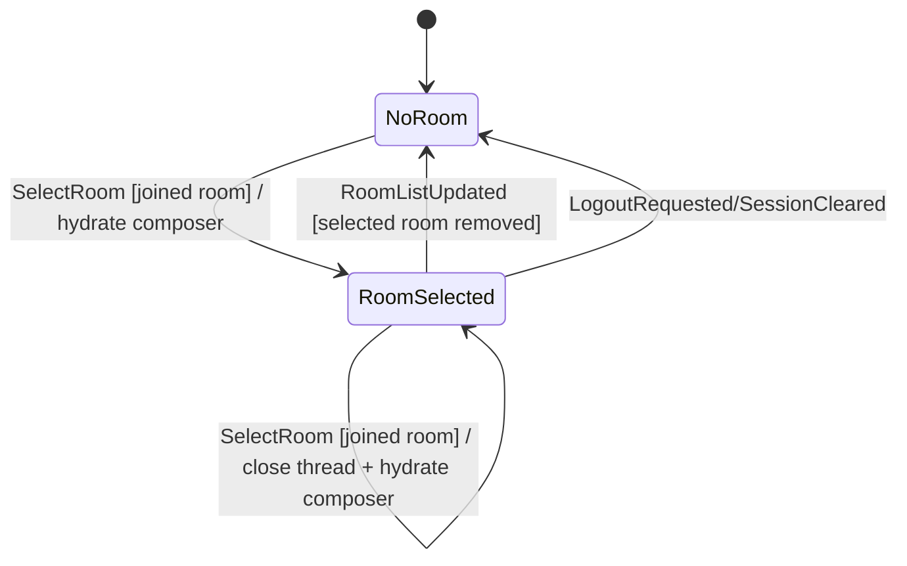

## Room Tags

Room tags are Rust-owned room-list state. `RoomSummary.tags` carries the
Element-aligned subset of Matrix `m.tag` data that affects product IA today:
favourite and low priority. React may render tag affordances and dispatch typed
commands, but it must not locally decide tag membership, mutually-exclusive tag
cleanup, or section membership.

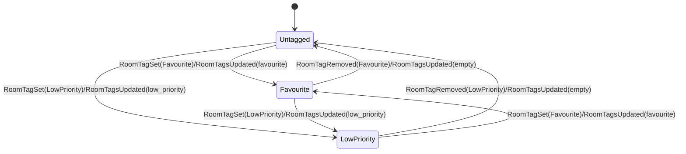

- `RoomTagsUpdated { room_id, tags }`, `RoomTagSet { room_id, tag, info }`,
  and `RoomTagRemoved { room_id, tag }` are accepted only when the session is
  Ready. Late deliveries after logout, restore, lock, or account switch are
  ignored.
- Unknown `room_id` inputs are ignored; tag actions never synthesize a room.
- Favourite and low-priority are mutually exclusive in the reducer. Setting one
  clears the other, matching the SDK `set_is_favourite` /
  `set_is_low_priority` behavior.
- Successful tag changes emit `RoomListChanged`. Phase B room-list sections
  (Favourites / People / Rooms / Low priority) are derived from this Rust-owned
  snapshot, not from React-local menu state.
- `RoomActor` routes `RoomCommand::SetTag` / `RemoveTag` through
  `koushi-sdk` tag wrappers, emits `RoomEvent::RoomTagSet` /
  `RoomTagRemoved`, reliably dispatches the reducer action that updates
  `RoomSummary.tags`, and does not immediately refresh the room list. The SDK
  tag calls send account-data changes to the homeserver, so the next sync
  snapshot is canonical; an immediate local refresh can still contain stale
  tags and must not overwrite the reducer projection.

## Invites And Direct Messages

Incoming invite state is Rust-owned in `AppState.invites`. React may render the
invite list and submit commands, but it must not synthesize invite receipt,
acceptance, decline, or DM-start lifecycle state locally.

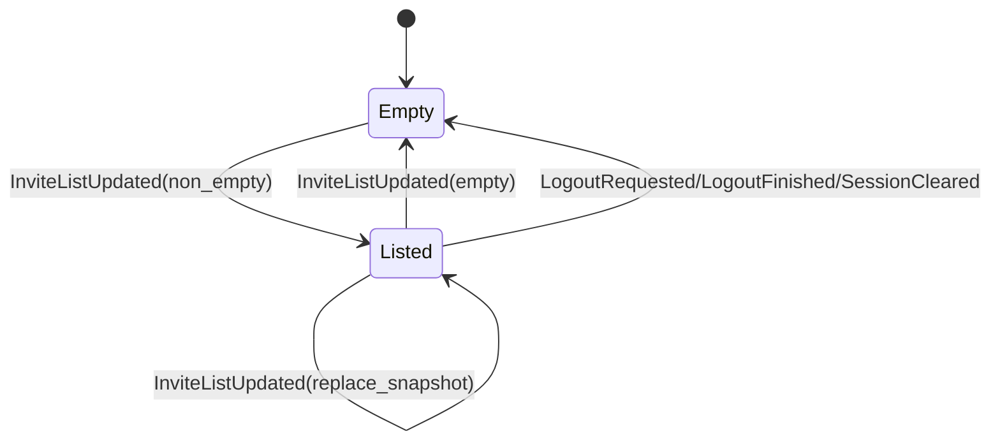

- `InviteListUpdated { invites }` is accepted only when the session is Ready.
  It replaces the whole invite snapshot and emits `RoomListChanged`; duplicate
  or stale SDK deliveries must be folded into the next Rust-owned snapshot.
- Backend selection proves the invite-list contract before either continuous
  owner starts. An authenticated, cursorless MSC4186 request asks for one fixed
  zero-timeline invited-room list. Presence of that exact list selects
  `SyncService`; omission, typed/malformed failure, or expiry of the single
  end-to-end two-second deadline selects `LegacySync`. The deadline includes
  automatic access-token refresh and retry. Probe cursors and room payloads are
  discarded, and the preflight never creates a second sync owner. Server-family
  or version-string fingerprints are not capability evidence.
- `InvitePreview` carries room id for command correlation plus display name,
  optional topic, optional inviter display name, and `is_dm`. GUI code must
  treat those fields as render data, not as a local membership state machine.
- `AcceptInvite` joins the invited room/space and emits
  `RoomEvent::InviteAccepted`; `DeclineInvite` leaves/forgets the invite and
  emits `RoomEvent::InviteDeclined`; `StartDirectMessage` creates a direct room
  through the SDK and emits `RoomEvent::DirectMessageStarted`. These commands
  carry normal request ids; GUI pending/settle feedback must come from Rust
  events/snapshots.
- `RoomActor` owns projection for both sync backends. On the SyncService path,
  the single live `RoomListService` entries adapter uses the non-left filter so
  visible invited-room diffs wake projection. A bounded entries head is not a
  complete change feed: an invite may commit outside that head without emitting
  an entries diff. The same observer also listens to the base client's
  post-commit room-update broadcast as an auxiliary wake, coalesces queued
  batches, and reprojects only for an invite payload, an invite-membership
  change, or one bounded lag recovery. Ordinary joined-room updates with an
  unchanged invite fingerprint do not rebuild the room list. A closed auxiliary
  broadcast disables that arm without ending the authoritative entries
  observer, and this path never creates a second sync owner or
  `RoomListService`. Joined rooms/spaces are still normalized from
  `RoomState::Joined`; invite previews are normalized from
  `client.invited_rooms()`.
- The local core `invites_dm` QA scenario is the Phase A proof:
  `invite_recv=ok invite_accept=ok invite_decline=ok dm_start=ok`. Its output
  must remain private-data-free; do not print Matrix room IDs, user IDs, invite
  names, or raw SDK errors for this stage.
- The Phase B GUI is a view over the same Rust state. React may keep only
  presentation state for the currently visible pane, the selected invite
  preview, and unsent user-id drafts. Accept/decline/start-DM/invite-user
  actions cross the Tauri adapter as typed commands and must render their
  result from the returned Rust snapshot or subsequent state event. The browser
  headless IPC-contract test covers `accept_invite`, `invite_user`, and
  `start_direct_message`; the Linux virtual-display lane covers real WebView
  invite acceptance and DM start against a disposable local homeserver with the
  legacy sync backend forced for smoke determinism. SyncService invite
  projection remains covered by the Phase A core `invites_dm` local QA.

## Timeline And Thread

### Timeline Diff Relay Recovery

The SDK `Timeline` is the authoritative timeline source. Each timeline actor owns
one relay task and a monotonically increasing relay generation. Normal SDK
`VectorDiff` batches use the bounded data inbox and carry the generation of the
relay that observed them. The actor applies a batch only when its generation
matches the actor's current relay generation; delayed batches from a replaced
relay are discarded.

```mermaid
stateDiagram-v2
    [*] --> Subscribed: Timeline::subscribe / snapshot + stream generation N
    Subscribed --> Projecting: CanonicalDiffBatch(N) / apply canonical once
    Projecting --> Subscribed: valid display projection / ItemsUpdated(display indices)
    Projecting --> Subscribed: ambiguous or invalid projection / display Reset + fallback counter
    Subscribed --> Subscribed: Subscribe(request R) while active / replay InitialItems(cause R, retained projection ACK)
    Subscribed --> Overflowed: data inbox Full / lossless Overflow(N) control
    Subscribed --> Overflowed: SDK diff stream ended / lossless StreamEnded(N) control
    Overflowed --> Resubscribing: actor stops relay N and advances to N+1
    Resubscribing --> Subscribed: Timeline::subscribe / ResyncRequired then InitialItems(N+1), start relay N+1
    Subscribed --> Subscribed: stale DiffBatch(<N) / discard
```

Overflow control has a dedicated lossless lane and never competes with diff
data for the already-full inbox. A relay terminates after reporting overflow;
it must not remain alive in a permanent drop mode. At recovery the actor stops
the old task, obtains the authoritative snapshot and matching new stream from
one `Timeline::subscribe()` boundary, emits `ResyncRequired` followed by
`InitialItems` for the new generation, and starts the replacement relay. The
next live diff is therefore emitted as an ordinary `ItemsUpdated`. Send-queue
broadcast lag recovery is a separate state machine and does not satisfy this
relay recovery contract.

Unexpected SDK diff-stream completion schedules the same generation-guarded
resubscription protocol with reason `SubscriptionRestarted`. The relay emits
exactly one lossless `StreamEnded(generation)` control before terminating. The
actor disables the closed data receiver immediately, then schedules one
actor-owned `RestartDue(generation, serial)` timer with bounded exponential
backoff (100 ms base, 5 s cap). Commands remain serviceable during the delay;
stale or duplicate due tokens are ignored, and actor shutdown aborts the timer.
Each immediately-ending replacement increases the delay, preventing a hot
subscribe/Resync loop. The first accepted live diff batch resets backoff to the
base delay. Queue overflow recovery remains immediate.

Canonical SDK positions and bounded display positions are distinct domains.
The timeline actor owns the only production projection transaction: it applies
the canonical batch once, advances exact pre-normalization display membership,
derives the authoritative bounded display, validates the display-relative
output in release builds, and publishes only that output. Invalid incremental
translation emits an authoritative display `Reset` and increments the
private-data-free fallback counter; normal focused and homeserver proofs require
the counter delta to remain zero.

An active-key Subscribe replay preserves the original projection request ID so
the WebView can acknowledge the exact actor/generation. It also carries the
new Subscribe request as a separate causal identity. Consumers must require
that causal identity for command success; key equality alone cannot settle a
later Subscribe because an older same-key replay may already be queued.

The replacement snapshot also reconciles actor-owned auxiliary projections
before the replacement relay becomes live: media-source cache and media gallery
are replaced from the snapshot, live receipts are replaced only within the
union of old/new window event IDs, and search removes old-window IDs absent
from the new window before applying the snapshot's Upsert/Edit/Redact messages.
Window-external crawler/search and receipt state is preserved.

- The main timeline has one selected room.
- Timeline subscription signals only affect the selected room.
- The main and thread composers correlate every new-text send with one opaque,
  private-data-safe `SubmissionId`. The same ID is preserved from the frontend
  intent through Tauri, `TimelineCommand`, the timeline actor, and reducer.
  A composer accepts a submission ID at most once: duplicate commands cannot
  allocate or enqueue another transaction, and stale or duplicate terminal
  results cannot settle a newer submission.

```mermaid
stateDiagram-v2
    [*] --> Idle
    Idle --> Resolving: ComposerEnter [resolveInFlight=false]
    Resolving --> Idle: ResolverRejected / release resolve guard
    Resolving --> Submitting: ResolverSend / allocate SubmissionId; set submitInFlight
    Submitting --> Pending: SubmissionAccepted [matching SubmissionId] / clear matching draft
    Submitting --> Submitting: Timeout_or_Disconnect_or_Lag / mark Unknown; preserve ID, target, payload, draft, guard
    Submitting --> Submitting: ExplicitRetry [Unknown] / reuse same ID and captured payload
    Submitting --> Idle: SubmissionRejected [matching SubmissionId] / preserve draft; release guards
    Pending --> Idle: SendFinished [matching SubmissionId and transaction] / release guards
    Pending --> Idle: SendFailed_or_Cancelled [matching SubmissionId and transaction] / release guards
    Resolving --> Resolving: duplicate Enter / ignore
    Submitting --> Submitting: duplicate invoke / return same acceptance; do not enqueue
    Pending --> Pending: duplicate or stale completion / ignore
```

- `resolveInFlight` is acquired synchronously before invoking the asynchronous
  shortcut resolver. `submitInFlight` and the `SubmissionId` are acquired after
  a resolved send action and before the Tauri invocation. Edit actions share
  the resolve guard but do not allocate new-text submission IDs.
- Core admission uses a cross-actor one-shot permit. The manager first creates
  and owns the permit-blocked enqueue future and activates its terminal
  correlation, then delivers reducer acceptance, records/emits submission
  acceptance, and only then opens the permit. A closed or dropped permit
  prevents every SDK enqueue and terminal. Because manager-owned enqueue
  futures have no independent task scheduler, the accepted route then polls
  worker completions until that specific worker emits a one-shot signal at the
  start of payload-specific preflight. Polling one arbitrary ready worker does
  not establish this causal progress. Reply preparation may still suspend before
  the SDK queue call, so preflight start does not serialize SDK enqueue order;
  later FIFO retry policy and scheduling remain SDK-owned.
  Reducer-delivery failure records a rejected tombstone;
  replay of that ID is explicitly rejected and cannot reach the actor again.
- A draft is cleared only by the reducer transition that accepts the matching
  submission. An IPC return without matching reducer acceptance is not success.
  Explicit rejection releases both guards while preserving the draft. Accepted
  pending submissions release only after matching completion, failure, or
  cancellation. Existing transaction retry does not allocate a new submission.
  Timeout, disconnect, and lag are unknown outcomes: the frontend retains the
  ID plus the original target/payload and retries only on explicit user action
  with those exact captured values. Later accepted/terminal observation may
  settle the guard without a retry.
- Acceptance and settlement tombstones live in one Rust-owned global timeline
  submission registry, independent of the selected room or open thread. The
  accepted list is the non-evicting active set; settlement removes its ID and
  appends it to a 128-entry settled FIFO. Both are serialized in snapshots. Tauri
  confirms acceptance from this registry, so room navigation cannot hide an
  admitted submission. Frontend submission controllers are keyed by stable
  main-room or thread-room/root targets; navigation to another target creates a
  distinct controller while the original Unknown submission remains retryable
  only from its original target. Every snapshot reconciles all controllers
  against the global accepted and settled lists.
- Lock and recovery transitions retain the registry for the same authenticated
  account, and registry acceptance/settlement projection remains active while
  the visible composer is unavailable. Logout and account replacement clear
  it. Account replacement first sends a TimelineManager shutdown barrier and
  awaits its acknowledgement after child timeline actors are dropped; only
  then may reducer state reset for the new account. This prevents an old
  account action from entering the new account registry.
- The timeline actor carries the submission ID beside the client transaction
  through its send-completion tracker. Success, failure, and cancellation emit
  one `ComposerSubmissionSettled` action containing both values and the main or
  thread target. The reducer clears pending state only when ID, transaction,
  and target all match; legacy transaction-only terminal actions never clear a
  submission-owned pending ID.
- Admission replay memory is bounded. Active IDs live in a non-evicting map;
  terminal notification moves them into a 128-entry FIFO tombstone ledger.
  Reducer composer state independently retains the latest 128 accepted IDs.
  Active pending IDs are stored separately and are never evicted. Retry uses
  the existing transaction and does not enter either admission path again.
- Tauri `send_text` and `send_reply` wait for the matching accepted/rejected
  result and return a typed outcome with the same submission ID, optional
  transaction ID, and correlated snapshot. Timeout and disconnect are typed
  failures whose diagnostics contain no message body or raw Matrix identifier.
- Main-composer drafts are backed by a Rust-owned keyed draft store outside the
  transient `TimelinePaneState`. `ComposerDraftChanged` writes the selected
  room's draft through to that store, `SelectRoom` hydrates the active composer
  from it, and `SendTextSubmitted` clears the selected room's stored draft.
  `RoomListUpdated`, logout, lock, and account switch prune or clear drafts so
  only joined-room account context remains. The draft store is not serialized to
  the frontend snapshot; React receives only the active composer for the
  selected room. `AppActor` observes draft-store changes after reducer actions
  and debounces persistence to an account-scoped encrypted local file. It loads
  the persisted store once a ready/recovery session is known and dispatches
  `ComposerDraftsLoaded`; corrupt or unavailable stores do not expose raw
  errors or plaintext to the webview.

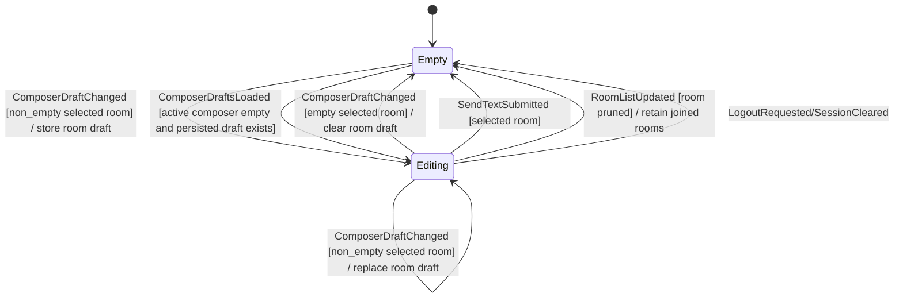
- Scheduled send is Rust-owned state, not a React timer. The full queue lives in
  an `AppState.scheduled_sends` backing store that is excluded from the full
  webview snapshot because it can contain future message bodies for non-visible
  rooms. `TimelinePaneState.scheduled_sends` is the selected-room projection
  only, and `TimelinePaneState.scheduled_send_capability` advertises whether
  server delayed events or the local fallback is active.
- Each scheduled item carries its room plus an optional thread root. A room
  item clears only the captured room draft; a thread item clears only the
  captured `(room_id, root_event_id)` draft and open thread composer. Both the
  local fallback and MSC4140 delayed-event paths build `m.thread` relation
  content when that root is present, including after reschedule/restart.
- `ScheduledSendCreated` inserts a queued item and updates the matching composer
  through the Rust draft store. `ScheduledSendRescheduled` updates the due timestamp and handle;
  `ScheduledSendCancelled` and `ScheduledSendDispatched` remove the item. Room
  pruning, logout, lock, and account switch clear or retain the backing store by
  joined-room account context.
- `AppActor` owns the local fallback timer. When an item is due, it dispatches
  only `ScheduledSendHandle::Local` items through the account actor with the
  captured room/thread target and deterministic transaction id. Server
  `ScheduledSendHandle::Server` items are never fired by the local timer.
- `AccountActor` owns MSC4140 side effects because it owns the SDK session.
  It detects `org.matrix.msc4140` through the SDK `/versions` unstable feature
  set, creates delayed message events through Ruma's
  `delayed_message_event::unstable` request, and cancel/reschedule operations
  update the server handle before reducer state changes. If capability
  detection or server create fails, the command falls back to a Local handle
  without exposing raw SDK errors or private content.
- Server MSC4140 delayed-event support is represented by the capability and
  handle boundary; GUI code must not call raw Matrix delayed-event APIs or run
  its own schedule timer.
- Headless core QA covers the local fallback with the `scheduled_send` scenario.
  Its tokens are private-data-free: `scheduled_capability=local_fallback`,
  `scheduled_create=ok`, `scheduled_reschedule=ok`, `scheduled_cancel=ok`, and
  `scheduled_fire=ok`.

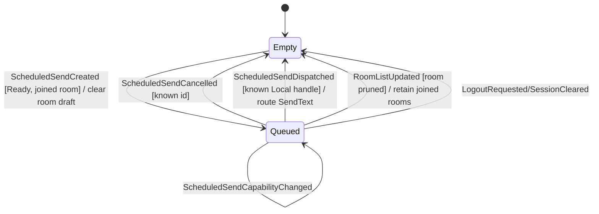

- The thread pane is either closed, opening a root event, or open with a focused
  thread timeline.
- Thread subscription success or failure must match the current opening room and
  root event; stale thread signals are ignored.
- Opening a thread is not complete when `ThreadPaneState` changes to `Opening`.
  The production runtime must also subscribe the corresponding
  `TimelineKind::Thread { room_id, root_event_id }`. Only the actual thread
  timeline subscription success may drive `ThreadSubscribed` and move the pane to
  `Open`. Matching subscription failure drives `ThreadSubscriptionFailed`, closes
  the pane, clears pane-level thread attention, and records a private-data-free
  recoverable error.
- Thread pane identity and open/closed state are Rust-owned `AppState`. Visible
  thread items are not stored in `AppState`; they flow as `TimelineEvent`
  batches/diffs keyed by the thread `TimelineKey`. Legacy top-level frontend
  placeholders such as `snapshot.thread` are not authoritative in production.
- The open thread pane owns its own Rust `ComposerState`. The thread composer
  sends by routing `TimelineCommand::SendReply` to
  `TimelineKind::Thread { room_id, root_event_id }`, with
  `in_reply_to_event_id == root_event_id`. Focused timelines do not own
  composer state. Thread drafts use the same Rust-owned draft store keyed by
  `(room_id, root_event_id)`: `ThreadComposerDraftChanged` writes through,
  `ThreadSubscribed` hydrates the open thread composer, and
  `ThreadReplySubmitted` clears the matching stored thread draft.
- The thread composer renders the shared full composer surface with thread key
  resolution, mention/emoji handling, target-scoped upload staging, and
  scheduled-send target capture. Presentation context is explicit: a thread
  timeline suppresses only the conversation-start marker and root reply-summary
  chip; the room timeline retains that chip and formats its Rust-projected
  latest-reply timestamp.
- Pane-level thread attention is Rust-owned `AppState.thread_attention`. It is
  initialized when a thread is opened, receives counts only for the currently
  open room/root event pair, and is cleared when the thread closes or navigation
  selects another room. React may render the DTO but must not scan timeline rows
  or thread chips to invent pane-level notification counts.

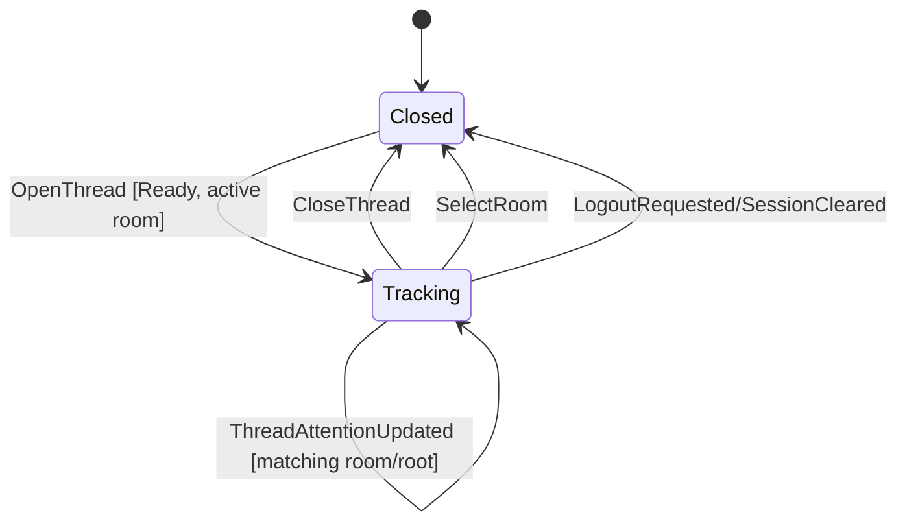

- `ThreadAttentionUpdated` is accepted only for a Ready session and only when
  its `room_id` and `root_event_id` match the currently tracked open thread.
  Stale, wrong-room, wrong-root, or post-logout updates are ignored.
- The tracking state carries `notification_count`, `highlight_count`, and
  `live_event_marker_count`. Equal updates produce no UI event; changed counts
  emit `ThreadChanged` so the pane can re-render from the Rust snapshot.
- GUI thread indicators, including the Threads nav badge/markers, render those
  three fields directly from `AppState.thread_attention`. They must not be
  derived from room-list unread totals, timeline row `thread_summary` chips, or
  visible thread rows.
- The producer is an actor-owned semantic tracker seeded from the SDK
  timeline's latest own threaded receipt. Hydration, backfill, replay, reset,
  and reconnect/resubscription observations normally extend its stable event-ID
  frontier without incrementing attention. A recovery/reset snapshot may add a
  first-seen event only when its canonical position after the visible
  authoritative receipt proves it unread. Live reconciliation counts only event-backed,
  renderable `m.thread` replies whose relation matches the tracked root and
  whose sender is not the current user. The root, transaction local echoes,
  later own remote echoes, other roots, and duplicate stable event IDs never
  count. A live encrypted reply that is not renderable yet remains eligible for
  its later decrypted `Set`, including across unrelated batches; only event IDs
  explicitly carried by a batch consume that batch's provenance. Backfill/replay
  IDs are absorbed immediately.
- `PushBack`, insertion position, and other vector-diff shapes are transport
  facts, not evidence that a reply is new. The relay attaches the SDK event
  origin to each stable event before actor scheduling, so lifecycle provenance
  cannot race pagination completion or other ambient actor state. Sync origin
  is live; pagination is backfill; cache, reset, append, and unknown origin are
  conservative replay. When the receipt is visible in the
  canonical thread window, it is the unread baseline; when it is outside the
  retained window, the explicit lifecycle frontier is the conservative
  fallback. A successful threaded read receipt, including an observed receipt
  advance from another device, acknowledges counted events through that event
  when its canonical position is known and reliably emits the next
  `ThreadAttentionUpdated` projection. An out-of-window receipt advances the
  fallback baseline but conservatively retains counts whose ordering cannot be
  proven yet; later reconciliation prunes those counts once the receipt and
  counted event positions become visible together.
- After a successful local threaded receipt send, the actor re-queries the SDK's
  latest own receipt before acknowledging the tracker. It selects the newest
  canonically provable position among the queried, current, and requested IDs,
  so a stale SDK cache cannot delay the successful acknowledgement and the
  requested viewport ID cannot regress a newer multi-device boundary.
- `TimelineItem.thread_summary.reply_count` remains the total reply projection.
  It is never copied into or reconstructed as pane-level new/unread attention.

## Main Timeline Anchor (Jump To Date)

Jump-to-date (issue #161) navigates the MAIN room timeline to the event nearest a
selected date, at arbitrary depth, and must never open the right panel.
`NavigationState.main_timeline_anchor: Option<MainTimelineAnchor { event_id }>` is
the Rust-owned mode: `None` = the main pane renders the live room timeline;
`Some` = the main pane renders the event-focused timeline (reusing the
focused-context `TimelineFocus::Event` subscription lifecycle) anchored at that
event. It is only ever set for the active, known room.

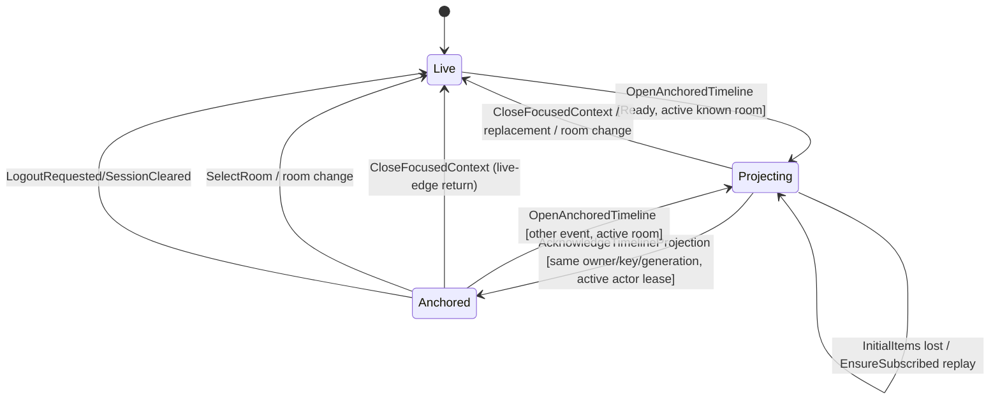

- Activity Recent/Unread, search results, and both timestamp-jump paths use one
  Focused navigation contract. Core retains the pending navigation owner while
  the actor emits `InitialItems`; the app-level WebView store acknowledges only
  after applying the exact key/generation projection. Core acquires the active
  actor-generation lease and only then dispatches `EnterAnchoredTimeline`.
  They do not open the right panel.
- `EnsureSubscribed` reprojects the actor-owned InitialItems identity while it
  remains unacknowledged. There is no sleep, fixed retry count, visibility
  heuristic, or command-side event observer in this success contract.
- `EnterAnchoredTimeline` is accepted only for a Ready session when `room_id` is
  the active, known room; otherwise it is ignored.
- `CloseFocusedContext` is the live-edge return: it clears
  `main_timeline_anchor` and, when leaving the anchored view, also drops the
  room's persisted `room_scroll_anchors` entry so the live timeline pins to the
  live edge rather than a stale pre-jump position. `ReturnMainTimelineToLive`
  clears the anchor for the active room without touching focused-context state.
- Any room change (`SelectRoom`, `SelectSpace`) and account clear/logout reset
  the anchor to `Live` through `select_active_room_for_navigation` /
  `clear_active_room_for_navigation`.
- React renders the mode from the snapshot (the main pane's timeline key
  switches to the focused-timeline key when anchored) and reports viewport facts
  only; it must not compute the mode, placement, or which timeline is active.

## Timeline Navigation Projection

Timeline navigation aids are Rust-owned actor projections, not React-local
state machines. A room `TimelineActor` combines projected item order,
`room.fully_read_event_id()` / `SetFullyRead`, and GUI-reported viewport facts
to emit `TimelineEvent::NavigationUpdated`.

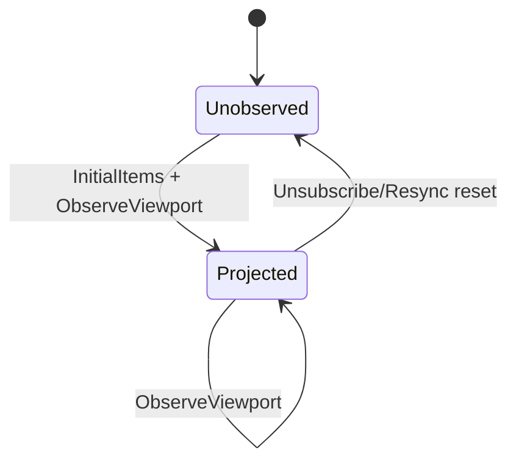

- `ObserveViewport` accepts only facts: first visible event id, last visible
  event id, and `at_bottom`. It does not carry unread counts, marker decisions,
  scroll intent, or Matrix API responses.
- The actor derives `read_marker_event_id`, `first_unread_event_id`,
  `unread_event_count`, `unread_position`, `newer_event_count`, and
  `can_jump_to_bottom` from Rust-owned item order. Local echoes, synthetic
  rows, hidden rows, and the current user's own events do not create unread
  counts.
- `NavigationUpdated` is emitted only when the projection changes. Diff-driven
  updates are emitted after the corresponding `ItemsUpdated` event so the GUI
  has the referenced rows before it renders or scrolls to an anchor.
- Jump-to-date is `AppCommand::OpenTimelineAtTimestamp`. Core resolves
  `timestamp_to_event` through the active Matrix session and then opens the
  existing focused-context timeline. React must not call raw Matrix APIs or
  convert dates to event ids itself.
- The local core `timeline` QA stage proves this contract with token-only
  stdout `timeline_nav=ok`. Do not print Matrix room ids, event ids, user ids,
  message bodies, timestamps, or raw SDK errors for this proof.

## Room Timeline Continuity

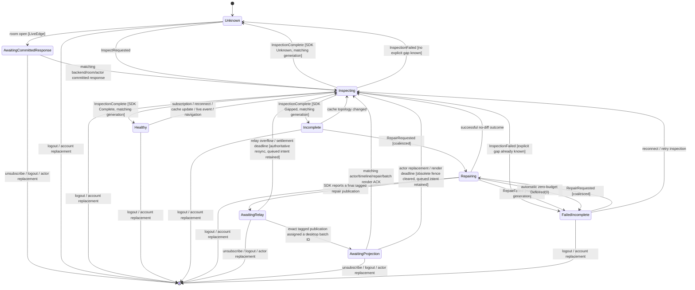

- Every inspection/repair start advances a room-local generation. Late SDK
  outcomes apply only when account, timeline actor, and room-local generations
  still match.
- On either SyncService or legacy sync, room-entry `LiveEdge` work does not
  acquire the gap scheduler until the SDK has committed that backend's current
  response to the room event cache. Timeline construction, `InitialItems`, and
  projection acknowledgement remain available while waiting. The retained
  committed-room observation is replayed when the response beats actor
  registration. Manager routing fences the backend instance epoch, room key,
  actor generation, and backend-local response/subscription generation, so a
  queued observation from a replaced backend cannot match a reused local
  generation.
- Each SDK room update carries the process-local response sequence assigned
  before publication. Legacy promotion records the first successful response
  sequence and rejects committed observations from any earlier response;
  per-room commit sequences are delivered at most once from that boundary.
- A checkpoint carrying a committed sync gap selects only that opaque SDK gap.
  A response with no newer timeline, a continuous response, a stale generation,
  or a gap no longer present in the inspected topology never falls back to an
  unrelated persisted gap. An explicit no-update/no-gap response closes the
  `LiveEdge` intent. If the descriptor became stale before inspection, Core
  performs one authoritative re-inspection and then releases scheduler
  ownership without choosing a substitute.
- `Healthy` means the SDK proved the persisted timeline complete. No gap rows,
  an empty local list, a new live event, or edge `EndReached` cannot make this
  transition.
- `AwaitingRelay` and `AwaitingProjection` are actor-private and do not enter `AppState`; the
  public continuity remains `Repairing`. React reports only that the matching
  presentation work committed through layout and never decides continuity.
- `AwaitingRelay` and `AwaitingProjection` are bounded by actor-owned,
  generation-tagged settlement deadlines. Relay overflow or an authoritative
  replacement snapshot that cannot contain the pending correlation clears the
  obsolete correlation; actor/timeline generation replacement clears an old
  render fence. Both paths retain the highest-priority queued trigger and
  return through authoritative resync/re-inspection. A stale timer is ignored.
- SDK repair publications carry actor, repair, and repair-publication
  generations through the UI timeline relay. A diff-producing repair outcome
  re-inspects only after the final tagged publication receives an exact desktop
  batch ID and React reports a matching-or-newer rendered batch ACK with the
  same actor, timeline, and repair generations. A successful no-diff outcome
  may re-inspect immediately. Core never closes a gap from an unverified local
  guess.
- Automatic repair uses no cached-chunk hydration. If the SDK returns
  `Deferred(0)`, Core stops instead of spinning through the repair ceiling and
  leaves the projected gap retryable through manual repair.
- `ObserveViewport` selects a projected gap candidate by viewport intersection,
  then live-edge proximity. A candidate/relation change queues automatic
  inspection; repeating the same candidate is idle. The queue survives an
  active inspection and `AwaitingProjection`, so projection ACK and viewport
  event order cannot lose the wake-up.
- Manual repair coalesces with an active automatic repair. Failures preserve
  the current event projection and leave a visible retryable gap state. After
  terminal failure processing first restarts any queued candidate inspection,
  Core emits `GapRepairReleased` only if no queued or active work remains; React
  uses that event to retry pagination commands rejected while repair owned the
  scheduler.
- **Start of conversation** is enabled only by the matching-generation
  `Complete`/`StartReached` proof.

## Timeline Reactions

Reaction annotations are Rust-owned timeline projection data. Grouped reaction
state carries the reaction key, aggregated count, whether the current user has
selected it, and the current user's reaction event id when present. React may
render this projection and dispatch typed commands, but it must not keep local
reaction counts, ownership, target eligibility, or toggle semantics.

- `SendReaction` and `RedactReaction` are the only reaction commands accepted
  across the app boundary. They are accepted only for a Ready session and only
  through the Rust timeline actor that owns the current subscription.
- Reaction targets are restricted to reaction-eligible timeline events in the
  active subscription. Stale event ids, wrong-room or wrong-thread targets,
  state events, and other unsupported targets are rejected as invalid reaction
  failures.
- Rust projects the SDK's aggregated reaction annotations into grouped state
  keyed by reaction key. Duplicate annotations are deduplicated by the SDK
  aggregation layer, and redactions update the same grouped projection rather
  than creating React-local replacement state.
- The public SDK surface exposes `Timeline::toggle_reaction`. Rust must prove
  the current projected state before delegating to that toggle helper: add only
  when the projection says the user has not already selected the reaction, and
  redact only when the projection says the matching own reaction event is
  present. If the projection does not support the requested transition, settle
  it as an invalid reaction failure instead of guessing from React state.

## Timeline Reply Quotes, Pins, And Actions

Reply quote previews and pinned-event state are Rust-owned message-interaction
projections. `TimelineItem.reply_quote` is projected in
`koushi-core` from SDK reply details; React renders that DTO and must
not resolve reply bodies, classify redactions, or repair missing quote state.

Message action affordances are also Rust-owned timeline projections.
`TimelineItem.actions` carries `can_copy`, `can_forward`, `can_permalink`,
`can_view_source`, and an optional `permalink`. The permalink is generated in
Rust from the owning `TimelineKey` room id plus the event id as a
`https://matrix.to/#/<room>/<event>` URL. React may render or copy this value
only when the DTO says it is available; it must not build Matrix permalinks,
infer action eligibility from `TimelineItemId`, body/media fields, or redaction
flags, or invent forward/source behavior.

`TimelineCommand::LoadMessageSource` loads a Rust-owned
`TimelineMessageSource` safe DTO for a subscribed event. It contains the
projected event id, sender, timestamp, visible body, reply/thread relation
ids, redaction/edit flags, and a media-presence flag; it is not a raw Matrix
event JSON dump. `TimelineCommand::ForwardMessage` resolves the source item in
Rust, sends only the projected visible body to the destination room, and emits
`MessageForwarded` when the destination send completes. React supplies source
and destination identifiers only; it must not copy the body, inspect raw event
JSON, or synthesize forward content. Media-only forwarding remains disabled
until a separate Rust-owned media-forward contract exists.

`AppState.room_interactions[room_id]` carries the room's pinned-event
projection plus the current pin/unpin operation state:

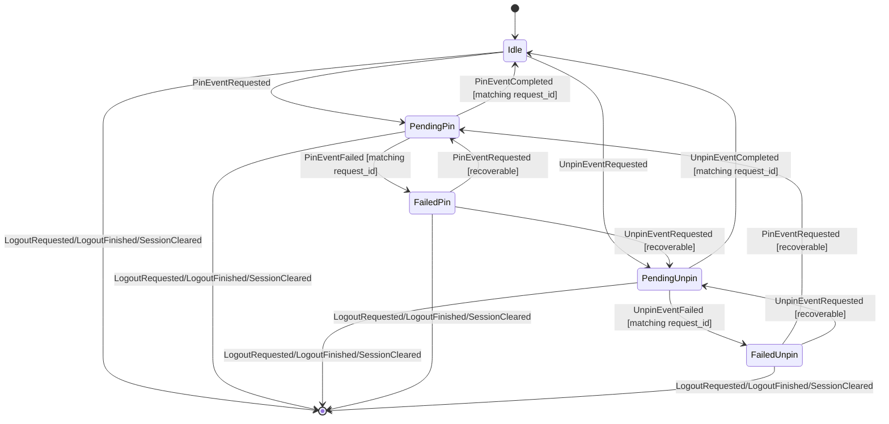

- `ReplyQuoteState` is one of `Ready`, `Redacted`, `Missing`, or
  `Unsupported`. `Ready` may include a sender and body preview; redacted,
  missing, and unsupported quotes never require React to inspect Matrix event
  content.
- `TimelineItem.actions` is populated only for event-backed timeline items.
  Synthetic and transaction-backed items receive all-false affordances. Redacted
  event items keep event-scoped affordances such as permalink/source visibility
  but lose copy/forward affordances unless Rust explicitly restores them.
- Copy is allowed only when Rust projected a visible body and the item is not
  redacted. Forward is allowed only when Rust projected a visible body and the
  item is not redacted; media-only items stay non-forwardable until media
  forwarding has its own Rust-owned contract. Future source extensions must
  consume typed Rust-owned DTOs rather than raw React-side event inspection.
- Phase B message-action menus are presentation state only. Menu visibility,
  submenu focus, and clipboard invocation may live in React, but menu entries
  are gated by `TimelineItem.actions`; source details render only after
  `MessageSourceLoaded`; forward commands use Rust-snapshot destination room
  ids and do not copy message bodies through React.
- `RoomPinnedEventsUpdated { room_id, pinned }` replaces only that room's
  pinned-event list and emits `RoomInteractionsChanged` when the list changes.
  It may arrive from sync or as the post-command refresh after successful
  pin/unpin. It does not synthesize a room summary and does not settle a
  pending operation by itself. It is applied in session projection context so a
  transient `Locked` or `SwitchingAccount` state cannot lose the projection.
- `PinEventRequested` and `UnpinEventRequested` are accepted only for a Ready
  session, a known room, a non-empty event id, and an `Idle` or recoverable
  `Failed` pin operation. Requests while another pin/unpin is pending are
  ignored.
- Completion and failure actions settle only the matching request id and
  operation kind, including while the session is `Locked` or
  `SwitchingAccount`. Stale completions, duplicate completions, and opposite
  operation completions are ignored.
- Failures store a recoverable `Failed` state and push only a coarse
  private-data-free `AppError`; raw SDK errors, room ids, event ids, and
  message bodies must not appear in ordinary logs or QA output.
- `RoomCommand::PinEvent` and `RoomCommand::UnpinEvent` route through
  `RoomActor` and `koushi-sdk`; successful commands emit typed
  completion events and then refresh the Rust pinned-event projection. The
  completion action settles `Pending` before the follow-up pinned-state reload:
  if that reload fails, the command is still no longer pending and the failure
  is reported as a coarse operation failure. GUI code dispatches typed commands
  and renders the next Rust snapshot/event only.
- The local core `reply` QA scenario proves this Phase A slice with
  `reply_quote=ok pin_event=ok pinned_state=ok unpin_event=ok`. Its stdout must
  remain private-data-free. Message-action QA evidence must likewise use coarse
  tokens only; do not print Matrix IDs, message bodies, or generated permalinks.

## Timeline Media

Timeline media is a core-owned operation/effect state, not React-local logic.
`TimelineItem.media` is projected in `koushi-core` from SDK
`m.image`/`m.file` message content and flows to the UI as ordinary timeline
diff data. React renders the metadata and dispatches typed commands; it must
not parse Matrix media event content, infer encryption state, or synthesize
upload/download lifecycle locally.

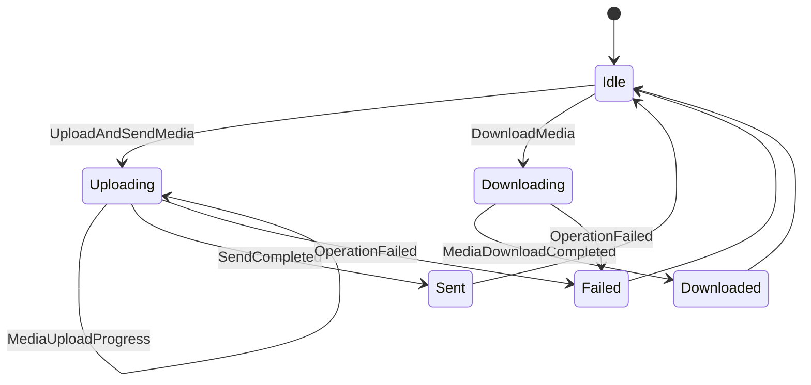

- `UploadAndSendMedia { key, transaction_id, request }` is routed only to a
  subscribed timeline, whose cloneable SDK context is handed to a
  `TimelineManager`-owned enqueue worker. The worker fixes the SDK attachment
  transaction id to the caller-provided `transaction_id` so local echo and
  upload progress use the same Rust-owned key. Request/submission correlation
  is registered before asynchronous SDK enqueue, and both enqueue and terminal
  observation outlive presentation-actor replacement, so unsubscribe cannot
  lose `SendCompleted`.
- On successful SDK enqueue, the manager-owned worker publishes
  `MediaSendQueued` before binding the SDK transaction id. Binding may
  synchronously release a terminal retained before enqueue completed, so this
  boundary—not manager-loop polling order—guarantees that a terminal cannot
  precede the queue acknowledgement and later regress the operation state.
- Upload requests may carry filename, caption, mimetype, dimensions, and bytes
  because those are required to send the media. Those fields are private
  visible-content payloads: `Debug`, QA output, logs, and errors must redact
  them.
- Media captions are part of the single media event, not a follow-up text
  event. Tauri converts the Composer draft into an optional
  `FormattedMessageDraft` on `UploadMediaRequest.caption`; the core maps that
  to Matrix caption-capable attachment content (`body` / optional
  `formatted_body`) on the same `m.image`, `m.file`, `m.video`, or `m.audio`
  event. Incoming media captions are projected back through
  `TimelineItem.body` / `TimelineItem.formatted` beside `TimelineItem.media`.
- Image preparation policy is Rust-owned. `SettingsValues.media` supplies the
  initial selection policy, while `koushi-media` deterministically decodes,
  resizes, and encodes PNG/JPEG/WebP candidates during staging. Re-encoded
  candidates report actual MIME, dimensions, byte count, metadata stripping,
  and thumbnail refresh; animated/unsupported sources remain original-only.
- Upload staging is Rust-owned. `AppState.upload_staging` is the reducer backing
  store and is not serialized directly. Projections are target-scoped:
  `TimelinePaneState.staged_uploads` for the active room composer and
  `ThreadPaneState::Open.staged_uploads` for the exact open thread. Equal staged
  ids in different targets remain isolated. Each item has preparing/ready/failed
  state, selected prepared variant metadata, stable position, and caption.
  Prepared source/candidate bytes live in a bounded ephemeral Rust registry
  keyed by `(ComposerTarget, staged_id, variant_id)` and are cleared on remove,
  close, navigation, logout, send, or stale-target settlement. React renders
  the projection and requests previews; it owns no attachment state machine.
- Room media gallery state is Rust-owned. `AppState.media_gallery` is the
  reducer backing store and is not serialized directly; the selected-room
  projection is `TimelinePaneState.media_gallery`, ordered by Rust from media
  event facts. React may render the gallery/viewer from this projection only; it
  must not scrape timeline DOM, parse Matrix event content, or assemble a
  gallery from local UI state.
- `MediaUploadProgress` carries only request/transaction correlation, progress,
  index, and safe media source metadata. It never carries filenames, captions,
  bytes, Matrix room ids, or raw SDK errors.
- `TimelineItem.media.source` may expose the MXC URI, encrypted flag, and
  encryption protocol version. Encrypted file keys, hashes, and decrypted bytes
  remain inside Rust actor-private SDK media sources and are never serialized to
  React.
- `DownloadMedia` resolves the actor-private media source by event id and emits
  `MediaDownloadCompleted` with `byte_count` only. A future GUI save/open flow
  must use a Rust-owned platform port or Tauri command that does not put bytes
  into React state.
- Phase B GUI wiring is a transport client only: picker, paste, and full-surface
  HTML5 drop all enter one ingestion adapter that captures the current
  `ComposerTarget` and bytes before asynchronous staging. Tauri disables native
  drag/drop so packaged WebViews use the same `DataTransfer.files` route.
  Candidate selection, retry, Use original, caption edits, and preview reads are
  typed target-scoped commands. Send reads the already-selected Rust bytes and
  performs no decode/resize/encode or Ask prompt. Thread sends use a thread
  `TimelineKey`, including the media relation. `TimelineView`
  renders `TimelineItem.media` plus `MediaUploadProgress` keyed by the
  transaction id; event-backed media rows invoke `download_media`. React does
  not parse Matrix event content, infer encryption details, render MXC URIs, or
  own upload/download success/failure state.
- The local core `media` QA scenario is the Phase A proof:
  `send_media=ok media_caption=ok image_compress=ok upload_staging=ok
  media_gallery=ok recv_media=ok`. Its output must remain private-data-free.

## Files View (Attachment Browser)

The files view is a Rust-owned attachment browser. `AppState.files_view` is the
reducer state machine; React may render the snapshot and dispatch typed open,
close, refresh, and selection commands, but it must not build attachment queries,
parse media event content, or maintain local browser state.

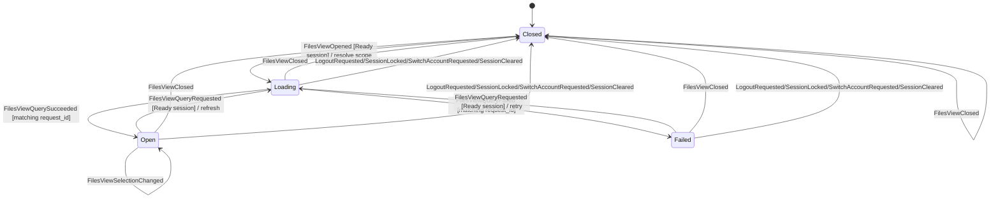

- `FilesViewState` is one of `Closed`, `Loading { request_id, scope, filter, sort }`,
  `Open { request_id, scope, filter, sort, items, selected_event_id }`, or
  `Failed { request_id, scope, filter, sort, message }`. `selected_event_id`
  identifies the currently selected attachment result by Matrix event id.
- `FilesViewOpened { request_id, scope, filter, sort }` is accepted only for a
  Ready session. It resolves the requested `FilesViewScope` into an
  `AttachmentScope` and enters `Loading`.
- `FilesViewQueryRequested { request_id, scope, filter, sort }` is accepted only
  for a Ready session. It allows refreshing or retrying an existing view and
  re-enters `Loading`.
- `FilesViewQuerySucceeded { request_id, items }` and
  `FilesViewQueryFailed { request_id, message }` settle only the matching
  in-flight `request_id` while the state is `Loading`. Stale successes, stale
  failures, duplicate completions, and completions when no query is in flight
  are ignored.
- `FilesViewSelectionChanged { event_id }` updates `selected_event_id` only when
  the view is `Open`. Equal updates are a no-op. Selection changes when the view
  is `Closed`, `Loading`, or `Failed` are ignored.
- `FilesViewClosed` resets any non-`Closed` state to `Closed`. Closing an already
  closed view is a no-op.
- Logout, lock, account switch, and session clearing reset `files_view` to
  `Closed` and emit `FilesViewChanged` when it was not already closed.
- Scope resolution is reducer-owned. `FilesViewScope::Room { room_id }` maps
  directly to `AttachmentScope::Room`. `FilesViewScope::Space { space_id }`
  resolves to `AttachmentScope::Space` by looking up the current space's
  `child_room_ids` in `AppState.spaces`; an unknown space resolves with an empty
  child list. `FilesViewScope::Account` maps to `AttachmentScope::Account`.
- Attachment results are Rust-projected `AttachmentResult` DTOs. Each result
  carries the event id, sender, timestamp, kind, filename, mimetype, size, and
  safe source/thumbnail MXC metadata. React must not re-derive attachment
  presence or metadata from timeline DOM or Matrix event content.
- Filenames are visible/private UI content. Debug output, logs, QA tokens, and
  snapshots must redact filenames and MXC URIs; the reducer `Debug` impl already
  hides them.

## Timeline Formatted Message Projection

Received Matrix `formatted_body` is a Rust-owned security projection. The
timeline actor extracts SDK `FormattedBody` from text, notice, emote, and
caption-capable media message content, accepts only Matrix HTML format, and
sanitizes it before exposing it through `TimelineItem.formatted`.

- Matrix message type display is Rust-owned. The timeline projection sets
  `TimelineItem.message_kind` to `text`, `emote`, or `notice`; React may map
  that value to CSS/markup only and must not infer msgtype from body text.
- `TimelineItem.formatted` carries a safe render contract: sanitized HTML,
  plain text derived from that sanitized tree, and extracted code-block metadata
  (`language` plus code body).
- Spoiler semantics are Rust-owned. Plain `||spoiler||` fallback text is
  normalized to display text plus `TimelineItem.spoiler_spans`; sanitized
  Matrix HTML `<span data-mx-spoiler>` is preserved as a reveal affordance and
  also projected to spoiler spans. Span offsets are UTF-16 string offsets over
  `TimelineItem.body` when formatted content is absent, and over
  `TimelineItem.formatted.plain_text` when formatted content is present.
- Unsafe tags, unsafe attributes, unsafe URL schemes, and script/style contents
  are removed in Rust. React must never render server `formatted_body` directly
  or re-run ad hoc sanitization as product logic.
- Plain `TimelineItem.body` remains the fallback when formatted content is
  absent, empty after sanitization, unsupported, or invalid.
- Code-block line wrapping is controlled by Rust-owned
  `SettingsValues.display.code_block_wrap`, defaulting to `true` and persisted
  through the settings store. GUI code may map the snapshot value to CSS only;
  it must not keep a separate wrap preference.
- Redacted-event visibility is controlled by Rust-owned
  `SettingsValues.display.hide_redacted`, defaulting to `false` and persisted
  through the settings store. Redacted events remain in timeline state; Rust
  projection marks redacted timeline DTOs with `TimelineItem.is_hidden` when
  the preference is enabled. React omits rows only from that DTO flag and must
  not filter redacted events from a local preference. `DisplayPolicyUpdated`
  reprojects already-loaded rows without removing non-redacted items.
- The React timeline renderer is a presentation adapter over this DTO. It may
  map sanitized tags into React nodes, attach copy-code controls using the
  Rust-provided code-block body, and highlight search terms over rendered text.
  It must not decide Matrix HTML safety or render server `formatted_body`
  directly.
- The presentation adapter follows HTML whitespace semantics: source newlines
  collapse as ordinary whitespace and never synthesize `br`; only an explicit
  sanitized `br` renders a line break. Whitespace-only list children are
  omitted, inline sibling spacing and code/pre content are preserved, and
  pretty-printed and minified equivalent markup must produce equivalent compact
  layout. This normalization happens after Rust-owned UTF-16 link/spoiler range
  projection and must not shift those range inputs.

## Profiles And Avatars

Profiles and avatars are Rust-owned account and room projections.
`AppState.profile.own` holds the current account display name and avatar,
`AppState.profile.users` holds the per-user profile cache used by timeline and
member surfaces, `AppState.profile.local_aliases` holds personal local display
aliases keyed by Matrix user id, and room/space/invite summaries carry their
own avatar DTOs.
React renders these DTOs and dispatches typed profile commands only; it must not
query Matrix profiles, parse MXC URIs, upload avatar bytes outside the command
boundary, resolve personal aliases locally, or infer profile operation success
from component state.

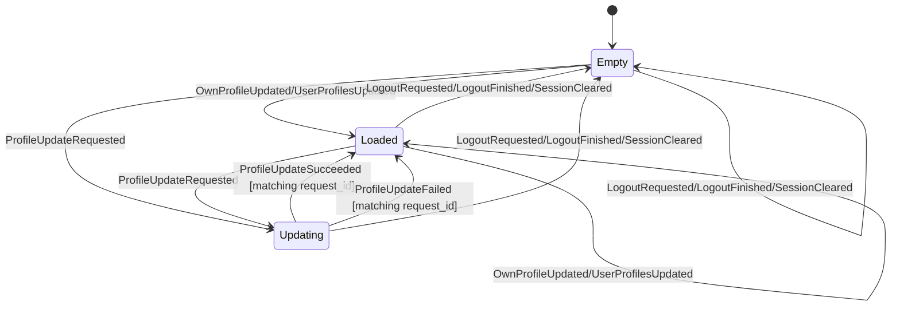

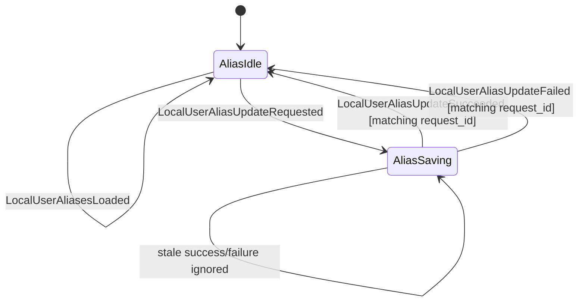

- Profile actions are accepted only for a Ready session. Late profile snapshots
  after logout, lock, or account switch are ignored.
- Joined-room member profiles enter `AppState.profile.users` through the
  Rust-owned room-list observation path (`RoomActor` normalizes SDK active
  member profiles and emits `UserProfilesUpdated`). GUI mention autocomplete
  and member/person surfaces consume this projection; React must not query
  Matrix profiles or create member candidates from DOM/timeline strings.
- `ProfileUpdateRequested { request_id, request }` is accepted only when no
  profile update is in flight. It records either `SettingDisplayName` or
  `SettingAvatar` and emits `ProfileChanged`.
- `ProfileUpdateSucceeded` and `ProfileUpdateFailed` settle only the matching
  in-flight request id. Stale or duplicate completions are ignored. Failures
  also emit `ErrorChanged`.
- Local user aliases are personal "only I see this name" data persisted as
  private global account data under `app.koushi.local_aliases`. `AccountActor`
  hydrates them after login/restore, and `SetLocalUserAlias` writes them through
  the SDK account-data boundary. They never become Matrix profile updates,
  room events, outgoing message content, notification text, or QA tokens.
- Alias display resolution is Rust-owned:
  `alias ?? upstream display name ?? profile cache/own profile ?? MXID`.
  Timeline/read-receipt/member/person surfaces must consume the Rust-resolved
  DTO labels; React must not join user ids to `local_aliases` or invent a
  separate alias cache.
- Per-user profile DTOs carry `display_label`, `original_display_label`, and
  `mention_search_terms` as Rust-owned projections. `display_label` may contain
  a local alias; `original_display_label` is the alias-free upstream,
  own-profile, or MXID context value. GUI mention autocomplete, mention
  highlighting, profile views, and tooltips consume the projected fields and
  must not recompute alias precedence or strip aliases in React.
- Room summaries carry `display_label` as the Rust-projected room list/header
  label and `original_display_label` as the alias-free room/DM context label.
  For one-to-one DM rooms, `dm_user_ids` supplies the target identity and labels
  resolve through the alias/profile precedence above; for non-DM rooms they use
  trimmed upstream `display_name` with `room_id` as the final fallback.
  `display_name` remains the upstream/original room name. React must render
  `display_label` for normal room title surfaces, may show
  `original_display_label` for context affordances, and must not infer DM
  identity from a display name or synthesize generic labels such as `Member`.
- Timeline CoreEvents preserve raw sender MXIDs only as identity fields.
  `CoreConnection` projects `TimelineItem.sender_label`,
  `ReplyQuote.sender_label`, and `ThreadSummaryDto.latest_sender_label` from
  the latest Rust `AppState.profile` before events reach consumers. Timeline
  GUI surfaces render those label fields; they must not display raw sender ids
  except as explicit identity/debug/source data.
- When `ProfileChanged` follows a profile or local-alias transition, the core
  runtime emits a keyless `TimelineEvent::DisplayLabelsUpdated` containing
  Rust-resolved `user_id -> display_label` patches. Timeline stores may apply
  those patches to already-loaded rows by matching raw identity fields
  (`sender`, reply quote `sender`, thread `latest_sender`), but must not derive
  the label values in React. `SetLocalUserAlias` includes its target user id in
  that emission so clearing an alias also relabels rows for users that are not
  present in the profile cache.
- `LocalUserAliasUpdateRequested` is accepted only for a Ready session and only
  while `local_alias_update` is idle. It trims non-empty aliases, treats empty
  aliases as clear, records `Saving { request_id }`, and emits
  `ProfileChanged`. Matching success returns to `Idle`; matching failure returns
  to `Idle`, records a private-data-free `local_user_alias_update_failed`
  `AppError`, and emits `ProfileChanged` plus `ErrorChanged`.
- Debug and QA output must redact local alias user ids and alias text.
  `ProfileState` debug reports only profile/avatar presence and counts,
  including `local_alias_count`; the SDK account data DTO debug reports only
  `alias_count`.
- `SetDisplayName` carries the submitted display name only across the typed
  command and reducer pending-state boundary. Normal logs, Debug output, QA
  tokens, and issue evidence must not expose real account display names.
- `SetAvatar` may carry mimetype and bytes only across the typed command
  boundary. Debug output redacts the bytes. The reducer pending state records
  mimetype and byte count, never bytes.
- Avatar images store the MXC URI as Rust-owned metadata. React must not render
  an MXC URI directly; it renders an image only when Rust/platform-owned media
  handling has settled `AvatarThumbnailState::Ready { source_url, .. }`.
  `NotRequested`, `Loading`, and `Failed` render the colored-initial fallback.
- In the #17 reducer slice, avatar thumbnail fields are replaced through the
  Rust-owned snapshot actions (`OwnProfileUpdated`, `UserProfilesUpdated`, room
  list updates, and invite updates). A future explicit avatar-thumbnail download
  workflow must add its own `AppAction` transitions and update this document in
  the same change.
- The existing timeline media download contract emits byte counts only and does
  not put downloaded bytes in React state. Avatar thumbnail source URLs must
  remain app-owned handles or source URLs produced by Rust/platform media
  handling; decrypted bytes, encrypted media keys, local filesystem paths, and
  raw SDK errors stay outside snapshots and QA output.

## Ignore, Block, And Report

Ignore/unignore and report commands are Rust-owned account/room operations.
React renders the resulting `AppState.profile.ignored_user_ids` snapshot and the
`IgnoredUserUpdateState` pending indicator, dispatches typed commands, and does
not maintain a separate ignore/report policy.

```mermaid
stateDiagram-v2
    [*] --> Idle
    Idle --> Saving: IgnoreUserRequested/UnignoreUserRequested [Ready]
    Saving --> Idle: IgnoreUserSucceeded/UnignoreUserSucceeded [matching request_id]
    Saving --> Idle: IgnoreUserFailed/UnignoreUserFailed [matching request_id]
```

- `IgnoredUserUpdateState` carries only `Idle` or `Saving { request_id }`. The
  reducer applies the optimistic `ignored_user_ids` change when the request is
  accepted and reverts it on a matching failure. Stale or duplicate completions
  are ignored.
- Ignore/unignore requests are accepted only for a `Ready` session. Logout,
  lock, account switch, and session clearing reset the state to `Idle`.
- Report commands (`ReportUser`, `ReportContent`, `ReportRoom`) are fire-and-
  forget one-shots from the GUI perspective. The typed command carries the
  target identifiers and reason; success is signalled back through a coarse
  `ReportCompleted` event and any resulting snapshot update. The reducer does
  not keep a dedicated report pending state.
- GUI code may open a lightweight reason dialog for report actions, but it must
  not log or display the reason, target user ids, event ids, or room ids in
  diagnostics or QA tokens. Browser-headless GUI evidence for these affordances
  should use private-data-free tokens such as `ignore_user=ok`,
  `unignore_user=ok`, `report_user=ok`, `report_content=ok`, and
  `report_room=ok` when that lane is added; there is no separate core
  ignore/report QA scenario at this point.

## Live Signals

Live signals are Rust-owned room/account projections in
`AppState.live_signals`. They cover per-room read receipts, fully-read markers,
typing users, and account/user presence. React renders this state and dispatches
typed commands; it does not infer Matrix signal semantics from timeline rows,
DOM hover state, timers, or local component state.

```mermaid
stateDiagram-v2
    [*] --> Empty
    Empty --> RoomSignals: LiveRoomSignalsUpdated
    Empty --> RoomSignals: LiveRoomReceiptsUpdated
    Empty --> RoomSignals: LiveRoomReceiptsWindowReconciled
    Empty --> RoomSignals: FullyReadMarkerUpdated
    Empty --> RoomSignals: TypingUsersUpdated
    Empty --> PresenceSignals: PresenceUpdated
    RoomSignals --> RoomSignals: LiveRoomSignalsUpdated
    RoomSignals --> RoomSignals: LiveRoomReceiptsUpdated
    RoomSignals --> RoomSignals: LiveRoomReceiptsWindowReconciled
    RoomSignals --> RoomSignals: FullyReadMarkerUpdated
    RoomSignals --> RoomSignals: TypingUsersUpdated
    RoomSignals --> RoomAndPresence: PresenceUpdated
    PresenceSignals --> PresenceSignals: PresenceUpdated
    PresenceSignals --> RoomAndPresence: LiveRoomSignalsUpdated
    PresenceSignals --> RoomAndPresence: LiveRoomReceiptsUpdated
    PresenceSignals --> RoomAndPresence: LiveRoomReceiptsWindowReconciled
    PresenceSignals --> RoomAndPresence: FullyReadMarkerUpdated
    PresenceSignals --> RoomAndPresence: TypingUsersUpdated
    RoomAndPresence --> RoomAndPresence: LiveRoomSignalsUpdated
    RoomAndPresence --> RoomAndPresence: LiveRoomReceiptsUpdated
    RoomAndPresence --> RoomAndPresence: LiveRoomReceiptsWindowReconciled
    RoomAndPresence --> RoomAndPresence: FullyReadMarkerUpdated
    RoomAndPresence --> RoomAndPresence: TypingUsersUpdated
    RoomAndPresence --> RoomAndPresence: PresenceUpdated
    RoomSignals --> Empty: LogoutRequested/LogoutFinished/SessionCleared
    PresenceSignals --> Empty: LogoutRequested/LogoutFinished/SessionCleared
    RoomAndPresence --> Empty: LogoutRequested/LogoutFinished/SessionCleared
```

- Every live-signal update is accepted only for a Ready session. Late SDK
  deliveries after logout, lock, account switch, or session clear are ignored.
- `LiveRoomSignalsUpdated { room_id, update }` replaces the room's full
  live-signal snapshot. The reducer normalizes duplicate receipts by user,
  sorts receipt event entries, and sorts/deduplicates typing user ids.
- `LiveRoomReceiptsUpdated { room_id, receipts_by_event }` is a partial merge
  into the room receipt map. It does not clear typing users or the fully-read
  marker.
- `LiveRoomReceiptsWindowReconciled { room_id, scoped_event_ids,
  receipts_by_event }` is an authoritative replacement only for the stable
  event-ID union of the actor's old and replacement timeline windows. It first
  removes receipt entries in that scope, then inserts the replacement snapshot;
  receipt state outside the scope is preserved.
- Receipt reader display data is resolved in Rust before it reaches the GUI.
  Each event's receipt projection deduplicates by reader user id using the
  newest timestamp, fills missing display labels and avatar DTOs from
  `AppState.profile`, orders readers most-recent-first with deterministic
  tie-breaking, caps the rendered reader list at the shared receipt-reader cap,
  and carries `total_count` plus `overflow_count`. GUI code renders that
  projection and must not join receipt ids to profile maps, choose ordering, or
  infer hidden overflow readers locally.
- `FullyReadMarkerUpdated { room_id, event_id }` replaces only that room's
  fully-read marker; `event_id: None` clears it.
- `TypingUsersUpdated { room_id, user_ids }` replaces only that room's typing
  user list with the normalized list from Rust. GUI timers or focus state must
  not repair typing state after the fact.
- `PresenceUpdated { user_id, presence }` updates the Rust-owned presence map.
  Current Phase A presence proves command/event/state ownership. Full network
  propagation remains tied to the sync backend's presence-setting API and must
  stay in Rust when implemented.
- Session-view clears reset all live signals and emit `LiveSignalsChanged` when
  anything was present.
- `TimelineCommand::SendReadReceipt`, `SetFullyRead`, and `SetTyping` are
  routed to the subscribed `TimelineActor`. Success events carry request ids;
  failures are redacted `OperationFailed` events. Event ids, room ids, and user
  ids may exist in app snapshots as visible Matrix UI data but must not appear
  in ordinary logs, Debug output, QA stdout, screenshots, or issue evidence.
- The local core `live_signals` QA scenario is the Phase A proof:
  `read_receipt=ok fully_read=ok typing=ok presence=ok live_signals=ok`. Its
  output must remain private-data-free and must not print Matrix room IDs, user
  IDs, event IDs, raw SDK errors, or message bodies. On local SyncService
  homeserver legs, the typing assertion may perform one bounded debug/test
  `SyncOnce` on the observer account after the sender's typing command is
  acknowledged; this is a QA delivery nudge, not React-owned or product
  polling logic.

## Focused Context

A focused context is the Rust-owned result-context timeline used when the
product opens a specific event from search or another contextual entry point.
It is separate from the selected room timeline and from the thread pane.

```mermaid
stateDiagram-v2
    [*] --> Closed
    Closed --> Opening: OpenFocusedContext
    Opening --> Opening: OpenFocusedContext [replacement]
    Open --> Opening: OpenFocusedContext [replacement]
    Opening --> Open: FocusedContextSubscribed
    Opening --> Closed: FocusedContextSubscriptionFailed
    Opening --> Closed: CloseFocusedContext
    Open --> Closed: CloseFocusedContext
```

- `OpenFocusedContext { room_id, event_id }` is accepted only for a ready session
  whose selected timeline room equals `room_id`; otherwise it is ignored. The
  selected timeline room guard prevents search/result UI from owning Matrix
  operation semantics.
- On accepted open, the reducer enters `Opening` and emits
  `OpenFocusedTimeline { room_id, event_id }`. Production runtime subscribes
  `TimelineKind::Focused { room_id, event_id }` through that effect.
- `FocusedContextSubscribed { room_id, event_id }` moves `Opening` to `Open`
  only when both fields match the currently opening context; stale subscription signals are ignored.
  Matching `FocusedContextSubscriptionFailed` closes the opening context and
  records a private-data-free recoverable error; stale failures are ignored.
- `CloseFocusedContext` closes an `Opening` or `Open` context for a ready
  session. close from `Closed`, or any close without a ready session, is a no-op.
- Focused context replacement is core-owned: when opening a different focused
  context while another focused context is `Opening` or `Open`, production
  runtime unsubscribes the previous focused timeline before subscribing the new
  key. Reopening the same focused key is idempotent as far as runtime
  subscription ownership allows.
- focused timelines do not own composer/send state. The selected room composer
  and the thread composer are separate Rust state machines; focused timelines do
  not submit sends, clear drafts, repair reply mode, or settle pending
  transactions.

## Thread Composer Reply Mode

The open thread pane's composer tracks draft and pending reply state separately
from the selected room's main composer:

```mermaid
stateDiagram-v2
    [*] --> Idle
    Idle --> Editing: ThreadComposerDraftChanged [matching open thread]
    Editing --> Editing: ThreadComposerDraftChanged [matching open thread]
    Idle --> Pending: ThreadReplySubmitted [matching open thread]
    Editing --> Pending: ThreadReplySubmitted [matching open thread]
    Pending --> Idle: ThreadReplyFinished [matching transaction]
    Pending --> Idle: ThreadReplyFailed [matching transaction]
```

- `ThreadComposerDraftChanged { room_id, root_event_id, draft }` applies only
  when a ready session has that exact thread open. Stale room/root signals and
  closed/opening thread states are ignored. Accepted changes update both the
  open thread composer and the Rust-owned `(room_id, root_event_id)` draft
  entry.
- `ThreadReplySubmitted { room_id, root_event_id, transaction_id, body }`
  applies only when a ready session has that exact thread open and the thread
  composer has no pending transaction. It records the pending transaction as a
  reply to `root_event_id`, clears the thread draft and stored thread draft,
  and emits `ThreadChanged`. It does not mutate the selected room's main
  composer.
- `ThreadReplyFinished { room_id, root_event_id, transaction_id }` clears only
  the matching thread composer pending transaction and emits `ThreadChanged`.
  Stale room/root/transaction signals are ignored.
- `ThreadReplyFailed { room_id, root_event_id, transaction_id, message }`
  clears only the matching thread composer pending transaction, records the same
  recoverable `send_text_failed` error pattern as main composer failures, and
  emits `ThreadChanged` plus `ErrorChanged`. Stale room/root/transaction signals
  are ignored.

## Composer Reply Mode

The selected room's composer carries a reply mode (`ComposerMode`) alongside its
pending-transaction tracking:

```mermaid
stateDiagram-v2
    [*] --> Plain
    Plain --> Reply: ComposerReplyTargetSelected
    Reply --> Reply: ComposerReplyTargetSelected
    Reply --> Plain: ComposerReplyCancelled
    Reply --> Plain: SendTextFinished [matching pending reply send]
```

- `ComposerReplyTargetSelected { room_id, event_id }` enters `Reply` only when the
  session is `Ready` and `room_id` is the selected timeline room; otherwise it is
  ignored. Re-selecting while already in `Reply` replaces the target (idempotent).
- `ComposerReplyCancelled` returns to `Plain`; it is a no-op when already `Plain`
  or when no room is selected.
- `SendTextSubmitted { room_id, transaction_id, body }` records one pending
  transaction only when no send is already pending. The pending state records the
  submitted composer kind: plain send, or reply send with the reply target that
  was current at submission time. It also clears the selected room's stored
  draft so switching away and back cannot resurrect a submitted message.
- `SetComposerDraft` crosses the Tauri boundary as an `AppCommand` and reduces
  to `ComposerDraftChanged`; React must not keep a cross-room draft map or
  hydrate composers locally. The only snapshot data React receives is
  `timeline.composer` for the active room.
- `SendTextFinished { room_id, transaction_id }` clears only the matching pending
  transaction. It returns the composer to `Plain` only when the matched pending
  send was submitted as a reply and the current reply target still equals the
  captured target. A plain send completion must not clear a reply target selected
  after submission, and a reply send completion must not clear a newer reply
  target selected before completion.
- `SendTextFailed { room_id, transaction_id, message }` clears the pending
  transaction and records a recoverable error. It preserves the current
  `Reply` mode so the user can retry or cancel explicitly.
- The reply target is Rust-owned `AppState`, not React-local, so the send path,
  snapshots, and QA can read which event a draft replies to.

## Outbound Send Queue

Outbound timeline send presentation and retry/cancel handles are Rust-owned and
keyed by the SDK send-queue transaction id exposed on local-echo timeline
items. The replaceable `TimelineActor` projects that local state. A
session-scoped `TimelineManager` owns supervised text/reply/media enqueue
workers, the sole client-global terminal observer, and the composite
`(room_id, sdk_transaction_id)` correlation back to the original
`TimelineKey`, `RequestId`, and `SubmissionId`. React may render
`TimelineItem.send_state` and dispatch typed commands, but it must not derive
retry/cancel legality from local component state.
Visible timeline sends go through the SDK UI `Timeline::send` path so local
echo diffs reach the subscribed timeline store; retry/cancel still operate on
the underlying SDK send queue handles.

```mermaid
stateDiagram-v2
    [*] --> Sending: NewLocalEvent / enqueue success
    Sending --> NotSent: SendError
    Sending --> Sent: SentEvent
    Sending --> Cancelled: CancelSend / CancelledLocalEvent
    NotSent --> Sending: RetrySend / RetryEvent
    NotSent --> Cancelled: CancelSend / CancelledLocalEvent
    Cancelled --> [*]
    Sent --> [*]
```

| Command / update | Accepted states | Rejected states | Notes |
| --- | --- | --- | --- |
| `NewLocalEvent` | any | none | Records `sending` and stores the SDK `SendHandle` for retry/cancel. Restored local echoes from `RoomSendQueue::subscribe()` initialize the same table before the actor starts processing commands. |
| `SendError` | `sending` | none | Records `not_sent { reason }` using only the SDK recoverable flag. Raw SDK errors stay out of DTOs, logs, QA tokens, and React state. The matching composer pending state is failed once; later retry success can still emit `SendCompleted`. |
| `RetrySend { room_id, transaction_id }` | `not_sent` with a stored `SendHandle` | `sending`, `sent`, `cancelled`, unknown transaction | Re-enables the SDK room queue with `room.send_queue().set_enabled(true)`, then calls `SendHandle::unwedge()`. FIFO order remains the SDK send queue's responsibility; React never reorders or manually marks successors sent. |
| `CancelSend { room_id, transaction_id }` | `sending`, `not_sent` with a stored `SendHandle` | `sent`, `cancelled`, unknown transaction | Calls `SendHandle::abort()`. A successful cancel records `cancelled`, drops the handle, re-enables the SDK room queue so successors are not stranded, and clears matching composer pending state without creating a send-failure error. |
| `SentEvent` | any | none | The manager-owned observer records `sent`, maps the composite SDK correlation to the original request, reliably enqueues the matching reducer action, then emits `SendCompleted`. Settled correlations are bounded tombstones so duplicate SDK terminals cannot complete twice. |

An explicit timeline `Unsubscribe`, room switch, resubscribe, or actor crash
removes only the presentation actor; active send correlation remains at
session scope. Unknown room-wide terminal updates are retained only during an
explicit pre-bind registration window and are purged when that room has no
active Koushi registration. SDK broadcast lag is an observation-loss terminal:
every affected active or in-flight request receives one private-data-safe
`QueueOverflow` failure instead of waiting for a deadline, while its composite
mapping remains available for a later exact `SentEvent` or cancellation.

Ordered shutdown gives the complete manager-owned enqueue-worker set one
absolute, count-independent five-second graceful deadline while the global SDK
terminal observer can still admit their results. Enqueue futures and the global
observer are boxed futures directly polled by the manager; enqueue panic is
caught at a fail-closed boundary. Graceful drain polls both worker and observer,
then gives the observer one final non-blocking poll after worker quiescence or
deadline cancellation so a queued exact terminal can be admitted. At the
deadline the manager synchronously drops remaining cooperative enqueue futures,
then drops the observer, stops
presentation actors, records remaining observation
loss, closes and drains manager terminal ingress, and only then acknowledges
shutdown. Unexpected manager drop closes terminal admission, synchronously
drops every worker future, then drops the global observer, so no send-lifecycle
task detaches. Enqueue futures must obey the async contract that each poll
returns rather than blocking a runtime thread.
This makes terminal
admission linear with teardown. Process restart is a separate boundary:
SDK-persisted local echoes converge after restore, but completion for the old
connection's `RequestId` is not replayed.

`TimelineItem.send_state` is a coarse webview DTO: `sending`, `notSent`
(`recoverable` / `unrecoverable`), `cancelled`, or `sent`. The SDK
`RoomSendQueue` remains responsible for local echo persistence, offline retry,
strict FIFO ordering, and retry-after-reconnect. The Rust runtime only projects
that state and exposes guarded commands.

Headless core QA covers this with the `send_queue` scenario against disposable
local homeservers. The Rust QA binary inserts a local TCP proxy to inject
offline send failures and reports only private-data-free tokens:
`send_fail=ok`, `resend=ok`, `cancel_send=ok`, `fifo=ok`, and
`unsent_restart=ok`.

## Basic Operations (Room / Space Creation, Space Linking)

Room creation, space creation, and space-child linking share one in-flight slot,
`AppState.basic_operation`, modeled as a guarded, request-correlated state
machine — the same shape as the composer's pending transaction and search's
`request_id` correlation:

```mermaid
stateDiagram-v2
    [*] --> Idle
    Idle --> CreatingRoom: BasicOperationRequested(CreateRoom)
    Idle --> CreatingSpace: BasicOperationRequested(CreateSpace)
    Idle --> LinkingSpaceChild: BasicOperationRequested(LinkSpaceChild)
    CreatingRoom --> Idle: BasicOperationSucceeded / BasicOperationFailed
    CreatingSpace --> Idle: BasicOperationSucceeded / BasicOperationFailed
    LinkingSpaceChild --> Idle: BasicOperationSucceeded / BasicOperationFailed
```

- Start guard: `BasicOperationRequested { request_id, request }` is accepted only
  from `Idle` with a `Ready` session. A request arriving while an operation is in
  flight is ignored, so the in-flight operation is never clobbered (mirrors "a
  second send is ignored until the pending transaction completes").
- Correlation: the pending state carries the request's `request_id`.
- Settle guard: `BasicOperationSucceeded { request_id }` and
  `BasicOperationFailed { request_id, message }` apply only when `request_id`
  matches the in-flight operation; stale, duplicate, or idle-state completions are
  ignored (mirrors search's `request_id` check). Failure also records a
  recoverable `basic_operation_failed` error.
- Event vs. state: `BasicOperationRequest` describes intent; the reducer derives
  the resulting `BasicOperationState`. An action never carries the target state.
- Producer: in production `koushi-core`'s `RoomActor` dispatches these
  events around the `CreateRoom` / `CreateSpace` / `SetSpaceChild` SDK calls,
  using the command's `request_id` (its `sequence`) as the correlation id.

## Room Management

Room settings and moderation are Rust-owned state in
`AppState.room_management`. React may render the loaded settings snapshot and
permission facts, but it must not decide whether a setting change or moderation
action is allowed. GUI code dispatches typed room-management commands and waits
for Rust-owned state/events to settle.

```mermaid
stateDiagram-v2
    [*] --> Idle
    Idle --> Idle: RoomSettingsSnapshotLoaded
    Idle --> PendingSettings: RoomSettingUpdateRequested [Ready + can_edit_settings]
    Idle --> PendingModeration: RoomModerationRequested [Ready + matching permission fact]
    Idle --> PendingRoles: RoomMemberRoleUpdateRequested [Ready + can_edit_roles]
    Idle --> FailedPermissions: RoomSettingUpdateRequested [permission denied]
    Idle --> FailedPermissions: RoomModerationRequested [permission denied]
    Idle --> FailedPermissions: RoomMemberRoleUpdateRequested [permission denied]
    PendingSettings --> PendingSettings: RoomSettingsSnapshotLoaded [same room]
    PendingModeration --> PendingModeration: RoomSettingsSnapshotLoaded [same room]
    PendingRoles --> PendingRoles: RoomSettingsSnapshotLoaded [same room]
    PendingSettings --> Idle: RoomSettingUpdateSucceeded [matching request_id]
    PendingSettings --> FailedSettings: RoomSettingUpdateFailed [matching request_id]
    PendingModeration --> Idle: RoomModerationSucceeded [matching request_id]
    PendingModeration --> FailedModeration: RoomModerationFailed [matching request_id]
    PendingRoles --> Idle: RoomMemberRoleUpdateSucceeded [matching request_id]
    PendingRoles --> FailedRoles: RoomMemberRoleUpdateFailed [matching request_id]
    FailedSettings --> PendingSettings: RoomSettingUpdateRequested
    FailedModeration --> PendingModeration: RoomModerationRequested
    FailedRoles --> PendingRoles: RoomMemberRoleUpdateRequested
    FailedPermissions --> PendingSettings: RoomSettingUpdateRequested [permission now allowed]
    FailedPermissions --> PendingModeration: RoomModerationRequested [permission now allowed]
    FailedPermissions --> PendingRoles: RoomMemberRoleUpdateRequested [permission now allowed]
    PendingSettings --> Idle: LogoutRequested/SwitchAccountRequested/SessionCleared
    PendingModeration --> Idle: LogoutRequested/SwitchAccountRequested/SessionCleared
    PendingRoles --> Idle: LogoutRequested/SwitchAccountRequested/SessionCleared
    FailedSettings --> Idle: LogoutRequested/SwitchAccountRequested/SessionCleared
    FailedModeration --> Idle: LogoutRequested/SwitchAccountRequested/SessionCleared
    FailedRoles --> Idle: LogoutRequested/SwitchAccountRequested/SessionCleared
    FailedPermissions --> Idle: LogoutRequested/SwitchAccountRequested/SessionCleared
```

- `RoomSettingsSnapshot` carries the selected room id, name, topic, avatar URL,
  join rule, history visibility, `RoomPermissionFacts`, and the room-scoped
  `members` projection. Each member summary includes the Rust-projected
  `display_label`
  (`local alias ?? nonblank room-scoped display_name ?? profile cache/own profile ?? MXID`),
  power level, and role label (`creator`, `administrator`, `moderator`,
  `user`). `display_name` remains the upstream/original name for context. It is
  app-owned DTO data mapped from the SDK before crossing the command/event
  boundary, then refreshed from `AppState.profile` on profile/alias changes.
  GUI member actions must render this room-scoped member snapshot, not the
  global profile cache, and must not derive label or role semantics in React.
- The command surface is `RoomCommand::LoadRoomSettings`,
  `RoomCommand::UpdateRoomSetting`, `RoomCommand::ModerateRoomMember`, and
  `RoomCommand::UpdateRoomMemberRole`.
  Tauri handlers are transport adapters: they allocate a request id, submit the
  typed command, wait for the correlated `RoomEvent`, and do not call SDK
  wrappers directly.
- Setting updates are accepted only with a `Ready` session and
  `can_edit_settings=true` in the current snapshot. Moderation is accepted only
  when the matching permission fact allows the action:
  `can_kick`, `can_ban`, or `can_unban`. Role edits are accepted only when
  `can_edit_roles=true`; success updates the target member's `power_level` and
  `role` in the Rust snapshot.
- Permission-denied requests settle as a failed `permissions` operation before
  SDK mutation. A GUI control may be disabled from the snapshot, but Rust still
  enforces the guard for direct commands and tests.
- A `RoomSettingsSnapshotLoaded` projection for the same room refreshes the
  visible snapshot while preserving any pending settings, moderation, or role
  operation. Loading a different room settings view replaces the selected
  settings state and clears the prior selected-room operation.
- Settings and moderation completions are request-correlated. Stale successes,
  stale failures, duplicate completions, and completions for a room that is no
  longer selected are ignored.
- Successful kick/ban completions remove the target from
  `RoomSettingsSnapshot.members` in the Rust reducer when the operation matches
  the selected room. React must wait for this snapshot change and must not
  locally filter member rows after dispatching a moderation command. Unban does
  not synthesize a member row; a later settings/member refresh projects any
  active membership.
- SDK state-event mutation calls can return before the SDK room cache reflects
  the sent state event. The SDK adapter must project the submitted setting
  change or member power-level change into the success snapshot or otherwise
  wait for a refreshed cache before emitting `RoomSettingUpdated` /
  `RoomMemberRoleUpdated`; React must not patch the visible settings or role
  state locally.
- Failure state stores only coarse `RoomFailureKind` values. Room IDs, user IDs,
  room names/topics, avatar URLs, moderation reasons, raw SDK errors, and event
  identifiers must not appear in `Debug` output or QA stdout.
- Logout, account switch, and session clearing reset `room_management` to its
  default idle state and drop selected-room settings.
- Headless core QA covers this with the `room_management` scenario and
  private-data-free tokens `room_settings=ok`, `permission_guard=ok`, and
  `moderation=ok`. The lane uses a disposable management room so timeline and
  room/space stages are not disrupted.

## Public Directory

Public room directory state is Rust-owned and split into two independent
submachines so a query result can stay visible while a join is pending or
failed:

```mermaid
stateDiagram-v2
    [*] --> QueryClosed
    QueryClosed --> Querying: DirectoryQueryRequested
    Querying --> Results: DirectoryQuerySucceeded [matching request_id]
    Querying --> Failed: DirectoryQueryFailed [matching request_id]
    Results --> Querying: DirectoryQueryRequested
    Failed --> Querying: DirectoryQueryRequested
    Querying --> QueryClosed: LogoutRequested/SwitchAccountRequested/SessionCleared
    Results --> QueryClosed: LogoutRequested/SwitchAccountRequested/SessionCleared
    Failed --> QueryClosed: LogoutRequested/SwitchAccountRequested/SessionCleared
```

```mermaid
stateDiagram-v2
    [*] --> JoinIdle
    JoinIdle --> Joining: DirectoryJoinRequested
    Joining --> JoinIdle: DirectoryJoinSucceeded [matching request_id]
    Joining --> JoinFailed: DirectoryJoinFailed [matching request_id, alias, via_server]
    JoinFailed --> Joining: DirectoryJoinRequested
    Joining --> JoinIdle: LogoutRequested/SwitchAccountRequested/SessionCleared
    JoinFailed --> JoinIdle: LogoutRequested/SwitchAccountRequested/SessionCleared
```

- `AppState.directory.query` carries `Closed`, `Querying`, `Results`, or
  `Failed`. Results include `DirectoryRoomSummary` rows, canonical alias when
  supplied by the homeserver, and an optional pagination token. React must not
  synthesize query completion, pagination, or failure state.
- `AppState.directory.join` carries `Idle`, `Joining`, or `Failed`. Join is
  alias-based; the SDK wrapper rejects bare room IDs for this directory flow.
  GUI code passes the canonical alias and optional server hint from the Rust
  directory result.
- Query and join actions are accepted only with a `Ready` session. Stale query
  completions are ignored unless their `request_id` matches the current
  `Querying` state. Join success is accepted only when its `request_id`
  matches the current `Joining` state; join failure is accepted only when its
  `request_id`, alias, and server hint match the current `Joining` state.
- `RoomActor` routes `RoomCommand::QueryDirectory` through the SDK public-room
  directory API and emits `RoomEvent::DirectoryQueryCompleted` on success.
  `RoomCommand::JoinDirectoryRoom` routes through SDK join-by-alias/server
  APIs and emits `RoomEvent::RoomJoined` on success. Failures are coarse
  `RoomFailureKind` / `OperationFailureKind` values only; raw SDK errors,
  aliases, server names, query text, and page tokens must not appear in Debug
  output or QA stdout.
- Logout, account switch, or session clear resets both submachines to
  `query=Closed` and `join=Idle`.
- Headless core QA covers this with the `directory` scenario and private-data-
  free tokens `directory_query=ok` and `directory_join=ok`.

## Package A Auth And Security

OIDC/MAS, device sessions, shared UIA, key-management, account management, and
QR login are Rust-owned state machines. Their reducer state contains only
request ids, coarse failure kinds, capability facts, counts, and operation
status. Tokens, passphrases, recovery keys, device ids, IP addresses, exported
room-key file contents, account-management secrets, and rendezvous secrets are
command-boundary values only.

Auth discovery and login-method projection:

```mermaid
stateDiagram-v2
    [*] --> Unknown
    Unknown --> Discovering: LoginDiscoveryRequested
    Ready --> Discovering: LoginDiscoveryRequested
    Failed --> Discovering: LoginDiscoveryRequested
    Discovering --> Ready: LoginDiscoverySucceeded
    Discovering --> Failed: LoginDiscoveryFailed
```

- `LoginDiscoverySucceeded` stores login flow kinds, delegated OIDC
  compatibility, optional display labels, and delegated registration/account
  management links. It does not carry access tokens, refresh tokens, or OAuth
  authorization artifacts.
- `StartOidcLogin` creates an SDK-owned authorization-code flow with PKCE and
  emits only a redacted `OidcAuthorizationCreated` command event containing the
  provider URL/state for the WebView handoff. `CompleteOidcLogin` consumes the
  callback in `AccountActor`, persists the OAuth session in the credential
  store, restores it into the encrypted per-account SDK store, and then emits
  `LoginSucceeded`.
- `LoginDiscoveryFailed` stores only `AuthFailureKind`; raw discovery responses,
  homeserver error bodies, and SDK errors do not enter snapshots.
- Discovery completion actions are accepted only while the reducer is still
  `Discovering` the same homeserver. Late completions from older discovery
  requests are ignored.

Device sessions:

```mermaid
stateDiagram-v2
    [*] --> Idle
    Idle --> Loading: DeviceSessionsLoadRequested [Ready]
    Loaded --> Loading: DeviceSessionsLoadRequested [Ready]
    Failed --> Loading: DeviceSessionsLoadRequested [Ready]
    Loading --> Loaded: DeviceSessionsLoaded [matching request_id]
    Loading --> Failed: DeviceSessionsLoadFailed [matching request_id]
```

- Device summaries use app-owned ordinals and coarse current/verified/inactive
  facts. Raw device ids and IP addresses are command-boundary values until a
  later explicitly reviewed DTO admits a redacted display form.
- `AccountCommand::QueryDevices` calls the SDK-owned device-list API in
  `AccountActor`, stores the ordinal-to-raw-device-id map actor-private, and
  projects only `DeviceSessionSummary` DTOs through `DeviceSessionsLoaded`.
- `AccountCommand::RenameDevice` and `AccountCommand::DeleteDevices` accept
  app-owned ordinals only. The actor resolves those ordinals to raw SDK device
  ids immediately before calling the SDK and clears the private map on logout,
  account switch, local reset, and actor shutdown.

Shared UIA and account management:

```mermaid
stateDiagram-v2
    [*] --> Idle
    Idle --> Working: AccountManagementRequested [Ready]
    Succeeded --> Working: AccountManagementRequested [Ready]
    Failed --> Working: AccountManagementRequested [Ready]
    Working --> AwaitingUia: AccountManagementUiaRequired [matching request_id]
    Working --> Succeeded: AccountManagementSucceeded [matching request_id]
    AwaitingUia --> Succeeded: AccountManagementSucceeded [matching request_id]
    AwaitingUia --> Working: AccountManagementAuthSubmitted [matching request_id, flow_id]
    Working --> Failed: AccountManagementFailed [matching request_id]
    AwaitingUia --> Failed: AccountManagementFailed [matching request_id]
```

- UIA continuation state carries only a local `flow_id`, request id, operation
  enum, and coarse failure kind. Passwords, auth sessions, and identity-server
  secrets remain in the account actor or native adapter.
- `AccountManagementAuthSubmitted` is accepted only from `AwaitingUia` when both
  `request_id` and `flow_id` match the pending UIA state. It transitions back to
  `Working` with the original operation so the account actor can retry the
  destructive action with the supplied auth.
- Device rename/delete completion uses `AccountManagementSucceeded` /
  `AccountManagementFailed`; reducer state does not include raw device ids,
  device IPs, auth passwords, or SDK errors.

Soft-logout re-authentication (MSC2697):

```mermaid
stateDiagram-v2
    [*] --> Idle
    Idle --> Authenticating: SoftLogoutReauthRequested [Ready]
    Authenticating --> Succeeded: SoftLogoutReauthSucceeded [matching request_id]
    Authenticating --> Failed: SoftLogoutReauthFailed [matching request_id]
    Authenticating --> Idle: LogoutRequested/SessionLocked/SwitchAccountRequested/SessionCleared
    Succeeded --> Idle: LogoutRequested/SessionLocked/SwitchAccountRequested/SessionCleared
    Failed --> Idle: LogoutRequested/SessionLocked/SwitchAccountRequested/SessionCleared
```

- Soft-logout re-auth is accepted only for a `Ready` session and only while no
  re-auth is already in flight. The reducer state carries only a request id and a
  coarse `AuthFailureKind` on failure.
- Passwords and session secrets stay inside `CoreCommand::Account` /
  `AccountActor`; `SoftLogoutReauthState` never stores credentials, access
  tokens, or raw SDK errors.
- `SoftLogoutReauthSucceeded` leaves the session `Ready` and restores sync once
  the account actor has persisted the refreshed session into the existing
  per-account store.
- Logout, lock, account switch, and session clearing reset soft-logout re-auth
  to `Idle` and emit `SoftLogoutReauthChanged` only when non-default state was
  present.

E2EE key management:

```mermaid
stateDiagram-v2
    [*] --> Idle
    Idle --> Exporting: RoomKeyExportRequested [Ready]
    Exported --> Exporting: RoomKeyExportRequested [Ready]
    Failed --> Exporting: RoomKeyExportRequested [Ready]
    Exporting --> Exported: RoomKeyExported [matching request_id]
    Exporting --> Failed: RoomKeyExportFailed [matching request_id]
```

```mermaid
stateDiagram-v2
    [*] --> Idle
    Idle --> Importing: RoomKeyImportRequested [Ready]
    Imported --> Importing: RoomKeyImportRequested [Ready]
    Failed --> Importing: RoomKeyImportRequested [Ready]
    Importing --> Imported: RoomKeyImported [matching request_id]
    Importing --> Failed: RoomKeyImportFailed [matching request_id]
```

```mermaid
stateDiagram-v2
    [*] --> Idle
    Idle --> SettingUp: SecureBackupSetupRequested [Ready]
    Enabled --> SettingUp: SecureBackupSetupRequested [Ready]
    Failed --> SettingUp: SecureBackupSetupRequested [Ready]
    SettingUp --> RecoveryKeyReady: SecureBackupRecoveryKeyReady [matching request_id]
    RecoveryKeyReady --> RecoveryKeyReady: SecureBackupRecoveryKeyReady [matching request_id]
    SettingUp --> Enabled: SecureBackupSetupEnabled [matching request_id]
    RecoveryKeyReady --> Enabled: SecureBackupSetupEnabled [matching request_id]
    SettingUp --> Failed: SecureBackupSetupFailed [matching request_id]
    RecoveryKeyReady --> Failed: SecureBackupSetupFailed [matching request_id]
```

```mermaid
stateDiagram-v2
    [*] --> Idle
    Idle --> Changing: SecureBackupPassphraseChangeRequested [Ready]
    Changed --> Changing: SecureBackupPassphraseChangeRequested [Ready]
    Failed --> Changing: SecureBackupPassphraseChangeRequested [Ready]
    Changing --> Changed: SecureBackupPassphraseChanged [matching request_id]
    Changing --> Failed: SecureBackupPassphraseChangeFailed [matching request_id]
```

- Room-key export/import state carries only request ids, available counts, and
  coarse `TrustOperationFailureKind`. `exported_sessions` may be unknown when
  the public SDK export API does not return a count. File paths, passphrases,
  and file contents are native/Tauri/account-actor boundary values.
- Manual room-key file transfer uses the Matrix key-export file format that
  Element clients use. Koushi must not wrap the encrypted Megolm session data
  in a custom JSON/archive format, and must not parse/decrypt the export file
  only to derive UI metadata.
- Secure-backup setup and passphrase-change state may report recovery-key
  delivery status, but recovery-key material itself never reaches reducer state,
  DTO snapshots, React state, logs, QA tokens, or issue comments.

QR login:

```mermaid
stateDiagram-v2
    [*] --> Idle
    Idle --> CheckingCapability: QrLoginCapabilityCheckRequested
    Unavailable --> CheckingCapability: QrLoginCapabilityCheckRequested
    Failed --> CheckingCapability: QrLoginCapabilityCheckRequested
    Verified --> CheckingCapability: QrLoginCapabilityCheckRequested
    CheckingCapability --> Unavailable: QrLoginUnavailable [matching request_id]
    Idle --> Displaying: QrLoginDisplayRequested
    CheckingCapability --> Displaying: QrLoginDisplayRequested
    Unavailable --> Displaying: QrLoginDisplayRequested
    Failed --> Displaying: QrLoginDisplayRequested
    Verified --> Displaying: QrLoginDisplayRequested
    Displaying --> Scanning: QrLoginScanStarted [matching request_id]
    Displaying --> Verified: QrLoginVerified [matching request_id]
    Scanning --> Verified: QrLoginVerified [matching request_id]
    CheckingCapability --> Failed: QrLoginFailed [matching request_id]
    Displaying --> Failed: QrLoginFailed [matching request_id]
    Scanning --> Failed: QrLoginFailed [matching request_id]
```

- QR login state contains no rendezvous secret, QR payload, scanned code, or
  device id. Those values stay in the auth actor/native adapter until a later
  typed non-secret capability DTO is approved.
- Logout, account switch, lock, or session clear resets Package A session-bound
  submachines and emits the matching UI events only when non-default state was
  present.

## E2EE Trust, Verification, And Key Backup

Account-level E2EE trust UX is Rust-owned state in `AppState.e2ee_trust`.
React may render verification, cross-signing, key-backup, device-trust, and
identity-reset state, but it must not decide completion, retry, failure, or
trust semantics locally.

Verification flow:

```mermaid
stateDiagram-v2
    [*] --> Idle
    Idle --> Requested: VerificationRequested
    Done --> Requested: VerificationRequested
    Failed --> Requested: VerificationRequested
    Requested --> Accepted: VerificationAccepted [matching request_id]
    Requested --> SasPresented: VerificationSasPresented [matching request_id]
    Accepted --> SasPresented: VerificationSasPresented [matching request_id]
    SasPresented --> SasPresented: VerificationSasPresented [matching request_id]
    SasPresented --> Confirming: VerificationConfirmed [matching request_id]
    Requested --> Idle: VerificationCancelled(User) [matching request_id]
    Accepted --> Idle: VerificationCancelled(User) [matching request_id]
    SasPresented --> Idle: VerificationCancelled(User) [matching request_id]
    Confirming --> Idle: VerificationCancelled(User) [matching request_id]
    SasPresented --> Failed: VerificationCancelled(Mismatch) [matching request_id]
    Confirming --> Failed: VerificationCancelled(Mismatch) [matching request_id]
    Requested --> Done: VerificationCompleted [matching request_id]
    Accepted --> Done: VerificationCompleted [matching request_id]
    SasPresented --> Done: VerificationCompleted [matching request_id]
    Confirming --> Done: VerificationCompleted [matching request_id]
    Requested --> Failed: VerificationFailed [matching request_id]
    Accepted --> Failed: VerificationFailed [matching request_id]
    SasPresented --> Failed: VerificationFailed [matching request_id]
    Confirming --> Failed: VerificationFailed [matching request_id]
```

Cross-signing status:

```mermaid
stateDiagram-v2
    [*] --> Unknown
    Unknown --> Bootstrapping: BootstrapCrossSigningRequested
    Missing --> Bootstrapping: BootstrapCrossSigningRequested
    NotTrusted --> Bootstrapping: BootstrapCrossSigningRequested
    Failed --> Bootstrapping: BootstrapCrossSigningRequested
    Trusted --> Bootstrapping: BootstrapCrossSigningRequested
    Bootstrapping --> Failed: BootstrapCrossSigningFailed [matching request_id]
    Unknown --> Missing: CrossSigningStatusChanged
    Unknown --> Trusted: CrossSigningStatusChanged
    Unknown --> NotTrusted: CrossSigningStatusChanged
    Bootstrapping --> Trusted: CrossSigningStatusChanged
```

- While cross-signing bootstrap is pending, non-success
  `CrossSigningStatusChanged` projections are ignored so a later correlated
  `BootstrapCrossSigningFailed` can still settle the operation. `Trusted`
  remains the uncorrelated success projection produced by the bootstrap result
  path.

Key-backup status:

```mermaid
stateDiagram-v2
    [*] --> Unknown
    Unknown --> Enabling: EnableKeyBackupRequested
    Disabled --> Enabling: EnableKeyBackupRequested
    Failed --> Enabling: EnableKeyBackupRequested
    Enabled --> Enabling: EnableKeyBackupRequested
    Enabling --> Enabled: KeyBackupEnabled [matching request_id]
    Enabling --> Failed: KeyBackupFailed [matching request_id]
    Unknown --> Restoring: RestoreKeyBackupRequested
    Disabled --> Restoring: RestoreKeyBackupRequested
    Enabled --> Restoring: RestoreKeyBackupRequested
    Failed --> Restoring: RestoreKeyBackupRequested
    Restoring --> Restoring: KeyBackupRestoreProgress [matching request_id]
    Restoring --> Enabled: KeyBackupRestored(Some(version)) [matching request_id]
    Restoring --> Unknown: KeyBackupRestored(None) [matching request_id]
    Restoring --> Failed: KeyBackupFailed [matching request_id]
```

Identity reset:

```mermaid
stateDiagram-v2
    [*] --> Idle
    Idle --> Resetting: ResetIdentityRequested
    Failed --> Resetting: ResetIdentityRequested
    Resetting --> AwaitingAuth: ResetIdentityAuthRequired [matching request_id]
    AwaitingAuth --> Resetting: ResetIdentityAuthSubmitted [matching request_id]
    AwaitingAuth --> Failed: ResetIdentityCancelled [matching request_id]
    AwaitingAuth --> Failed: ResetIdentityTimedOut [matching request_id]
    Resetting --> Idle: ResetIdentityCompleted [matching request_id]
    AwaitingAuth --> Idle: ResetIdentityCompleted [matching request_id]
    Resetting --> Failed: ResetIdentityFailed [matching request_id]
    AwaitingAuth --> Failed: ResetIdentityFailed [matching request_id]
```

- Every transition requires a Ready session unless it is a stale settle signal
  ignored from an already-reset state. Signed-out, restoring, locked, and
  logging-out states ignore E2EE trust actions.
- Session-view clearing transitions (`LogoutRequested`, `SessionLocked`,
  `SwitchAccountRequested`) reset `AppState.e2ee_trust` to its default
  private-data-free unknowns and emit `E2eeTrustChanged` when trust state was
  non-default. Verification targets from one account must not remain visible in
  snapshots for another account or a signed-out/locked surface.
- Verification start is accepted only when no verification is active
  (`Idle`, `Done`, or `Failed`). A second request while `Requested`,
  `Accepted`, `SasPresented`, or `Confirming` is ignored.
- Identity reset auth waits expose a Rust-owned `CancelIdentityReset` command
  and actor-owned timeout. Both settle the matching `AwaitingAuth` flow to
  `Failed` with `Cancelled` or `Timeout`; stale flow ids are ignored and must
  not cancel a newer SDK continuation.
- All settle/progress actions are request-correlated. Stale request ids are
  ignored and must not clobber an active verification, cross-signing bootstrap,
  backup enable/restore, or identity reset.
- Verification cancellation carries a Rust-owned reason. User decline/cancel
  returns the flow to `Idle`; SAS mismatch sends the SDK's mismatched-SAS
  cancellation and settles the reducer as `Failed { kind: Mismatch }`.
- Verification follow-up commands carry both a command `request_id` and a
  verification `flow_id`. The reducer state's `request_id` field is the flow
  id used for stale-flow guards; command `request_id` remains only for command
  submission/failure correlation. Incoming SDK-originated verification requests
  use a reserved Rust-owned flow-id namespace, so React never synthesizes or
  owns verification discovery state.
- Incoming SDK-originated verification observations are idempotent by the full
  `VerificationTarget` (peer and device) plus SDK flow id. `AccountActor`
  ignores only an exact target-and-flow replay; a different target or flow,
  including the same opaque flow id from another peer or device, is explicitly
  cancelled as a conflict while another verification is active. A pre-SAS
  own-user verification also counts as active and owns the shared request
  observer/continuation slots; because it exposes no incoming replay identity,
  every incoming request conflicts and is cancelled before adoption.
- A valid to-device verification request whose sender device is not yet in the
  crypto store is not terminally discarded. The crypto machine retains it in a
  bounded FIFO pending set, deduplicated by sender and flow and governed by the
  normal request timestamp window. It marks the sender through the existing
  key-query owner, then retries only after the corresponding key response has
  committed. Replay re-runs timestamp, self-device, and device-data validation;
  it materializes at most one request and keeps a still-missing device pending
  for a later matching response. Expired entries are dropped, but capacity does
  not evict an existing obligation: the newest unknown-device request is not
  retained and does not schedule a key query.
  Pending entries retain their original FIFO position across a still-missing
  response or fallible replay. A failed initial key-query schedule stays
  explicitly unscheduled so an exact duplicate can retry that schedule; after
  scheduling succeeds, duplicates do not create another query.
  Every generated query records the exact `request_id -> covered users`
  mapping, sequence, and request until all outer response-associated
  verification recovery succeeds. Cancellation or recovery failure preserves
  the original mapping and request ID for retry. Repeated, concurrent, and
  cancelled collectors preserve and reuse existing mappings, and create new
  requests only for uncovered dirty users. A collector revalidates and registers
  its final dirty-state snapshot under the dirty-query owner, so cleanup cannot
  leave stale unreachable metadata. A stable per-entry async gate serializes
  complete response-associated processing for the same request ID while
  different IDs remain concurrent. Each handler awaits the gate without a
  registry or store guard, revalidates the entry, and only then snapshots
  coverage and claims recovery. Success consumes the pointer-matched entry;
  failure or cancellation preserves it so the next waiter can settle it, while
  a waiter after successful consumption has no metadata obligation. The
  pending-response scope is exactly the union of response `device_keys` users
  and the matching request's covered users; this includes failure-only responses
  whose `device_keys` map is empty without admitting users from another request.
  This recovery may not create a second sync owner, poll, blindly resend the
  request, or expose sender, device, flow, or raw error data in diagnostics.
- Normal and recovered to-device request materialization feed one typed lease
  stream. One owner lock contains unknown pending entries, stable publications,
  subscriber generation, and the active head claim, with a combined maximum of
  32. Pending-to-publication replay is an in-lock slot transition. Active lease
  acquisition retains the head slot; commit pops it and drop releases it in
  place. Generation check and claim are the same linearization point: a claim
  that wins first remains valid through commit/drop, while a replacement that
  wins first prevents the stale generation from claiming. No owner lock is held
  across fallible or async work, and it is never nested with the request-cache
  lock. Capacity is strict FIFO and never evicts an existing pending entry,
  publication, or active lease to admit a newcomer. At capacity a new
  materialized request is terminally cancelled with an outgoing protocol cancel
  rather than silently discarded.
- Deferred replay, concurrent key responses, and normal materialization share
  stable sender/flow identity and atomic cache insertion. A same-flow collision
  with unrelated cached provenance is not relabelled or published. Post-key-
  query replay/cache/reschedule failures are best-effort after committed device
  changes: the applied key response is returned and pending retry state remains
  schedulable. Pending query ownership is an explicit state machine:
  `NeedsQuery`, `QueryInFlight`, `WaitingForExternalUpdate`, response-claimed,
  and replay-claimed. The response claim is acquired before identity-manager
  response processing and therefore spans durable commit plus later awaits.
  Cancellation/error anywhere in that window returns only that response token's
  entries to `NeedsQuery`; it must not reset or steal a newer same-sender
  response/replay claim. Successful still-missing replay explicitly enters
  `WaitingForExternalUpdate` so a duplicate does not schedule another query.
  Each pending entry also carries a committed-update generation. If an
  overlapping response commits while another token owns replay, the owner must
  replay that deferred generation before transitioning to
  `WaitingForExternalUpdate`; an in-progress stale lookup cannot consume the
  later response observation.
  Koushi consumes only the typed lease stream for to-device product discovery;
  it has no raw to-device handler. Actionable leases commit after product-channel
  send, while terminal heads commit immediately so they cannot starve the FIFO.
  Generic SDK raw handlers are independent compatibility fanout and are
  at-least-once: cancelling a partially completed handler set may cause a
  completed handler to run again on redelivery. `AccountActor` deduplicates by
  stable target-and-flow identity, treats only an exact replay as a no-op, and
  explicitly cancels a different peer, device, or flow as a conflict. A
  replayed SAS handle is likewise a no-op; a distinct conflicting SAS handle is
  explicitly cancelled with private-data-safe failure reporting.
- Replacing an authenticated SDK session requires ordered observer teardown.
  The old Account forwarder and SDK typed-lease worker are signalled and joined
  before the new session subscribes to typed incoming handles. The old room
  handler is removed to prevent new dispatch. Any handler future already
  dispatched remains owned and awaited by the SDK sync dispatcher; stopping and
  joining the old `SyncActor` is that callback's settlement barrier.
  Observer-to-actor messages carry a dedicated session generation and are
  ignored before adoption when stale or when no session is active. A blocked
  actor-mailbox send is stop-aware with stop priority, and join uses a bounded
  timeout followed by abort and owned settlement. Eventual task exit after
  dropping the owner is insufficient because it permits stale old-client
  delivery to overlap the new owner. Typed delivery `Debug` output is redacted
  at both crypto and client wrapper layers.
- A verification request adopts at most one SAS continuation for a flow. After
  a remote SAS start has been adopted, a replayed start from the same peer,
  device, and flow is a no-op in the SDK, and `AccountActor` must not replace
  the adopted handle, observer, or timeout or accept it twice. Locally started
  simultaneous-SAS negotiation and QR-to-SAS transitions retain their protocol
  tie-break paths; replay idempotency must not collapse those distinct origins.
- SAS peer acceptance is decided from the SDK SAS state mapped into Rust, not
  from React state or SDK direction flags. `MatrixSasState::Started` is the
  peer side that must call the SDK SAS accept path; `Created` is the local side
  after `start_sas` and must not be auto-accepted.
- Same-user two-device SAS verification should keep the request direction
  A2 -> A and start SAS from the requester after the accepting device reaches
  `Accepted`. The accepting-device-start sequence reproduced Tuwunel
  `m.key_mismatch` cancellation before SAS presentation in local QA.
- The local proof keeps one Koushi actor owner for each sync cursor/connection
  lane and never overlaps Koushi's manual `SyncOnce` path with a restricted or
  continuous owner for the same SDK client. This does not prohibit the Matrix
  SDK from running distinct, internally coordinated encryption and room-list
  protocol lanes. The already-ready primary keeps its normal sync owner for
  incoming to-device delivery, while the provisional second device keeps its
  actor-owned restricted verification sync until authoritative promotion.
  Event/state conditions, not manual `SyncOnce` nudges or fixed sleeps, prove
  progress. Overlapping Koushi cursor owners can replay verification traffic
  and previously exposed pre-SAS key-mismatch failures. This is an actor
  admission invariant, not only a QA convention: `AccountActor` rejects
  one-shot sync before routing when it owns restricted sync, and `SyncActor`
  rejects it before the SDK call whenever a continuous lifecycle/backend/task/
  service/stop owner is still active.
  Where QA must prove that a newly logged-in peer device is known before an
  encrypted send or a fresh-device verification request, use the `qa-bin`-only
  exact-target device-key refresh and receiver acknowledgement before the
  sender acts. Do not send/cancel a verification request as a readiness probe.
  Paired verification progress waits consume either participant's event stream
  against one absolute deadline; fixed-interval snapshot polling is not causal
  evidence.
- A QA participant becomes owned before its login command is submitted. The
  owner advances through runtime-only, login-submitted, and keyed-logged-in
  phases so every early return can attempt the strongest valid cleanup:
  shutdown only before submission, keyless signed-out confirmation after a
  provisional submission, and keyed logout confirmation after the account key
  is known. Connection drop and ordered runtime shutdown follow the barrier.
  Cleanup attempts every owned participant even when an earlier cleanup fails;
  borrowed participants remain the outer caller's responsibility. Logout
  events only wake the waiter, and timeout, lag, or stream closure requires one
  final authoritative `SignedOut` snapshot read within the same absolute
  deadline before failure is reported.
- A verification-only `/sync` uses `NoToken` plus
  `SyncSettings::save_sync_token(false)`. Its crypto/device/to-device state and
  handlers still commit, but the filter-scoped `next_batch` is never written as
  the global room cursor. A fresh store remains tokenless, while a restored
  canonical cursor survives restricted sync, actor/runtime teardown, account
  switching, and SQLite reopen. Normal LegacySync reuses that canonical cursor
  directly; there is no separate cursor-taint state machine or repair baseline.
- Identity reset is a typed Rust-owned state machine
  (`Idle`, `Resetting`, `AwaitingAuth`, `Failed`), not a nullable pending flag.
  `AwaitingAuth` carries only a request id and coarse auth type
  (`uiaa`, `oauth`, or `unknown`). The SDK continuation handle remains private
  to `AccountActor` and is cancelled when the active account runtime is logged
  out, switched, or shut down. Auth continuation submission is also a
  `CoreCommand::Account` path projected through the reducer before actor
  routing. It carries a command `request_id` for submission/failure correlation
  and a Rust-owned identity-reset `flow_id` for stale-flow guards. React must
  read that `flow_id` from `AppState.e2ee_trust.identity_reset`; it must not
  call SDK/UIAA/OAuth continuation logic directly or synthesize local flow ids.
- Failure state carries only `TrustOperationFailureKind` (`cancelled`,
  `mismatch`, `network`, `forbidden`, `timeout`, `sdk`). Raw SDK errors,
  private keys, recovery secrets, room keys, and key-backup secrets never enter
  `AppState`, `CoreEvent`, `Debug`, or QA output.
- `CoreCommand::Account` owns the typed command surface:
  `RequestVerification`, `AcceptVerification`, `ConfirmSasVerification`,
  `CancelVerification`, `BootstrapCrossSigning`, `EnableKeyBackup`,
  `RestoreKeyBackup`, `ResetIdentity`, and `SubmitIdentityResetAuth`. These
  commands redact verification targets, backup versions, and auth secrets in
  `Debug`. Ordinary trust-management commands are Ready-session gated. During
  admission, only the verification/recovery/bootstrap commands explicitly
  offered by the current `AwaitingVerification` or `Verifying` gate state are
  accepted; the `AccountActor` still enforces the matching opaque flow handle
  and a keyed store-backed provisional Matrix session.
- Phase B GUI controls are thin transport clients for that command surface.
  Tauri handlers allocate a fresh command `request_id`, pass the Rust-owned
  verification/identity-reset `flow_id` from the snapshot when required, and
  submit `CoreCommand::Account`; they must not call SDK wrappers directly or
  repair trust state in the adapter. Browser preview and Playwright harnesses
  may provide deterministic Rust-shaped `e2ee_trust` snapshots, but those
  fixtures must mirror the DTO shape rather than inventing React-only trust
  state.
- React trust UI must render `AppState.e2ee_trust` and dispatch typed
  commands only. Verification target user/device ids are not display labels;
  device rows should use private-data-free ordinal/status labels unless a
  later product decision explicitly introduces a redacted display model in
  Rust. SAS comparison UI may render the emoji symbols from Rust, but visible
  labels/status text must come from the i18n catalog.
- `RestoreKeyBackup` carries the secret-bearing recovery request only inside
  `CoreCommand::Account`; the projected `AppAction::RestoreKeyBackupRequested`,
  reducer effects, `CoreEvent`, and snapshots carry only request id, optional
  private-data-free backup version, and progress counters. React never receives
  or interprets the recovery secret.
- `EnableKeyBackup` may carry an optional passphrase `AuthSecret` only inside
  `CoreCommand::Account`; reducer actions, effects, events, snapshots, and logs
  must not expose the passphrase or the recovery key returned by the SDK.
- `BootstrapCrossSigning` may carry a UIAA password `AuthSecret` only inside
  `CoreCommand::Account`; reducer actions, effects, events, snapshots, and
  logs remain secret-free.
- Production `CoreCommand::Account` trust commands are projected through the
  reducer before actor routing. This is required even though the SDK work
  happens in `AccountActor`: pending state such as `Bootstrapping`,
  `Enabling`, and `Resetting` must be Rust-owned `AppState`, not React-local
  state inferred after button clicks.
- `CoreEvent::E2eeTrust` owns the typed event surface for verification
  progress, cross-signing status, key-backup status, and identity reset. The
  event payload is structured for UI consumption; event `Debug` redacts account
  keys and verification targets so QA output remains private-data-free.
- Device verification SDK handles are not reducer state. `AccountActor` owns
  the opaque `koushi-sdk` verification-request and SAS handles, observes
  their SDK state streams, and projects only reducer actions / typed
  `CoreEvent::E2eeTrust` updates. The frontend receives SAS emoji DTOs only
  after Rust observes `KeysExchanged`; React must not decide SAS readiness,
  completion, cancellation, or mismatch semantics locally.
- `AccountActor` SDK results settle the reducer with kind-only actions and emit
  typed `CoreEvent::E2eeTrust` updates. The SDK wrapper maps Matrix SDK
  cross-signing and backup states to app DTOs before they cross the
  core/state boundary. Until a public SDK backup-version accessor is used, an
  enabled backup may be surfaced as a private-data-free `available` version
  sentinel; local-homeserver proof must tighten this before issue closure.
- Current Phase A key-backup restore uses public SDK APIs only: import recovery
  secrets, then hydrate currently joined rooms through
  `Backups::download_room_keys_for_room`. `restored_rooms` / `total_rooms`
  describe that joined-room hydration set. The SDK's true backup-wide
  all-session one-shot download remains behind private internals, so the app
  must not claim exhaustive backup-wide restore until a public SDK API or
  reviewed vendored patch exists.
- Actor-side unavailable paths must also settle any already-projected pending
  trust state with the matching reducer failure action. `OperationFailed`
  alone is a transport error signal; it is not a state-machine transition.
- The local core QA `e2ee_trust` scenario is the Phase A proof for this
  contract on disposable homeservers. It exercises Rust-owned cross-signing
  bootstrap, encrypted seed-room backup upload, passphrase-backed key-backup
  enable, wrong-secret restore failure, successful passphrase restore on a
  second same-user device, two-device SAS verification, and identity reset
  before any GUI controls are considered complete. Run it on the probed
  SyncService core leg:
  `npm --prefix apps/desktop run qa:headless-local -- --server=conduit --scenario=e2ee_trust --core --core-backend=probed --timeout-ms=240000`.
  The runner registers separate synthetic users for the SDK lane and each core
  backend leg so the E2EE proof's account/device graph stays isolated.
- The fixture/demo backend reports E2EE trust effects as unavailable until the
  `AccountActor` SDK implementation lands. It must not silently discard those
  effects.

## Local Encryption Health

Local encryption and credential-store health are Rust-owned state in
`AppState.local_encryption`. React may render status and dispatch typed reset or
retry commands, but it must not inspect OS/keyring errors, decide fail-open
fallbacks, or recreate local keys.

```mermaid
stateDiagram-v2
    [*] --> Unknown
    Unknown --> Probing: LocalEncryptionProbeRequested
    Probing --> Healthy: LocalEncryptionHealthChanged(healthy) [matching request_id]
    Probing --> Unavailable: LocalEncryptionHealthChanged(unavailable) [matching request_id]
    Probing --> LockedOrInaccessible: LocalEncryptionHealthChanged(locked_or_inaccessible) [matching request_id]
    Probing --> MissingCredential: LocalEncryptionHealthChanged(missing_credential) [matching request_id]
    Probing --> ResetRequired: LocalEncryptionHealthChanged(reset_required) [matching request_id]
    Unavailable --> Probing: LocalEncryptionProbeRequested
    LockedOrInaccessible --> Probing: LocalEncryptionProbeRequested
    MissingCredential --> Probing: LocalEncryptionProbeRequested
    ResetRequired --> Resetting: ResetLocalDataRequested
    MissingCredential --> Resetting: ResetLocalDataRequested
    Resetting --> Resetting: LocalEncryptionProbeRequested [ignored]
    Resetting --> Unknown: ResetLocalDataCompleted [matching request_id]
    Resetting --> ResetRequired: ResetLocalDataFailed [matching request_id]
    Healthy --> Unknown: LogoutRequested/SwitchAccountRequested/SessionCleared
    Unavailable --> Unknown: LogoutRequested/SwitchAccountRequested/SessionCleared
    LockedOrInaccessible --> Unknown: LogoutRequested/SwitchAccountRequested/SessionCleared
    MissingCredential --> Unknown: LogoutRequested/SwitchAccountRequested/SessionCleared
    ResetRequired --> Unknown: LogoutRequested/SwitchAccountRequested/SessionCleared
    Probing --> Unknown: LogoutRequested/SwitchAccountRequested/SessionCleared
    Resetting --> Unknown: LogoutRequested/SwitchAccountRequested/SessionCleared
```

- The coarse health states are exactly `unknown`, `healthy`, `unavailable`,
  `locked_or_inaccessible`, `missing_credential`, and `reset_required`.
- Probes are accepted after the account runtime is ready and on explicit retry.
  GUI code requests a probe through the typed `probe_local_encryption_health`
  command; it never reads OS/keyring errors directly.
- Probes are ignored while local-data reset is in flight. Only the matching
  reset completion or failure can leave `Resetting`, or session cleanup can
  clear it to `Unknown`.
- Commands that open encrypted SDK/search storage fail closed inside the
  StoreActor/credential backend path. `AppState.local_encryption` is the
  public coarse status projection for UI and QA, not a React-side authorization
  switch.
- Health and reset completions carry a request id owned by Rust. Stale
  completions and duplicate completions are ignored; logout, lock, and account
  switch clear any account-specific health state before another account can
  observe it.
- `reset_local_data` is a typed Rust command. `AccountActor` stops
  session-owned children, drops the current SDK session handle inside the Tokio
  runtime context, asks `StoreActor` to clear the current account's session
  JSON, saved-session index entry, last-session pointer, unlock secret, and
  local store/search directories, then projects `ResetLocalDataCompleted` plus
  a local signed-out snapshot. React never maps this action to a UI-only logout
  or store cleanup path.
- Failure behavior is fail-closed. Public state stores only kind-only failure
  data; raw OS/keyring errors, local paths, keys, and recovery material never
  enter `AppState`, `CoreEvent`, `Debug`, or QA tokens.
- Logout, lock, account switch, and local-data removal clear account-scoped
  health to `Unknown` and cancel pending probe/reset correlation. Platform
  capability facts may be recomputed after the next startup/login probe.

## Account Activity

Account-wide Recent/Unread Activity is a Rust-owned state machine. It may be
rendered by React as tabs or a rail, but the list membership, ordering,
low-priority exclusion, unread clearing, and focused-context references are
computed before the GUI layer.

```mermaid
stateDiagram-v2
    [*] --> Closed
    Closed --> Opening: OpenActivity
    Opening --> Open: ActivitySnapshotLoaded [matching request_id]
    Opening --> Closed: CloseActivity
    Open --> Open: SetActivityTab
    Open --> Open: ActivityRowsUpdated
    Open --> Resolving: unresolved RoomUnread rows
    Resolving --> Open: ActivityResolutionSucceeded [matching generation]
    Resolving --> ResolutionFailed: ActivityResolutionFailed [matching generation]
    ResolutionFailed --> Resolving: RetryActivityResolution [new generation]
    Resolving --> Closed: close/session clear cancels task
    Open --> Open: PaginateActivity/ActivitySnapshotLoaded
    Open --> MarkReadPending: MarkActivityRead(room|all)
    MarkReadPending --> Open: ActivityMarkReadSucceeded [matching request_id]
    MarkReadPending --> Open: ActivityMarkReadFailed [matching request_id]
    Open --> Closed: CloseActivity
```

- Accepted inputs are `ActivityRowsObserved` from room `TimelineActor`s, room
  unread/highlight counts, room tag facts, explicit Activity commands, and
  request-correlated Activity completions. Thread and focused timelines do not
  duplicate account-wide Activity rows; the room live timeline is the source.
- `AppActor` owns the Activity projection cache. It fills safe room labels,
  unread/highlight flags, and low-priority exclusions from `AppState`; React
  must not infer Activity rows from timeline DOM, browser-local state, or IPC
  mock convenience data.
- Unread membership is `RoomSummary`-authoritative. When a room has unread or
  highlight state but no observed unread event row survives the fully-read
  marker / cleared-event filter, `ActivityProjection` synthesizes a private-data-
  minimized room-level placeholder row (`kind = RoomUnread`, `event_id = None`).
  Observed event rows remain preferred for the same room. The placeholder is a
  transient resolver input, never completed message content: `AccountActor`
  consumes decrypted cache/live timeline items and bounded 50-event backward
  pages (maximum 32 per room and 16 rooms per generation) through the shared
  `/messages` gate, then feeds real event rows back through a generation-guarded
  observation. Per-room successes are retained when another room fails; capped
  batches rotate across retry generations to avoid starvation.
- `ActivityStream.resolution` is Rust-owned `Idle | Resolving | Failed` state.
  Generation guards reject late completion after retry, close, logout, lock, or
  account replacement. Failure exposes only a coarse `OperationFailureKind` and
  unresolved count. React hides `RoomUnread` rows, renders resolving/failure
  status, and may dispatch only `retry_activity_resolution`.
- `ActivityRow` is typed, not string-sniffed:
  - `kind = Event` rows carry a real Matrix `event_id` and support focused
    context open and row-level mark-read.
  - `kind = RoomUnread` placeholders carry no `event_id`; they are resolver
    inputs and are not rendered as message rows. GUI code must branch on `kind`,
    not on `event_id` shape or sentinel strings.
- Recent and Unread are separate `ActivityStream`s. Changing tabs only updates
  `active_tab`; viewing Unread does not mark rows read. Mark-read commands
  transition the Rust `mark_read` substate to pending, then clear projection
  rows only after a matching success action. `MarkActivityRead(All)` clears
  event-backed rows through real event ids and room-level placeholders through
  `RoomMarkedAsReadSucceeded` only; it never emits a synthetic event id or
  `FullyReadMarkerUpdated` for a placeholder.
- QA tokens and logs must not print room IDs, event IDs, sender IDs, message
  previews, pagination tokens, or raw SDK errors.
- Logout, lock, account switch, and session clearing close Activity and discard
  account-derived rows. Non-secret UI preferences such as the last selected tab
  may be remembered only if they are not coupled to room or event identity.

## Native Attention

Native notifications, badges, title hints, sounds, tray state, and activation
requests are Rust-owned attention decisions in `AppState.native_attention`.
React may render settings and visible affordances, but it must not decide
whether a Matrix event should notify, badge, suppress, dedupe, or clear.

```mermaid
stateDiagram-v2
    [*] --> Idle
    Idle --> Candidate: AttentionCandidateRaised
    Candidate --> Candidate: AttentionCandidateUpdated
    Candidate --> Suppressed: AttentionSuppressed
    Candidate --> Dispatching: NativeAttentionDispatchRequested
    Dispatching --> Delivered: NativeAttentionDelivered [matching request_id]
    Dispatching --> Failed: NativeAttentionFailed [matching request_id]
    Delivered --> Idle: AttentionCleared/RoomMarkedRead/WindowFocused
    Suppressed --> Idle: AttentionCleared/RoomMarkedRead/WindowFocused
    Failed --> Idle: AttentionCleared/RoomMarkedRead/WindowFocused
    Candidate --> Idle: AttentionCleared/RoomMarkedRead/WindowFocused
    Dispatching --> Idle: AttentionCleared/RoomMarkedRead/WindowFocused
```

- Accepted inputs are Rust-owned room/timeline activity observations,
  notification settings changes, room muted/low-priority state changes, window
  focus changes, mark-read/read-receipt actions, platform capability updates,
  and dispatch completion/failure events from the Tauri adapter.
- Notification policy enters this machine through Rust-owned
  `SettingsValues.notifications`, persisted by the settings store with legacy
  JSON backfill to the default policy. React settings panels may dispatch typed
  `SettingsPatch.notifications` updates, but they must not keep separate
  notification policy state. Disabling badges immediately projects
  `badge_count = 0` in the Rust reducer and emits the updated attention state;
  React must not mask a nonzero badge locally.
- Platform capability updates use the shared Rust `DisplayPlatform` model.
  React receives the resulting `NativeAttentionCapabilities` DTO and must not
  branch on macOS/Linux/Windows notification semantics locally.
- Windows taskbar overlay icon routing is represented by the
  `overlay_icon` capability, separate from generic badge count capability.
- The Phase A core projection is `native_attention_state_from_rooms`. It
  aggregates unread/highlight counts from eligible rooms, excludes low-priority
  and muted rooms, prefers `mention` over `dm` over `message` candidates,
  suppresses initial sync/backfill/self/focused-room observations, suppresses
  duplicate candidates, and clears badge/candidate state when unread attention
  reaches zero.
- Candidates carry only private-data-minimized fields allowed by the security
  rules: safe room display label, attention kind (`mention`, `dm`, `message`),
  aggregate unread/highlight counts, and coarse capability tokens. They must not
  carry message bodies, sender identifiers, room IDs, event IDs, transaction IDs,
  raw SDK errors, or secrets.
- The safe room display label comes from `RoomSummary.display_label`. When a
  profile or local-alias change relabels a room, the Rust reducer refreshes the
  current candidate label from `state.rooms`; React must not attach room IDs to
  candidates or recompute notification policy to repair labels.
- Candidate generation, dedupe, suppression while focused, badge count, sound
  eligibility, tray visibility, and activation behavior are reducer/core
  semantics. Platform adapters only map candidates to macOS, Windows, Linux, or
  no-op capabilities.
- Persistent adapter effects such as window title, badge count, Windows overlay,
  tray count, and zero-badge notification clearing follow the Rust-owned
  snapshot state. Transient sound and activation effects are scoped to a
  Rust-owned notification candidate; they must not fire again merely because a
  later snapshot still has unread or badge state.
- Notification sound policy is `SettingsValues.notifications.sound`. React may
  pass that Rust-owned setting into transient adapter routing to skip sound, but
  must not keep a separate notification preference or alter
  `NativeAttentionState` locally.
- Sound playback crosses a typed Tauri command into a cfg-specific Rust native
  adapter (macOS AudioToolbox, Windows User32; Linux explicitly unsupported).
  No WebView audio or external process fallback is allowed. A deterministic
  three-second dispatcher cooldown coalesces successfully played candidate
  bursts independently of Rust candidate dedupe. Playback is synchronously
  reserved before awaiting the native adapter, so concurrent React dispatches
  cannot start duplicate sounds. `Failed`, `Unsupported`, and thrown outcomes
  release that reservation without consuming the cooldown, so a later
  candidate can retry.
- Numeric badge, overlay, and tray APIs are called only for `Available`
  capabilities; `Unknown` and `Unavailable` never trigger substitute surfaces.
  Native failures are nonfatal but emit fixed `attention_*_failed` diagnostic
  tokens without raw errors, paths, or Matrix identifiers.
- Space attention for the workspace rail is projected by Rust
  `SidebarModel.space_rail`; React renders those unread/highlight counts without
  recomputing child-room state. Timeline thread summary chips render
  Rust-projected row `thread_summary` DTOs. Pane-level thread attention renders
  `AppState.thread_attention`, mirrored through the Tauri/TypeScript DTO; React
  must not synthesize it by scanning visible thread rows.
- Passive platform dispatch must not trigger native notification permission
  prompts. Adapters may check already-granted permission and no-op otherwise;
  prompts require an explicit user/onboarding action and a corresponding
  Rust-owned setting/permission transition.
- When Rust-owned attention state clears unread badge state to zero, the GUI may
  ask the native adapter to cancel/remove pending or active notifications as a
  best-effort side effect. Adapter clear failures do not feed back into Matrix
  state and cannot change read/focus semantics.
- Native sound dispatch starts and settles through typed core commands and the
  Rust reducer. Its opaque dispatch identity contains both runtime connection
  identity and sequence, preventing separately attached Tauri commands from
  colliding at the same sequence. Tauri waits for a typed matching Rust
  admission before invoking the native backend; an already-dispatching request
  is rejected and skipped. A process-local adapter lock is secondary protection.
  Attention projection updates replace summary/candidate/capabilities while
  preserving an active dispatch lifecycle. Completions are request-correlated; stale results are ignored,
  `Played` settles as delivered, and adapter failures settle as
  private-data-free `Failed(kind)` or `Unsupported` states that can be cleared
  by read/focus transitions. React diagnostics are secondary observability and
  are not the authoritative dispatch state.
- Logout, lock, account switch, and session clearing remove all account-derived
  summaries, candidates, and badge counts. Non-secret platform capability data
  may survive as a process-level profile, but it cannot carry account activity.

## Japanese/CJK Display And Search

Japanese catalog completeness, CJK normalization, CJK collation, search/display
matching, and IME send-vs-commit behavior are Rust-owned contracts. GUI code
may render the resolved locale/search policy and pass typed key facts, but it
must not choose catalog fallback, sort keys, normalization, highlight offsets, or
whether an IME composition keypress sends a message.

```mermaid
stateDiagram-v2
    [*] --> Unresolved
    Unresolved --> Resolved: LocaleProfileResolved/CjkPolicyResolved
    Resolved --> Resolved: SettingsLoaded/SettingsUpdateRequested/CjkPolicyResolved
    Resolved --> Failed: CjkPolicyFailed
    Failed --> Resolved: LocaleProfileResolved/CjkPolicyResolved
    Resolved --> Unresolved: SessionCleared
    Failed --> Unresolved: SessionCleared
```

- `ja-*` resolves to a Japanese catalog selector in Rust. A Japanese catalog may
  intentionally fall back to English only when the catalog registry records the
  missing IDs; silent component-local English strings are defects.
- Accepted inputs are settings/profile updates, catalog coverage results,
  CJK policy resolution results, search submissions/results, and typed composer
  key facts from any composer surface. Search queries and message bodies stay
  outside diagnostics even when they trigger policy failures.
- CJK normalization, collation keys for room/person ordering, and search
  comparison policy are produced by Rust-owned profile data. React receives sort
  order, display strings, snippets, and verified highlight spans; it does not
  tokenize Japanese text, generate search candidates, or compute collation.
- Composer key evaluation accepts typed key facts, including `is_composing`.
  When `is_composing` is true, Enter-like keys are treated as IME commit input
  and must not send, insert a product newline, accept autocomplete, or close a
  composer. React must not fall back to local send behavior if the Rust resolver
  fails. Because the resolver crosses async IPC, GUI handlers must not prevent
  the native browser default for `is_composing` key events; candidate commit is
  the platform/editor default, while Rust still owns the app-level action.
- Composer send intent is also Rust-owned. GUI code may pass typed draft,
  mention, and selection facts only; Rust builds the final message content:
  `MentionIntent` becomes Matrix `m.mentions`, supported markdown becomes a
  plain body plus safe HTML formatted body, `||spoiler||` becomes a Matrix
  spoiler span in `formatted_body`, `/me` becomes an emote message, and
  unsupported slash commands fail locally as `UnsupportedSlashCommand` before a
  submitted composer transaction clears draft state.
- Mention autocomplete candidates are Rust-owned profile/member DTOs. React may
  show the popover, track selected draft pills, and pass a typed
  `MentionIntent`; it must not synthesize Matrix mention content, infer members
  from rendered timeline text, or repair send behavior if the Rust resolver
  returns `noop`/failure.
- Timeline mention pills are presentation over Rust-owned timeline body text
  and Rust-owned `ProfileState.users`. They do not create, modify, or infer
  Matrix `m.mentions`; send semantics remain in the Rust composer path.
- CJK policy updates carry a generation or request id. Stale profile/search
  results for an older locale/settings generation are ignored.
- Failure behavior falls back to safe default display/search policy with a
  private-data-free error kind. Raw locale input, search query text, message
  bodies, snippets from real accounts, and raw normalization errors must not be
  logged or emitted as diagnostics.
- Logout and account switch clear account-scoped search and composer context.
  Device-local locale settings and non-secret resolved profile data may remain,
  but any pending search result, autocomplete, or composer resolution tied to the
  previous account is ignored.

## Backup Restore Scope

Key-backup restore progress is Rust-owned and request-correlated. The current
MVP scope is recovery secret import plus currently joined-room key hydration.
The app must not claim exhaustive backup-wide restore until the SDK exposes a
public API for that broader scope or a reviewed vendored patch lands.

```mermaid
stateDiagram-v2
    [*] --> Idle
    Idle --> ImportingRecoverySecret: RestoreKeyBackupRequested
    ImportingRecoverySecret --> HydratingJoinedRooms: RecoverySecretImported [matching request_id]
    HydratingJoinedRooms --> HydratingJoinedRooms: JoinedRoomHydrationProgress [matching request_id]
    HydratingJoinedRooms --> CompletedJoinedRooms: JoinedRoomHydrationCompleted [matching request_id]
    ImportingRecoverySecret --> Failed: KeyBackupRestoreFailed [matching request_id]
    HydratingJoinedRooms --> Failed: KeyBackupRestoreFailed [matching request_id]
    CompletedJoinedRooms --> ImportingRecoverySecret: RestoreKeyBackupRequested
    Failed --> ImportingRecoverySecret: RestoreKeyBackupRequested
    ImportingRecoverySecret --> Idle: LogoutRequested/SwitchAccountRequested/SessionCleared
    HydratingJoinedRooms --> Idle: LogoutRequested/SwitchAccountRequested/SessionCleared
    CompletedJoinedRooms --> Idle: LogoutRequested/SwitchAccountRequested/SessionCleared
    Failed --> Idle: LogoutRequested/SwitchAccountRequested/SessionCleared
```

- `RestoreKeyBackupRequested` is accepted for a Ready session or when recovery
  is the explicitly selected method of the current `AwaitingVerification` or
  `Verifying` admission flow, with a keyed store-backed SDK client and matching
  opaque flow handle. The recovery secret stays inside `CoreCommand::Account` /
  `AccountActor` and never enters reducer state or snapshots.
- Progress counters describe the joined-room hydration set only:
  `restored_rooms` / `total_rooms` are not backup-wide counts. Product copy,
  issue evidence, and QA tokens must use "joined-room restore" language unless
  a later implementation proves broader semantics. The SDK adapter summary
  exposes this as `KeyBackupRestoreSummary.scope = JoinedRooms`; any broader
  scope needs a new explicit enum value plus upstream/API rationale.
- Restore events are request-correlated. Stale progress, duplicate completions,
  and completions from an account that is no longer active are ignored.
- Failure behavior emits only `TrustOperationFailureKind` or a restore-specific
  kind-only failure. Raw backup versions, room keys, recovery secrets, room IDs,
  event IDs, and SDK errors remain private.
- Logout, lock, account switch, and account shutdown cancel in-flight restore
  handles, clear progress to `Idle`, and drop secret material inside the actor.
  React cannot repair or complete restore state after those transitions.

## Search

```mermaid
stateDiagram-v2
    [*] --> Closed
    Closed --> Editing: SearchEdited
    Editing --> Searching: SearchSubmitted
    Searching --> Results: SearchSucceeded
    Searching --> Failed: SearchFailed
    Results --> Editing: SearchEdited
    Failed --> Editing: SearchEdited
    Searching --> Editing: SearchEdited
```

- Search has editing, searching, results, and failed states.
- Search responses carry the submitted `request_id`, `query`, and `scope`.
- Responses whose `request_id`, `query`, or `scope` does not match the active
  searching state are ignored. This prevents results from a previous transient
  command connection from settling the current search if connection-local
  sequence numbers collide.
- If the user edits the query while a search is in flight, the in-flight response
  is ignored because the state is no longer `Searching`.
- Submitting a search emits both the backend search request and `SearchChanged`
  so the UI can display the loading state immediately.
- Snippet text and highlight ranges are DTO fields produced by a future search
  adapter, not by the reducer.

The ngram index is a candidate generator, not the source of display truth. Before
returning a result, the search adapter must run a second-pass verification over
the resolved visible body or snippet. Only verified exact spans are returned as
highlight ranges. Ngram candidates without a verified span are dropped from the
default search result set.

Highlight ranges are half-open UTF-16 code unit offsets relative to the returned
snippet so the frontend can apply them without re-tokenizing Japanese text or
emoji. Future fuzzy or related-message search must use a different
`SearchMatchKind` and a different visual treatment from exact highlights.

Attachment filenames are searchable, but they are not treated as message-body
matches. The search adapter indexes the resolved visible filename for file-like
events and returns `SearchMatchField::AttachmentFileName` when the verified span
is in that filename. In that case, `snippet` is the filename, highlight ranges
are relative to the filename, and the UI should render the result as a file
match with a file affordance. The click target remains the Matrix event that
contains the attachment.

Redacted attachments are not searchable. If a file event is edited or replaced,
the adapter indexes only the resolved visible filename. File contents are out of
scope for this search contract; only filenames participate.

Edited, redacted, or replaced Matrix events must be resolved before producing a
search result. The reducer stores only the search adapter's result snapshot; it
does not decide whether an older event body, an edited body, or a redaction tombstone
is visible.

Matrix edit events may be downloaded before the event they replace. The search
adapter must store such edits as pending relations keyed by the target event ID,
not as standalone searchable messages. If a search runs before the target event
has been downloaded, the adapter may either omit that pending edit from results
or synchronously repair the gap by fetching the target event first. It must not
return the edit event as if it were an independent room message.

When the missing target event later arrives, the adapter applies the pending edit
and indexes the resolved visible body for the target event. This can create a
temporary false negative for edited text, but avoids showing duplicated,
misordered, or non-visible edit events. Search results that depend on an
incomplete local index should be treated as partial until the indexer catches up.

Search timeline display must be treated as a focused result view, not as a normal
room timeline. It should avoid implying that search results are a complete
chronological timeline unless the backend explicitly provides enough surrounding
context and replacement/redaction state to render that context safely.

## Search History Crawler

The crawler maintains a per-room state machine inside
`AppState.search_crawler.rooms: BTreeMap<room_id, SearchCrawlerRoomState>`.
Each room progresses independently; rooms absent from the map are implicitly
`Idle`.

```mermaid
stateDiagram-v2
    [*] --> Idle
    Idle --> Queued : HistoryCrawlStarted\n(actor auto-start or explicit StartHistoryCrawl)
    Queued --> Running : HistoryCrawlProgress\n(first processed page)
    Running --> Running : HistoryCrawlProgress\n(processed / indexed updated)
    Queued --> Idle : HistoryCrawlStopped\n(stop / pause / prune)
    Running --> Idle : HistoryCrawlStopped\n(stop / pause / prune)
    Running --> Completed : HistoryCrawlCompleted
    Running --> Failed : HistoryCrawlFailed
    Completed --> Idle : content-setting toggle\n(include_media_captions or\ninclude_filenames changed)
    Completed --> Idle : HistoryCrawlStopped\n(room pruned)
    Failed --> Queued : HistoryCrawlStarted\n(retry)
```

### Guards and lifecycle

- **Auto-start (idempotent)**: `RoomListUpdated` emits
  `AppEffect::NotifySearchCrawlerRoomsAvailable` with all current joined rooms
  whenever `speed != Paused`. The `SearchActor` owns an Element-style
  checkpoint queue: it skips rooms already queued, actively paging, or
  completed, fetches one bounded `/messages` page at a time, and pushes an
  unfinished checkpoint to the back of the queue. This round-robin shape avoids
  one room monopolizing historical backfill. Every crawler page also passes
  through the account-wide `/messages` backpressure gate shared with
  `TimelineActor` pagination. The gate allows only one `/messages` page fetch
  per account at a time, and timeline pagination has priority over background
  crawler work.
- **Paused → active**: When `SettingsUpdateRequested` changes speed from
  `Paused` to any active value, the reducer emits
  `NotifySearchCrawlerRoomsAvailable` with all known rooms so previously-paused
  rooms are enqueued. This is the only trigger that re-enqueues all rooms on a
  speed change.
- **Pause**: Changing speed from active to `Paused` emits
  `NotifySearchCrawlerRoomsAvailable` with `settings.speed = Paused` so the
  actor clears queued checkpoints and aborts the active page task. Completed
  markers are retained. The reducer must not predict `Running → Queued` on its
  own; the `SearchActor` settles queued/running rows through
  `HistoryCrawlStopped`, and stale `HistoryCrawlProgress` is ignored while the
  persisted speed is `Paused`.
- **Stop / prune settle**: Explicit `StopHistoryCrawl`, manual start while
  paused, and actor-side pruning of unavailable rooms emit
  `HistoryCrawlStopped`, which returns the room projection to `Idle`. This is a
  Rust-owned lifecycle projection; React must not synthesize stop state from
  settings or local queue mirrors.
- **Pure speed change**: Changing speed between two active values (e.g.
  `Standard → Slow`) does NOT invalidate `Completed` rooms and does NOT emit
  `NotifySearchCrawlerRoomsAvailable`. No `SearchCrawlerChanged` event is
  emitted for a pure speed change.
- **Content-setting toggle**: Changing `include_media_captions` or
  `include_filenames` does three things atomically: resets all `Completed` rooms
  to `Idle` in the reducer, emits `InvalidateSearchCrawlerCache` (actor bumps
  its `crawl_settings_generation` counter and clears `completed_rooms`), and
  emits `NotifySearchCrawlerRoomsAvailable` with all current joined rooms so
  fresh crawls start with the new settings. Stale captions/filenames must not
  remain searchable after the user opts out (privacy rule).
  Running rooms are not interrupted by the reducer. However, the actor records
  a `crawl_settings_generation` counter (u64, monotonically increasing) at the
  time each crawl is spawned. When a crawl sends `CrawlFinished`, the actor
  only adds the room to `completed_rooms` if the crawl's recorded generation
  matches the current counter. A crawl that started before the toggle (stale
  generation) is rejected: the room stays out of `completed_rooms` and is
  re-crawled by the next `RoomsAvailable` notification.
- **Room churn**: Every `RoomsAvailable` notification is authoritative for
  auto-crawled rooms. The actor prunes queued and completed auto checkpoints
  whose rooms disappeared, and aborts the active page if its room disappeared
  before the page result can reinsert stale state. Manual probe crawls are
  allowed outside the joined-room set so failure-path QA can target a synthetic
  absent room.
- **Index application**: The page task returns parsed `SearchIndexMessage`
  mutations to the actor. The actor first checks generation and room
  eligibility, then applies the messages to the canonical document store and
  emits progress/completion actions. Stale page results are discarded before
  they can update search state.
- **Reliable delivery**: `CrawlFinished` and `InvalidateSearchCrawlerCache`
  settle crawler state and are delivered via reliable actor sends.
  `NotifySearchCrawlerRoomsAvailable` is different: it carries an
  authoritative latest snapshot of joined rooms and crawler settings. It may be
  delivered through a latest-wins nonblocking path so room/timeline/user
  operations never wait behind crawler work, but the `AccountActor` must retain
  the newest pending payload and retry it until the `SearchActor` accepts it.
  Silent loss of the only pending room-availability update is prohibited
  (REPOSITORY_RULES State-Machine Discipline).
- **Restore gap**: A `NotifySearchCrawlerRoomsAvailable` that arrives before
  the `SearchActor` is spawned (e.g. `RoomListUpdated` fires between session
  establishment and `SearchActor` creation at restore time) is buffered in
  `AccountActor.pending_crawler_notification` and replayed immediately after
  the actor is created.
- **Failure kinds**: `Failed` carries only a coarse `SearchCrawlerFailureKind`
  (`RoomNotFound | Sdk | Decryption | IndexUnavailable`). Raw SDK error text,
  room IDs, event IDs, and message bodies never appear in the state machine,
  logs, or QA output.
- **Debug privacy**: `SearchCrawlerState` has a custom `Debug` implementation
  that emits only per-state counts (`idle`, `running`, `completed`, `failed`).
  Room ids (Matrix identifiers) must not appear in `Debug` output, logs,
  screenshots, or issue evidence.
- **No attachment bytes**: The crawler indexes body text, captions (if
  `include_media_captions`), and filenames (if `include_filenames`). It never
  downloads attachment binary content. Media events produce only
  `AttachmentDocument` metadata; blob bytes remain out of scope.
- **Redaction target**: In a backward crawl, the `m.room.redaction` event's
  `redacts` field names the TARGET event to remove from the index (not the
  redaction event itself). The crawler reads `redacts` (top-level or
  `content.redacts` per MSC2174) and records the target in a
  `pending_redactions` set so a later-crawled older original is not indexed
  after its redaction.
- **Shutdown**: On actor `Shutdown`, all per-room cancel flags are set
  (`Ordering::Relaxed`) and every `JoinHandle` is awaited before the actor loop
  exits. This prevents stale crawl tasks from emitting `HistoryCrawl*` actions
  into the next account's reducer (ordered-shutdown rule, overview.md Async
  rule 12).
  **Drain-while-await (deadlock prevention)**: Crawler tasks send
  `CrawlFinished` via `actor_tx.send(...).await` and index messages via
  `index_tx.send(...).await`. If the actor stopped draining its receivers
  before awaiting handles, those sends would block indefinitely. The Shutdown
  arm therefore uses a `tokio::select!` loop that drains both `msg_rx` and
  `index_rx` concurrently while awaiting each handle, so cancellation and
  completion can proceed without backpressure stalls.
  Completed rooms are NOT persisted across restarts; the actor uses an
  in-memory `completed_rooms: HashSet<String>` seeded fresh each session.

## Appearance / Theme Ownership

Theme *appearance* is split deliberately:

- **OS-follow theming is presentation-only.** The dark token set is applied by
  `@media (prefers-color-scheme: dark)` in `styles.css`. No React or Rust state
  participates; nothing is dispatched, nothing is stored.
- **An explicit user theme choice (`system | light | dark`) is product state**
  and is therefore Rust-owned in `SettingsState`. React applies it by setting
  `data-theme` / `color-scheme` on the root element; the CSS
  `:root[data-theme="dark"]` block exists for this. React must not store the
  chosen theme as its own product state.

Selection, unread, reply, thread, search, and right-panel modes remain
Rust-owned (`AppState.navigation`, `rooms[].unread_count`/`highlight_count`,
`timeline.composer.mode`, `thread`, `search`, right-panel mode).

## Settings

Settings are Rust-owned product state and are not gated by a Ready session.
They affect signed-out and signed-in UI surfaces such as language, text
direction, appearance/theme, font/emoji choice, and composer send shortcut.
React renders `AppState.settings` and dispatches typed settings commands; it
must not store these preferences as product state in localStorage or component
state.

```mermaid
stateDiagram-v2
    [*] --> Idle
    Idle --> Idle: SettingsLoaded
    Idle --> Idle: SettingsLoadFailed
    Idle --> Saving: SettingsUpdateRequested
    Saving --> Saving: SettingsUpdateRequested [replacement]
    Saving --> Idle: SettingsPersisted [matching request_id]
    Saving --> Idle: SettingsPersistFailed [matching request_id]
```

- Settings load failure keeps safe defaults and records a private-data-free
  recoverable error.
- Settings updates are optimistic: the reducer applies the typed patch before
  persistence completes, records the latest saving request id, and ignores stale
  persist completions.
- Composer send shortcut behavior is resolved by the pure Rust-owned
  `koushi-state` composer resolver for main, thread, and edit composer
  surfaces. GUI code may normalize DOM/native key input into the resolver's
  typed key facts; it must not reimplement Enter, Shift+Enter, Mod+Enter,
  autocomplete acceptance, or cancel semantics as product logic.
- Font and emoji display behavior is resolved by
  `koushi_state::resolve_typography_display_profile`. GUI code may
  apply the resulting `TypographyDisplayProfile` tokens to root attributes and
  CSS variables, but it must not choose Inter/Twemoji/system fallback semantics
  locally or branch per component/OS.
- Persist failures do not roll back the in-memory product state. They clear the
  pending save and record a recoverable error so the UI can surface retry/status
  later without inventing product semantics.
- Settings values are non-secret by construction. They must never include
  access tokens, refresh tokens, passwords, recovery material, SDK store keys,
  search index keys, local unlock secrets, raw homeserver credentials, raw
  Matrix session JSON, message bodies, attachment filenames, room IDs, event
  IDs, user IDs, or raw SDK errors.

### UI readability #130

- Home is the account-level activity surface. The Home rail button opens
  Home and resets the main content to `Activity / Recent`; normal in-app Home
  navigation may preserve the current Home subsection.
- Activity `Recent` and `Unread` are message-centric inbox views. Event-backed
  rows foreground the sender avatar/display label and timestamp, then show
  context (`DM` or `Room · Space / Room`) and preview. Room-unread placeholders
  stay typed and eventless inside Rust but are replaced by resolution status in
  the GUI until real message rows are available.
- People and Profile are right-panel states separate from Room info. Room info
  may link to People but must not render the dense member-card list.
- Thread-list display ordering is a Rust-owned setting. The SDK timeline/order
  is canonical; the UI receives a projected display order.
- Room/DM list sorting is a Rust-owned room-list projection setting with at
  least recent-first and locale-normal modes.
- Plain-text URL linkification and link-preview URL extraction use one
  Rust-owned Unicode-aware policy. React renders only the projected URL ranges
  and preview DTOs.
- Avatar MXC URIs, thumbnail state, and user-room avatar associations are
  account-scoped sensitive metadata. Debug, logs, tests, QA tokens, fixtures,
  and issue evidence must redact real values.
