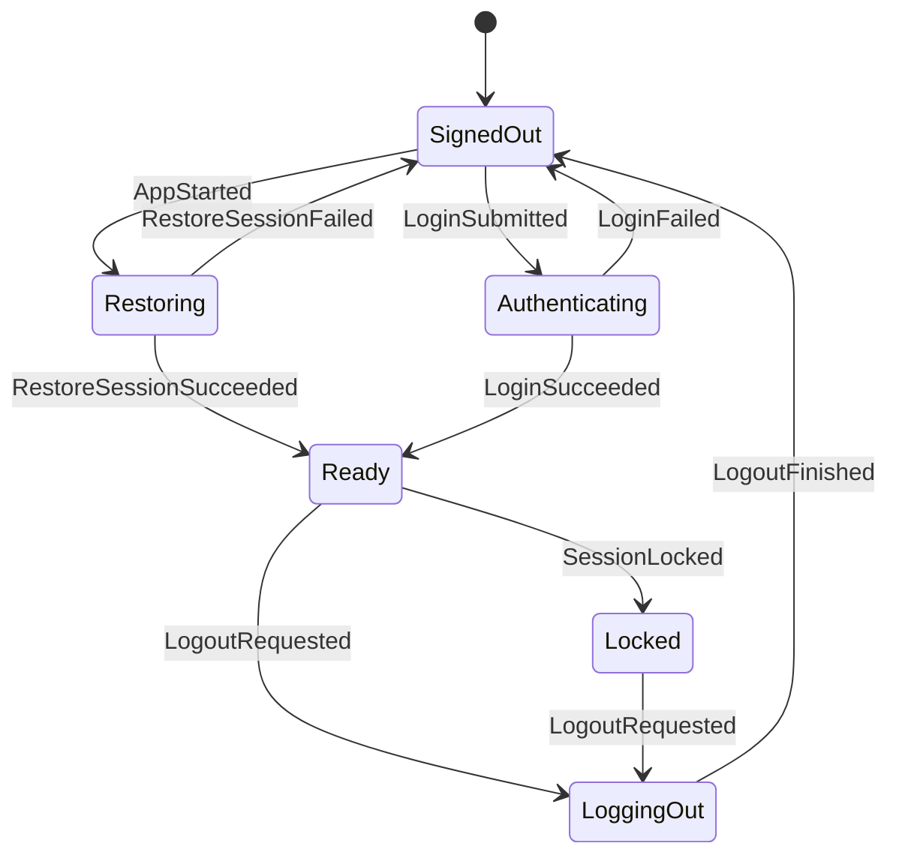
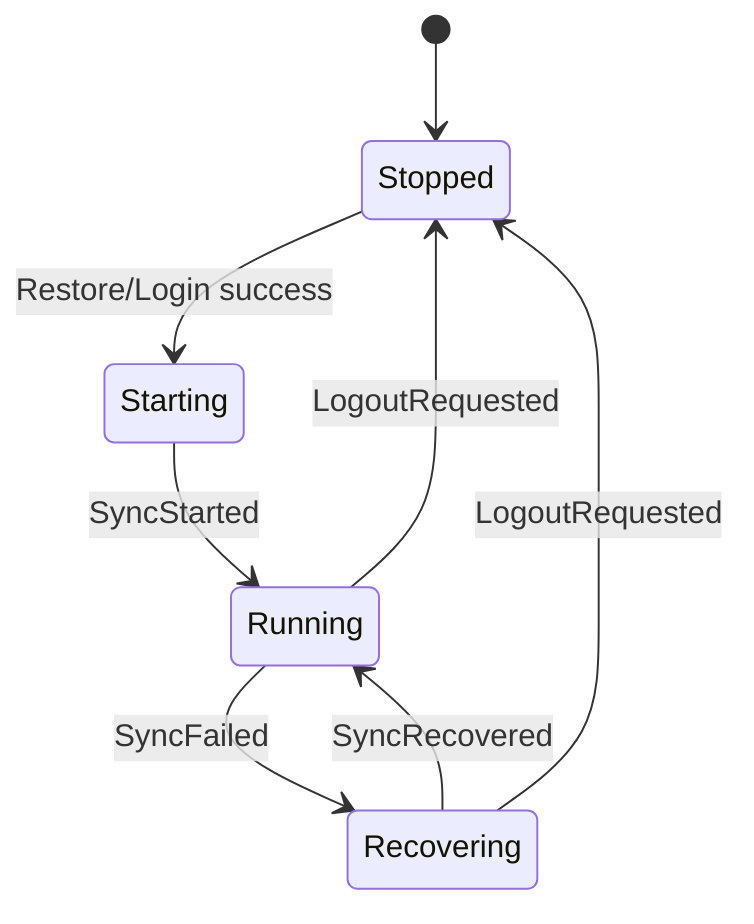

# Matrix Desktop State Machine

Date: 2026-06-11

## Contract

The app state machine is a pure Rust reducer:

```rust
reduce(&mut AppState, AppAction) -> Vec<AppEffect>
```

`AppAction` is either user intent from React or a completed SDK/backend operation.
`AppEffect` is a request for the future Tauri backend to perform work. The reducer
does not call Matrix SDK, Tauri, filesystem, keyring, or network APIs.

Actions that touch room, timeline, thread, or search state are accepted only when
the session is `Ready`. Late backend signals after logout or lock are ignored.

## Session And Sync





Logout and lock clear navigation, room lists, the main timeline, thread pane, and
search state. The reducer emits UI events for any cleared visible panes.

## Navigation

- Spaces filter non-DM rooms.
- DMs are global and remain visible regardless of active Space.
- If no active Space is selected, only non-DM rooms with no parent Space appear
  in the room list.
- Room-list updates clear an active Space or room if the item disappears.
- Selecting a room closes any open thread pane and emits a timeline subscription
  effect.

## Timeline And Thread

- The main timeline has one selected room.
- Timeline subscription signals only affect the selected room.
- The main composer tracks one pending transaction. A second send is ignored
  until the pending transaction completes.
- The thread pane is either closed, opening a root event, or open with a focused
  thread timeline.
- Thread subscription success must match the current opening room and root event;
  stale thread signals are ignored.

## Search

- Search has editing, searching, results, and failed states.
- Search responses carry a `request_id`.
- Responses whose `request_id` does not match the active searching state are
  ignored.
- If the user edits the query while a search is in flight, the in-flight response
  is ignored because the state is no longer `Searching`.
- Submitting a search emits both the backend search request and `SearchChanged`
  so the UI can display the loading state immediately.
- Snippet text and highlight ranges are DTO fields produced by a future search
  adapter, not by the reducer.

The ngram index is a candidate generator, not the source of display truth. Before
returning a result, the search adapter must run a second-pass verification over
the resolved visible body or snippet. Only verified exact spans are returned as
highlight ranges. Ngram candidates without a verified span are dropped from the
default search result set.

Highlight ranges are half-open UTF-16 code unit offsets relative to the returned
snippet so the frontend can apply them without re-tokenizing Japanese text or
emoji. Future fuzzy or related-message search must use a different
`SearchMatchKind` and a different visual treatment from exact highlights.

Attachment filenames are searchable, but they are not treated as message-body
matches. The search adapter indexes the resolved visible filename for file-like
events and returns `SearchMatchField::AttachmentFileName` when the verified span
is in that filename. In that case, `snippet` is the filename, highlight ranges
are relative to the filename, and the UI should render the result as a file
match with a file affordance. The click target remains the Matrix event that
contains the attachment.

Redacted attachments are not searchable. If a file event is edited or replaced,
the adapter indexes only the resolved visible filename. File contents are out of
scope for this search contract; only filenames participate.

Edited, redacted, or replaced Matrix events must be resolved before producing a
search result. The reducer stores only the search adapter's result snapshot; it
does not decide whether an older event body, an edited body, or a redaction tombstone
is visible.

Matrix edit events may be downloaded before the event they replace. The search
adapter must store such edits as pending relations keyed by the target event ID,
not as standalone searchable messages. If a search runs before the target event
has been downloaded, the adapter may either omit that pending edit from results
or synchronously repair the gap by fetching the target event first. It must not
return the edit event as if it were an independent room message.

When the missing target event later arrives, the adapter applies the pending edit
and indexes the resolved visible body for the target event. This can create a
temporary false negative for edited text, but avoids showing duplicated,
misordered, or non-visible edit events. Search results that depend on an
incomplete local index should be treated as partial until the indexer catches up.

Search timeline display must be treated as a focused result view, not as a normal
room timeline. It should avoid implying that search results are a complete
chronological timeline unless the backend explicitly provides enough surrounding
context and replacement/redaction state to render that context safely.
