# Matrix Desktop State Machine

Status: maintained reference for the reducer state machines. The
`reduce(AppState, AppAction)` reducer described here is the live UI
state-transition mechanism — production wires `CoreEvent -> AppAction ->
reduce(AppState)` (see [overview.md](./overview.md)). The `AppEffect`
fixture/demo backend contract mentioned below is historical (dev/demo only).
The state-transition diagrams in this document are normative and must track the
reducer; see [Maintenance Contract](#maintenance-contract).

Date: 2026-06-16

## Contract

The app state machine is a pure Rust reducer:

```rust
reduce(&mut AppState, AppAction) -> Vec<AppEffect>
```

`AppAction` is either user intent from React or a completed SDK/backend operation.
`AppEffect` is a request for the reducer-backed fixture/demo backend contract
used by older shell layers and tests. The reducer does not call Matrix SDK,
Tauri, filesystem, keyring, or network APIs. Current production runtime work
uses `CoreCommand` / `CoreEvent` in `docs/architecture/overview.md`.

Actions that touch room, timeline, thread, search, or composer state are accepted
only for a *Ready session* (defined below). Late backend signals after logout or
lock are ignored.

Reducer guard phrase: "Ready session" means a Matrix-capable authenticated
session whose runtime may accept room, timeline, thread, search, and composer
actions: `SessionState::Ready(_)`, `SessionState::NeedsRecovery { .. }`, or
`SessionState::Recovering { .. }`. It does not include `SignedOut`, `Restoring`,
`SwitchingAccount`, `Authenticating`, `Locked`, or `LoggingOut`. Recovery states
may show degraded encrypted-content behavior, but product state still remains
Rust-owned and guarded.

## Maintenance Contract

The state-transition diagrams in this document are normative, not illustrative.
Every reducer state machine — its states, the `AppAction` events that drive
transitions, and the guards that reject invalid or stale inputs — is documented
here as a Mermaid `stateDiagram-v2`. When the reducer changes (a new state,
transition, or guard), the matching diagram and its guard notes are updated in
the same change. A transition that exists in the reducer but not in the diagram,
or vice versa, is a defect; phase-exit docs-sync checks for it (see
[REPOSITORY_RULES.md](../../REPOSITORY_RULES.md) -> State-Machine Discipline and
[engineering-rules.md](../policies/engineering-rules.md) -> Documentation).

Convention: each transition is labeled with the `AppAction` that causes it, and
guards are stated as prose under the diagram. Unless noted, every transition
also requires a `Ready` session, and late or stale signals are ignored rather
than applied.

## Session And Sync

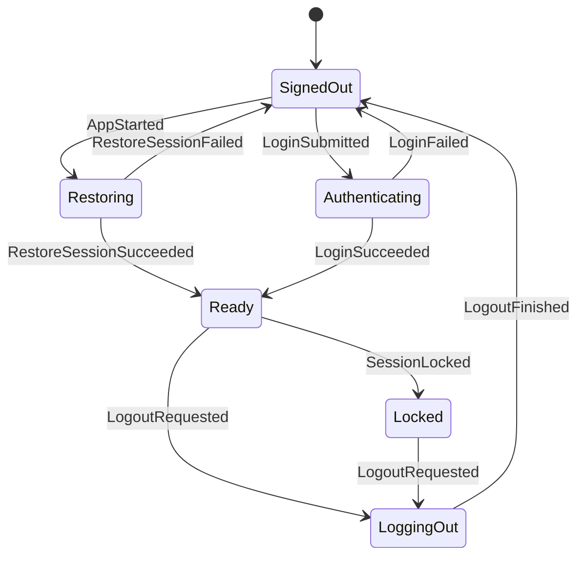

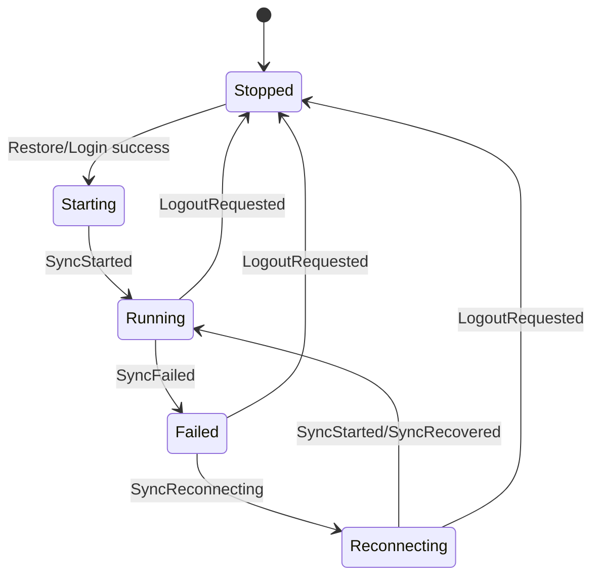

Logout and lock clear navigation, room lists, the main timeline, thread pane, and
search state. The reducer emits UI events for any cleared visible panes.

## Navigation

- Spaces filter non-DM rooms.
- DMs are global and remain visible regardless of active Space.
- If no active Space is selected, only non-DM rooms with no parent Space appear
  in the room list.
- Room-list updates clear an active Space or room if the item disappears.
- Selecting a room closes any open thread pane and emits a timeline subscription
  effect.

## Room Tags

Room tags are Rust-owned room-list state. `RoomSummary.tags` carries the
Element-aligned subset of Matrix `m.tag` data that affects product IA today:
favourite and low priority. React may render tag affordances and dispatch typed
commands, but it must not locally decide tag membership, mutually-exclusive tag
cleanup, or section membership.

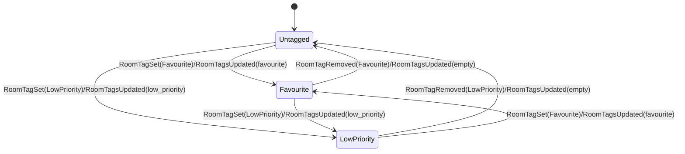

- `RoomTagsUpdated { room_id, tags }`, `RoomTagSet { room_id, tag, info }`,
  and `RoomTagRemoved { room_id, tag }` are accepted only when the session is
  Ready. Late deliveries after logout, restore, lock, or account switch are
  ignored.
- Unknown `room_id` inputs are ignored; tag actions never synthesize a room.
- Favourite and low-priority are mutually exclusive in the reducer. Setting one
  clears the other, matching the SDK `set_is_favourite` /
  `set_is_low_priority` behavior.
- Successful tag changes emit `RoomListChanged`. Phase B room-list sections
  (Favourites / People / Rooms / Low priority) are derived from this Rust-owned
  snapshot, not from React-local menu state.
- `RoomActor` routes `RoomCommand::SetTag` / `RemoveTag` through
  `matrix-desktop-sdk` tag wrappers, emits `RoomEvent::RoomTagSet` /
  `RoomTagRemoved`, reliably dispatches the reducer action that updates
  `RoomSummary.tags`, and does not immediately refresh the room list. The SDK
  tag calls send account-data changes to the homeserver, so the next sync
  snapshot is canonical; an immediate local refresh can still contain stale
  tags and must not overwrite the reducer projection.

## Invites And Direct Messages

Incoming invite state is Rust-owned in `AppState.invites`. React may render the
invite list and submit commands, but it must not synthesize invite receipt,
acceptance, decline, or DM-start lifecycle state locally.

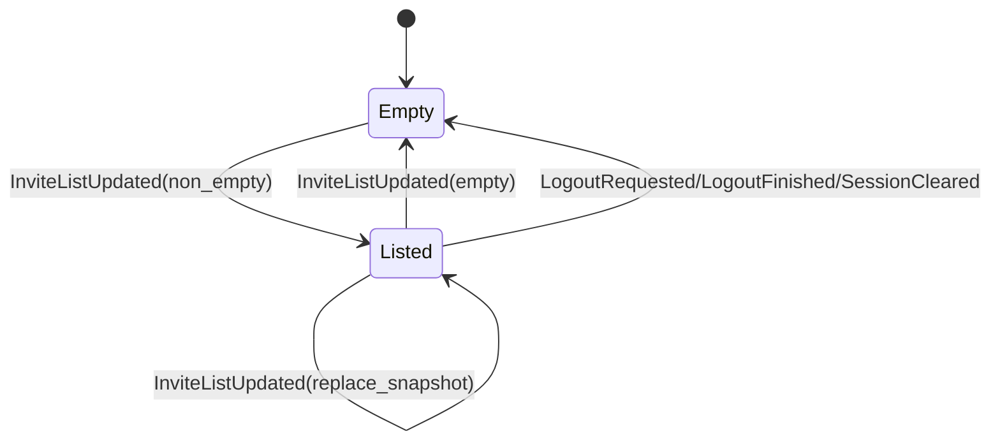

- `InviteListUpdated { invites }` is accepted only when the session is Ready.
  It replaces the whole invite snapshot and emits `RoomListChanged`; duplicate
  or stale SDK deliveries must be folded into the next Rust-owned snapshot.
- `InvitePreview` carries room id for command correlation plus display name,
  optional topic, optional inviter display name, and `is_dm`. GUI code must
  treat those fields as render data, not as a local membership state machine.
- `AcceptInvite` joins the invited room/space and emits
  `RoomEvent::InviteAccepted`; `DeclineInvite` leaves/forgets the invite and
  emits `RoomEvent::InviteDeclined`; `StartDirectMessage` creates a direct room
  through the SDK and emits `RoomEvent::DirectMessageStarted`. These commands
  carry normal request ids; GUI pending/settle feedback must come from Rust
  events/snapshots.
- `RoomActor` owns projection for both sync backends. On the SyncService path,
  the single live `RoomListService` entries adapter uses the non-left filter so
  invited-room diffs wake projection. Joined rooms/spaces are still normalized
  from `RoomState::Joined`; invite previews are normalized from
  `client.invited_rooms()`. A joined-only adapter is incorrect because invite
  receipt can sync successfully without any joined-room diff.
- The local core `invites_dm` QA scenario is the Phase A proof:
  `invite_recv=ok invite_accept=ok invite_decline=ok dm_start=ok`. Its output
  must remain private-data-free; do not print Matrix room IDs, user IDs, invite
  names, or raw SDK errors for this stage.
- The Phase B GUI is a view over the same Rust state. React may keep only
  presentation state for the currently visible pane, the selected invite
  preview, and unsent user-id drafts. Accept/decline/start-DM/invite-user
  actions cross the Tauri adapter as typed commands and must render their
  result from the returned Rust snapshot or subsequent state event. The browser
  headless IPC-contract test covers `accept_invite`, `invite_user`, and
  `start_direct_message`; the Linux virtual-display lane covers real WebView
  invite acceptance and DM start against a disposable local homeserver with the
  legacy sync backend forced for smoke determinism. SyncService invite
  projection remains covered by the Phase A core `invites_dm` local QA.

## Timeline And Thread

- The main timeline has one selected room.
- Timeline subscription signals only affect the selected room.
- The main composer tracks one pending transaction. A second send is ignored
  until the pending transaction completes.
- The thread pane is either closed, opening a root event, or open with a focused
  thread timeline.
- Thread subscription success must match the current opening room and root event;
  stale thread signals are ignored.
- Opening a thread is not complete when `ThreadPaneState` changes to `Opening`.
  The production runtime must also subscribe the corresponding
  `TimelineKind::Thread { room_id, root_event_id }`. Only the actual thread
  timeline subscription success may drive `ThreadSubscribed` and move the pane to
  `Open`.
- Thread pane identity and open/closed state are Rust-owned `AppState`. Visible
  thread items are not stored in `AppState`; they flow as `TimelineEvent`
  batches/diffs keyed by the thread `TimelineKey`. Legacy top-level frontend
  placeholders such as `snapshot.thread` are not authoritative in production.
- The open thread pane owns its own Rust `ComposerState`. The thread composer
  sends by routing `TimelineCommand::SendReply` to
  `TimelineKind::Thread { room_id, root_event_id }`, with
  `in_reply_to_event_id == root_event_id`. Focused timelines do not own
  composer state.
- Pane-level thread attention is Rust-owned `AppState.thread_attention`. It is
  initialized when a thread is opened, receives counts only for the currently
  open room/root event pair, and is cleared when the thread closes or navigation
  selects another room. React may render the DTO but must not scan timeline rows
  or thread chips to invent pane-level notification counts.

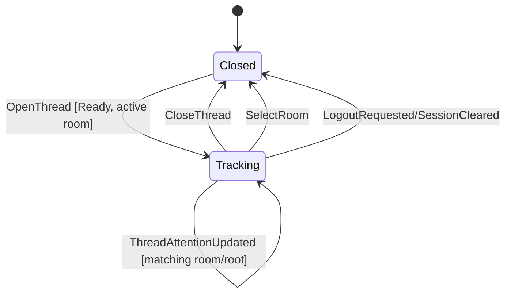

- `ThreadAttentionUpdated` is accepted only for a Ready session and only when
  its `room_id` and `root_event_id` match the currently tracked open thread.
  Stale, wrong-room, wrong-root, or post-logout updates are ignored.
- The tracking state carries `notification_count`, `highlight_count`, and
  `live_event_marker_count`. Equal updates produce no UI event; changed counts
  emit `ThreadChanged` so the pane can re-render from the Rust snapshot.
- GUI thread indicators, including the Threads nav badge/markers, render those
  three fields directly from `AppState.thread_attention`. They must not be
  derived from room-list unread totals, timeline row `thread_summary` chips, or
  visible thread rows.
- The current producer increments `notification_count` and
  `live_event_marker_count` from remote live `PushBack` message diffs in the
  open thread timeline. Backfill/prepend diffs and the current user's own
  messages are ignored. Future richer SDK thread notification counts must enter
  through the same Rust-owned action/state path.

## Timeline Reactions

Reaction annotations are Rust-owned timeline projection data. Grouped reaction
state carries the reaction key, aggregated count, whether the current user has
selected it, and the current user's reaction event id when present. React may
render this projection and dispatch typed commands, but it must not keep local
reaction counts, ownership, target eligibility, or toggle semantics.

- `SendReaction` and `RedactReaction` are the only reaction commands accepted
  across the app boundary. They are accepted only for a Ready session and only
  through the Rust timeline actor that owns the current subscription.
- Reaction targets are restricted to reaction-eligible timeline events in the
  active subscription. Stale event ids, wrong-room or wrong-thread targets,
  state events, and other unsupported targets are rejected as invalid reaction
  failures.
- Rust projects the SDK's aggregated reaction annotations into grouped state
  keyed by reaction key. Duplicate annotations are deduplicated by the SDK
  aggregation layer, and redactions update the same grouped projection rather
  than creating React-local replacement state.
- The public SDK surface exposes `Timeline::toggle_reaction`. Rust must prove
  the current projected state before delegating to that toggle helper: add only
  when the projection says the user has not already selected the reaction, and
  redact only when the projection says the matching own reaction event is
  present. If the projection does not support the requested transition, settle
  it as an invalid reaction failure instead of guessing from React state.

## Timeline Reply Quotes, Pins, And Actions

Reply quote previews and pinned-event state are Rust-owned message-interaction
projections. `TimelineItem.reply_quote` is projected in
`matrix-desktop-core` from SDK reply details; React renders that DTO and must
not resolve reply bodies, classify redactions, or repair missing quote state.

Message action affordances are also Rust-owned timeline projections.
`TimelineItem.actions` carries `can_copy`, `can_forward`, `can_permalink`,
`can_view_source`, and an optional `permalink`. The permalink is generated in
Rust from the owning `TimelineKey` room id plus the event id as a
`https://matrix.to/#/<room>/<event>` URL. React may render or copy this value
only when the DTO says it is available; it must not build Matrix permalinks,
infer action eligibility from `TimelineItemId`, body/media fields, or redaction
flags, or invent forward/source behavior.

`TimelineCommand::LoadMessageSource` loads a Rust-owned
`TimelineMessageSource` safe DTO for a subscribed event. It contains the
projected event id, sender, timestamp, visible body, reply/thread relation
ids, redaction/edit flags, and a media-presence flag; it is not a raw Matrix
event JSON dump. `TimelineCommand::ForwardMessage` resolves the source item in
Rust, sends only the projected visible body to the destination room, and emits
`MessageForwarded` when the destination send completes. React supplies source
and destination identifiers only; it must not copy the body, inspect raw event
JSON, or synthesize forward content. Media-only forwarding remains disabled
until a separate Rust-owned media-forward contract exists.

`AppState.room_interactions[room_id]` carries the room's pinned-event
projection plus the current pin/unpin operation state:

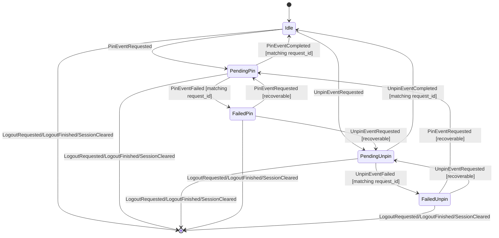

- `ReplyQuoteState` is one of `Ready`, `Redacted`, `Missing`, or
  `Unsupported`. `Ready` may include a sender and body preview; redacted,
  missing, and unsupported quotes never require React to inspect Matrix event
  content.
- `TimelineItem.actions` is populated only for event-backed timeline items.
  Synthetic and transaction-backed items receive all-false affordances. Redacted
  event items keep event-scoped affordances such as permalink/source visibility
  but lose copy/forward affordances unless Rust explicitly restores them.
- Copy is allowed only when Rust projected a visible body and the item is not
  redacted. Forward is allowed only when Rust projected a visible body and the
  item is not redacted; media-only items stay non-forwardable until media
  forwarding has its own Rust-owned contract. Future source extensions must
  consume typed Rust-owned DTOs rather than raw React-side event inspection.
- Phase B message-action menus are presentation state only. Menu visibility,
  submenu focus, and clipboard invocation may live in React, but menu entries
  are gated by `TimelineItem.actions`; source details render only after
  `MessageSourceLoaded`; forward commands use Rust-snapshot destination room
  ids and do not copy message bodies through React.
- `RoomPinnedEventsUpdated { room_id, pinned }` replaces only that room's
  pinned-event list and emits `RoomInteractionsChanged` when the list changes.
  It may arrive from sync or as the post-command refresh after successful
  pin/unpin. It does not synthesize a room summary and does not settle a
  pending operation by itself.
- `PinEventRequested` and `UnpinEventRequested` are accepted only for a Ready
  session, a known room, a non-empty event id, and an `Idle` or recoverable
  `Failed` pin operation. Requests while another pin/unpin is pending are
  ignored.
- Completion and failure actions settle only the matching request id and
  operation kind. Stale completions, duplicate completions, and opposite
  operation completions are ignored.
- Failures store a recoverable `Failed` state and push only a coarse
  private-data-free `AppError`; raw SDK errors, room ids, event ids, and
  message bodies must not appear in ordinary logs or QA output.
- `RoomCommand::PinEvent` and `RoomCommand::UnpinEvent` route through
  `RoomActor` and `matrix-desktop-sdk`; successful commands emit typed
  completion events and then refresh the Rust pinned-event projection. The
  completion action settles `Pending` before the follow-up pinned-state reload:
  if that reload fails, the command is still no longer pending and the failure
  is reported as a coarse operation failure. GUI code dispatches typed commands
  and renders the next Rust snapshot/event only.
- The local core `reply` QA scenario proves this Phase A slice with
  `reply_quote=ok pin_event=ok pinned_state=ok unpin_event=ok`. Its stdout must
  remain private-data-free. Message-action QA evidence must likewise use coarse
  tokens only; do not print Matrix IDs, message bodies, or generated permalinks.

## Timeline Media

Timeline media is a core-owned operation/effect state, not React-local logic.
`TimelineItem.media` is projected in `matrix-desktop-core` from SDK
`m.image`/`m.file` message content and flows to the UI as ordinary timeline
diff data. React renders the metadata and dispatches typed commands; it must
not parse Matrix media event content, infer encryption state, or synthesize
upload/download lifecycle locally.

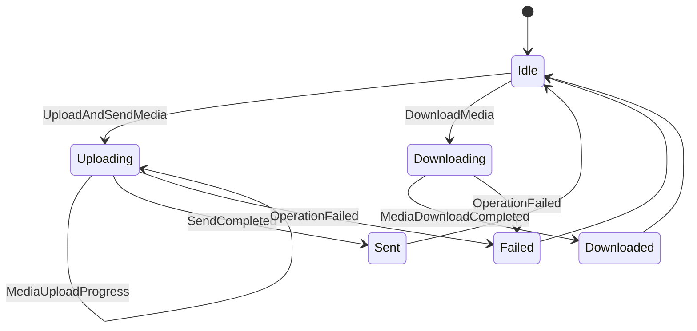

- `UploadAndSendMedia { key, transaction_id, request }` is routed only to a
  subscribed `TimelineActor`. The actor fixes the SDK attachment transaction id
  to the caller-provided `transaction_id` so local echo, upload progress, and
  `SendCompleted` correlate through the same Rust-owned key.
- Upload requests may carry filename, caption, mimetype, dimensions, and bytes
  because those are required to send the media. Those fields are private
  visible-content payloads: `Debug`, QA output, logs, and errors must redact
  them.
- `MediaUploadProgress` carries only request/transaction correlation, progress,
  index, and safe media source metadata. It never carries filenames, captions,
  bytes, Matrix room ids, or raw SDK errors.
- `TimelineItem.media.source` may expose the MXC URI, encrypted flag, and
  encryption protocol version. Encrypted file keys, hashes, and decrypted bytes
  remain inside Rust actor-private SDK media sources and are never serialized to
  React.
- `DownloadMedia` resolves the actor-private media source by event id and emits
  `MediaDownloadCompleted` with `byte_count` only. A future GUI save/open flow
  must use a Rust-owned platform port or Tauri command that does not put bytes
  into React state.
- Phase B GUI wiring is a transport client only: the Composer file input reads
  synthetic/user-selected bytes and invokes `upload_media`; `TimelineView`
  renders `TimelineItem.media` plus `MediaUploadProgress` keyed by the
  transaction id; event-backed media rows invoke `download_media`. React does
  not parse Matrix event content, infer encryption details, render MXC URIs, or
  own upload/download success/failure state.
- The local core `media` QA scenario is the Phase A proof:
  `send_media=ok recv_media=ok`. Its output must remain private-data-free.

## Timeline Formatted Message Projection

Received Matrix `formatted_body` is a Rust-owned security projection. The
timeline actor extracts SDK `FormattedBody` from text, notice, emote, and
caption-capable media message content, accepts only Matrix HTML format, and
sanitizes it before exposing it through `TimelineItem.formatted`.

- `TimelineItem.formatted` carries a safe render contract: sanitized HTML,
  plain text derived from that sanitized tree, and extracted code-block metadata
  (`language` plus code body).
- Unsafe tags, unsafe attributes, unsafe URL schemes, and script/style contents
  are removed in Rust. React must never render server `formatted_body` directly
  or re-run ad hoc sanitization as product logic.
- Plain `TimelineItem.body` remains the fallback when formatted content is
  absent, empty after sanitization, unsupported, or invalid.
- Code-block line wrapping is controlled by Rust-owned
  `SettingsValues.display.code_block_wrap`, defaulting to `true` and persisted
  through the settings store. GUI code may map the snapshot value to CSS only;
  it must not keep a separate wrap preference.

## Profiles And Avatars

Profiles and avatars are Rust-owned account and room projections.
`AppState.profile.own` holds the current account display name and avatar,
`AppState.profile.users` holds the per-user profile cache used by timeline and
member surfaces, `AppState.profile.local_aliases` holds personal local display
aliases keyed by Matrix user id, and room/space/invite summaries carry their
own avatar DTOs.
React renders these DTOs and dispatches typed profile commands only; it must not
query Matrix profiles, parse MXC URIs, upload avatar bytes outside the command
boundary, resolve personal aliases locally, or infer profile operation success
from component state.

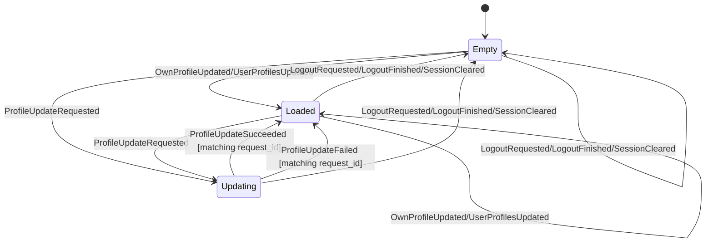

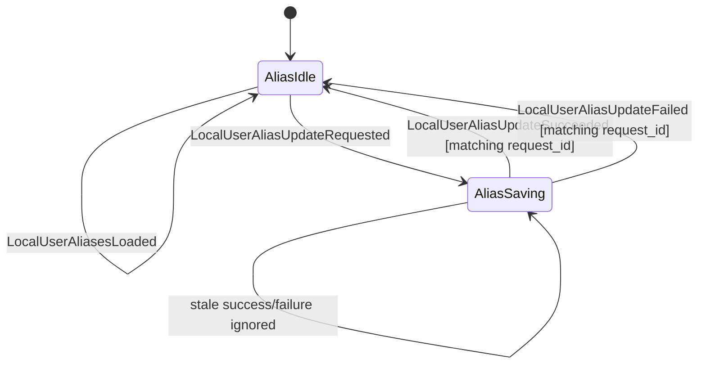

- Profile actions are accepted only for a Ready session. Late profile snapshots
  after logout, lock, or account switch are ignored.
- Joined-room member profiles enter `AppState.profile.users` through the
  Rust-owned room-list observation path (`RoomActor` normalizes SDK active
  member profiles and emits `UserProfilesUpdated`). GUI mention autocomplete
  and member/person surfaces consume this projection; React must not query
  Matrix profiles or create member candidates from DOM/timeline strings.
- `ProfileUpdateRequested { request_id, request }` is accepted only when no
  profile update is in flight. It records either `SettingDisplayName` or
  `SettingAvatar` and emits `ProfileChanged`.
- `ProfileUpdateSucceeded` and `ProfileUpdateFailed` settle only the matching
  in-flight request id. Stale or duplicate completions are ignored. Failures
  also emit `ErrorChanged`.
- Local user aliases are personal "only I see this name" data persisted as
  private global account data under `app.ruri.local_aliases`. `AccountActor`
  hydrates them after login/restore, and `SetLocalUserAlias` writes them through
  the SDK account-data boundary. They never become Matrix profile updates,
  room events, outgoing message content, notification text, or QA tokens.
- Alias display resolution is Rust-owned:
  `alias ?? upstream display name ?? profile cache/own profile ?? MXID`.
  Timeline/read-receipt/member/person surfaces must consume the Rust-resolved
  DTO labels; React must not join user ids to `local_aliases` or invent a
  separate alias cache.
- Per-user profile DTOs carry `display_label`, `original_display_label`, and
  `mention_search_terms` as Rust-owned projections. `display_label` may contain
  a local alias; `original_display_label` is the alias-free upstream,
  own-profile, or MXID context value. GUI mention autocomplete, mention
  highlighting, profile views, and tooltips consume the projected fields and
  must not recompute alias precedence or strip aliases in React.
- Room summaries carry `display_label` as the Rust-projected room list/header
  label and `original_display_label` as the alias-free room/DM context label.
  For one-to-one DM rooms, `dm_user_ids` supplies the target identity and labels
  resolve through the alias/profile precedence above; for non-DM rooms they use
  trimmed upstream `display_name` with `room_id` as the final fallback.
  `display_name` remains the upstream/original room name. React must render
  `display_label` for normal room title surfaces, may show
  `original_display_label` for context affordances, and must not infer DM
  identity from a display name or synthesize generic labels such as `Member`.
- Timeline CoreEvents preserve raw sender MXIDs only as identity fields.
  `CoreConnection` projects `TimelineItem.sender_label`,
  `ReplyQuote.sender_label`, and `ThreadSummaryDto.latest_sender_label` from
  the latest Rust `AppState.profile` before events reach consumers. Timeline
  GUI surfaces render those label fields; they must not display raw sender ids
  except as explicit identity/debug/source data.
- When `ProfileChanged` follows a profile or local-alias transition, the core
  runtime emits a keyless `TimelineEvent::DisplayLabelsUpdated` containing
  Rust-resolved `user_id -> display_label` patches. Timeline stores may apply
  those patches to already-loaded rows by matching raw identity fields
  (`sender`, reply quote `sender`, thread `latest_sender`), but must not derive
  the label values in React. `SetLocalUserAlias` includes its target user id in
  that emission so clearing an alias also relabels rows for users that are not
  present in the profile cache.
- `LocalUserAliasUpdateRequested` is accepted only for a Ready session and only
  while `local_alias_update` is idle. It trims non-empty aliases, treats empty
  aliases as clear, records `Saving { request_id }`, and emits
  `ProfileChanged`. Matching success returns to `Idle`; matching failure returns
  to `Idle`, records a private-data-free `local_user_alias_update_failed`
  `AppError`, and emits `ProfileChanged` plus `ErrorChanged`.
- Debug and QA output must redact local alias user ids and alias text.
  `ProfileState` debug reports only profile/avatar presence and counts,
  including `local_alias_count`; the SDK account data DTO debug reports only
  `alias_count`.
- `SetDisplayName` carries the submitted display name only across the typed
  command and reducer pending-state boundary. Normal logs, Debug output, QA
  tokens, and issue evidence must not expose real account display names.
- `SetAvatar` may carry mimetype and bytes only across the typed command
  boundary. Debug output redacts the bytes. The reducer pending state records
  mimetype and byte count, never bytes.
- Avatar images store the MXC URI as Rust-owned metadata. React must not render
  an MXC URI directly; it renders an image only when Rust/platform-owned media
  handling has settled `AvatarThumbnailState::Ready { source_url, .. }`.
  `NotRequested`, `Loading`, and `Failed` render the colored-initial fallback.
- In the #17 reducer slice, avatar thumbnail fields are replaced through the
  Rust-owned snapshot actions (`OwnProfileUpdated`, `UserProfilesUpdated`, room
  list updates, and invite updates). A future explicit avatar-thumbnail download
  workflow must add its own `AppAction` transitions and update this document in
  the same change.
- The existing timeline media download contract emits byte counts only and does
  not put downloaded bytes in React state. Avatar thumbnail source URLs must
  remain app-owned handles or source URLs produced by Rust/platform media
  handling; decrypted bytes, encrypted media keys, local filesystem paths, and
  raw SDK errors stay outside snapshots and QA output.

## Live Signals

Live signals are Rust-owned room/account projections in
`AppState.live_signals`. They cover per-room read receipts, fully-read markers,
typing users, and account/user presence. React renders this state and dispatches
typed commands; it does not infer Matrix signal semantics from timeline rows,
DOM hover state, timers, or local component state.

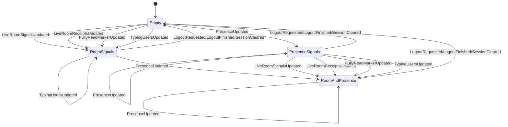

- Every live-signal update is accepted only for a Ready session. Late SDK
  deliveries after logout, lock, account switch, or session clear are ignored.
- `LiveRoomSignalsUpdated { room_id, update }` replaces the room's full
  live-signal snapshot. The reducer normalizes duplicate receipts by user,
  sorts receipt event entries, and sorts/deduplicates typing user ids.
- `LiveRoomReceiptsUpdated { room_id, receipts_by_event }` is a partial merge
  into the room receipt map. It does not clear typing users or the fully-read
  marker.
- Receipt reader display data is resolved in Rust before it reaches the GUI.
  Each event's receipt projection deduplicates by reader user id using the
  newest timestamp, fills missing display labels and avatar DTOs from
  `AppState.profile`, orders readers most-recent-first with deterministic
  tie-breaking, caps the rendered reader list at the shared receipt-reader cap,
  and carries `total_count` plus `overflow_count`. GUI code renders that
  projection and must not join receipt ids to profile maps, choose ordering, or
  infer hidden overflow readers locally.
- `FullyReadMarkerUpdated { room_id, event_id }` replaces only that room's
  fully-read marker; `event_id: None` clears it.
- `TypingUsersUpdated { room_id, user_ids }` replaces only that room's typing
  user list with the normalized list from Rust. GUI timers or focus state must
  not repair typing state after the fact.
- `PresenceUpdated { user_id, presence }` updates the Rust-owned presence map.
  Current Phase A presence proves command/event/state ownership. Full network
  propagation remains tied to the sync backend's presence-setting API and must
  stay in Rust when implemented.
- Session-view clears reset all live signals and emit `LiveSignalsChanged` when
  anything was present.
- `TimelineCommand::SendReadReceipt`, `SetFullyRead`, and `SetTyping` are
  routed to the subscribed `TimelineActor`. Success events carry request ids;
  failures are redacted `OperationFailed` events. Event ids, room ids, and user
  ids may exist in app snapshots as visible Matrix UI data but must not appear
  in ordinary logs, Debug output, QA stdout, screenshots, or issue evidence.
- The local core `live_signals` QA scenario is the Phase A proof:
  `read_receipt=ok fully_read=ok typing=ok presence=ok live_signals=ok`. Its
  output must remain private-data-free and must not print Matrix room IDs, user
  IDs, event IDs, raw SDK errors, or message bodies. On local SyncService
  homeserver legs, the typing assertion may perform one bounded debug/test
  `SyncOnce` on the observer account after the sender's typing command is
  acknowledged; this is a QA delivery nudge, not React-owned or product
  polling logic.

## Focused Context

A focused context is the Rust-owned result-context timeline used when the
product opens a specific event from search or another contextual entry point.
It is separate from the selected room timeline and from the thread pane.

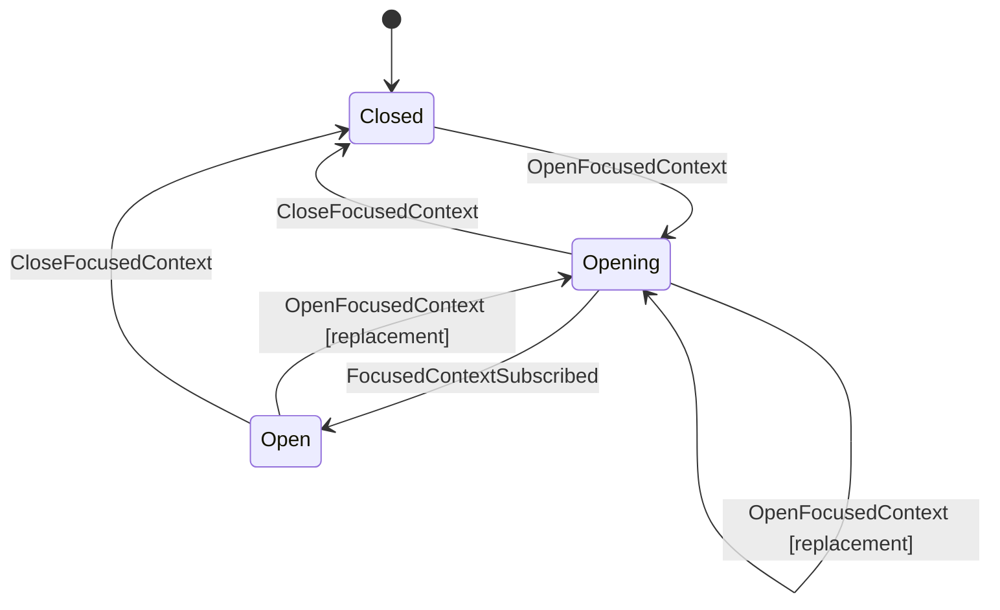

- `OpenFocusedContext { room_id, event_id }` is accepted only for a ready session
  whose selected timeline room equals `room_id`; otherwise it is ignored. The
  selected timeline room guard prevents search/result UI from owning Matrix
  operation semantics.
- On accepted open, the reducer enters `Opening` and emits
  `OpenFocusedTimeline { room_id, event_id }`. Production runtime subscribes
  `TimelineKind::Focused { room_id, event_id }` through that effect.
- `FocusedContextSubscribed { room_id, event_id }` moves `Opening` to `Open`
  only when both fields match the currently opening context; stale subscription signals are ignored.
- `CloseFocusedContext` closes an `Opening` or `Open` context for a ready
  session. close from `Closed`, or any close without a ready session, is a no-op.
- Focused context replacement is core-owned: when opening a different focused
  context while another focused context is `Opening` or `Open`, production
  runtime unsubscribes the previous focused timeline before subscribing the new
  key. Reopening the same focused key is idempotent as far as runtime
  subscription ownership allows.
- focused timelines do not own composer/send state. The selected room composer
  and the thread composer are separate Rust state machines; focused timelines do
  not submit sends, clear drafts, repair reply mode, or settle pending
  transactions.

## Thread Composer Reply Mode

The open thread pane's composer tracks draft and pending reply state separately
from the selected room's main composer:

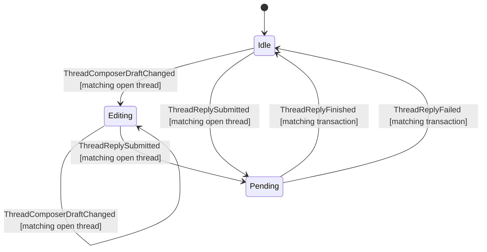

- `ThreadComposerDraftChanged { room_id, root_event_id, draft }` applies only
  when a ready session has that exact thread open. Stale room/root signals and
  closed/opening thread states are ignored.
- `ThreadReplySubmitted { room_id, root_event_id, transaction_id, body }`
  applies only when a ready session has that exact thread open and the thread
  composer has no pending transaction. It records the pending transaction as a
  reply to `root_event_id`, clears the thread draft, and emits `ThreadChanged`.
  It does not mutate the selected room's main composer.
- `ThreadReplyFinished { room_id, root_event_id, transaction_id }` clears only
  the matching thread composer pending transaction and emits `ThreadChanged`.
  Stale room/root/transaction signals are ignored.
- `ThreadReplyFailed { room_id, root_event_id, transaction_id, message }`
  clears only the matching thread composer pending transaction, records the same
  recoverable `send_text_failed` error pattern as main composer failures, and
  emits `ThreadChanged` plus `ErrorChanged`. Stale room/root/transaction signals
  are ignored.

## Composer Reply Mode

The selected room's composer carries a reply mode (`ComposerMode`) alongside its
pending-transaction tracking:

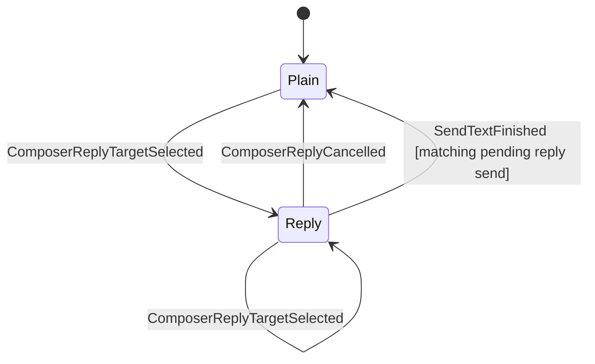

- `ComposerReplyTargetSelected { room_id, event_id }` enters `Reply` only when the
  session is `Ready` and `room_id` is the selected timeline room; otherwise it is
  ignored. Re-selecting while already in `Reply` replaces the target (idempotent).
- `ComposerReplyCancelled` returns to `Plain`; it is a no-op when already `Plain`
  or when no room is selected.
- `SendTextSubmitted { room_id, transaction_id, body }` records one pending
  transaction only when no send is already pending. The pending state records the
  submitted composer kind: plain send, or reply send with the reply target that
  was current at submission time.
- `SendTextFinished { room_id, transaction_id }` clears only the matching pending
  transaction. It returns the composer to `Plain` only when the matched pending
  send was submitted as a reply and the current reply target still equals the
  captured target. A plain send completion must not clear a reply target selected
  after submission, and a reply send completion must not clear a newer reply
  target selected before completion.
- `SendTextFailed { room_id, transaction_id, message }` clears the pending
  transaction and records a recoverable error. It preserves the current
  `Reply` mode so the user can retry or cancel explicitly.
- The reply target is Rust-owned `AppState`, not React-local, so the send path,
  snapshots, and QA can read which event a draft replies to.

## Outbound Send Queue

Outbound timeline send state is owned by the Rust `TimelineActor`, keyed by the
SDK send-queue transaction id exposed on local-echo timeline items. React may
render `TimelineItem.send_state` and dispatch typed commands, but it must not
derive retry/cancel legality from local component state.
Visible timeline sends go through the SDK UI `Timeline::send` path so local
echo diffs reach the subscribed timeline store; retry/cancel still operate on
the underlying SDK send queue handles.

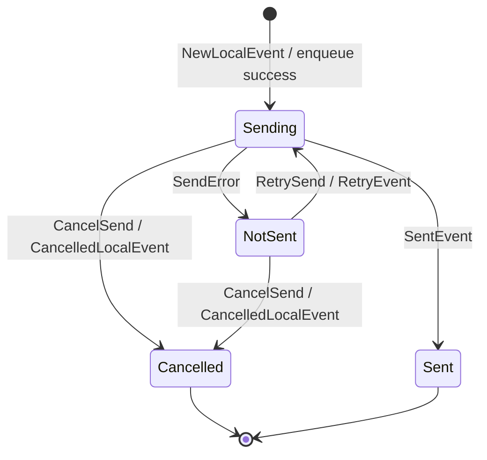

| Command / update | Accepted states | Rejected states | Notes |
| --- | --- | --- | --- |
| `NewLocalEvent` | any | none | Records `sending` and stores the SDK `SendHandle` for retry/cancel. Restored local echoes from `RoomSendQueue::subscribe()` initialize the same table before the actor starts processing commands. |
| `SendError` | `sending` | none | Records `not_sent { reason }` using only the SDK recoverable flag. Raw SDK errors stay out of DTOs, logs, QA tokens, and React state. The matching composer pending state is failed once; later retry success can still emit `SendCompleted`. |
| `RetrySend { room_id, transaction_id }` | `not_sent` with a stored `SendHandle` | `sending`, `sent`, `cancelled`, unknown transaction | Re-enables the SDK room queue with `room.send_queue().set_enabled(true)`, then calls `SendHandle::unwedge()`. FIFO order remains the SDK send queue's responsibility; React never reorders or manually marks successors sent. |
| `CancelSend { room_id, transaction_id }` | `sending`, `not_sent` with a stored `SendHandle` | `sent`, `cancelled`, unknown transaction | Calls `SendHandle::abort()`. A successful cancel records `cancelled`, drops the handle, re-enables the SDK room queue so successors are not stranded, and clears matching composer pending state without creating a send-failure error. |
| `SentEvent` | any | none | Records `sent`, drops the handle, maps SDK transaction id to event id, and emits `SendCompleted` for the original request when available. |

`TimelineItem.send_state` is a coarse webview DTO: `sending`, `notSent`
(`recoverable` / `unrecoverable`), `cancelled`, or `sent`. The SDK
`RoomSendQueue` remains responsible for local echo persistence, offline retry,
strict FIFO ordering, and retry-after-reconnect. The Rust runtime only projects
that state and exposes guarded commands.

Headless core QA covers this with the `send_queue` scenario against disposable
local homeservers. The Rust QA binary inserts a local TCP proxy to inject
offline send failures and reports only private-data-free tokens:
`send_fail=ok`, `resend=ok`, `cancel_send=ok`, `fifo=ok`, and
`unsent_restart=ok`.

## Basic Operations (Room / Space Creation, Space Linking)

Room creation, space creation, and space-child linking share one in-flight slot,
`AppState.basic_operation`, modeled as a guarded, request-correlated state
machine — the same shape as the composer's pending transaction and search's
`request_id` correlation:

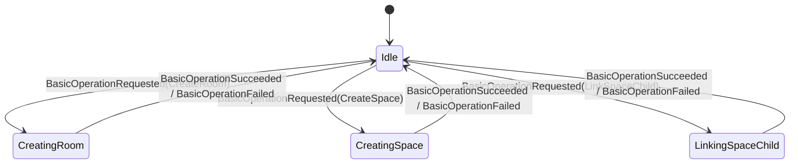

- Start guard: `BasicOperationRequested { request_id, request }` is accepted only
  from `Idle` with a `Ready` session. A request arriving while an operation is in
  flight is ignored, so the in-flight operation is never clobbered (mirrors "a
  second send is ignored until the pending transaction completes").
- Correlation: the pending state carries the request's `request_id`.
- Settle guard: `BasicOperationSucceeded { request_id }` and
  `BasicOperationFailed { request_id, message }` apply only when `request_id`
  matches the in-flight operation; stale, duplicate, or idle-state completions are
  ignored (mirrors search's `request_id` check). Failure also records a
  recoverable `basic_operation_failed` error.
- Event vs. state: `BasicOperationRequest` describes intent; the reducer derives
  the resulting `BasicOperationState`. An action never carries the target state.
- Producer: in production `matrix-desktop-core`'s `RoomActor` dispatches these
  events around the `CreateRoom` / `CreateSpace` / `SetSpaceChild` SDK calls,
  using the command's `request_id` (its `sequence`) as the correlation id.

## Room Management

Room settings and moderation are Rust-owned state in
`AppState.room_management`. React may render the loaded settings snapshot and
permission facts, but it must not decide whether a setting change or moderation
action is allowed. GUI code dispatches typed room-management commands and waits
for Rust-owned state/events to settle.

```mermaid
stateDiagram-v2
    [*] --> Idle
    Idle --> Idle: RoomSettingsSnapshotLoaded
    Idle --> PendingSettings: RoomSettingUpdateRequested [Ready + can_edit_settings]
    Idle --> PendingModeration: RoomModerationRequested [Ready + matching permission fact]
    Idle --> PendingRoles: RoomMemberRoleUpdateRequested [Ready + can_edit_roles]
    Idle --> FailedPermissions: RoomSettingUpdateRequested [permission denied]
    Idle --> FailedPermissions: RoomModerationRequested [permission denied]
    Idle --> FailedPermissions: RoomMemberRoleUpdateRequested [permission denied]
    PendingSettings --> Idle: RoomSettingUpdateSucceeded [matching request_id]
    PendingSettings --> FailedSettings: RoomSettingUpdateFailed [matching request_id]
    PendingModeration --> Idle: RoomModerationSucceeded [matching request_id]
    PendingModeration --> FailedModeration: RoomModerationFailed [matching request_id]
    PendingRoles --> Idle: RoomMemberRoleUpdateSucceeded [matching request_id]
    PendingRoles --> FailedRoles: RoomMemberRoleUpdateFailed [matching request_id]
    FailedSettings --> PendingSettings: RoomSettingUpdateRequested
    FailedModeration --> PendingModeration: RoomModerationRequested
    FailedRoles --> PendingRoles: RoomMemberRoleUpdateRequested
    FailedPermissions --> PendingSettings: RoomSettingUpdateRequested [permission now allowed]
    FailedPermissions --> PendingModeration: RoomModerationRequested [permission now allowed]
    FailedPermissions --> PendingRoles: RoomMemberRoleUpdateRequested [permission now allowed]
    PendingSettings --> Idle: LogoutRequested/SwitchAccountRequested/SessionCleared
    PendingModeration --> Idle: LogoutRequested/SwitchAccountRequested/SessionCleared
    PendingRoles --> Idle: LogoutRequested/SwitchAccountRequested/SessionCleared
    FailedSettings --> Idle: LogoutRequested/SwitchAccountRequested/SessionCleared
    FailedModeration --> Idle: LogoutRequested/SwitchAccountRequested/SessionCleared
    FailedRoles --> Idle: LogoutRequested/SwitchAccountRequested/SessionCleared
    FailedPermissions --> Idle: LogoutRequested/SwitchAccountRequested/SessionCleared
```

- `RoomSettingsSnapshot` carries the selected room id, name, topic, avatar URL,
  join rule, history visibility, `RoomPermissionFacts`, and the room-scoped
  `members` projection. Each member summary includes the Rust-projected
  `display_label`
  (`local alias ?? nonblank room-scoped display_name ?? profile cache/own profile ?? MXID`),
  power level, and role label (`creator`, `administrator`, `moderator`,
  `user`). `display_name` remains the upstream/original name for context. It is
  app-owned DTO data mapped from the SDK before crossing the command/event
  boundary, then refreshed from `AppState.profile` on profile/alias changes.
  GUI member actions must render this room-scoped member snapshot, not the
  global profile cache, and must not derive label or role semantics in React.
- The command surface is `RoomCommand::LoadRoomSettings`,
  `RoomCommand::UpdateRoomSetting`, `RoomCommand::ModerateRoomMember`, and
  `RoomCommand::UpdateRoomMemberRole`.
  Tauri handlers are transport adapters: they allocate a request id, submit the
  typed command, wait for the correlated `RoomEvent`, and do not call SDK
  wrappers directly.
- Setting updates are accepted only with a `Ready` session and
  `can_edit_settings=true` in the current snapshot. Moderation is accepted only
  when the matching permission fact allows the action:
  `can_kick`, `can_ban`, or `can_unban`. Role edits are accepted only when
  `can_edit_roles=true`; success updates the target member's `power_level` and
  `role` in the Rust snapshot.
- Permission-denied requests settle as a failed `permissions` operation before
  SDK mutation. A GUI control may be disabled from the snapshot, but Rust still
  enforces the guard for direct commands and tests.
- Settings and moderation completions are request-correlated. Stale successes,
  stale failures, duplicate completions, and completions for a room that is no
  longer selected are ignored.
- Successful kick/ban completions remove the target from
  `RoomSettingsSnapshot.members` in the Rust reducer when the operation matches
  the selected room. React must wait for this snapshot change and must not
  locally filter member rows after dispatching a moderation command. Unban does
  not synthesize a member row; a later settings/member refresh projects any
  active membership.
- SDK state-event mutation calls can return before the SDK room cache reflects
  the sent state event. The SDK adapter must project the submitted setting
  change or member power-level change into the success snapshot or otherwise
  wait for a refreshed cache before emitting `RoomSettingUpdated` /
  `RoomMemberRoleUpdated`; React must not patch the visible settings or role
  state locally.
- Failure state stores only coarse `RoomFailureKind` values. Room IDs, user IDs,
  room names/topics, avatar URLs, moderation reasons, raw SDK errors, and event
  identifiers must not appear in `Debug` output or QA stdout.
- Logout, account switch, and session clearing reset `room_management` to its
  default idle state and drop selected-room settings.
- Headless core QA covers this with the `room_management` scenario and
  private-data-free tokens `room_settings=ok`, `permission_guard=ok`, and
  `moderation=ok`. The lane uses a disposable management room so timeline and
  room/space stages are not disrupted.

## Public Directory

Public room directory state is Rust-owned and split into two independent
submachines so a query result can stay visible while a join is pending or
failed:

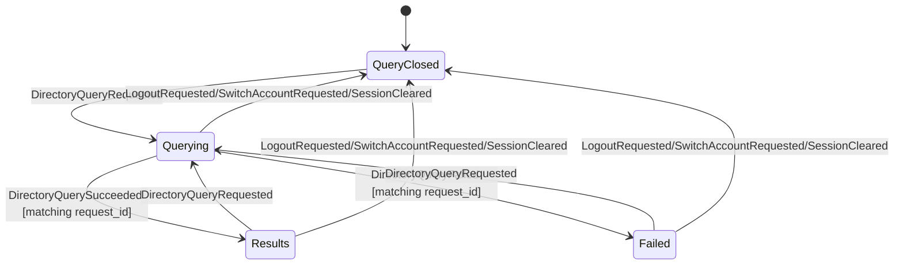

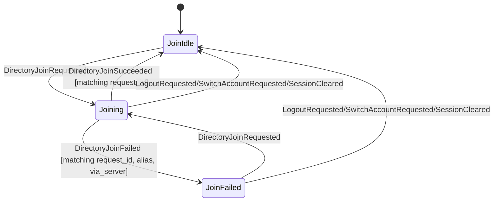

- `AppState.directory.query` carries `Closed`, `Querying`, `Results`, or
  `Failed`. Results include `DirectoryRoomSummary` rows, canonical alias when
  supplied by the homeserver, and an optional pagination token. React must not
  synthesize query completion, pagination, or failure state.
- `AppState.directory.join` carries `Idle`, `Joining`, or `Failed`. Join is
  alias-based; the SDK wrapper rejects bare room IDs for this directory flow.
  GUI code passes the canonical alias and optional server hint from the Rust
  directory result.
- Query and join actions are accepted only with a `Ready` session. Stale query
  completions are ignored unless their `request_id` matches the current
  `Querying` state. Join success is accepted only when its `request_id`
  matches the current `Joining` state; join failure is accepted only when its
  `request_id`, alias, and server hint match the current `Joining` state.
- `RoomActor` routes `RoomCommand::QueryDirectory` through the SDK public-room
  directory API and emits `RoomEvent::DirectoryQueryCompleted` on success.
  `RoomCommand::JoinDirectoryRoom` routes through SDK join-by-alias/server
  APIs and emits `RoomEvent::RoomJoined` on success. Failures are coarse
  `RoomFailureKind` / `OperationFailureKind` values only; raw SDK errors,
  aliases, server names, query text, and page tokens must not appear in Debug
  output or QA stdout.
- Logout, account switch, or session clear resets both submachines to
  `query=Closed` and `join=Idle`.
- Headless core QA covers this with the `directory` scenario and private-data-
  free tokens `directory_query=ok` and `directory_join=ok`.

## E2EE Trust, Verification, And Key Backup

Account-level E2EE trust UX is Rust-owned state in `AppState.e2ee_trust`.
React may render verification, cross-signing, key-backup, device-trust, and
identity-reset state, but it must not decide completion, retry, failure, or
trust semantics locally.

Verification flow:

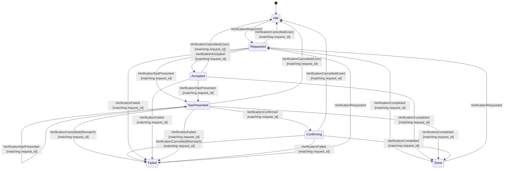

Cross-signing status:

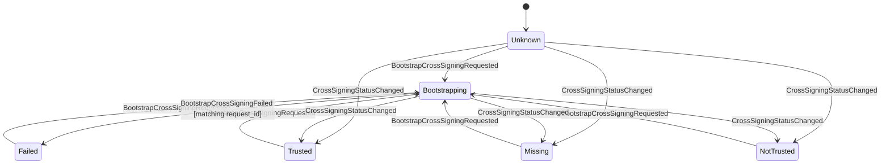

Key-backup status:

```mermaid
stateDiagram-v2
    [*] --> Unknown
    Unknown --> Enabling: EnableKeyBackupRequested
    Disabled --> Enabling: EnableKeyBackupRequested
    Failed --> Enabling: EnableKeyBackupRequested
    Enabled --> Enabling: EnableKeyBackupRequested
    Enabling --> Enabled: KeyBackupEnabled [matching request_id]
    Enabling --> Failed: KeyBackupFailed [matching request_id]
    Unknown --> Restoring: RestoreKeyBackupRequested
    Disabled --> Restoring: RestoreKeyBackupRequested
    Enabled --> Restoring: RestoreKeyBackupRequested
    Failed --> Restoring: RestoreKeyBackupRequested
    Restoring --> Restoring: KeyBackupRestoreProgress [matching request_id]
    Restoring --> Enabled: KeyBackupRestored(Some(version)) [matching request_id]
    Restoring --> Unknown: KeyBackupRestored(None) [matching request_id]
    Restoring --> Failed: KeyBackupFailed [matching request_id]
```

Identity reset:

```mermaid
stateDiagram-v2
    [*] --> Idle
    Idle --> Resetting: ResetIdentityRequested
    Failed --> Resetting: ResetIdentityRequested
    Resetting --> AwaitingAuth: ResetIdentityAuthRequired [matching request_id]
    AwaitingAuth --> Resetting: ResetIdentityAuthSubmitted [matching request_id]
    Resetting --> Idle: ResetIdentityCompleted [matching request_id]
    AwaitingAuth --> Idle: ResetIdentityCompleted [matching request_id]
    Resetting --> Failed: ResetIdentityFailed [matching request_id]
    AwaitingAuth --> Failed: ResetIdentityFailed [matching request_id]
```

- Every transition requires a Ready session unless it is a stale settle signal
  ignored from an already-reset state. Signed-out, restoring, locked, and
  logging-out states ignore E2EE trust actions.
- Session-view clearing transitions (`LogoutRequested`, `SessionLocked`,
  `SwitchAccountRequested`) reset `AppState.e2ee_trust` to its default
  private-data-free unknowns and emit `E2eeTrustChanged` when trust state was
  non-default. Verification targets from one account must not remain visible in
  snapshots for another account or a signed-out/locked surface.
- Verification start is accepted only when no verification is active
  (`Idle`, `Done`, or `Failed`). A second request while `Requested`,
  `Accepted`, `SasPresented`, or `Confirming` is ignored.
- All settle/progress actions are request-correlated. Stale request ids are
  ignored and must not clobber an active verification, cross-signing bootstrap,
  backup enable/restore, or identity reset.
- Verification cancellation carries a Rust-owned reason. User decline/cancel
  returns the flow to `Idle`; SAS mismatch sends the SDK's mismatched-SAS
  cancellation and settles the reducer as `Failed { kind: Mismatch }`.
- Verification follow-up commands carry both a command `request_id` and a
  verification `flow_id`. The reducer state's `request_id` field is the flow
  id used for stale-flow guards; command `request_id` remains only for command
  submission/failure correlation. Incoming SDK-originated verification requests
  use a reserved Rust-owned flow-id namespace, so React never synthesizes or
  owns verification discovery state.
- Incoming SDK-originated verification observations are idempotent by SDK
  flow id. `AccountActor` ignores duplicate observations for the active flow
  and only cancels/rejects a different incoming flow while another verification
  is active.
- SAS peer acceptance is decided from the SDK SAS state mapped into Rust, not
  from React state or SDK direction flags. `MatrixSasState::Started` is the
  peer side that must call the SDK SAS accept path; `Created` is the local side
  after `start_sas` and must not be auto-accepted.
- Same-user two-device SAS verification should keep the request direction
  A2 -> A and start SAS from the requester after the accepting device reaches
  `Accepted`. The accepting-device-start sequence reproduced Tuwunel
  `m.key_mismatch` cancellation before SAS presentation in local QA.
- The local proof starts the verification request while continuous sync is
  running so device data is fresh, then pauses both sync loops and drives SAS
  delivery with bounded `SyncOnce` polling. Do not overlap continuous
  SyncService delivery with manual `SyncOnce` nudges during SAS; that overlap
  reproduced pre-SAS key-mismatch flakes.
- Identity reset is a typed Rust-owned state machine
  (`Idle`, `Resetting`, `AwaitingAuth`, `Failed`), not a nullable pending flag.
  `AwaitingAuth` carries only a request id and coarse auth type
  (`uiaa`, `oauth`, or `unknown`). The SDK continuation handle remains private
  to `AccountActor` and is cancelled when the active account runtime is logged
  out, switched, or shut down. Auth continuation submission is also a
  `CoreCommand::Account` path projected through the reducer before actor
  routing. It carries a command `request_id` for submission/failure correlation
  and a Rust-owned identity-reset `flow_id` for stale-flow guards. React must
  read that `flow_id` from `AppState.e2ee_trust.identity_reset`; it must not
  call SDK/UIAA/OAuth continuation logic directly or synthesize local flow ids.
- Failure state carries only `TrustOperationFailureKind` (`cancelled`,
  `mismatch`, `network`, `forbidden`, `timeout`, `sdk`). Raw SDK errors,
  private keys, recovery secrets, room keys, and key-backup secrets never enter
  `AppState`, `CoreEvent`, `Debug`, or QA output.
- `CoreCommand::Account` owns the typed command surface:
  `RequestVerification`, `AcceptVerification`, `ConfirmSasVerification`,
  `CancelVerification`, `BootstrapCrossSigning`, `EnableKeyBackup`,
  `RestoreKeyBackup`, `ResetIdentity`, and `SubmitIdentityResetAuth`. These
  commands redact verification targets, backup versions, and auth secrets in
  `Debug`. Trust commands are ready-session gated except
  `RestoreKeyBackup`, which must also be accepted while the authenticated
  session is `NeedsRecovery` / `Recovering`; the `AccountActor` still enforces
  that a store-backed Matrix session exists.
- Phase B GUI controls are thin transport clients for that command surface.
  Tauri handlers allocate a fresh command `request_id`, pass the Rust-owned
  verification/identity-reset `flow_id` from the snapshot when required, and
  submit `CoreCommand::Account`; they must not call SDK wrappers directly or
  repair trust state in the adapter. Browser preview and Playwright harnesses
  may provide deterministic Rust-shaped `e2ee_trust` snapshots, but those
  fixtures must mirror the DTO shape rather than inventing React-only trust
  state.
- React trust UI must render `AppState.e2ee_trust` and dispatch typed
  commands only. Verification target user/device ids are not display labels;
  device rows should use private-data-free ordinal/status labels unless a
  later product decision explicitly introduces a redacted display model in
  Rust. SAS comparison UI may render the emoji symbols from Rust, but visible
  labels/status text must come from the i18n catalog.
- `RestoreKeyBackup` carries the secret-bearing recovery request only inside
  `CoreCommand::Account`; the projected `AppAction::RestoreKeyBackupRequested`,
  reducer effects, `CoreEvent`, and snapshots carry only request id, optional
  private-data-free backup version, and progress counters. React never receives
  or interprets the recovery secret.
- `EnableKeyBackup` may carry an optional passphrase `AuthSecret` only inside
  `CoreCommand::Account`; reducer actions, effects, events, snapshots, and logs
  must not expose the passphrase or the recovery key returned by the SDK.
- `BootstrapCrossSigning` may carry a UIAA password `AuthSecret` only inside
  `CoreCommand::Account`; reducer actions, effects, events, snapshots, and
  logs remain secret-free.
- Production `CoreCommand::Account` trust commands are projected through the
  reducer before actor routing. This is required even though the SDK work
  happens in `AccountActor`: pending state such as `Bootstrapping`,
  `Enabling`, and `Resetting` must be Rust-owned `AppState`, not React-local
  state inferred after button clicks.
- `CoreEvent::E2eeTrust` owns the typed event surface for verification
  progress, cross-signing status, key-backup status, and identity reset. The
  event payload is structured for UI consumption; event `Debug` redacts account
  keys and verification targets so QA output remains private-data-free.
- Device verification SDK handles are not reducer state. `AccountActor` owns
  the opaque `matrix-desktop-sdk` verification-request and SAS handles, observes
  their SDK state streams, and projects only reducer actions / typed
  `CoreEvent::E2eeTrust` updates. The frontend receives SAS emoji DTOs only
  after Rust observes `KeysExchanged`; React must not decide SAS readiness,
  completion, cancellation, or mismatch semantics locally.
- `AccountActor` SDK results settle the reducer with kind-only actions and emit
  typed `CoreEvent::E2eeTrust` updates. The SDK wrapper maps Matrix SDK
  cross-signing and backup states to app DTOs before they cross the
  core/state boundary. Until a public SDK backup-version accessor is used, an
  enabled backup may be surfaced as a private-data-free `available` version
  sentinel; local-homeserver proof must tighten this before issue closure.
- Current Phase A key-backup restore uses public SDK APIs only: import recovery
  secrets, then hydrate currently joined rooms through
  `Backups::download_room_keys_for_room`. `restored_rooms` / `total_rooms`
  describe that joined-room hydration set. The SDK's true backup-wide
  all-session one-shot download remains behind private internals, so the app
  must not claim exhaustive backup-wide restore until a public SDK API or
  reviewed vendored patch exists.
- Actor-side unavailable paths must also settle any already-projected pending
  trust state with the matching reducer failure action. `OperationFailed`
  alone is a transport error signal; it is not a state-machine transition.
- The local core QA `e2ee_trust` scenario is the Phase A proof for this
  contract on disposable homeservers. It exercises Rust-owned cross-signing
  bootstrap, encrypted seed-room backup upload, passphrase-backed key-backup
  enable, wrong-secret restore failure, successful passphrase restore on a
  second same-user device, two-device SAS verification, and identity reset
  before any GUI controls are considered complete. Run it on the probed
  SyncService core leg:
  `npm --prefix apps/desktop run qa:headless-local -- --server=conduit --scenario=e2ee_trust --core --core-backend=probed --timeout-ms=240000`.
  The runner registers separate synthetic users for the SDK lane and each core
  backend leg so the E2EE proof's account/device graph stays isolated.
- The fixture/demo backend reports E2EE trust effects as unavailable until the
  `AccountActor` SDK implementation lands. It must not silently discard those
  effects.

## Local Encryption Health

Local encryption and credential-store health are Rust-owned state in
`AppState.local_encryption`. React may render status and dispatch typed reset or
retry commands, but it must not inspect OS/keyring errors, decide fail-open
fallbacks, or recreate local keys.

```mermaid
stateDiagram-v2
    [*] --> Unknown
    Unknown --> Probing: LocalEncryptionProbeRequested
    Probing --> Healthy: LocalEncryptionHealthChanged(healthy) [matching request_id]
    Probing --> Unavailable: LocalEncryptionHealthChanged(unavailable) [matching request_id]
    Probing --> LockedOrInaccessible: LocalEncryptionHealthChanged(locked_or_inaccessible) [matching request_id]
    Probing --> MissingCredential: LocalEncryptionHealthChanged(missing_credential) [matching request_id]
    Probing --> ResetRequired: LocalEncryptionHealthChanged(reset_required) [matching request_id]
    Unavailable --> Probing: LocalEncryptionProbeRequested
    LockedOrInaccessible --> Probing: LocalEncryptionProbeRequested
    MissingCredential --> Probing: LocalEncryptionProbeRequested
    ResetRequired --> Resetting: ResetLocalDataRequested
    MissingCredential --> Resetting: ResetLocalDataRequested
    Resetting --> Unknown: ResetLocalDataCompleted [matching request_id]
    Resetting --> ResetRequired: ResetLocalDataFailed [matching request_id]
    Healthy --> Unknown: LogoutRequested/SwitchAccountRequested/SessionCleared
    Unavailable --> Unknown: LogoutRequested/SwitchAccountRequested/SessionCleared
    LockedOrInaccessible --> Unknown: LogoutRequested/SwitchAccountRequested/SessionCleared
    MissingCredential --> Unknown: LogoutRequested/SwitchAccountRequested/SessionCleared
    ResetRequired --> Unknown: LogoutRequested/SwitchAccountRequested/SessionCleared
    Probing --> Unknown: LogoutRequested/SwitchAccountRequested/SessionCleared
    Resetting --> Unknown: LogoutRequested/SwitchAccountRequested/SessionCleared
```

- The coarse health states are exactly `unknown`, `healthy`, `unavailable`,
  `locked_or_inaccessible`, `missing_credential`, and `reset_required`.
- Probes are accepted after the account runtime is ready and on explicit retry.
  GUI code requests a probe through the typed `probe_local_encryption_health`
  command; it never reads OS/keyring errors directly.
- Commands that open encrypted SDK/search storage fail closed inside the
  StoreActor/credential backend path. `AppState.local_encryption` is the
  public coarse status projection for UI and QA, not a React-side authorization
  switch.
- Health and reset completions carry a request id owned by Rust. Stale
  completions and duplicate completions are ignored; logout, lock, and account
  switch clear any account-specific health state before another account can
  observe it.
- `reset_local_data` is a typed Rust command. `AccountActor` stops
  session-owned children, drops the current SDK session handle inside the Tokio
  runtime context, asks `StoreActor` to clear the current account's session
  JSON, saved-session index entry, last-session pointer, unlock secret, and
  local store/search directories, then projects `ResetLocalDataCompleted` plus
  a local signed-out snapshot. React never maps this action to a UI-only logout
  or store cleanup path.
- Failure behavior is fail-closed. Public state stores only kind-only failure
  data; raw OS/keyring errors, local paths, keys, and recovery material never
  enter `AppState`, `CoreEvent`, `Debug`, or QA tokens.
- Logout, lock, account switch, and local-data removal clear account-scoped
  health to `Unknown` and cancel pending probe/reset correlation. Platform
  capability facts may be recomputed after the next startup/login probe.

## Account Activity

Account-wide Recent/Unread Activity is a Rust-owned state machine. It may be
rendered by React as tabs or a rail, but the list membership, ordering,
low-priority exclusion, unread clearing, and focused-context references are
computed before the GUI layer.

```mermaid
stateDiagram-v2
    [*] --> Closed
    Closed --> Opening: OpenActivity
    Opening --> Open: ActivitySnapshotLoaded [matching request_id]
    Opening --> Closed: CloseActivity
    Open --> Open: SetActivityTab
    Open --> Open: ActivityRowsUpdated
    Open --> Open: PaginateActivity/ActivitySnapshotLoaded
    Open --> MarkReadPending: MarkActivityRead(room|all)
    MarkReadPending --> Open: ActivityMarkReadSucceeded [matching request_id]
    MarkReadPending --> Open: ActivityMarkReadFailed [matching request_id]
    Open --> Closed: CloseActivity
```

- Accepted inputs are `ActivityRowsObserved` from room `TimelineActor`s, room
  unread/highlight counts, room tag facts, explicit Activity commands, and
  request-correlated Activity completions. Thread and focused timelines do not
  duplicate account-wide Activity rows; the room live timeline is the source.
- `AppActor` owns the Activity projection cache. It fills safe room labels,
  unread/highlight flags, and low-priority exclusions from `AppState`; React
  must not infer Activity rows from timeline DOM, browser-local state, or IPC
  mock convenience data.
- Recent and Unread are separate `ActivityStream`s. Changing tabs only updates
  `active_tab`; viewing Unread does not mark rows read. Mark-read commands
  transition the Rust `mark_read` substate to pending, then clear projection
  rows only after a matching success action. Any future SDK fully-read side
  effect must remain behind this typed command path.
- `ActivityRow` carries event references so the GUI can dispatch a focused
  context open without inventing navigation semantics. QA tokens and logs must
  not print room IDs, event IDs, sender IDs, message previews, pagination
  tokens, or raw SDK errors.
- Logout, lock, account switch, and session clearing close Activity and discard
  account-derived rows. Non-secret UI preferences such as the last selected tab
  may be remembered only if they are not coupled to room or event identity.

## Native Attention

Native notifications, badges, title hints, sounds, tray state, and activation
requests are Rust-owned attention decisions in `AppState.native_attention`.
React may render settings and visible affordances, but it must not decide
whether a Matrix event should notify, badge, suppress, dedupe, or clear.

```mermaid
stateDiagram-v2
    [*] --> Idle
    Idle --> Candidate: AttentionCandidateRaised
    Candidate --> Candidate: AttentionCandidateUpdated
    Candidate --> Suppressed: AttentionSuppressed
    Candidate --> Dispatching: NativeAttentionDispatchRequested
    Dispatching --> Delivered: NativeAttentionDelivered [matching request_id]
    Dispatching --> Failed: NativeAttentionFailed [matching request_id]
    Delivered --> Idle: AttentionCleared/RoomMarkedRead/WindowFocused
    Suppressed --> Idle: AttentionCleared/RoomMarkedRead/WindowFocused
    Failed --> Idle: AttentionCleared/RoomMarkedRead/WindowFocused
    Candidate --> Idle: AttentionCleared/RoomMarkedRead/WindowFocused
    Dispatching --> Idle: AttentionCleared/RoomMarkedRead/WindowFocused
```

- Accepted inputs are Rust-owned room/timeline activity observations,
  notification settings changes, room muted/low-priority state changes, window
  focus changes, mark-read/read-receipt actions, platform capability updates,
  and dispatch completion/failure events from the Tauri adapter.
- Notification policy enters this machine through Rust-owned
  `SettingsValues.notifications`, persisted by the settings store with legacy
  JSON backfill to the default policy. React settings panels may dispatch typed
  `SettingsPatch.notifications` updates, but they must not keep separate
  notification policy state.
- Platform capability updates use the shared Rust `DisplayPlatform` model.
  React receives the resulting `NativeAttentionCapabilities` DTO and must not
  branch on macOS/Linux/Windows notification semantics locally.
- Windows taskbar overlay icon routing is represented by the
  `overlay_icon` capability, separate from generic badge count capability.
- The Phase A core projection is `native_attention_state_from_rooms`. It
  aggregates unread/highlight counts from eligible rooms, excludes low-priority
  and muted rooms, prefers `mention` over `dm` over `message` candidates,
  suppresses initial sync/backfill/self/focused-room observations, suppresses
  duplicate candidates, and clears badge/candidate state when unread attention
  reaches zero.
- Candidates carry only private-data-minimized fields allowed by the security
  rules: safe room display label, attention kind (`mention`, `dm`, `message`),
  aggregate unread/highlight counts, and coarse capability tokens. They must not
  carry message bodies, sender identifiers, room IDs, event IDs, transaction IDs,
  raw SDK errors, or secrets.
- The safe room display label comes from `RoomSummary.display_label`. When a
  profile or local-alias change relabels a room, the Rust reducer refreshes the
  current candidate label from `state.rooms`; React must not attach room IDs to
  candidates or recompute notification policy to repair labels.
- Candidate generation, dedupe, suppression while focused, badge count, sound
  eligibility, tray visibility, and activation behavior are reducer/core
  semantics. Platform adapters only map candidates to macOS, Windows, Linux, or
  no-op capabilities.
- Persistent adapter effects such as window title, badge count, Windows overlay,
  tray count, and zero-badge notification clearing follow the Rust-owned
  snapshot state. Transient sound and activation effects are scoped to a
  Rust-owned notification candidate; they must not fire again merely because a
  later snapshot still has unread or badge state.
- Notification sound policy is `SettingsValues.notifications.sound`. React may
  pass that Rust-owned setting into transient adapter routing to skip sound, but
  must not keep a separate notification preference or alter
  `NativeAttentionState` locally.
- Space attention for the workspace rail is projected by Rust
  `SidebarModel.space_rail`; React renders those unread/highlight counts without
  recomputing child-room state. Timeline thread summary chips render
  Rust-projected row `thread_summary` DTOs. Pane-level thread attention renders
  `AppState.thread_attention`, mirrored through the Tauri/TypeScript DTO; React
  must not synthesize it by scanning visible thread rows.
- Passive platform dispatch must not trigger native notification permission
  prompts. Adapters may check already-granted permission and no-op otherwise;
  prompts require an explicit user/onboarding action and a corresponding
  Rust-owned setting/permission transition.
- When Rust-owned attention state clears unread badge state to zero, the GUI may
  ask the native adapter to cancel/remove pending or active notifications as a
  best-effort side effect. Adapter clear failures do not feed back into Matrix
  state and cannot change read/focus semantics.
- Dispatch completions are request-correlated. Stale dispatch results are
  ignored, and adapter failures settle as private-data-free `Failed(kind)`
  states that can be cleared by read/focus transitions.
- Logout, lock, account switch, and session clearing remove all account-derived
  summaries, candidates, and badge counts. Non-secret platform capability data
  may survive as a process-level profile, but it cannot carry account activity.

## Japanese/CJK Display And Search

Japanese catalog completeness, CJK normalization, CJK collation, search/display
matching, and IME send-vs-commit behavior are Rust-owned contracts. GUI code
may render the resolved locale/search policy and pass typed key facts, but it
must not choose catalog fallback, sort keys, normalization, highlight offsets, or
whether an IME composition keypress sends a message.

```mermaid
stateDiagram-v2
    [*] --> Unresolved
    Unresolved --> Resolved: LocaleProfileResolved/CjkPolicyResolved
    Resolved --> Resolved: SettingsLoaded/SettingsUpdateRequested/CjkPolicyResolved
    Resolved --> Failed: CjkPolicyFailed
    Failed --> Resolved: LocaleProfileResolved/CjkPolicyResolved
    Resolved --> Unresolved: SessionCleared
    Failed --> Unresolved: SessionCleared
```

- `ja-*` resolves to a Japanese catalog selector in Rust. A Japanese catalog may
  intentionally fall back to English only when the catalog registry records the
  missing IDs; silent component-local English strings are defects.
- Accepted inputs are settings/profile updates, catalog coverage results,
  CJK policy resolution results, search submissions/results, and typed composer
  key facts from any composer surface. Search queries and message bodies stay
  outside diagnostics even when they trigger policy failures.
- CJK normalization, collation keys for room/person ordering, and search
  comparison policy are produced by Rust-owned profile data. React receives sort
  order, display strings, snippets, and verified highlight spans; it does not
  tokenize Japanese text, generate search candidates, or compute collation.
- Composer key evaluation accepts typed key facts, including `is_composing`.
  When `is_composing` is true, Enter-like keys are treated as IME commit input
  and must not send, insert a product newline, accept autocomplete, or close a
  composer. React must not fall back to local send behavior if the Rust resolver
  fails. Because the resolver crosses async IPC, GUI handlers must not prevent
  the native browser default for `is_composing` key events; candidate commit is
  the platform/editor default, while Rust still owns the app-level action.
- Composer send intent is also Rust-owned. GUI code may pass typed draft,
  mention, and selection facts only; Rust builds the final message content:
  `MentionIntent` becomes Matrix `m.mentions`, supported markdown becomes a
  plain body plus safe HTML formatted body, `/me` becomes an emote message, and
  unsupported slash commands fail locally as `UnsupportedSlashCommand` before
  a submitted composer transaction clears draft state.
- Mention autocomplete candidates are Rust-owned profile/member DTOs. React may
  show the popover, track selected draft pills, and pass a typed
  `MentionIntent`; it must not synthesize Matrix mention content, infer members
  from rendered timeline text, or repair send behavior if the Rust resolver
  returns `noop`/failure.
- Timeline mention pills are presentation over Rust-owned timeline body text
  and Rust-owned `ProfileState.users`. They do not create, modify, or infer
  Matrix `m.mentions`; send semantics remain in the Rust composer path.
- CJK policy updates carry a generation or request id. Stale profile/search
  results for an older locale/settings generation are ignored.
- Failure behavior falls back to safe default display/search policy with a
  private-data-free error kind. Raw locale input, search query text, message
  bodies, snippets from real accounts, and raw normalization errors must not be
  logged or emitted as diagnostics.
- Logout and account switch clear account-scoped search and composer context.
  Device-local locale settings and non-secret resolved profile data may remain,
  but any pending search result, autocomplete, or composer resolution tied to the
  previous account is ignored.

## Backup Restore Scope

Key-backup restore progress is Rust-owned and request-correlated. The current
MVP scope is recovery secret import plus currently joined-room key hydration.
The app must not claim exhaustive backup-wide restore until the SDK exposes a
public API for that broader scope or a reviewed vendored patch lands.

```mermaid
stateDiagram-v2
    [*] --> Idle
    Idle --> ImportingRecoverySecret: RestoreKeyBackupRequested
    ImportingRecoverySecret --> HydratingJoinedRooms: RecoverySecretImported [matching request_id]
    HydratingJoinedRooms --> HydratingJoinedRooms: JoinedRoomHydrationProgress [matching request_id]
    HydratingJoinedRooms --> CompletedJoinedRooms: JoinedRoomHydrationCompleted [matching request_id]
    ImportingRecoverySecret --> Failed: KeyBackupRestoreFailed [matching request_id]
    HydratingJoinedRooms --> Failed: KeyBackupRestoreFailed [matching request_id]
    CompletedJoinedRooms --> ImportingRecoverySecret: RestoreKeyBackupRequested
    Failed --> ImportingRecoverySecret: RestoreKeyBackupRequested
    ImportingRecoverySecret --> Idle: LogoutRequested/SwitchAccountRequested/SessionCleared
    HydratingJoinedRooms --> Idle: LogoutRequested/SwitchAccountRequested/SessionCleared
    CompletedJoinedRooms --> Idle: LogoutRequested/SwitchAccountRequested/SessionCleared
    Failed --> Idle: LogoutRequested/SwitchAccountRequested/SessionCleared
```

- `RestoreKeyBackupRequested` is accepted for a Ready, `NeedsRecovery`, or
  `Recovering` authenticated session with an encrypted store-backed SDK client.
  The recovery secret stays inside `CoreCommand::Account` / `AccountActor` and
  never enters reducer state or snapshots.
- Progress counters describe the joined-room hydration set only:
  `restored_rooms` / `total_rooms` are not backup-wide counts. Product copy,
  issue evidence, and QA tokens must use "joined-room restore" language unless
  a later implementation proves broader semantics. The SDK adapter summary
  exposes this as `KeyBackupRestoreSummary.scope = JoinedRooms`; any broader
  scope needs a new explicit enum value plus upstream/API rationale.
- Restore events are request-correlated. Stale progress, duplicate completions,
  and completions from an account that is no longer active are ignored.
- Failure behavior emits only `TrustOperationFailureKind` or a restore-specific
  kind-only failure. Raw backup versions, room keys, recovery secrets, room IDs,
  event IDs, and SDK errors remain private.
- Logout, lock, account switch, and account shutdown cancel in-flight restore
  handles, clear progress to `Idle`, and drop secret material inside the actor.
  React cannot repair or complete restore state after those transitions.

## Search

```mermaid
stateDiagram-v2
    [*] --> Closed
    Closed --> Editing: SearchEdited
    Editing --> Searching: SearchSubmitted
    Searching --> Results: SearchSucceeded
    Searching --> Failed: SearchFailed
    Results --> Editing: SearchEdited
    Failed --> Editing: SearchEdited
    Searching --> Editing: SearchEdited
```

- Search has editing, searching, results, and failed states.
- Search responses carry a `request_id`.
- Responses whose `request_id` does not match the active searching state are
  ignored.
- If the user edits the query while a search is in flight, the in-flight response
  is ignored because the state is no longer `Searching`.
- Submitting a search emits both the backend search request and `SearchChanged`
  so the UI can display the loading state immediately.
- Snippet text and highlight ranges are DTO fields produced by a future search
  adapter, not by the reducer.

The ngram index is a candidate generator, not the source of display truth. Before
returning a result, the search adapter must run a second-pass verification over
the resolved visible body or snippet. Only verified exact spans are returned as
highlight ranges. Ngram candidates without a verified span are dropped from the
default search result set.

Highlight ranges are half-open UTF-16 code unit offsets relative to the returned
snippet so the frontend can apply them without re-tokenizing Japanese text or
emoji. Future fuzzy or related-message search must use a different
`SearchMatchKind` and a different visual treatment from exact highlights.

Attachment filenames are searchable, but they are not treated as message-body
matches. The search adapter indexes the resolved visible filename for file-like
events and returns `SearchMatchField::AttachmentFileName` when the verified span
is in that filename. In that case, `snippet` is the filename, highlight ranges
are relative to the filename, and the UI should render the result as a file
match with a file affordance. The click target remains the Matrix event that
contains the attachment.

Redacted attachments are not searchable. If a file event is edited or replaced,
the adapter indexes only the resolved visible filename. File contents are out of
scope for this search contract; only filenames participate.

Edited, redacted, or replaced Matrix events must be resolved before producing a
search result. The reducer stores only the search adapter's result snapshot; it
does not decide whether an older event body, an edited body, or a redaction tombstone
is visible.

Matrix edit events may be downloaded before the event they replace. The search
adapter must store such edits as pending relations keyed by the target event ID,
not as standalone searchable messages. If a search runs before the target event
has been downloaded, the adapter may either omit that pending edit from results
or synchronously repair the gap by fetching the target event first. It must not
return the edit event as if it were an independent room message.

When the missing target event later arrives, the adapter applies the pending edit
and indexes the resolved visible body for the target event. This can create a
temporary false negative for edited text, but avoids showing duplicated,
misordered, or non-visible edit events. Search results that depend on an
incomplete local index should be treated as partial until the indexer catches up.

Search timeline display must be treated as a focused result view, not as a normal
room timeline. It should avoid implying that search results are a complete
chronological timeline unless the backend explicitly provides enough surrounding
context and replacement/redaction state to render that context safely.

## Appearance / Theme Ownership

Theme *appearance* is split deliberately:

- **OS-follow theming is presentation-only.** The dark token set is applied by
  `@media (prefers-color-scheme: dark)` in `styles.css`. No React or Rust state
  participates; nothing is dispatched, nothing is stored.
- **An explicit user theme choice (`system | light | dark`) is product state**
  and is therefore Rust-owned in `SettingsState`. React applies it by setting
  `data-theme` / `color-scheme` on the root element; the CSS
  `:root[data-theme="dark"]` block exists for this. React must not store the
  chosen theme as its own product state.

Selection, unread, reply, thread, search, and right-panel modes remain
Rust-owned (`AppState.navigation`, `rooms[].unread_count`/`highlight_count`,
`timeline.composer.mode`, `thread`, `search`, right-panel mode).

## Settings

Settings are Rust-owned product state and are not gated by a Ready session.
They affect signed-out and signed-in UI surfaces such as language, text
direction, appearance/theme, font/emoji choice, and composer send shortcut.
React renders `AppState.settings` and dispatches typed settings commands; it
must not store these preferences as product state in localStorage or component
state.

```mermaid
stateDiagram-v2
    [*] --> Idle
    Idle --> Idle: SettingsLoaded
    Idle --> Idle: SettingsLoadFailed
    Idle --> Saving: SettingsUpdateRequested
    Saving --> Saving: SettingsUpdateRequested [replacement]
    Saving --> Idle: SettingsPersisted [matching request_id]
    Saving --> Idle: SettingsPersistFailed [matching request_id]
```

- Settings load failure keeps safe defaults and records a private-data-free
  recoverable error.
- Settings updates are optimistic: the reducer applies the typed patch before
  persistence completes, records the latest saving request id, and ignores stale
  persist completions.
- Composer send shortcut behavior is resolved by the pure Rust-owned
  `matrix-desktop-state` composer resolver for main, thread, and edit composer
  surfaces. GUI code may normalize DOM/native key input into the resolver's
  typed key facts; it must not reimplement Enter, Shift+Enter, Mod+Enter,
  autocomplete acceptance, or cancel semantics as product logic.
- Font and emoji display behavior is resolved by
  `matrix_desktop_state::resolve_typography_display_profile`. GUI code may
  apply the resulting `TypographyDisplayProfile` tokens to root attributes and
  CSS variables, but it must not choose Inter/Twemoji/system fallback semantics
  locally or branch per component/OS.
- Persist failures do not roll back the in-memory product state. They clear the
  pending save and record a recoverable error so the UI can surface retry/status
  later without inventing product semantics.
- Settings values are non-secret by construction. They must never include
  access tokens, refresh tokens, passwords, recovery material, SDK store keys,
  search index keys, local unlock secrets, raw homeserver credentials, raw
  Matrix session JSON, message bodies, attachment filenames, room IDs, event
  IDs, user IDs, or raw SDK errors.
