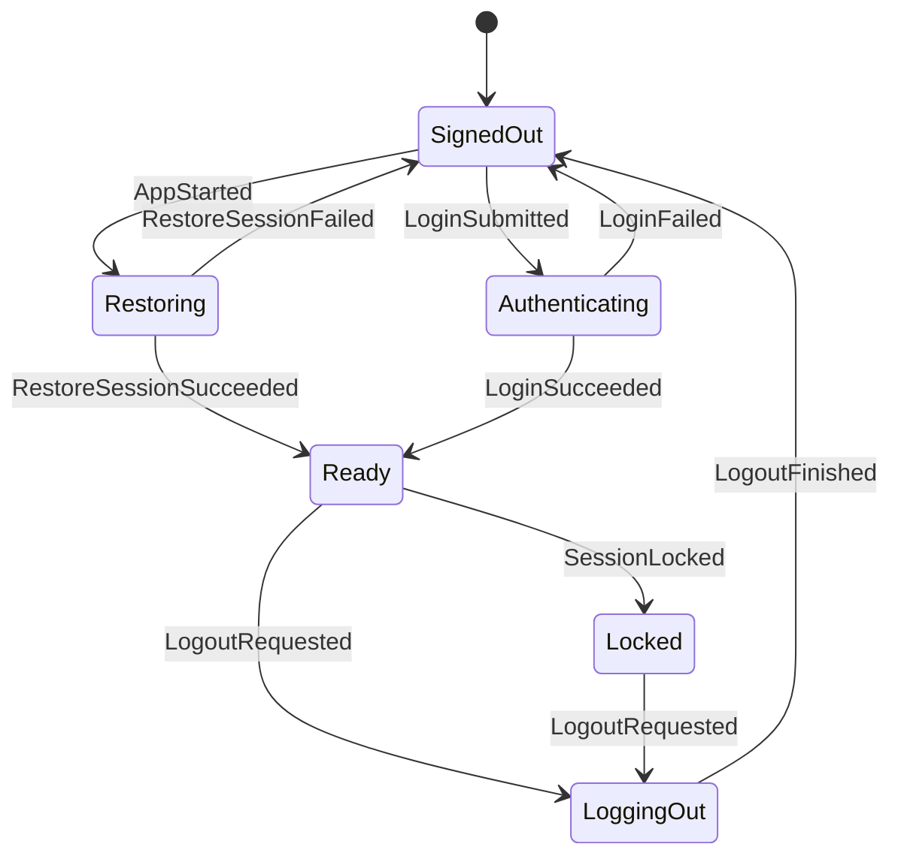
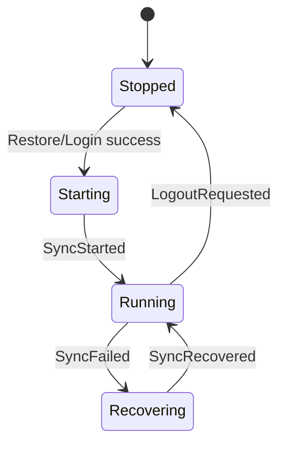

# State Machine Foundation Implementation Plan

Status: historical plan. The current production runtime architecture is
documented in `docs/architecture/overview.md`; this file records the foundation
work before the headless core runtime.

> **Historical execution note:** this plan originally required `superpowers:subagent-driven-development` or `superpowers:executing-plans` for task-by-task implementation. It is no longer the active implementation plan.

**Goal:** Build a pure Rust application state machine that defines the Matrix desktop client's session, sync, navigation, timeline, thread, and search transitions before adding Tauri or React integration.

**Architecture:** Add a production Rust crate, `koushi-state`, with no Matrix SDK or Tauri dependency. The crate exposes serializable state DTOs, user/SDK actions, and effect requests; a pure reducer maps `AppAction` into mutated `AppState` plus `AppEffect` values that the planned Tauri backend would execute. Sidebar composition and key-management spike findings are folded into the state model without copying SDK objects into UI state.

**Tech Stack:** Rust 2024, Cargo workspace, serde, table-driven reducer tests, Mermaid state-machine documentation.

---

## Scope

This plan intentionally does not build the Tauri shell, React UI, Matrix SDK client wiring, or live homeserver integration. It creates the state contract those layers will consume:

1. Session and sync lifecycle.
2. Space/room/DM navigation state.
3. Timeline and thread pane state.
4. Search request/result state with stale-result rejection.
5. Reducer effects that the planned command runners at this stage would execute.

The reducer must stay deterministic and testable without network access or OS credential-store access.

## Planned File Structure

```text
matrix-desktop/
  Cargo.toml
  crates/
    koushi-state/
      Cargo.toml
      src/
        action.rs
        effect.rs
        lib.rs
        reducer.rs
        sidebar.rs
        state.rs
      tests/
        navigation_state.rs
        search_state.rs
        session_state.rs
        timeline_thread_state.rs
  docs/
    architecture/
      state-machine.md
    superpowers/plans/
      2026-06-11-state-machine-foundation.md
```

## Task 1: Scaffold the State Crate

**Files:**
- Modify: `Cargo.toml`
- Create: `crates/koushi-state/Cargo.toml`
- Create: `crates/koushi-state/src/lib.rs`

- [ ] **Step 1: Add the production crate to the workspace**

Modify the root `Cargo.toml`:

```toml
[workspace]
members = [
    "crates/koushi-state",
    "spikes/sidebar-composition",
    "spikes/key-management",
]
resolver = "2"
```

- [ ] **Step 2: Create the crate manifest**

Create `crates/koushi-state/Cargo.toml`:

```toml
[package]
name = "koushi-state"
version = "0.1.0"
edition = "2024"
license = "MIT"

[dependencies]
serde = { version = "1", features = ["derive"] }
```

- [ ] **Step 3: Create the initial crate root**

Create `crates/koushi-state/src/lib.rs`:

```rust
pub const CRATE_NAME: &str = "koushi-state";
```

- [ ] **Step 4: Run check**

Run:

```bash
cargo check -p koushi-state
```

Expected: PASS.

- [ ] **Step 5: Commit the scaffold**

Run:

```bash
git add Cargo.toml crates/koushi-state/Cargo.toml crates/koushi-state/src/lib.rs
git commit -m "Add state machine crate scaffold"
```

Expected: commit succeeds.

## Task 2: Define State, Actions, Effects, and Sidebar Composition

**Files:**
- Modify: `crates/koushi-state/src/lib.rs`
- Create: `crates/koushi-state/src/state.rs`
- Create: `crates/koushi-state/src/action.rs`
- Create: `crates/koushi-state/src/effect.rs`
- Create: `crates/koushi-state/src/sidebar.rs`
- Create: `crates/koushi-state/src/reducer.rs`

- [ ] **Step 1: Replace the crate root with public modules**

Replace `crates/koushi-state/src/lib.rs`:

```rust
pub mod action;
pub mod effect;
pub mod reducer;
pub mod sidebar;
pub mod state;

pub use action::AppAction;
pub use effect::{AppEffect, UiEvent};
pub use reducer::reduce;
pub use sidebar::{SidebarModel, SpaceRailItem, compose_sidebar};
pub use state::{
    AppError, AppState, ComposerState, NavigationState, RoomSummary, SearchResult, SearchScope,
    SearchState, SessionInfo, SessionState, SpaceSummary, SyncState, ThreadPaneState,
    TimelinePaneState,
};
```

- [ ] **Step 2: Create state types**

Create `crates/koushi-state/src/state.rs`:

```rust
use serde::{Deserialize, Serialize};

#[derive(Clone, Debug, Eq, PartialEq, Serialize, Deserialize)]
pub struct AppState {
    pub session: SessionState,
    pub sync: SyncState,
    pub navigation: NavigationState,
    pub spaces: Vec<SpaceSummary>,
    pub rooms: Vec<RoomSummary>,
    pub timeline: TimelinePaneState,
    pub thread: ThreadPaneState,
    pub search: SearchState,
    pub errors: Vec<AppError>,
}

impl Default for AppState {
    fn default() -> Self {
        Self {
            session: SessionState::SignedOut,
            sync: SyncState::Stopped,
            navigation: NavigationState::default(),
            spaces: Vec::new(),
            rooms: Vec::new(),
            timeline: TimelinePaneState::default(),
            thread: ThreadPaneState::Closed,
            search: SearchState::Closed,
            errors: Vec::new(),
        }
    }
}

#[derive(Clone, Debug, Eq, PartialEq, Serialize, Deserialize)]
pub enum SessionState {
    SignedOut,
    Restoring,
    Authenticating { homeserver: String },
    Ready(SessionInfo),
    Locked(SessionInfo),
    LoggingOut,
}

#[derive(Clone, Debug, Eq, PartialEq, Serialize, Deserialize)]
pub struct SessionInfo {
    pub homeserver: String,
    pub user_id: String,
    pub device_id: String,
}

#[derive(Clone, Debug, Eq, PartialEq, Serialize, Deserialize)]
pub enum SyncState {
    Stopped,
    Starting,
    Running,
    Recovering { reason: String },
}

#[derive(Clone, Debug, Default, Eq, PartialEq, Serialize, Deserialize)]
pub struct NavigationState {
    pub active_space_id: Option<String>,
    pub active_room_id: Option<String>,
}

#[derive(Clone, Debug, Eq, PartialEq, Serialize, Deserialize)]
pub struct SpaceSummary {
    pub space_id: String,
    pub display_name: String,
    pub child_room_ids: Vec<String>,
}

#[derive(Clone, Debug, Eq, PartialEq, Serialize, Deserialize)]
pub struct RoomSummary {
    pub room_id: String,
    pub display_name: String,
    pub is_dm: bool,
    pub unread_count: u64,
    pub parent_space_ids: Vec<String>,
}

#[derive(Clone, Debug, Default, Eq, PartialEq, Serialize, Deserialize)]
pub struct TimelinePaneState {
    pub room_id: Option<String>,
    pub is_subscribed: bool,
    pub is_paginating_backwards: bool,
    pub composer: ComposerState,
}

#[derive(Clone, Debug, Default, Eq, PartialEq, Serialize, Deserialize)]
pub struct ComposerState {
    pub pending_transaction_id: Option<String>,
    pub draft: String,
}

#[derive(Clone, Debug, Eq, PartialEq, Serialize, Deserialize)]
pub enum ThreadPaneState {
    Closed,
    Opening { room_id: String, root_event_id: String },
    Open {
        room_id: String,
        root_event_id: String,
        is_subscribed: bool,
        composer: ComposerState,
    },
}

#[derive(Clone, Debug, Eq, PartialEq, Serialize, Deserialize)]
pub enum SearchState {
    Closed,
    Editing { query: String, scope: SearchScope },
    Searching {
        request_id: u64,
        query: String,
        scope: SearchScope,
    },
    Results {
        request_id: u64,
        query: String,
        scope: SearchScope,
        results: Vec<SearchResult>,
    },
    Failed {
        request_id: u64,
        query: String,
        scope: SearchScope,
        message: String,
    },
}

#[derive(Clone, Debug, Eq, PartialEq, Serialize, Deserialize)]
pub enum SearchScope {
    CurrentRoom { room_id: String },
    CurrentSpace { space_id: String },
    Dms,
    AllRooms,
}

#[derive(Clone, Debug, Eq, PartialEq, Serialize, Deserialize)]
pub struct SearchResult {
    pub room_id: String,
    pub event_id: String,
    pub sender: String,
    pub timestamp_ms: u64,
    pub score_millis: u32,
    pub snippet: String,
}

#[derive(Clone, Debug, Eq, PartialEq, Serialize, Deserialize)]
pub struct AppError {
    pub code: String,
    pub message: String,
    pub recoverable: bool,
}
```

- [ ] **Step 3: Create action types**

Create `crates/koushi-state/src/action.rs`:

```rust
use serde::{Deserialize, Serialize};

use crate::state::{RoomSummary, SearchResult, SearchScope, SessionInfo, SpaceSummary};

#[derive(Clone, Debug, Eq, PartialEq, Serialize, Deserialize)]
pub enum AppAction {
    AppStarted,
    RestoreSessionSucceeded(SessionInfo),
    RestoreSessionFailed { message: String },
    LoginSubmitted { homeserver: String, username: String },
    LoginSucceeded(SessionInfo),
    LoginFailed { message: String },
    SessionLocked,
    LogoutRequested,
    LogoutFinished,
    SyncStarted,
    SyncFailed { reason: String },
    SyncRecovered,
    SyncStopped,
    RoomListUpdated {
        spaces: Vec<SpaceSummary>,
        rooms: Vec<RoomSummary>,
    },
    SelectSpace { space_id: Option<String> },
    SelectRoom { room_id: String },
    TimelineSubscribed { room_id: String },
    TimelineSubscriptionFailed { room_id: String, message: String },
    ComposerDraftChanged { room_id: String, draft: String },
    SendTextSubmitted {
        room_id: String,
        transaction_id: String,
        body: String,
    },
    SendTextFinished { room_id: String, transaction_id: String },
    OpenThread { room_id: String, root_event_id: String },
    ThreadSubscribed { room_id: String, root_event_id: String },
    CloseThread,
    SearchEdited { query: String, scope: SearchScope },
    SearchSubmitted { request_id: u64, query: String, scope: SearchScope },
    SearchSucceeded { request_id: u64, results: Vec<SearchResult> },
    SearchFailed { request_id: u64, message: String },
    ClearError { code: String },
}
```

- [ ] **Step 4: Create effect types**

Create `crates/koushi-state/src/effect.rs`:

```rust
use serde::{Deserialize, Serialize};

use crate::state::{SearchScope, SessionInfo};

#[derive(Clone, Debug, Eq, PartialEq, Serialize, Deserialize)]
pub enum AppEffect {
    RestoreSession,
    Login { homeserver: String, username: String },
    PersistSession(SessionInfo),
    ClearSession,
    StartSync,
    StopSync,
    SubscribeTimeline { room_id: String },
    SendText {
        room_id: String,
        transaction_id: String,
        body: String,
    },
    OpenThreadTimeline { room_id: String, root_event_id: String },
    SearchMessages {
        request_id: u64,
        query: String,
        scope: SearchScope,
    },
    EmitUiEvent(UiEvent),
}

#[derive(Clone, Debug, Eq, PartialEq, Serialize, Deserialize)]
pub enum UiEvent {
    SessionChanged,
    RoomListChanged,
    TimelineChanged { room_id: String },
    ThreadChanged,
    SearchChanged,
    ErrorChanged,
}
```

- [ ] **Step 5: Create sidebar composition**

Create `crates/koushi-state/src/sidebar.rs`:

```rust
use std::collections::HashMap;

use serde::{Deserialize, Serialize};

use crate::state::{RoomSummary, SpaceSummary};

#[derive(Clone, Debug, Eq, PartialEq, Serialize, Deserialize)]
pub struct SidebarModel {
    pub active_space_id: Option<String>,
    pub space_rail: Vec<SpaceRailItem>,
    pub space_rooms: Vec<RoomListItem>,
    pub global_dms: Vec<RoomListItem>,
    pub space_unread_count: u64,
    pub dm_unread_count: u64,
}

#[derive(Clone, Debug, Eq, PartialEq, Serialize, Deserialize)]
pub struct SpaceRailItem {
    pub space_id: String,
    pub display_name: String,
    pub unread_count: u64,
    pub is_active: bool,
}

#[derive(Clone, Debug, Eq, PartialEq, Serialize, Deserialize)]
pub struct RoomListItem {
    pub room_id: String,
    pub display_name: String,
    pub unread_count: u64,
}

pub fn compose_sidebar(
    active_space_id: Option<&str>,
    spaces: &[SpaceSummary],
    rooms: &[RoomSummary],
) -> SidebarModel {
    let rooms_by_id: HashMap<&str, &RoomSummary> =
        rooms.iter().map(|room| (room.room_id.as_str(), room)).collect();

    let space_rail = spaces
        .iter()
        .map(|space| SpaceRailItem {
            space_id: space.space_id.clone(),
            display_name: space.display_name.clone(),
            unread_count: space_unread_count(space, &rooms_by_id),
            is_active: active_space_id == Some(space.space_id.as_str()),
        })
        .collect();

    let space_rooms = active_space_id
        .and_then(|space_id| spaces.iter().find(|space| space.space_id == space_id))
        .map(|space| {
            space
                .child_room_ids
                .iter()
                .filter_map(|room_id| rooms_by_id.get(room_id.as_str()).copied())
                .filter(|room| !room.is_dm)
                .map(room_list_item)
                .collect()
        })
        .unwrap_or_else(|| {
            rooms
                .iter()
                .filter(|room| !room.is_dm && room.parent_space_ids.is_empty())
                .map(room_list_item)
                .collect()
        });

    let global_dms: Vec<_> = rooms.iter().filter(|room| room.is_dm).map(room_list_item).collect();

    SidebarModel {
        active_space_id: active_space_id.map(str::to_owned),
        space_unread_count: unread_count(&space_rooms),
        dm_unread_count: unread_count(&global_dms),
        space_rail,
        space_rooms,
        global_dms,
    }
}

fn space_unread_count(space: &SpaceSummary, rooms_by_id: &HashMap<&str, &RoomSummary>) -> u64 {
    space
        .child_room_ids
        .iter()
        .filter_map(|room_id| rooms_by_id.get(room_id.as_str()).copied())
        .filter(|room| !room.is_dm)
        .map(|room| room.unread_count)
        .sum()
}

fn room_list_item(room: &RoomSummary) -> RoomListItem {
    RoomListItem {
        room_id: room.room_id.clone(),
        display_name: room.display_name.clone(),
        unread_count: room.unread_count,
    }
}

fn unread_count(rooms: &[RoomListItem]) -> u64 {
    rooms.iter().map(|room| room.unread_count).sum()
}
```

- [ ] **Step 6: Create a reducer stub**

Create `crates/koushi-state/src/reducer.rs`:

```rust
use crate::{action::AppAction, effect::AppEffect, state::AppState};

pub fn reduce(_state: &mut AppState, _action: AppAction) -> Vec<AppEffect> {
    Vec::new()
}
```

- [ ] **Step 7: Run check**

Run:

```bash
cargo check -p koushi-state
```

Expected: PASS.

- [ ] **Step 8: Commit core types**

Run:

```bash
git add crates/koushi-state/src
git commit -m "Define desktop state machine types"
```

Expected: commit succeeds.

## Task 3: Implement Session and Sync Transitions

**Files:**
- Create: `crates/koushi-state/tests/session_state.rs`
- Modify: `crates/koushi-state/src/reducer.rs`

- [ ] **Step 1: Write session reducer tests**

Create `crates/koushi-state/tests/session_state.rs`:

```rust
use koushi_state::{
    AppAction, AppEffect, AppState, SessionInfo, SessionState, SyncState, UiEvent, reduce,
};

fn session_info() -> SessionInfo {
    SessionInfo {
        homeserver: "https://matrix.example.org".to_owned(),
        user_id: "@user-a:example.invalid".to_owned(),
        device_id: "DEVICE".to_owned(),
    }
}

#[test]
fn app_started_requests_session_restore() {
    let mut state = AppState::default();

    let effects = reduce(&mut state, AppAction::AppStarted);

    assert_eq!(state.session, SessionState::Restoring);
    assert_eq!(effects, vec![AppEffect::RestoreSession]);
}

#[test]
fn restore_success_marks_ready_and_starts_sync() {
    let mut state = AppState {
        session: SessionState::Restoring,
        ..AppState::default()
    };
    let info = session_info();

    let effects = reduce(&mut state, AppAction::RestoreSessionSucceeded(info.clone()));

    assert_eq!(state.session, SessionState::Ready(info.clone()));
    assert_eq!(state.sync, SyncState::Starting);
    assert_eq!(
        effects,
        vec![
            AppEffect::PersistSession(info),
            AppEffect::StartSync,
            AppEffect::EmitUiEvent(UiEvent::SessionChanged),
        ]
    );
}

#[test]
fn login_failure_returns_to_signed_out_and_records_error() {
    let mut state = AppState {
        session: SessionState::Authenticating {
            homeserver: "https://matrix.example.org".to_owned(),
        },
        ..AppState::default()
    };

    let effects = reduce(
        &mut state,
        AppAction::LoginFailed {
            message: "invalid password".to_owned(),
        },
    );

    assert_eq!(state.session, SessionState::SignedOut);
    assert_eq!(state.errors[0].code, "login_failed");
    assert!(state.errors[0].recoverable);
    assert_eq!(effects, vec![AppEffect::EmitUiEvent(UiEvent::ErrorChanged)]);
}

#[test]
fn logout_stops_sync_and_clears_session() {
    let mut state = AppState {
        session: SessionState::Ready(session_info()),
        sync: SyncState::Running,
        ..AppState::default()
    };

    let effects = reduce(&mut state, AppAction::LogoutRequested);

    assert_eq!(state.session, SessionState::LoggingOut);
    assert_eq!(state.sync, SyncState::Stopped);
    assert_eq!(effects, vec![AppEffect::StopSync, AppEffect::ClearSession]);
}

#[test]
fn sync_failure_enters_recovering_state() {
    let mut state = AppState {
        session: SessionState::Ready(session_info()),
        sync: SyncState::Running,
        ..AppState::default()
    };

    let effects = reduce(
        &mut state,
        AppAction::SyncFailed {
            reason: "limited network".to_owned(),
        },
    );

    assert_eq!(
        state.sync,
        SyncState::Recovering {
            reason: "limited network".to_owned(),
        }
    );
    assert_eq!(effects, vec![AppEffect::StartSync]);
}
```

- [ ] **Step 2: Run tests to verify failure**

Run:

```bash
cargo test -p koushi-state --test session_state
```

Expected: FAIL because the reducer currently returns no effects and does not mutate state.

- [ ] **Step 3: Implement session and sync reducer branches**

Replace `crates/koushi-state/src/reducer.rs` with:

```rust
use crate::{
    action::AppAction,
    effect::{AppEffect, UiEvent},
    state::{AppError, AppState, SearchState, SessionState, SyncState, ThreadPaneState},
};

pub fn reduce(state: &mut AppState, action: AppAction) -> Vec<AppEffect> {
    match action {
        AppAction::AppStarted => {
            state.session = SessionState::Restoring;
            vec![AppEffect::RestoreSession]
        }
        AppAction::RestoreSessionSucceeded(info) | AppAction::LoginSucceeded(info) => {
            state.session = SessionState::Ready(info.clone());
            state.sync = SyncState::Starting;
            vec![
                AppEffect::PersistSession(info),
                AppEffect::StartSync,
                AppEffect::EmitUiEvent(UiEvent::SessionChanged),
            ]
        }
        AppAction::RestoreSessionFailed { message } => {
            state.session = SessionState::SignedOut;
            state.errors.push(AppError {
                code: "restore_failed".to_owned(),
                message,
                recoverable: true,
            });
            vec![
                AppEffect::EmitUiEvent(UiEvent::SessionChanged),
                AppEffect::EmitUiEvent(UiEvent::ErrorChanged),
            ]
        }
        AppAction::LoginSubmitted { homeserver, username } => {
            state.session = SessionState::Authenticating {
                homeserver: homeserver.clone(),
            };
            vec![AppEffect::Login { homeserver, username }]
        }
        AppAction::LoginFailed { message } => {
            state.session = SessionState::SignedOut;
            state.errors.push(AppError {
                code: "login_failed".to_owned(),
                message,
                recoverable: true,
            });
            vec![AppEffect::EmitUiEvent(UiEvent::ErrorChanged)]
        }
        AppAction::SessionLocked => {
            if let SessionState::Ready(info) = &state.session {
                state.session = SessionState::Locked(info.clone());
            }
            vec![AppEffect::EmitUiEvent(UiEvent::SessionChanged)]
        }
        AppAction::LogoutRequested => {
            state.session = SessionState::LoggingOut;
            state.sync = SyncState::Stopped;
            state.timeline = Default::default();
            state.thread = ThreadPaneState::Closed;
            state.search = SearchState::Closed;
            vec![AppEffect::StopSync, AppEffect::ClearSession]
        }
        AppAction::LogoutFinished => {
            *state = AppState::default();
            vec![AppEffect::EmitUiEvent(UiEvent::SessionChanged)]
        }
        AppAction::SyncStarted => {
            state.sync = SyncState::Running;
            vec![AppEffect::EmitUiEvent(UiEvent::RoomListChanged)]
        }
        AppAction::SyncFailed { reason } => {
            state.sync = SyncState::Recovering { reason };
            vec![AppEffect::StartSync]
        }
        AppAction::SyncRecovered => {
            state.sync = SyncState::Running;
            vec![AppEffect::EmitUiEvent(UiEvent::RoomListChanged)]
        }
        AppAction::SyncStopped => {
            state.sync = SyncState::Stopped;
            vec![AppEffect::StopSync]
        }
        AppAction::ClearError { code } => {
            state.errors.retain(|error| error.code != code);
            vec![AppEffect::EmitUiEvent(UiEvent::ErrorChanged)]
        }
        _ => Vec::new(),
    }
}
```

- [ ] **Step 4: Run session tests**

Run:

```bash
cargo test -p koushi-state --test session_state
```

Expected: PASS.

- [ ] **Step 5: Commit session transitions**

Run:

```bash
git add crates/koushi-state/src/reducer.rs crates/koushi-state/tests/session_state.rs
git commit -m "Add session state transitions"
```

Expected: commit succeeds.

## Task 4: Implement Navigation and Sidebar Transitions

**Files:**
- Create: `crates/koushi-state/tests/navigation_state.rs`
- Modify: `crates/koushi-state/src/reducer.rs`

- [ ] **Step 1: Write navigation tests**

Create `crates/koushi-state/tests/navigation_state.rs`:

```rust
use koushi_state::{
    AppAction, AppEffect, AppState, RoomSummary, SpaceSummary, UiEvent, compose_sidebar, reduce,
};

fn spaces() -> Vec<SpaceSummary> {
    vec![SpaceSummary {
        space_id: "space-a".to_owned(),
        display_name: "Space A".to_owned(),
        child_room_ids: vec!["room-a".to_owned(), "dm-a".to_owned()],
    }]
}

fn rooms() -> Vec<RoomSummary> {
    vec![
        RoomSummary {
            room_id: "room-a".to_owned(),
            display_name: "Room A".to_owned(),
            is_dm: false,
            unread_count: 5,
            parent_space_ids: vec!["space-a".to_owned()],
        },
        RoomSummary {
            room_id: "dm-a".to_owned(),
            display_name: "Alice".to_owned(),
            is_dm: true,
            unread_count: 3,
            parent_space_ids: vec!["space-a".to_owned()],
        },
        RoomSummary {
            room_id: "global-room".to_owned(),
            display_name: "Global Room".to_owned(),
            is_dm: false,
            unread_count: 2,
            parent_space_ids: vec![],
        },
    ]
}

#[test]
fn room_list_update_replaces_state_and_emits_room_list_event() {
    let mut state = AppState::default();

    let effects = reduce(
        &mut state,
        AppAction::RoomListUpdated {
            spaces: spaces(),
            rooms: rooms(),
        },
    );

    assert_eq!(state.spaces.len(), 1);
    assert_eq!(state.rooms.len(), 3);
    assert_eq!(effects, vec![AppEffect::EmitUiEvent(UiEvent::RoomListChanged)]);
}

#[test]
fn selecting_space_filters_rooms_and_keeps_dms_global() {
    let mut state = AppState {
        spaces: spaces(),
        rooms: rooms(),
        ..AppState::default()
    };

    let effects = reduce(
        &mut state,
        AppAction::SelectSpace {
            space_id: Some("space-a".to_owned()),
        },
    );

    assert_eq!(state.navigation.active_space_id.as_deref(), Some("space-a"));
    let sidebar = compose_sidebar(
        state.navigation.active_space_id.as_deref(),
        &state.spaces,
        &state.rooms,
    );
    assert_eq!(sidebar.space_rooms[0].room_id, "room-a");
    assert_eq!(sidebar.global_dms[0].room_id, "dm-a");
    assert_eq!(sidebar.space_unread_count, 5);
    assert_eq!(sidebar.dm_unread_count, 3);
    assert_eq!(effects, vec![AppEffect::EmitUiEvent(UiEvent::RoomListChanged)]);
}

#[test]
fn selecting_room_subscribes_timeline_and_clears_thread() {
    let mut state = AppState::default();

    let effects = reduce(
        &mut state,
        AppAction::SelectRoom {
            room_id: "room-a".to_owned(),
        },
    );

    assert_eq!(state.navigation.active_room_id.as_deref(), Some("room-a"));
    assert_eq!(state.timeline.room_id.as_deref(), Some("room-a"));
    assert!(!state.timeline.is_subscribed);
    assert_eq!(
        effects,
        vec![
            AppEffect::SubscribeTimeline {
                room_id: "room-a".to_owned(),
            },
            AppEffect::EmitUiEvent(UiEvent::TimelineChanged {
                room_id: "room-a".to_owned(),
            }),
        ]
    );
}
```

- [ ] **Step 2: Run navigation tests to verify failure**

Run:

```bash
cargo test -p koushi-state --test navigation_state
```

Expected: FAIL because navigation branches are not implemented.

- [ ] **Step 3: Implement navigation branches**

In `crates/koushi-state/src/reducer.rs`, add imports:

```rust
use crate::state::TimelinePaneState;
```

Add these match arms before the final `_ => Vec::new()` arm:

```rust
        AppAction::RoomListUpdated { spaces, rooms } => {
            state.spaces = spaces;
            state.rooms = rooms;
            vec![AppEffect::EmitUiEvent(UiEvent::RoomListChanged)]
        }
        AppAction::SelectSpace { space_id } => {
            state.navigation.active_space_id = space_id;
            vec![AppEffect::EmitUiEvent(UiEvent::RoomListChanged)]
        }
        AppAction::SelectRoom { room_id } => {
            state.navigation.active_room_id = Some(room_id.clone());
            state.timeline = TimelinePaneState {
                room_id: Some(room_id.clone()),
                is_subscribed: false,
                is_paginating_backwards: false,
                composer: Default::default(),
            };
            state.thread = ThreadPaneState::Closed;
            vec![
                AppEffect::SubscribeTimeline {
                    room_id: room_id.clone(),
                },
                AppEffect::EmitUiEvent(UiEvent::TimelineChanged { room_id }),
            ]
        }
```

- [ ] **Step 4: Run navigation tests**

Run:

```bash
cargo test -p koushi-state --test navigation_state
```

Expected: PASS.

- [ ] **Step 5: Commit navigation transitions**

Run:

```bash
git add crates/koushi-state/src/reducer.rs crates/koushi-state/tests/navigation_state.rs
git commit -m "Add navigation state transitions"
```

Expected: commit succeeds.

## Task 5: Implement Timeline and Thread Transitions

**Files:**
- Create: `crates/koushi-state/tests/timeline_thread_state.rs`
- Modify: `crates/koushi-state/src/reducer.rs`

- [ ] **Step 1: Write timeline and thread tests**

Create `crates/koushi-state/tests/timeline_thread_state.rs`:

```rust
use koushi_state::{
    AppAction, AppEffect, AppState, ComposerState, ThreadPaneState, UiEvent, reduce,
};

#[test]
fn timeline_subscription_success_marks_selected_room_subscribed() {
    let mut state = AppState::default();
    reduce(
        &mut state,
        AppAction::SelectRoom {
            room_id: "room-a".to_owned(),
        },
    );

    let effects = reduce(
        &mut state,
        AppAction::TimelineSubscribed {
            room_id: "room-a".to_owned(),
        },
    );

    assert!(state.timeline.is_subscribed);
    assert_eq!(
        effects,
        vec![AppEffect::EmitUiEvent(UiEvent::TimelineChanged {
            room_id: "room-a".to_owned(),
        })]
    );
}

#[test]
fn composer_draft_change_only_affects_active_room() {
    let mut state = AppState::default();
    reduce(
        &mut state,
        AppAction::SelectRoom {
            room_id: "room-a".to_owned(),
        },
    );

    reduce(
        &mut state,
        AppAction::ComposerDraftChanged {
            room_id: "room-b".to_owned(),
            draft: "ignored".to_owned(),
        },
    );
    assert_eq!(state.timeline.composer.draft, "");

    reduce(
        &mut state,
        AppAction::ComposerDraftChanged {
            room_id: "room-a".to_owned(),
            draft: "hello".to_owned(),
        },
    );
    assert_eq!(state.timeline.composer.draft, "hello");
}

#[test]
fn send_text_sets_pending_transaction_and_emits_send_effect() {
    let mut state = AppState::default();
    reduce(
        &mut state,
        AppAction::SelectRoom {
            room_id: "room-a".to_owned(),
        },
    );
    state.timeline.composer.draft = "hello".to_owned();

    let effects = reduce(
        &mut state,
        AppAction::SendTextSubmitted {
            room_id: "room-a".to_owned(),
            transaction_id: "txn1".to_owned(),
            body: "hello".to_owned(),
        },
    );

    assert_eq!(state.timeline.composer.pending_transaction_id.as_deref(), Some("txn1"));
    assert_eq!(state.timeline.composer.draft, "");
    assert_eq!(
        effects,
        vec![AppEffect::SendText {
            room_id: "room-a".to_owned(),
            transaction_id: "txn1".to_owned(),
            body: "hello".to_owned(),
        }]
    );
}

#[test]
fn opening_thread_requests_thread_timeline_and_subscription_success_opens_pane() {
    let mut state = AppState::default();

    let effects = reduce(
        &mut state,
        AppAction::OpenThread {
            room_id: "room-a".to_owned(),
            root_event_id: "$root".to_owned(),
        },
    );

    assert_eq!(
        state.thread,
        ThreadPaneState::Opening {
            room_id: "room-a".to_owned(),
            root_event_id: "$root".to_owned(),
        }
    );
    assert_eq!(
        effects,
        vec![AppEffect::OpenThreadTimeline {
            room_id: "room-a".to_owned(),
            root_event_id: "$root".to_owned(),
        }]
    );

    let effects = reduce(
        &mut state,
        AppAction::ThreadSubscribed {
            room_id: "room-a".to_owned(),
            root_event_id: "$root".to_owned(),
        },
    );

    assert_eq!(
        state.thread,
        ThreadPaneState::Open {
            room_id: "room-a".to_owned(),
            root_event_id: "$root".to_owned(),
            is_subscribed: true,
            composer: ComposerState::default(),
        }
    );
    assert_eq!(effects, vec![AppEffect::EmitUiEvent(UiEvent::ThreadChanged)]);
}
```

- [ ] **Step 2: Run tests to verify failure**

Run:

```bash
cargo test -p koushi-state --test timeline_thread_state
```

Expected: FAIL because timeline and thread branches are not implemented.

- [ ] **Step 3: Implement timeline and thread branches**

In `crates/koushi-state/src/reducer.rs`, add these match arms before `_ => Vec::new()`:

```rust
        AppAction::TimelineSubscribed { room_id } => {
            if state.timeline.room_id.as_deref() == Some(room_id.as_str()) {
                state.timeline.is_subscribed = true;
            }
            vec![AppEffect::EmitUiEvent(UiEvent::TimelineChanged { room_id })]
        }
        AppAction::TimelineSubscriptionFailed { room_id, message } => {
            state.errors.push(AppError {
                code: "timeline_subscription_failed".to_owned(),
                message,
                recoverable: true,
            });
            vec![
                AppEffect::EmitUiEvent(UiEvent::TimelineChanged { room_id }),
                AppEffect::EmitUiEvent(UiEvent::ErrorChanged),
            ]
        }
        AppAction::ComposerDraftChanged { room_id, draft } => {
            if state.timeline.room_id.as_deref() == Some(room_id.as_str()) {
                state.timeline.composer.draft = draft;
                return vec![AppEffect::EmitUiEvent(UiEvent::TimelineChanged { room_id })];
            }
            Vec::new()
        }
        AppAction::SendTextSubmitted {
            room_id,
            transaction_id,
            body,
        } => {
            if state.timeline.room_id.as_deref() == Some(room_id.as_str()) {
                state.timeline.composer.pending_transaction_id = Some(transaction_id.clone());
                state.timeline.composer.draft.clear();
            }
            vec![AppEffect::SendText {
                room_id,
                transaction_id,
                body,
            }]
        }
        AppAction::SendTextFinished {
            room_id,
            transaction_id,
        } => {
            if state.timeline.room_id.as_deref() == Some(room_id.as_str())
                && state.timeline.composer.pending_transaction_id.as_deref()
                    == Some(transaction_id.as_str())
            {
                state.timeline.composer.pending_transaction_id = None;
            }
            vec![AppEffect::EmitUiEvent(UiEvent::TimelineChanged { room_id })]
        }
        AppAction::OpenThread {
            room_id,
            root_event_id,
        } => {
            state.thread = ThreadPaneState::Opening {
                room_id: room_id.clone(),
                root_event_id: root_event_id.clone(),
            };
            vec![AppEffect::OpenThreadTimeline { room_id, root_event_id }]
        }
        AppAction::ThreadSubscribed {
            room_id,
            root_event_id,
        } => {
            state.thread = ThreadPaneState::Open {
                room_id,
                root_event_id,
                is_subscribed: true,
                composer: Default::default(),
            };
            vec![AppEffect::EmitUiEvent(UiEvent::ThreadChanged)]
        }
        AppAction::CloseThread => {
            state.thread = ThreadPaneState::Closed;
            vec![AppEffect::EmitUiEvent(UiEvent::ThreadChanged)]
        }
```

- [ ] **Step 4: Run timeline and thread tests**

Run:

```bash
cargo test -p koushi-state --test timeline_thread_state
```

Expected: PASS.

- [ ] **Step 5: Commit timeline and thread transitions**

Run:

```bash
git add crates/koushi-state/src/reducer.rs crates/koushi-state/tests/timeline_thread_state.rs
git commit -m "Add timeline and thread state transitions"
```

Expected: commit succeeds.

## Task 6: Implement Search Transitions

**Files:**
- Create: `crates/koushi-state/tests/search_state.rs`
- Modify: `crates/koushi-state/src/reducer.rs`

- [ ] **Step 1: Write search tests**

Create `crates/koushi-state/tests/search_state.rs`:

```rust
use koushi_state::{
    AppAction, AppEffect, AppState, SearchResult, SearchScope, SearchState, UiEvent, reduce,
};

fn scope() -> SearchScope {
    SearchScope::AllRooms
}

fn result(event_id: &str) -> SearchResult {
    SearchResult {
        room_id: "room-a".to_owned(),
        event_id: event_id.to_owned(),
        sender: "@user-a:example.invalid".to_owned(),
        timestamp_ms: 1_700_000_000_000,
        score_millis: 900,
        snippet: "再アンケートです".to_owned(),
    }
}

#[test]
fn editing_search_updates_local_state_without_effect() {
    let mut state = AppState::default();

    let effects = reduce(
        &mut state,
        AppAction::SearchEdited {
            query: "アンケート".to_owned(),
            scope: scope(),
        },
    );

    assert_eq!(
        state.search,
        SearchState::Editing {
            query: "アンケート".to_owned(),
            scope: scope(),
        }
    );
    assert_eq!(effects, vec![AppEffect::EmitUiEvent(UiEvent::SearchChanged)]);
}

#[test]
fn submitting_search_emits_search_effect() {
    let mut state = AppState::default();

    let effects = reduce(
        &mut state,
        AppAction::SearchSubmitted {
            request_id: 7,
            query: "アンケート".to_owned(),
            scope: scope(),
        },
    );

    assert_eq!(
        state.search,
        SearchState::Searching {
            request_id: 7,
            query: "アンケート".to_owned(),
            scope: scope(),
        }
    );
    assert_eq!(
        effects,
        vec![AppEffect::SearchMessages {
            request_id: 7,
            query: "アンケート".to_owned(),
            scope: scope(),
        }]
    );
}

#[test]
fn stale_search_result_is_ignored() {
    let mut state = AppState::default();
    reduce(
        &mut state,
        AppAction::SearchSubmitted {
            request_id: 8,
            query: "new".to_owned(),
            scope: scope(),
        },
    );

    let effects = reduce(
        &mut state,
        AppAction::SearchSucceeded {
            request_id: 7,
            results: vec![result("$old")],
        },
    );

    assert_eq!(
        state.search,
        SearchState::Searching {
            request_id: 8,
            query: "new".to_owned(),
            scope: scope(),
        }
    );
    assert_eq!(effects, Vec::<AppEffect>::new());
}

#[test]
fn matching_search_result_updates_results() {
    let mut state = AppState::default();
    reduce(
        &mut state,
        AppAction::SearchSubmitted {
            request_id: 9,
            query: "アンケート".to_owned(),
            scope: scope(),
        },
    );

    let effects = reduce(
        &mut state,
        AppAction::SearchSucceeded {
            request_id: 9,
            results: vec![result("$event")],
        },
    );

    assert_eq!(
        state.search,
        SearchState::Results {
            request_id: 9,
            query: "アンケート".to_owned(),
            scope: scope(),
            results: vec![result("$event")],
        }
    );
    assert_eq!(effects, vec![AppEffect::EmitUiEvent(UiEvent::SearchChanged)]);
}
```

- [ ] **Step 2: Run tests to verify failure**

Run:

```bash
cargo test -p koushi-state --test search_state
```

Expected: FAIL because search branches are not implemented.

- [ ] **Step 3: Implement search branches**

In `crates/koushi-state/src/reducer.rs`, add these match arms before `_ => Vec::new()`:

```rust
        AppAction::SearchEdited { query, scope } => {
            state.search = SearchState::Editing { query, scope };
            vec![AppEffect::EmitUiEvent(UiEvent::SearchChanged)]
        }
        AppAction::SearchSubmitted {
            request_id,
            query,
            scope,
        } => {
            state.search = SearchState::Searching {
                request_id,
                query: query.clone(),
                scope: scope.clone(),
            };
            vec![AppEffect::SearchMessages {
                request_id,
                query,
                scope,
            }]
        }
        AppAction::SearchSucceeded {
            request_id,
            results,
        } => {
            let (current_request_id, query, scope) = match &state.search {
                SearchState::Searching {
                    request_id,
                    query,
                    scope,
                } => (*request_id, query.clone(), scope.clone()),
                _ => return Vec::new(),
            };

            if current_request_id != request_id {
                return Vec::new();
            }

            state.search = SearchState::Results {
                request_id,
                query,
                scope,
                results,
            };
            vec![AppEffect::EmitUiEvent(UiEvent::SearchChanged)]
        }
        AppAction::SearchFailed {
            request_id,
            message,
        } => {
            let (current_request_id, query, scope) = match &state.search {
                SearchState::Searching {
                    request_id,
                    query,
                    scope,
                } => (*request_id, query.clone(), scope.clone()),
                _ => return Vec::new(),
            };

            if current_request_id != request_id {
                return Vec::new();
            }

            state.search = SearchState::Failed {
                request_id,
                query,
                scope,
                message,
            };
            vec![AppEffect::EmitUiEvent(UiEvent::SearchChanged)]
        }
```

- [ ] **Step 4: Run search tests**

Run:

```bash
cargo test -p koushi-state --test search_state
```

Expected: PASS.

- [ ] **Step 5: Commit search transitions**

Run:

```bash
git add crates/koushi-state/src/reducer.rs crates/koushi-state/tests/search_state.rs
git commit -m "Add search state transitions"
```

Expected: commit succeeds.

## Task 7: Add State Machine Documentation

**Files:**
- Create: `docs/architecture/state-machine.md`

- [ ] **Step 1: Create the state-machine documentation**

Create `docs/architecture/state-machine.md`:

````markdown
# Kagome State Machine

Date: 2026-06-11

## Contract

The app state machine is a pure Rust reducer:

```rust
reduce(&mut AppState, AppAction) -> Vec<AppEffect>
```

`AppAction` is either user intent from React or a completed SDK/backend operation. `AppEffect` is a request for the planned Tauri backend at this foundation stage to perform work. The reducer does not call Matrix SDK, Tauri, filesystem, keyring, or network APIs.

## Session And Sync





## Navigation

- Spaces filter non-DM rooms.
- DMs are global and remain visible regardless of active Space.
- If no active Space is selected, only non-DM rooms with no parent Space appear in the room list.
- Selecting a room closes any open thread pane and emits a timeline subscription effect.

## Timeline And Thread

- The main timeline has one selected room.
- The thread pane is either closed, opening a root event, or open with a focused thread timeline.
- Thread subscriptions are represented as effects. The reducer records successful subscription signals but does not assume server support.

## Search

- Search has editing, searching, results, and failed states.
- Search responses carry a `request_id`.
- Responses whose `request_id` does not match the active searching state are ignored.
- Snippet text is a DTO field produced by a future search adapter, not by the reducer.
````

- [ ] **Step 2: Commit documentation**

Run:

```bash
git add docs/architecture/state-machine.md
git commit -m "Document desktop state machine"
```

Expected: commit succeeds.

## Task 8: Final Verification

**Files:**
- No file changes expected unless verification exposes a defect.

- [ ] **Step 1: Run all state crate tests**

Run:

```bash
cargo test -p koushi-state
```

Expected: PASS.

- [ ] **Step 2: Run existing spike tests to catch workspace regressions**

Run:

```bash
cargo test -p sidebar-composition
cargo test -p key-management
```

Expected: PASS for both commands. The key-management live OS credential-store test remains ignored.

- [ ] **Step 3: Verify workspace status**

Run:

```bash
git status --short
```

Expected: no output.

If `Cargo.lock` appears as an untracked file because test commands regenerated it, remove it for this phase:

```bash
rm Cargo.lock
git status --short
```

Expected: no output.

- [ ] **Step 4: Record final commit list**

Run:

```bash
git log --oneline -8
```

Expected: the latest commits include:

```text
Document desktop state machine
Add search state transitions
Add timeline and thread state transitions
Add navigation state transitions
Add session state transitions
Define desktop state machine types
Add state machine crate scaffold
```
