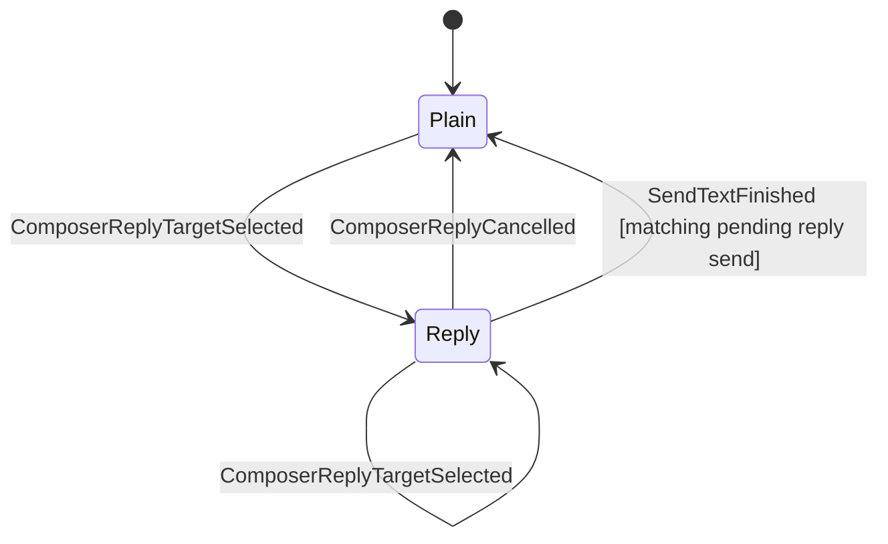

# Rules Compliance Remediation Implementation Plan

> **For agentic workers:** REQUIRED SUB-SKILL: Use superpowers:subagent-driven-development (recommended) or superpowers:executing-plans to implement this plan task-by-task. Steps use checkbox (`- [ ]`) syntax for tracking.

**Goal:** Remove every rule violation found in the 2026-06-14 rules audit: Rust-owned send/reply state, Tauri DTO/thread placeholders, QA token and cleanup contracts, private-data-safe real QA logs, fixed-sleep QA waits, fail-closed data paths, and user-facing text localization.

**Architecture:** Product semantics move back into Rust state machines and core events. React renders snapshots/events and may keep only ephemeral presentation state. QA scripts enforce token/privacy contracts directly instead of relying on docs or process exit code.

**Tech Stack:** Rust (`matrix-desktop-state`, `matrix-desktop-core`, Tauri command adapter), React/TypeScript, Vitest, Playwright, Node QA scripts.

---

## Findings Covered

- React clears reply mode after send with `cancel_composer_reply`; reducer/core do not own the completion transition.
- Production send/reply commands do not drive `SendTextSubmitted` / `SendTextFinished` / `SendTextFailed` through `AppState`.
- Tauri snapshots expose legacy `timeline: []` and `thread: null`, while React still uses those placeholders for thread UI decisions.
- Reducer docs say "Ready" while `is_session_ready()` allows `Ready`, `NeedsRecovery`, and `Recovering`.
- Real homeserver QA logs Matrix IDs and checks only password/recovery-key leaks.
- Headless/real QA scripts do not enforce required success tokens.
- `qa:headless-basic:real` is locked to `compat`, but docs claim space cleanup tokens.
- Real-login mac GUI smoke lacks a logout/session cleanup guard after successful login.
- FIFO credential writers spawn `tee` with the parent environment.
- Several QA waits use fixed sleeps instead of concrete state/event waits.
- `default_data_dir()` silently falls back to the current working directory.
- Tauri has placeholder commands that discard inputs (`discover_login_methods`, `open_thread`, `close_thread`).
- User-facing text is embedded directly in React/domain source instead of a message catalog.

## File Map

- `docs/architecture/state-machine.md`: clarify the session guard and send/reply completion transitions.
- `crates/matrix-desktop-state/src/reducer.rs`: clear reply mode on correlated successful send completion; preserve reply mode on failure for retry.
- `crates/matrix-desktop-state/tests/timeline_thread_state.rs`: reducer regression tests.
- `crates/matrix-desktop-core/src/command.rs`: add first-class app commands for thread open/close.
- `crates/matrix-desktop-core/src/runtime.rs`: fail closed for default data dir; reduce app commands.
- `crates/matrix-desktop-core/src/timeline.rs`: emit send submitted/finished/failed `AppAction`s from the production timeline path.
- `crates/matrix-desktop-core/src/bin/real-homeserver-qa.rs`: remove private identifiers from output and enforce cleanup.
- `crates/matrix-desktop-core/src/bin/headless-core-qa.rs`: replace fixed sleeps in cleanup paths.
- `apps/desktop/src/App.tsx`: remove product-state repair, stop using legacy snapshot placeholders, route visible text through i18n.
- `apps/desktop/src-tauri/src/commands.rs`: remove or promote placeholder commands.
- `apps/desktop/src-tauri/src/dto.rs`: keep DTO completeness tests aligned with real production fields.
- `apps/desktop/src/test/appHarnessMain.tsx`: expose reply-mode snapshots for Playwright regression tests.
- `apps/desktop/e2e/basic-operations.spec.ts`: assert reply send does not call cancel fallback.
- `apps/desktop/e2e/timeline-scrollback.spec.ts`: replace fixed timeout with DOM/state wait.
- `apps/desktop/src/i18n/messages.ts`: new typed message catalog.
- `apps/desktop/src/i18n/messages.test.ts`: catalog completeness and missing-key tests.
- `apps/desktop/src/domain/contextMenus.ts`, `apps/desktop/src/domain/shortcuts.ts`, `apps/desktop/src/components/*.tsx`: migrate user-visible text to catalog.
- `scripts/lib/qa-token-contract.mjs`: new shared token/private-data assertion helper.
- `scripts/desktop-headless-local-qa.mjs`: enforce local required tokens.
- `scripts/desktop-real-homeserver-qa.mjs`: enforce real required tokens and private-data leak patterns.
- `scripts/desktop-linux-gui-qa.mjs`: remove `tee` FIFO writer.
- `scripts/desktop-mac-gui-smoke.mjs`: remove `tee`, remove fixed sleeps, add real-login cleanup guard.
- `apps/desktop/package.json`: make real basic lane scenario match docs.
- `apps/desktop/src/scripts/releaseScripts.test.ts`: structural tests for the script contracts.
- `docs/qa/headless-basic-operations.md`: sync real lane token/scenario contract.

---

### Task 1: Sync State-Machine Canon For Session Guards And Reply Completion

**Files:**
- Modify: `docs/architecture/state-machine.md`
- Modify: `crates/matrix-desktop-state/tests/timeline_thread_state.rs`
- Modify: `crates/matrix-desktop-state/src/reducer.rs`

- [ ] **Step 1: Amend the session guard wording**

In `docs/architecture/state-machine.md`, add this paragraph under `## Contract` after the "Late backend signals" paragraph:

```markdown
Reducer guard phrase: "Ready session" means a Matrix-capable authenticated
session whose runtime may accept room, timeline, thread, search, and composer
actions: `SessionState::Ready(_)`, `SessionState::NeedsRecovery { .. }`, or
`SessionState::Recovering { .. }`. It does not include `SignedOut`,
`Restoring`, `Authenticating`, `Locked`, or `LoggingOut`. Recovery states may
show degraded encrypted-content behavior, but product state still remains
Rust-owned and guarded.
```

Update the Composer Reply Mode diagram:



Replace the existing send-path bullet with:

```markdown
- `SendTextFinished { room_id, transaction_id }` clears the pending
  transaction. If the matching send was submitted while the composer was in
  `Reply`, it also returns the composer to `Plain`.
- `SendTextFailed { room_id, transaction_id, message }` clears the pending
  transaction and records a recoverable error. It preserves `Reply` mode so the
  user can retry or cancel explicitly.
```

- [ ] **Step 2: Write failing reducer tests**

Append these tests near the existing send-text tests in `crates/matrix-desktop-state/tests/timeline_thread_state.rs`:

```rust
#[test]
fn send_text_finished_clears_reply_mode_for_matching_reply_send() {
    let mut state = selected_room_state("room-a");
    state.timeline.composer.mode = ComposerMode::Reply {
        in_reply_to_event_id: "$root:example.invalid".to_owned(),
    };

    reduce(
        &mut state,
        AppAction::SendTextSubmitted {
            room_id: "room-a".to_owned(),
            transaction_id: "txn-reply".to_owned(),
            body: "reply body".to_owned(),
        },
    );

    reduce(
        &mut state,
        AppAction::SendTextFinished {
            room_id: "room-a".to_owned(),
            transaction_id: "txn-reply".to_owned(),
        },
    );

    assert_eq!(state.timeline.composer.pending_transaction_id, None);
    assert_eq!(state.timeline.composer.mode, ComposerMode::Plain);
}

#[test]
fn send_text_failed_preserves_reply_mode_for_retry() {
    let mut state = selected_room_state("room-a");
    state.timeline.composer.mode = ComposerMode::Reply {
        in_reply_to_event_id: "$root:example.invalid".to_owned(),
    };

    reduce(
        &mut state,
        AppAction::SendTextSubmitted {
            room_id: "room-a".to_owned(),
            transaction_id: "txn-reply".to_owned(),
            body: "reply body".to_owned(),
        },
    );

    reduce(
        &mut state,
        AppAction::SendTextFailed {
            room_id: "room-a".to_owned(),
            transaction_id: "txn-reply".to_owned(),
            message: "send failed".to_owned(),
        },
    );

    assert_eq!(state.timeline.composer.pending_transaction_id, None);
    assert_eq!(
        state.timeline.composer.mode,
        ComposerMode::Reply {
            in_reply_to_event_id: "$root:example.invalid".to_owned()
        }
    );
}
```

- [ ] **Step 3: Verify the tests fail**

Run:

```bash
cargo test -p matrix-desktop-state --test timeline_thread_state
```

Expected: the new `send_text_finished_clears_reply_mode_for_matching_reply_send`
test fails because `SendTextFinished` does not clear `ComposerMode::Reply`.

- [ ] **Step 4: Implement reducer completion behavior**

In `crates/matrix-desktop-state/src/reducer.rs`, update the matching `SendTextFinished` arm:

```rust
state.timeline.composer.pending_transaction_id = None;
state.timeline.composer.mode = ComposerMode::Plain;
vec![AppEffect::EmitUiEvent(UiEvent::TimelineChanged { room_id })]
```

Leave `SendTextFailed` preserving `state.timeline.composer.mode`.

- [ ] **Step 5: Verify reducer tests pass**

Run:

```bash
cargo test -p matrix-desktop-state --test timeline_thread_state
```

Expected: all tests in `timeline_thread_state` pass.

---

### Task 2: Make Production Send/Reply Drive Rust AppState

**Files:**
- Modify: `crates/matrix-desktop-core/src/timeline.rs`
- Modify: `crates/matrix-desktop-core/src/runtime.rs`
- Modify: `crates/matrix-desktop-core/src/tests.rs`

- [ ] **Step 1: Route send submission into the reducer**

In `TimelineManagerActor::handle_command`, before routing `TimelineCommand::SendText` and `TimelineCommand::SendReply`, emit `AppAction::SendTextSubmitted` for room timelines:

```rust
if let Some(room_id) = reducer_room_id(&key) {
    let _ = self.action_tx.try_send(vec![AppAction::SendTextSubmitted {
        room_id,
        transaction_id: transaction_id.clone(),
        body: body.clone(),
    }]);
}
```

Add this helper near the manager helpers:

```rust
fn reducer_room_id(key: &TimelineKey) -> Option<String> {
    match &key.kind {
        TimelineKind::Room { room_id } => Some(room_id.clone()),
        TimelineKind::Thread { .. } | TimelineKind::Focused { .. } => None,
    }
}
```

- [ ] **Step 2: Give TimelineActor an action channel**

Add `action_tx: mpsc::Sender<Vec<AppAction>>` to `TimelineActor`, pass it through `TimelineActor::spawn`, and pass `self.action_tx.clone()` from `TimelineManagerActor::handle_subscribe`.

The actor constructor should include:

```rust
let actor = TimelineActor {
    key,
    timeline,
    session,
    action_tx,
    event_tx,
    msg_rx: actor_rx,
    generation,
    next_batch_id: TimelineBatchId(0),
    send_completion: SendCompletionTracker::default(),
    sent_event_txns: HashMap::new(),
    search_index_tx,
};
```

- [ ] **Step 3: Emit send finished actions on completion**

Whenever `TimelineActor` emits `TimelineEvent::SendCompleted`, also send:

```rust
if let Some(room_id) = reducer_room_id(&self.key) {
    let _ = self.action_tx.try_send(vec![AppAction::SendTextFinished {
        room_id,
        transaction_id: client_txn_id.clone(),
    }]);
}
```

Apply this in both completion paths: immediate completion after `remember_pending_send` and queued completion in `handle_send_queue_update`.

- [ ] **Step 4: Emit send failed actions on enqueue/build failures**

Add a helper:

```rust
fn emit_send_failed_action(&self, transaction_id: &str) {
    if let Some(room_id) = reducer_room_id(&self.key) {
        let _ = self.action_tx.try_send(vec![AppAction::SendTextFailed {
            room_id,
            transaction_id: transaction_id.to_owned(),
            message: "send failed".to_owned(),
        }]);
    }
}
```

Call it in `handle_send_text` and `handle_send_reply` before every return that emits `TimelineOperationFailed` after a transaction was submitted.

- [ ] **Step 5: Add a core runtime regression test**

In `crates/matrix-desktop-core/src/tests.rs`, extend `app_command_sets_and_clears_reply_target` or add a new test that injects:

```rust
runtime.inject_actions(vec![
    AppAction::SendTextSubmitted {
        room_id: "!room:example.test".to_owned(),
        transaction_id: "txn-reply".to_owned(),
        body: "reply body".to_owned(),
    },
    AppAction::SendTextFinished {
        room_id: "!room:example.test".to_owned(),
        transaction_id: "txn-reply".to_owned(),
    },
]).await;
```

Assert the snapshot returns `ComposerMode::Plain`.

- [ ] **Step 6: Run core tests**

Run:

```bash
cargo test -p matrix-desktop-core --features qa-bin,test-hooks
```

Expected: core tests pass and send/reply completion updates snapshots without React repair.

---

### Task 3: Remove React Reply-State Repair

**Files:**
- Modify: `apps/desktop/src/App.tsx`
- Modify: `apps/desktop/src/test/appHarnessMain.tsx`
- Modify: `apps/desktop/e2e/basic-operations.spec.ts`

- [ ] **Step 1: Expose a reply-mode harness snapshot**

In `AppHarnessControl`, add:

```ts
replyModeSnapshot(): DesktopSnapshot;
```

Expose it in `harnessControl`:

```ts
replyModeSnapshot
```

- [ ] **Step 2: Add a failing Playwright regression**

Append to `apps/desktop/e2e/basic-operations.spec.ts`:

```ts
test("reply send does not repair product state by cancelling reply mode", async ({ page }) => {
  await gotoReadyShell(page);
  await page.getByRole("button", { name: "Reply to message" }).first().click();
  await expect(page.getByRole("button", { name: "Cancel reply" })).toBeVisible();

  await page.evaluate(() => {
    window.__harness.setCommandResponse(
      "send_reply",
      window.__harness.replyModeSnapshot()
    );
    window.__harness.clearInvocations();
  });

  await page.getByRole("textbox", { name: "Message composer" }).fill("A reply body");
  await page.getByRole("button", { name: "Send" }).click();

  await expect.poll(() => invocationCount(page, "send_reply")).toBeGreaterThanOrEqual(1);
  expect(await invocationCount(page, "cancel_composer_reply")).toBe(0);
});
```

- [ ] **Step 3: Verify the test fails**

Run:

```bash
npm --prefix apps/desktop exec -- playwright test e2e/basic-operations.spec.ts --grep "reply send does not repair"
```

Expected: fails while `App.tsx` still calls `cancelComposerReply()`.

- [ ] **Step 4: Remove the fallback**

In `apps/desktop/src/App.tsx`, delete this block:

```ts
if (nextSnapshot.state.timeline.composer.mode !== "Plain") {
  setSnapshot(await api.cancelComposerReply());
}
```

- [ ] **Step 5: Run frontend checks**

Run:

```bash
npm --prefix apps/desktop run test:ui-headless
npm --prefix apps/desktop run typecheck
```

Expected: Playwright and typecheck pass.

---

### Task 4: Promote Or Remove Tauri Placeholder Commands

**Files:**
- Modify: `crates/matrix-desktop-core/src/command.rs`
- Modify: `crates/matrix-desktop-core/src/runtime.rs`
- Modify: `apps/desktop/src-tauri/src/commands.rs`
- Modify: `apps/desktop/src/App.tsx`
- Modify: `apps/desktop/src/domain/types.ts`
- Modify: `apps/desktop/src-tauri/src/dto.rs`
- Modify: `apps/desktop/src-tauri/src/lib.rs`

- [ ] **Step 1: Promote thread open/close into core app commands**

Add variants to `AppCommand`:

```rust
OpenThread {
    request_id: RequestId,
    room_id: String,
    root_event_id: String,
},
CloseThread {
    request_id: RequestId,
},
```

Include them in `AppCommand::request_id()`.

- [ ] **Step 2: Reduce thread app commands in runtime**

In `CoreRuntime` command handling:

```rust
AppCommand::OpenThread {
    room_id,
    root_event_id,
    ..
} => {
    let _effects = reduce(&mut self.state, AppAction::OpenThread { room_id, root_event_id });
    true
}
AppCommand::CloseThread { .. } => {
    let _effects = reduce(&mut self.state, AppAction::CloseThread);
    true
}
```

- [ ] **Step 3: Replace Tauri placeholder commands**

`apps/desktop/src-tauri/src/commands.rs::open_thread` should submit:

```rust
CoreCommand::App(AppCommand::OpenThread {
    request_id,
    room_id,
    root_event_id,
})
```

and return a fresh snapshot. `close_thread` should submit:

```rust
CoreCommand::App(AppCommand::CloseThread { request_id })
```

`discover_login_methods` must either call a real core discovery command or be deleted with its caller. If it remains, add a core command and reducer state for discovery; do not leave a snapshot-only shim.

- [ ] **Step 4: Remove production dependency on legacy top-level placeholders**

In `App.tsx`, do not use `snapshot.timeline` or `snapshot.thread` to decide production thread behavior. Use `snapshot.state.thread` for thread state and the event-driven timeline store for row selection.

The intended predicate for rendering the thread pane is:

```ts
const threadState = snapshot.state.thread;
const threadIsOpen = threadState.kind === "opening" || threadState.kind === "open";
```

- [ ] **Step 5: Keep DTO tests explicit**

In `apps/desktop/src-tauri/src/dto.rs`, keep the legacy top-level `timeline` and `thread` fields only as backward-compatible DTO fields. Add a test assertion that product state comes from `state.thread`:

```rust
assert_eq!(value["state"]["thread"]["kind"], json!("closed"));
assert_eq!(value["thread"], json!(null));
```

- [ ] **Step 6: Run Tauri and frontend tests**

Run:

```bash
cargo test --manifest-path apps/desktop/src-tauri/Cargo.toml
npm --prefix apps/desktop run test -- --run src/domain/rightPanel.test.ts src/domain/timelineStore.test.ts
npm --prefix apps/desktop run test:ui-headless
```

Expected: placeholder command behavior is gone or promoted to core, and UI tests pass.

---

### Task 5: Enforce Private-Data-Free Real Homeserver QA

**Files:**
- Create: `scripts/lib/qa-token-contract.mjs`
- Modify: `scripts/desktop-real-homeserver-qa.mjs`
- Modify: `crates/matrix-desktop-core/src/bin/real-homeserver-qa.rs`
- Modify: `apps/desktop/src/scripts/releaseScripts.test.ts`

- [ ] **Step 1: Add shared token and private-data assertions**

Create `scripts/lib/qa-token-contract.mjs`:

```js
export function tokensFromOutput(output) {
  return new Set(
    String(output)
      .split(/\\s+/)
      .filter((token) => /^[a-z0-9_]+=(ok|running|created|not_found|completed|partial)$/.test(token))
  );
}

export function assertRequiredTokens(output, requiredTokens, label) {
  const tokens = tokensFromOutput(output);
  const missing = requiredTokens.filter((token) => !tokens.has(token));
  if (missing.length > 0) {
    throw new Error(`${label}: missing required QA tokens: ${missing.join(", ")}`);
  }
}

export function assertNoMatrixIdentifiers(output, label) {
  const text = String(output);
  const matrixIdPattern = /(?:^|\\s)([@!$][A-Za-z0-9._=\\-]+:[A-Za-z0-9.\\-]+)(?:\\s|$)/;
  const match = text.match(matrixIdPattern);
  if (match) {
    throw new Error(`${label}: private Matrix identifier leaked into QA output: ${match[1]}`);
  }
}
```

- [ ] **Step 2: Stop printing real identifiers from the Rust binary**

Replace real-homeserver lines that include `user_id=`, `room_id=`, `space_id=`, or `event_id=` with token-only lines:

```rust
let line = "login=ok".to_owned();
let line = "qa_room=created".to_owned();
let line = "send_msg1=ok".to_owned();
let line = "send_search=ok".to_owned();
let line = "send_msg2=ok".to_owned();
let line = "real_reply=ok".to_owned();
```

The summary must not include `user={user_id}`. Use:

```rust
let mut summary = format!(
    "Real homeserver QA OK. \
     login=ok recovery={recovery} \
     sync_backend={backend} sync=ok \
     rooms={rooms} spaces={spaces} dms={dms} \
     qa_room=created send_msg1=ok send_search=ok send_msg2=ok real_reply=ok \
     edit_msg1=ok redact_msg2=ok \
     paginate={paginate} search={search} \
     store_restore=ok restore_body={body_ok} \
     leave_room=ok forget_room=ok \
     logout=ok post_logout_restore=not_found",
    recovery = "completed",
    backend = backend_name,
    rooms = rooms_count,
    spaces = spaces_count,
    dms = dms_count,
    paginate = paginate_result,
    search = search_status,
    body_ok = restore_body_tag,
);
```

- [ ] **Step 3: Enforce the no-ID check in the wrapper**

In `scripts/desktop-real-homeserver-qa.mjs`, import and call:

```js
import {
  assertNoMatrixIdentifiers,
  assertRequiredTokens
} from "./lib/qa-token-contract.mjs";

const combinedOutput = `${result.stdout || ""}\\n${result.stderr || ""}`;
assertNoMatrixIdentifiers(combinedOutput, "real-homeserver-qa");
assertRequiredTokens(combinedOutput, requiredTokensForScenario(scenarioOption), "real-homeserver-qa");
```

Add:

```js
function requiredTokensForScenario(scenario) {
  const base = [
    "login=ok",
    "sync=running",
    "qa_room=created",
    "send_msg1=ok",
    "send_search=ok",
    "send_msg2=ok",
    "real_reply=ok",
    "edit_msg1=ok",
    "redact_msg2=ok",
    "search=ok",
    "store_restore=ok",
    "leave_room=ok",
    "forget_room=ok",
    "logout=ok",
    "post_logout_restore=not_found"
  ];
  if (scenario === "space_compat" || scenario === "all") {
    return [...base, "real_space_create=ok", "real_space_child=ok", "real_space_cleanup=ok"];
  }
  return base;
}
```

- [ ] **Step 4: Add structural tests**

In `apps/desktop/src/scripts/releaseScripts.test.ts`, add tests that assert the real runner imports `qa-token-contract.mjs`, calls `assertRequiredTokens`, calls `assertNoMatrixIdentifiers`, and the Rust binary no longer contains `event_id={` in printed transcript lines.

- [ ] **Step 5: Run tests**

Run:

```bash
npm --prefix apps/desktop run test -- --run src/scripts/releaseScripts.test.ts
cargo test -p matrix-desktop-core --features qa-bin,test-hooks --bin real-homeserver-qa -- --nocapture
```

Expected: script tests pass; binary unit tests pass without real credentials.

---

### Task 6: Align Real Scenario Defaults With Documented Cleanup

**Files:**
- Modify: `apps/desktop/package.json`
- Modify: `scripts/desktop-real-homeserver-qa.mjs`
- Modify: `crates/matrix-desktop-core/src/bin/real-homeserver-qa.rs`
- Modify: `docs/qa/headless-basic-operations.md`
- Modify: `apps/desktop/src/scripts/releaseScripts.test.ts`

- [ ] **Step 1: Make the basic real lane include space cleanup**

Change:

```json
"qa:headless-basic:real": "node ../../scripts/desktop-real-homeserver-qa.mjs --run --scenario=space_compat"
```

Change the runner default:

```js
const scenarioOption = optionValue("--scenario") ?? "space_compat";
```

Change `RealQaScenario::from_env_value(None)` to return `SpaceCompat`.

- [ ] **Step 2: Keep compat as an explicit debug subset**

Update usage text to:

```text
Scenario defaults to space_compat; compat is a reduced debug subset.
```

- [ ] **Step 3: Sync docs and tests**

`docs/qa/headless-basic-operations.md` required real tokens must list:

```text
login=ok
sync=running
qa_room=created
send_msg1=ok
send_search=ok
send_msg2=ok
real_reply=ok
edit_msg1=ok
redact_msg2=ok
search=ok
store_restore=ok
leave_room=ok
forget_room=ok
real_space_create=ok
real_space_child=ok
real_space_cleanup=ok
logout=ok
post_logout_restore=not_found
```

- [ ] **Step 4: Run tests**

Run:

```bash
npm --prefix apps/desktop run test -- --run src/scripts/releaseScripts.test.ts
cargo test -p matrix-desktop-core --features qa-bin,test-hooks --bin real-homeserver-qa -- --nocapture
```

Expected: package script, runner default, Rust default, and docs agree.

---

### Task 7: Add Real QA Cleanup Guards

**Files:**
- Modify: `crates/matrix-desktop-core/src/bin/real-homeserver-qa.rs`
- Modify: `scripts/desktop-mac-gui-smoke.mjs`
- Modify: `apps/desktop/src-tauri/src/lib.rs`
- Modify: `apps/desktop/src-tauri/src/commands.rs`

- [ ] **Step 1: Track resources created by real-homeserver QA**

Add a cleanup state struct:

```rust
#[derive(Default)]
struct RealQaCleanupState {
    account_key: Option<AccountKey>,
    qa_room_id: Option<String>,
    qa_space_id: Option<String>,
    logged_out: bool,
}
```

Record `account_key` after login, `qa_room_id` after room creation, and `qa_space_id` after space creation.

- [ ] **Step 2: Wrap the post-login flow**

Split `run_async` into:

```rust
async fn run_async(
    creds: &RealCredentials,
    scenario: RealQaScenario,
    transcript: &mut Vec<String>,
) -> Result<String, String> {
    let mut cleanup = RealQaCleanupState::default();
    let result = run_async_inner(creds, scenario, transcript, &mut cleanup).await;
    if result.is_err() && !cleanup.logged_out {
        cleanup_real_qa_resources(transcript, &mut cleanup).await;
    }
    result
}
```

`cleanup_real_qa_resources` must attempt leave/forget for known rooms/spaces and logout. It records cleanup failures with concrete warning tokens such as `cleanup_warning=leave_room_failed`, `cleanup_warning=forget_room_failed`, `cleanup_warning=leave_space_failed`, `cleanup_warning=forget_space_failed`, and `cleanup_warning=logout_failed`, then returns the original failure.

- [ ] **Step 3: Add a mac GUI QA control cleanup path**

Add a debug/test-only QA control path to the Tauri app:

```rust
const MATRIX_DESKTOP_QA_CONTROL_PIPE: &str = "MATRIX_DESKTOP_QA_CONTROL_PIPE";
```

When present in debug/test builds, read newline JSON commands from the FIFO:

```json
{"command":"logout"}
```

On `logout`, submit the existing `logout` core command and update the QA title. Release builds ignore this env var.

- [ ] **Step 4: Use the control pipe in mac real-login smoke**

In `scripts/desktop-mac-gui-smoke.mjs`, create a second FIFO for real-login runs and pass it as `MATRIX_DESKTOP_QA_CONTROL_PIPE`. In the `finally` block, if real login reached ready and `--keep-session` was not requested, write:

```json
{"command":"logout"}
```

Then wait for a QA title with `session=signedOut` or a `logout=ok` signal before terminating the process group.

- [ ] **Step 5: Run tests**

Run:

```bash
cargo test --manifest-path apps/desktop/src-tauri/Cargo.toml
npm --prefix apps/desktop run test -- --run src/scripts/releaseScripts.test.ts
```

Expected: release gate tests prove QA control env is debug/test-only; script tests prove cleanup pipe is used for real login.

---

### Task 8: Remove Parent-Env FIFO Writers And Fixed Sleeps

**Files:**
- Modify: `scripts/desktop-linux-gui-qa.mjs`
- Modify: `scripts/desktop-mac-gui-smoke.mjs`
- Modify: `apps/desktop/e2e/timeline-scrollback.spec.ts`
- Modify: `crates/matrix-desktop-core/src/bin/headless-core-qa.rs`
- Modify: `crates/matrix-desktop-core/src/bin/real-homeserver-qa.rs`
- Modify: `crates/matrix-desktop-core/src/event.rs`
- Modify: `crates/matrix-desktop-core/src/search.rs`

- [ ] **Step 1: Replace `tee` with direct FIFO writes**

In both Node scripts, replace `writeSensitivePayloadToPath` with:

```js
import { open } from "node:fs/promises";

async function writeSensitivePayloadToPath(path, payload, timeout) {
  let handle;
  const write = async () => {
    handle = await open(path, "w");
    await handle.writeFile(payload, "utf8");
  };
  await Promise.race([
    write(),
    new Promise((_, reject) =>
      setTimeout(() => reject(new Error("FIFO write timed out")), timeout)
    )
  ]);
  await handle?.close();
}
```

No helper process means no parent environment is inherited.

- [ ] **Step 2: Remove mac panel sleeps**

In `scripts/desktop-mac-gui-smoke.mjs`, delete:

```js
await sleep(1000);
```

after `keyChord("/")` and `keyChord(",")`. `waitForQaPanel(...)` already waits for the concrete QA title token.

- [ ] **Step 3: Replace Playwright scrollback timeout**

In `apps/desktop/e2e/timeline-scrollback.spec.ts`, replace `page.waitForTimeout(250)` with:

```ts
await expect
  .poll(() =>
    page.locator("[data-timeline-generation]").first().getAttribute("data-timeline-generation")
  )
  .not.toBe(previousGeneration);
```

If the test does not expose a generation attribute yet, add a stable `data-timeline-generation` attribute to the timeline root.

- [ ] **Step 4: Replace search polling sleep with an index event**

Add a search event:

```rust
pub enum SearchEvent {
    Results {
        request_id: RequestId,
        results: Vec<SearchResultItem>,
    },
    IndexUpdated {
        room_id: String,
        event_id: String,
    },
}
```

Emit `IndexUpdated` from `SearchActor::handle_index` after `Upsert` or `Edit` applies. In `poll_search_until_found_or_timeout`, wait for either `SearchEvent::IndexUpdated` or the query result instead of sleeping for 1000 ms.

- [ ] **Step 5: Replace headless cleanup sleeps**

In `headless-core-qa.rs`, remove the fixed sleeps after unsubscribe/stop. Wait for the next concrete state used by the following step: `SyncStopped`, `LoggedOut`, or `RestoreSessionFailed(SessionNotFound)` depending on the path.

- [ ] **Step 6: Run QA script tests**

Run:

```bash
npm --prefix apps/desktop run test -- --run src/scripts/releaseScripts.test.ts
cargo test -p matrix-desktop-core --features qa-bin,test-hooks --bin headless-core-qa -- --nocapture
cargo test -p matrix-desktop-core --features qa-bin,test-hooks --bin real-homeserver-qa -- --nocapture
```

Expected: no fixed-sleep structural checks fail; QA binaries still pass unit tests.

---

### Task 9: Fail Closed On Runtime Data Directory Resolution

**Files:**
- Modify: `crates/matrix-desktop-core/src/runtime.rs`
- Modify: `crates/matrix-desktop-core/src/tests.rs`

- [ ] **Step 1: Add a pure resolver**

In `runtime.rs`:

```rust
fn default_data_dir_from_home(home: Option<std::ffi::OsString>) -> Result<std::path::PathBuf, String> {
    let home = home.ok_or_else(|| "HOME is required to resolve matrix-desktop data dir".to_owned())?;
    Ok(std::path::PathBuf::from(home)
        .join(".local")
        .join("share")
        .join("matrix-desktop"))
}
```

Use it from `default_data_dir()`:

```rust
fn default_data_dir() -> std::path::PathBuf {
    default_data_dir_from_home(std::env::var_os("HOME"))
        .expect("HOME is required to resolve matrix-desktop data dir")
}
```

- [ ] **Step 2: Add tests**

Add:

```rust
#[test]
fn default_data_dir_requires_home() {
    assert!(default_data_dir_from_home(None).is_err());
}

#[test]
fn default_data_dir_uses_xdg_like_user_data_path() {
    let dir = default_data_dir_from_home(Some("/tmp/synthetic-home".into())).unwrap();
    assert!(dir.ends_with(".local/share/matrix-desktop"));
}
```

- [ ] **Step 3: Run tests**

Run:

```bash
cargo test -p matrix-desktop-core runtime
```

Expected: runtime path tests pass and no CWD fallback remains.

---

### Task 10: Introduce A Typed I18n Catalog And Migrate User-Facing Text

**Files:**
- Create: `apps/desktop/src/i18n/messages.ts`
- Create: `apps/desktop/src/i18n/messages.test.ts`
- Modify: `apps/desktop/src/App.tsx`
- Modify: `apps/desktop/src/components/UserSettingsPanel.tsx`
- Modify: `apps/desktop/src/components/KeyboardSettingsPanel.tsx`
- Modify: `apps/desktop/src/components/RoomInfoPanel.tsx`
- Modify: `apps/desktop/src/components/SpaceInfoPanel.tsx`
- Modify: `apps/desktop/src/components/TimelineView.tsx`
- Modify: `apps/desktop/src/domain/contextMenus.ts`
- Modify: `apps/desktop/src/domain/shortcuts.ts`
- Modify: tests that assert visible text by literal strings.

- [ ] **Step 1: Add a minimal typed catalog**

Create `apps/desktop/src/i18n/messages.ts`:

```ts
export type Locale = "en" | "ja" | "pseudo";

export type MessageId =
  | "action.add"
  | "action.back"
  | "action.cancel"
  | "action.close"
  | "action.createRoom"
  | "action.createSpace"
  | "action.forward"
  | "action.restartSync"
  | "action.send"
  | "action.sending"
  | "composer.bold"
  | "composer.code"
  | "composer.emoji"
  | "composer.italic"
  | "composer.link"
  | "composer.list"
  | "composer.mention"
  | "composer.messageComposer"
  | "composer.placeholder"
  | "composer.replying"
  | "composer.cancelReply"
  | "dialog.cancelCreate"
  | "dialog.submitCreateRoom"
  | "dialog.submitCreateSpace"
  | "panel.context"
  | "panel.keyboard"
  | "panel.recovery"
  | "panel.roomInfo"
  | "panel.search"
  | "panel.spaceInfo"
  | "panel.thread"
  | "panel.userSettings"
  | "room.members"
  | "room.roomInfo"
  | "room.tabs"
  | "room.threadToggle"
  | "settings.accountSwitcher"
  | "settings.current"
  | "settings.device"
  | "settings.general"
  | "settings.homeserver"
  | "settings.keyboard"
  | "settings.localStore"
  | "settings.matrixAccount"
  | "settings.notRestored"
  | "settings.preferences"
  | "settings.searchIndex"
  | "settings.security"
  | "settings.securityPrivacy"
  | "settings.session"
  | "settings.sessionSecret"
  | "settings.switch"
  | "settings.userId"
  | "shortcut.cancelReplyOrEdit"
  | "shortcut.sendMessage"
  | "timeline.conversation"
  | "timeline.editMessage"
  | "timeline.redactMessage"
  | "timeline.replyToMessage"
  | "timeline.viewReplies"
  | "workspace.createSpace"
  | "workspace.rooms"
  | "workspace.search"
  | "workspace.searchScope"
  | "workspace.spaceInfoSettings"
  | "workspace.userSettings"
  | "workspace.workspaces";

type MessageValues = Record<string, string | number>;
type Catalog = Record<MessageId, string>;

const en: Catalog = {
  "action.add": "Add",
  "action.back": "Back",
  "action.cancel": "Cancel",
  "action.close": "Close {title}",
  "action.createRoom": "Create room",
  "action.createSpace": "Create space",
  "action.forward": "Forward",
  "action.restartSync": "Restart sync",
  "action.send": "Send",
  "action.sending": "Sending",
  "composer.bold": "Bold",
  "composer.code": "Code",
  "composer.emoji": "Emoji",
  "composer.italic": "Italic",
  "composer.link": "Link",
  "composer.list": "List",
  "composer.mention": "Mention",
  "composer.messageComposer": "Message composer",
  "composer.placeholder": "Message {roomName}",
  "composer.replying": "Replying",
  "composer.cancelReply": "Cancel reply",
  "dialog.cancelCreate": "Cancel create",
  "dialog.submitCreateRoom": "Submit create room",
  "dialog.submitCreateSpace": "Submit create space",
  "panel.context": "Context panel",
  "panel.keyboard": "Keyboard",
  "panel.recovery": "Recovery",
  "panel.roomInfo": "Room info",
  "panel.search": "Search",
  "panel.spaceInfo": "Space info",
  "panel.thread": "Thread",
  "panel.userSettings": "User settings",
  "room.members": "Members",
  "room.roomInfo": "Room info",
  "room.tabs": "Room tabs",
  "room.threadToggle": "Toggle thread",
  "settings.accountSwitcher": "Account switcher",
  "settings.current": "Current",
  "settings.device": "Device",
  "settings.general": "General",
  "settings.homeserver": "Homeserver",
  "settings.keyboard": "Keyboard",
  "settings.localStore": "Separate encrypted namespace",
  "settings.matrixAccount": "Matrix account",
  "settings.notRestored": "Not restored",
  "settings.preferences": "Preferences",
  "settings.searchIndex": "Encrypted local index",
  "settings.security": "Security",
  "settings.securityPrivacy": "Security & Privacy",
  "settings.session": "Session",
  "settings.sessionSecret": "OS credential store",
  "settings.switch": "Switch",
  "settings.userId": "User ID",
  "shortcut.cancelReplyOrEdit": "Cancel reply or edit",
  "shortcut.sendMessage": "Send message",
  "timeline.conversation": "Conversation timeline",
  "timeline.editMessage": "Edit message",
  "timeline.redactMessage": "Redact message",
  "timeline.replyToMessage": "Reply to message",
  "timeline.viewReplies": "View new replies · {count}",
  "workspace.createSpace": "Create space",
  "workspace.rooms": "Rooms",
  "workspace.search": "Search",
  "workspace.searchScope": "Search scope",
  "workspace.spaceInfoSettings": "Space info and settings",
  "workspace.userSettings": "User settings",
  "workspace.workspaces": "Workspaces"
};

const ja: Catalog = { ...en };

const pseudo: Catalog = Object.fromEntries(
  Object.entries(en).map(([id, value]) => [id, `[!! ${value} !!]`])
) as Catalog;

export const catalogs: Record<Locale, Catalog> = { en, ja, pseudo };

export function t(id: MessageId, values: MessageValues = {}, locale: Locale = "en"): string {
  const template = catalogs[locale][id] ?? catalogs.en[id];
  return template.replace(/\{([a-zA-Z0-9_]+)\}/g, (_, key: string) =>
    String(values[key] ?? `{${key}}`)
  );
}
```

- [ ] **Step 2: Add catalog tests**

Create `apps/desktop/src/i18n/messages.test.ts`:

```ts
import { describe, expect, test } from "vitest";
import { catalogs, t, type Locale } from "./messages";

describe("i18n message catalog", () => {
  test("all locales expose the same message ids", () => {
    const locales = Object.keys(catalogs) as Locale[];
    const baseline = Object.keys(catalogs.en).sort();
    for (const locale of locales) {
      expect(Object.keys(catalogs[locale]).sort()).toEqual(baseline);
    }
  });

  test("interpolates named values", () => {
    expect(t("composer.placeholder", { roomName: "Synthetic Room" })).toBe(
      "Message Synthetic Room"
    );
  });
});
```

- [ ] **Step 3: Migrate user-visible strings**

Replace visible literals in React/domain code with `t(...)`. Example:

```tsx
aria-label={t("composer.messageComposer")}
placeholder={t("composer.placeholder", { roomName })}
aria-label={isSending ? t("action.sending") : t("action.send")}
```

For context menu and shortcut definitions, store `labelId: MessageId` and resolve to text at render boundaries. Do not localize QA tokens, enum names, CSS classes, `data-*` values, or synthetic fixture message bodies.

- [ ] **Step 4: Update tests**

Tests that assert role names may keep default English expectations because `t(..., "en")` is default. Add at least one test proving the Japanese locale intentionally falls back to English until localization is staffed:

```ts
expect(t("composer.replying", {}, "ja")).toBe("Replying");
```

- [ ] **Step 5: Run frontend tests**

Run:

```bash
npm --prefix apps/desktop run test -- --run src/i18n/messages.test.ts src/domain/shortcuts.test.ts src/domain/contextMenus.test.ts src/components/UserSettingsPanel.test.tsx src/components/KeyboardSettingsPanel.test.tsx
npm --prefix apps/desktop run test:ui-headless
npm --prefix apps/desktop run typecheck
```

Expected: UI remains English by default, Japanese catalog entries exist, and hardcoded production text is removed from touched UI surfaces.

---

### Task 11: Final Verification And Docs-Sync Gate

**Files:**
- Modify only files touched by previous tasks if verification exposes drift.

- [ ] **Step 1: Run fast structural checks**

Run:

```bash
git diff --check
npm --prefix apps/desktop run test -- --run src/scripts/releaseScripts.test.ts src/i18n/messages.test.ts
cargo test -p matrix-desktop-state
cargo test -p matrix-desktop-core --features qa-bin,test-hooks
cargo test --manifest-path apps/desktop/src-tauri/Cargo.toml
```

Expected: all commands pass.

- [ ] **Step 2: Run headless UI checks**

Run:

```bash
npm --prefix apps/desktop run test:ui-headless
npm --prefix apps/desktop run typecheck
```

Expected: all commands pass.

- [ ] **Step 3: Run local QA gates when tools are available**

Run:

```bash
npm --prefix apps/desktop run qa:secret-scan
npm --prefix apps/desktop run qa:headless-basic:local
```

Expected: both pass. If local homeserver binaries are missing, install them following `AGENTS.md` and rerun.

- [ ] **Step 4: Record deferred gates**

Do not run real homeserver QA or mac GUI smoke without approved credentials and user coordination. Record them as deferred if unavailable:

```text
Deferred: npm --prefix apps/desktop run qa:headless-basic:real
Deferred: npm --prefix apps/desktop run qa:mac-gui -- --real-login-from-stdin
```

- [ ] **Step 5: Final docs-sync check**

Verify:

```bash
rg -n "cancelComposerReply\\(\\)" apps/desktop/src/App.tsx
rg -n "waitForTimeout|sleep\\(" apps/desktop/e2e scripts crates/matrix-desktop-core/src/bin
rg -n "event_id=|room_id=|space_id=|user_id=" crates/matrix-desktop-core/src/bin/real-homeserver-qa.rs scripts/desktop-real-homeserver-qa.mjs
rg -n "current_snapshot\\(state.inner\\(\\)\\).*compat|compatibility shim|discard" apps/desktop/src-tauri/src/commands.rs
```

Expected: no remaining product-state repair, no fixed sleep waiting for Matrix/UI effects, no real QA identifier logging, and no placeholder Tauri command shims.

---

## Execution Notes

- Implement tasks in order. Tasks 1-4 unblock the Rust-owned state-machine violations. Tasks 5-8 close QA/security violations. Task 10 is intentionally after state cleanup so localization does not obscure semantic diffs.
- Keep local QA troubleshooting in `AGENTS.md` for now. A separate follow-up should split those notes into a dedicated operational QA document.
- Do not run destructive real-account or matrix.org QA until local headless and Linux lanes are green and credentials are explicitly approved.
