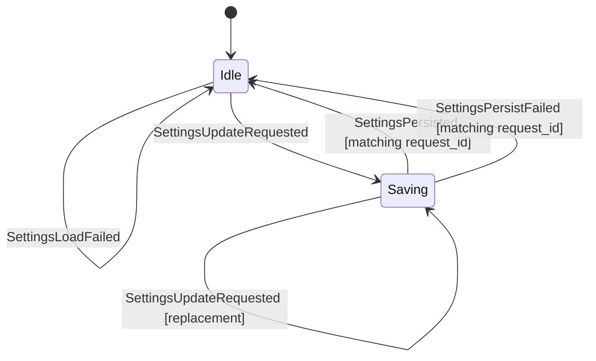

# Rust-Owned Settings Phase A Implementation Plan

> **For agentic workers:** REQUIRED SUB-SKILL: Use superpowers:subagent-driven-development (recommended) or superpowers:executing-plans to implement this plan task-by-task. Steps use checkbox (`- [ ]`) syntax for tracking.

**Goal:** Complete Issue #6 Phase A by adding Rust-owned non-secret settings state, reducer transitions, typed command/effect contracts, and a non-secret persistence store before any Settings UI or composer-key GUI behavior is built.

**Architecture:** Settings are product state and live in `matrix-desktop-state::AppState.settings`. React may render these values and dispatch typed updates later, but it must not own locale, theme, font/emoji choice, or composer send shortcut semantics. The production runtime persists settings through a new non-secret JSON settings store under the app data directory; it never uses the credential store and never stores Matrix credentials, tokens, recovery material, SDK store keys, or search index keys.

**Tech Stack:** Rust reducer/state tests first; serde DTO contract tests; `matrix-desktop-core` runtime command/effect tests; Tauri serialization tests; docs sync in `docs/architecture/state-machine.md`, `docs/architecture/overview.md`, and `docs/policies/engineering-rules.md` when implementation discoveries harden into durable rules.

---

## Scope

In scope for this Phase A plan:

- Rust-owned settings schema with defaults:
  - locale preference and text direction policy
  - appearance/theme preference: `system | light | dark`
  - font/emoji preferences with safe defaults
  - keyboard/composer send shortcut: `enter | modEnter`
- Reducer state machine and guarded transitions:
  - settings loaded
  - settings load failed
  - settings update requested
  - settings persisted
  - settings persist failed
- Core command/effect path for typed settings updates.
- Non-secret JSON settings persistence.
- DTO/TypeScript contract fields so the frontend can only consume Rust-owned settings.
- Docs and worklog update recording the implementation rule: each issue task records discovered durable rules in `docs/` and local operational notes in `AGENTS.md`.

Out of scope for this Phase A plan:

- Full Settings/Preferences UI.
- Replacing React composer key handling with the shared resolver.
- Browser-headless GUI-operation lane for #6 close. This becomes the Phase B close check, after the command path and UI control exist.
- #4 locale catalog completion and #5 font/emoji asset loading. This plan adds settings fields those issues will consume.

## Settings Data Contract

Add these app-owned types to `crates/matrix-desktop-state/src/state.rs` or a new `settings.rs` module re-exported from `lib.rs`:

```rust
#[derive(Clone, Debug, Eq, PartialEq, Serialize, Deserialize)]
pub struct SettingsState {
    pub values: SettingsValues,
    pub persistence: SettingsPersistenceState,
}

#[derive(Clone, Debug, Eq, PartialEq, Serialize, Deserialize)]
pub struct SettingsValues {
    pub locale: LocaleSettings,
    pub appearance: AppearanceSettings,
    pub typography: TypographySettings,
    pub keyboard: KeyboardSettings,
}

#[derive(Clone, Debug, Eq, PartialEq, Serialize, Deserialize)]
pub struct LocaleSettings {
    pub language_tag: Option<String>,
    pub text_direction: TextDirectionPreference,
}

#[derive(Clone, Debug, Eq, PartialEq, Serialize, Deserialize)]
#[serde(rename_all = "camelCase")]
pub enum TextDirectionPreference {
    Auto,
    Ltr,
    Rtl,
}

#[derive(Clone, Debug, Eq, PartialEq, Serialize, Deserialize)]
pub struct AppearanceSettings {
    pub theme: ThemePreference,
}

#[derive(Clone, Debug, Eq, PartialEq, Serialize, Deserialize)]
#[serde(rename_all = "camelCase")]
pub enum ThemePreference {
    System,
    Light,
    Dark,
}

#[derive(Clone, Debug, Eq, PartialEq, Serialize, Deserialize)]
pub struct TypographySettings {
    pub font: FontPreference,
    pub emoji: EmojiPreference,
}

#[derive(Clone, Debug, Eq, PartialEq, Serialize, Deserialize)]
#[serde(rename_all = "camelCase")]
pub enum FontPreference {
    System,
    Inter,
}

#[derive(Clone, Debug, Eq, PartialEq, Serialize, Deserialize)]
#[serde(rename_all = "camelCase")]
pub enum EmojiPreference {
    System,
    TwemojiColr,
}

#[derive(Clone, Debug, Eq, PartialEq, Serialize, Deserialize)]
pub struct KeyboardSettings {
    pub composer_send_shortcut: ComposerSendShortcut,
}

#[derive(Clone, Debug, Eq, PartialEq, Serialize, Deserialize)]
#[serde(rename_all = "camelCase")]
pub enum ComposerSendShortcut {
    Enter,
    ModEnter,
}

#[derive(Clone, Debug, Eq, PartialEq, Serialize, Deserialize)]
#[serde(tag = "kind", rename_all = "camelCase")]
pub enum SettingsPersistenceState {
    Idle,
    Saving { request_id: u64 },
}

#[derive(Clone, Debug, Default, Eq, PartialEq, Serialize, Deserialize)]
pub struct SettingsPatch {
    pub locale: Option<LocaleSettings>,
    pub appearance: Option<AppearanceSettings>,
    pub typography: Option<TypographySettings>,
    pub keyboard: Option<KeyboardSettings>,
}
```

Defaults:

```rust
SettingsValues {
    locale: LocaleSettings {
        language_tag: None,
        text_direction: TextDirectionPreference::Auto,
    },
    appearance: AppearanceSettings {
        theme: ThemePreference::System,
    },
    typography: TypographySettings {
        font: FontPreference::System,
        emoji: EmojiPreference::System,
    },
    keyboard: KeyboardSettings {
        composer_send_shortcut: ComposerSendShortcut::Enter,
    },
}
```

---

### Task 1: Reducer state machine and serialization tests

**Files:**
- Create: `crates/matrix-desktop-state/tests/settings_state.rs`
- Modify: `crates/matrix-desktop-state/src/state.rs`
- Modify: `crates/matrix-desktop-state/src/action.rs`
- Modify: `crates/matrix-desktop-state/src/effect.rs`
- Modify: `crates/matrix-desktop-state/src/reducer.rs`
- Modify: `crates/matrix-desktop-state/src/lib.rs`

- [x] **Step 1: Write the failing tests**

Create `crates/matrix-desktop-state/tests/settings_state.rs`:

```rust
use matrix_desktop_state::{
    AppAction, AppEffect, AppState, AppearanceSettings, ComposerSendShortcut, EmojiPreference,
    FontPreference, KeyboardSettings, LocaleSettings, SettingsPatch, SettingsPersistenceState,
    SettingsValues, TextDirectionPreference, ThemePreference, UiEvent, reduce,
};

fn dark_theme_patch() -> SettingsPatch {
    SettingsPatch {
        appearance: Some(AppearanceSettings {
            theme: ThemePreference::Dark,
        }),
        ..SettingsPatch::default()
    }
}

#[test]
fn app_state_carries_default_non_secret_settings() {
    let state = AppState::default();

    assert_eq!(state.settings.values.appearance.theme, ThemePreference::System);
    assert_eq!(
        state.settings.values.keyboard.composer_send_shortcut,
        ComposerSendShortcut::Enter
    );
    assert_eq!(state.settings.values.locale.language_tag, None);
    assert_eq!(
        state.settings.values.locale.text_direction,
        TextDirectionPreference::Auto
    );
    assert_eq!(state.settings.values.typography.font, FontPreference::System);
    assert_eq!(state.settings.values.typography.emoji, EmojiPreference::System);
    assert_eq!(state.settings.persistence, SettingsPersistenceState::Idle);
}

#[test]
fn settings_loaded_replaces_values_without_requiring_a_session() {
    let mut state = AppState::default();
    let values = SettingsValues {
        locale: LocaleSettings {
            language_tag: Some("ja-JP".to_owned()),
            text_direction: TextDirectionPreference::Auto,
        },
        appearance: AppearanceSettings {
            theme: ThemePreference::Light,
        },
        typography: matrix_desktop_state::TypographySettings {
            font: FontPreference::Inter,
            emoji: EmojiPreference::TwemojiColr,
        },
        keyboard: KeyboardSettings {
            composer_send_shortcut: ComposerSendShortcut::ModEnter,
        },
    };

    let effects = reduce(
        &mut state,
        AppAction::SettingsLoaded {
            values: values.clone(),
        },
    );

    assert_eq!(state.settings.values, values);
    assert_eq!(effects, vec![AppEffect::EmitUiEvent(UiEvent::SettingsChanged)]);
}

#[test]
fn settings_update_is_optimistic_and_emits_a_persist_effect() {
    let mut state = AppState::default();

    let effects = reduce(
        &mut state,
        AppAction::SettingsUpdateRequested {
            request_id: 42,
            patch: dark_theme_patch(),
        },
    );

    assert_eq!(state.settings.values.appearance.theme, ThemePreference::Dark);
    assert_eq!(
        state.settings.persistence,
        SettingsPersistenceState::Saving { request_id: 42 }
    );
    assert_eq!(
        effects,
        vec![
            AppEffect::PersistSettings {
                request_id: 42,
                values: state.settings.values.clone(),
            },
            AppEffect::EmitUiEvent(UiEvent::SettingsChanged),
        ]
    );
}

#[test]
fn settings_persist_settle_requires_matching_request_id() {
    let mut state = AppState::default();

    reduce(
        &mut state,
        AppAction::SettingsUpdateRequested {
            request_id: 7,
            patch: dark_theme_patch(),
        },
    );

    let stale = reduce(&mut state, AppAction::SettingsPersisted { request_id: 999 });
    assert_eq!(stale, Vec::new());
    assert_eq!(
        state.settings.persistence,
        SettingsPersistenceState::Saving { request_id: 7 }
    );

    let matched = reduce(&mut state, AppAction::SettingsPersisted { request_id: 7 });
    assert_eq!(state.settings.persistence, SettingsPersistenceState::Idle);
    assert_eq!(matched, vec![AppEffect::EmitUiEvent(UiEvent::SettingsChanged)]);
}

#[test]
fn settings_load_and_persist_failures_are_private_data_free() {
    let mut state = AppState::default();

    reduce(
        &mut state,
        AppAction::SettingsLoadFailed {
            message: "settings file is corrupt".to_owned(),
        },
    );
    assert_eq!(state.settings.values, SettingsValues::default());
    assert_eq!(state.errors[0].code, "settings_load_failed");
    assert!(!state.errors[0].message.contains("@"));

    reduce(
        &mut state,
        AppAction::SettingsUpdateRequested {
            request_id: 3,
            patch: dark_theme_patch(),
        },
    );
    reduce(
        &mut state,
        AppAction::SettingsPersistFailed {
            request_id: 3,
            message: "settings file could not be saved".to_owned(),
        },
    );
    assert_eq!(state.settings.persistence, SettingsPersistenceState::Idle);
    assert!(state.errors.iter().any(|error| error.code == "settings_persist_failed"));
}
```

- [x] **Step 2: Run and verify RED**

Run:

```bash
cargo test -p matrix-desktop-state settings
```

Expected: compile failure because the settings types and actions do not exist.

- [x] **Step 3: Implement minimal state/action/effect/reducer code**

Add the data contract above, add `settings: SettingsState` to `AppState`, add these action variants:

```rust
SettingsLoaded { values: SettingsValues },
SettingsLoadFailed { message: String },
SettingsUpdateRequested { request_id: u64, patch: SettingsPatch },
SettingsPersisted { request_id: u64 },
SettingsPersistFailed { request_id: u64, message: String },
```

Add these effect/event variants:

```rust
AppEffect::PersistSettings { request_id: u64, values: SettingsValues }
UiEvent::SettingsChanged
```

Reducer rules:

- `SettingsLoaded` replaces `state.settings.values`, sets persistence `Idle`, emits `SettingsChanged`.
- `SettingsLoadFailed` keeps defaults, sets persistence `Idle`, records `settings_load_failed`, emits `SettingsChanged` and `ErrorChanged`.
- `SettingsUpdateRequested` applies all present patch fields, marks `Saving { request_id }`, emits `PersistSettings` and `SettingsChanged`.
- `SettingsPersisted` only settles the matching `Saving { request_id }`.
- `SettingsPersistFailed` only settles the matching `Saving { request_id }`, records `settings_persist_failed`, emits `SettingsChanged` and `ErrorChanged`.

- [x] **Step 4: Run and verify GREEN**

Run:

```bash
cargo test -p matrix-desktop-state settings
```

Expected: all settings tests pass.

---

### Task 2: State-machine docs and durable rules

**Files:**
- Modify: `docs/architecture/state-machine.md`
- Modify: `docs/architecture/overview.md`
- Modify: `docs/policies/engineering-rules.md`

- [x] **Step 1: Add the settings state machine to `state-machine.md`**

Add a `## Settings` section:

```markdown
## Settings

Settings are Rust-owned product state and are not gated by a Ready session.
They affect signed-out and signed-in UI surfaces such as language, text
direction, appearance/theme, font/emoji choice, and composer send shortcut.
React renders `AppState.settings` and dispatches typed settings commands; it
must not store these preferences as product state in localStorage or component
state.



- Settings load failure keeps safe defaults and records a private-data-free
  recoverable error.
- Settings updates are optimistic: the reducer applies the typed patch before
  persistence completes, records the latest saving request id, and ignores stale
  persist completions.
- Persist failures do not roll back the in-memory product state. They clear the
  pending save and record a recoverable error so the UI can surface retry/status
  later without inventing product semantics.
- Settings values are non-secret by construction. They must never include
  access tokens, refresh tokens, passwords, recovery material, SDK store keys,
  search index keys, local unlock secrets, raw homeserver credentials, raw
  Matrix session JSON, message bodies, attachment filenames, room IDs, event
  IDs, user IDs, or raw SDK errors.
```

- [x] **Step 2: Amend architecture/policy docs**

In `docs/architecture/overview.md`, add settings ownership under layer/runtime responsibilities:

```markdown
- `SettingsState` is serializable Rust product state owned by
  `matrix-desktop-state` and persisted by `matrix-desktop-core` through a
  non-secret settings store. React may apply settings to presentation, but it
  must not be the source of truth for locale, theme, font/emoji choice, or
  composer send shortcut semantics.
```

In `docs/policies/engineering-rules.md`, add:

```markdown
Device-local settings are non-secret product state, but they are still a
privacy boundary. Settings files may contain only typed preferences such as
locale, theme, font/emoji choice, keyboard behavior, and notification policy.
They must not contain Matrix credentials, tokens, recovery material, local
unlock secrets, SDK/search keys, raw Matrix session JSON, room/event/user IDs,
message bodies, attachment filenames, search queries, or raw SDK errors.
```

- [x] **Step 3: Add the user-requested task-experience rule**

Add a short durable rule to `docs/policies/engineering-rules.md` Documentation:

```markdown
For umbrella issue work, each child issue completion must record implementation
discoveries in the right place: durable architecture/rule changes in
`docs/architecture/`, `REPOSITORY_RULES.md`, or this document; operational
setup/failure notes in `AGENTS.md`; and QA scenario contracts in `docs/qa/`.
Closing an issue without syncing the learned rule is a process defect.
```

- [x] **Step 4: Run docs/source checks**

Run:

```bash
rg -n "SettingsLoaded|SettingsUpdateRequested|SettingsPersisted|SettingsPersistFailed" docs/architecture/state-machine.md crates/matrix-desktop-state/src
```

Expected: matching transition names appear in both docs and reducer/action source.

---

### Task 3: DTO serialization and TypeScript contract

**Files:**
- Modify: `apps/desktop/src-tauri/src/dto.rs`
- Modify: `apps/desktop/src/domain/types.ts`
- Modify: `apps/desktop/src/backend/browserFakeApi.ts`
- Modify: `apps/desktop/src/test/tauriIpcMock.ts`

- [x] **Step 1: Write the failing DTO test**

Extend `frontend_snapshot_serializes_to_the_typescript_contract` in `apps/desktop/src-tauri/src/dto.rs`:

```rust
assert_eq!(
    value["state"]["settings"]["values"]["appearance"]["theme"],
    json!("system")
);
assert_eq!(
    value["state"]["settings"]["values"]["keyboard"]["composer_send_shortcut"],
    json!("enter")
);
assert_eq!(
    value["state"]["settings"]["persistence"]["kind"],
    json!("idle")
);
```

Run:

```bash
cargo test --manifest-path apps/desktop/src-tauri/Cargo.toml dto::tests::frontend_snapshot_serializes_to_the_typescript_contract
```

Expected: FAIL because `state.settings` is absent.

- [x] **Step 2: Add DTO/TS fields**

Add `settings: SettingsState` to `FrontendAppState` and pass `state.settings` through. Add matching TypeScript interfaces in `apps/desktop/src/domain/types.ts`.

Update default fake snapshots with:

```ts
settings: {
  values: {
    locale: { language_tag: null, text_direction: "auto" },
    appearance: { theme: "system" },
    typography: { font: "system", emoji: "system" },
    keyboard: { composer_send_shortcut: "enter" }
  },
  persistence: { kind: "idle" }
}
```

- [x] **Step 3: Verify DTO contract**

Run:

```bash
cargo test --manifest-path apps/desktop/src-tauri/Cargo.toml dto
npm --prefix apps/desktop run test -- src/test/tauriIpcMock.test.ts
```

Expected: DTO and mock snapshot tests pass.

---

### Task 4: Core command/effect contract and non-secret settings store

**Files:**
- Create: `crates/matrix-desktop-core/src/settings.rs`
- Modify: `crates/matrix-desktop-core/src/lib.rs`
- Modify: `crates/matrix-desktop-core/src/command.rs`
- Modify: `crates/matrix-desktop-core/src/runtime.rs`
- Modify: `crates/matrix-desktop-core/src/tests.rs`

- [x] **Step 1: Write failing core tests**

Add tests to `crates/matrix-desktop-core/src/tests.rs`:

```rust
#[tokio::test]
async fn app_update_settings_projects_state_and_persists() {
    let data_dir = tempfile::tempdir().expect("tempdir");
    let runtime = CoreRuntime::start_with_data_dir(data_dir.path().to_path_buf());
    let mut connection = runtime.attach();
    let request_id = connection.next_request_id();

    connection
        .command(CoreCommand::App(AppCommand::UpdateSettings {
            request_id,
            patch: matrix_desktop_state::SettingsPatch {
                appearance: Some(matrix_desktop_state::AppearanceSettings {
                    theme: matrix_desktop_state::ThemePreference::Dark,
                }),
                ..matrix_desktop_state::SettingsPatch::default()
            },
        }))
        .await
        .expect("submit settings update");

    let snapshot = executor::timeout(Duration::from_secs(1), async {
        loop {
            match connection.recv_event().await.expect("event") {
                CoreEvent::StateChanged(snapshot)
                    if snapshot.settings.values.appearance.theme
                        == matrix_desktop_state::ThemePreference::Dark =>
                {
                    return snapshot;
                }
                _ => continue,
            }
        }
    })
    .await
    .expect("settings state should change");

    assert_eq!(snapshot.settings.persistence, matrix_desktop_state::SettingsPersistenceState::Idle);
}

#[test]
fn settings_store_rejects_corrupt_json_with_defaults() {
    let data_dir = tempfile::tempdir().expect("tempdir");
    let settings_dir = data_dir.path().join("settings");
    std::fs::create_dir_all(&settings_dir).expect("settings dir");
    std::fs::write(settings_dir.join("settings.json"), "{not-json").expect("write corrupt");

    let store = crate::settings::SettingsStore::new(data_dir.path());
    let err = store.load().expect_err("corrupt settings should fail safely");

    assert_eq!(err.kind(), crate::settings::SettingsStoreErrorKind::Corrupt);
}
```

Expected RED: `AppCommand::UpdateSettings`, `SettingsStore`, and settings types do not exist.

- [x] **Step 2: Implement `SettingsStore`**

Create `crates/matrix-desktop-core/src/settings.rs`:

```rust
use std::path::{Path, PathBuf};

use matrix_desktop_state::SettingsValues;

#[derive(Clone, Copy, Debug, Eq, PartialEq)]
pub enum SettingsStoreErrorKind {
    Io,
    Corrupt,
}

#[derive(Debug)]
pub struct SettingsStoreError {
    kind: SettingsStoreErrorKind,
}

impl SettingsStoreError {
    pub fn kind(&self) -> SettingsStoreErrorKind {
        self.kind
    }
}

pub struct SettingsStore {
    path: PathBuf,
}

impl SettingsStore {
    pub fn new(data_dir: impl AsRef<Path>) -> Self {
        Self {
            path: data_dir.as_ref().join("settings").join("settings.json"),
        }
    }

    pub fn load(&self) -> Result<SettingsValues, SettingsStoreError> {
        match std::fs::read_to_string(&self.path) {
            Ok(json) => serde_json::from_str(&json).map_err(|_| SettingsStoreError {
                kind: SettingsStoreErrorKind::Corrupt,
            }),
            Err(err) if err.kind() == std::io::ErrorKind::NotFound => Ok(SettingsValues::default()),
            Err(_) => Err(SettingsStoreError {
                kind: SettingsStoreErrorKind::Io,
            }),
        }
    }

    pub fn save(&self, values: &SettingsValues) -> Result<(), SettingsStoreError> {
        if let Some(parent) = self.path.parent() {
            std::fs::create_dir_all(parent).map_err(|_| SettingsStoreError {
                kind: SettingsStoreErrorKind::Io,
            })?;
        }
        let json = serde_json::to_string_pretty(values).map_err(|_| SettingsStoreError {
            kind: SettingsStoreErrorKind::Corrupt,
        })?;
        std::fs::write(&self.path, format!("{json}\n")).map_err(|_| SettingsStoreError {
            kind: SettingsStoreErrorKind::Io,
        })
    }
}
```

- [x] **Step 3: Add `AppCommand::UpdateSettings`**

Add to `CoreCommand::request_id` and `AppCommand`:

```rust
UpdateSettings {
    request_id: RequestId,
    patch: matrix_desktop_state::SettingsPatch,
},
```

Add a redacted `Debug` arm that prints only request id and patch field names, not arbitrary strings from `language_tag`.

- [x] **Step 4: Wire runtime initialization and persistence**

In `CoreRuntime::start_inner`, create `SettingsStore::new(data_dir.clone())`, initialize `AppState` by calling `reduce` with either `SettingsLoaded` or `SettingsLoadFailed`, and store `settings_store` in `AppActor`.

In `AppCommand::UpdateSettings`, call `reduce(SettingsUpdateRequested { request_id: request_id.sequence, patch })`, then save the `PersistSettings` effect through `SettingsStore`. On save success, reduce `SettingsPersisted`; on failure, reduce `SettingsPersistFailed` with a private-data-free message such as `"settings could not be saved"`.

- [x] **Step 5: Verify core tests**

Run:

```bash
cargo test -p matrix-desktop-core settings
cargo test -p matrix-desktop-core app_update_settings_projects_state_and_persists
```

Expected: pass.

---

### Task 5: Tauri command shape for Phase B consumers

**Files:**
- Modify: `apps/desktop/src-tauri/src/commands.rs`
- Modify: `apps/desktop/src-tauri/src/lib.rs`
- Modify: `apps/desktop/src/backend/client.ts`
- Modify: `apps/desktop/src/backend/browserFakeApi.ts`

- [x] **Step 1: Add `update_settings` transport command**

The Tauri adapter allocates a request id, submits `CoreCommand::App(AppCommand::UpdateSettings { .. })`, updates QA title, and returns the current snapshot. It does not interpret settings.

- [x] **Step 2: Expose typed TS API**

Add `updateSettings(patch: SettingsPatch): Promise<DesktopSnapshot>` to `DesktopApi`, `TauriDesktopApi`, and `BrowserFakeApi`. Browser fake may apply the same patch to its local fake snapshot only for preview/tests; production semantics remain Rust-owned.

- [x] **Step 3: Verify IPC contract**

Run:

```bash
npm --prefix apps/desktop run test:ipc-contract
cargo test --manifest-path apps/desktop/src-tauri/Cargo.toml commands
```

Expected: pass.

---

### Task 6: Worklog, issue comment, and focused verification

**Files:**
- Modify: this plan file's checkbox state or add a short changelog section.
- Modify: `AGENTS.md` when the task discovers a local setup, QA, tooling, or flaky-test operational failure.
- Modify: `docs/policies/engineering-rules.md`, `docs/architecture/overview.md`, `docs/architecture/state-machine.md`, or `REPOSITORY_RULES.md` when the task discovers a durable product, architecture, security, or process rule.

- [x] **Step 1: Record implementation discoveries**

If the implementation reveals a durable rule, update `REPOSITORY_RULES.md` or `docs/policies/engineering-rules.md`. If it reveals a local setup or flaky-test footgun, update `AGENTS.md`. If no new discovery occurred, record that in the issue comment rather than inventing a rule.

- [x] **Step 2: Run focused verification**

Run:

```bash
cargo test -p matrix-desktop-state settings
cargo test -p matrix-desktop-core settings
cargo test --manifest-path apps/desktop/src-tauri/Cargo.toml dto
npm --prefix apps/desktop run test -- src/test/tauriIpcMock.test.ts src/domain/shortcuts.test.ts
git diff --check
```

### Task 7: Shared composer shortcut resolver foundation

**Files:**
- Create: `crates/matrix-desktop-state/src/composer_shortcuts.rs`
- Create: `crates/matrix-desktop-state/tests/composer_shortcut_resolver.rs`
- Modify: `crates/matrix-desktop-state/src/lib.rs`
- Modify: `docs/architecture/overview.md`
- Modify: `docs/architecture/state-machine.md`
- Modify: `AGENTS.md`

- [x] **Step 1: Write failing Rust resolver tests**

Added a Rust/headless resolver contract for main, thread, and edit composer
surfaces covering Enter, Shift+Enter, Mod+Enter, autocomplete acceptance,
disabled sends, IME composition, and Escape cancel.

- [x] **Step 2: Implement pure Rust resolver**

Added `resolve_composer_key_action` and typed, platform-generic key/context
facts in `matrix-desktop-state`. GUI code remains a future Phase B consumer
that normalizes DOM/native key input into these facts.

- [x] **Step 3: Sync docs/AGENTS**

Recorded that composer shortcut behavior is Rust-owned and shared across
composer surfaces; React must not reimplement those semantics as product logic.

---

### Task 8: Issue comment

- [x] **Step 1: Comment on #6**

Comment with completed Phase A evidence and remaining Phase B scope:

```text
Phase A settings state/core contract landed on branch <branch>.

Done:
- Rust-owned SettingsState in AppState.
- Reducer transitions for load/update/persist success/failure.
- Non-secret JSON SettingsStore outside credential stores.
- DTO/TS contract includes settings.
- Shared Rust composer shortcut resolver covers main/thread/edit surfaces for
  Enter, Shift+Enter, Mod+Enter, autocomplete acceptance, disabled sends, IME,
  and Escape cancel.
- Docs updated; settings and composer shortcut semantics remain Rust-owned,
  React is not source of truth.

Verification:
- cargo test -p matrix-desktop-state settings
- cargo test -p matrix-desktop-state --test composer_shortcut_resolver
- cargo test -p matrix-desktop-core settings
- cargo test --manifest-path apps/desktop/src-tauri/Cargo.toml dto
- npm --prefix apps/desktop run test -- src/test/tauriIpcMock.test.ts src/domain/shortcuts.test.ts
- git diff --check

Remaining:
- Phase B Settings UI.
- Shared composer resolver wiring in React using Rust-owned setting.
- Linux virtual-display GUI-operation behavior check required by #12 before closing #6.
```
