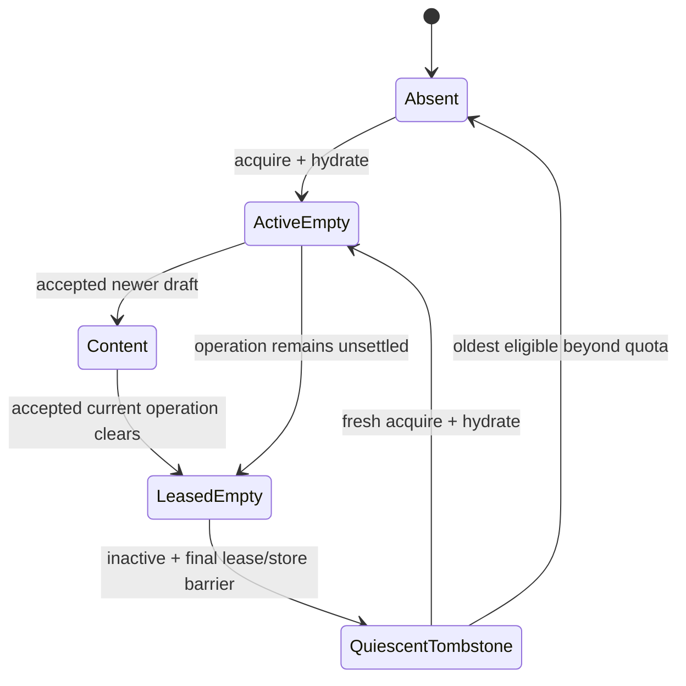

# Composer Revision Bounds Implementation Plan

> **For agentic workers:** REQUIRED SUB-SKILL: Use superpowers:subagent-driven-development (recommended) or superpowers:executing-plans to implement this plan task-by-task. Steps use checkbox (`- [ ]`) syntax for tracking.

**Goal:** Replace numeric composer revisions with an exact string wire type and bound live main/thread revision tombstones without collecting non-empty, active, or unsettled targets.

**Architecture:** Rust owns a checked `ComposerDraftRevision(u128)`, account-and-target-scoped lifecycle leases, and 128/256 quiescent-tombstone LRU queues. Tauri transports canonical decimal strings and lease identities, while one frontend lifecycle registry owns only active DOM overlays and bounded quiescent coordinator entries; Rust projects the accepted-clear revision used by the IME sync key.

**Tech Stack:** Rust 2024, serde/serde_json, Tokio actor channels, Tauri 2, TypeScript 6, React 19, Vitest, Playwright, encrypted file persistence, GitHub Actions.

---

## Execution Rules

- Work from the isolated issue branch/worktree created for #294.
- Read and follow
  `docs/superpowers/specs/2026-07-24-composer-revision-bounds-design.md`,
  `REPOSITORY_RULES.md`, `AGENTS.md`,
  `docs/architecture/overview.md`,
  `docs/architecture/state-machine.md`, and
  `docs/policies/engineering-rules.md` before editing.
- Preserve the RED test and its exact command in each task. Do not implement a
  behavior before its named RED test fails for the expected reason.
- Use synthetic `example.invalid`/`example.test` fixture identities only.
  Assertions inspect typed state, wire JSON, or DOM, never logs or fixed sleeps.
- Do not use `saturating_add`, wrapping arithmetic, JavaScript `number`,
  `Math.max`, or string lexicographic comparison for composer revisions.
- Do not commit a half-migrated numeric/string wire. Task 3 intentionally
  continues directly into Task 4; their changes form one atomic wire commit.
- Run the named focused gate before every commit. The main agent re-runs every
  gate; subagent results are drafts, not evidence.

### Shared hot-file ownership

The main agent exclusively integrates these shared surfaces:

- `crates/koushi-state/src/{action.rs,lib.rs,state/mod.rs,state/timeline.rs,reducer/mod.rs,reducer/timeline.rs,reducer/thread.rs}`;
- `crates/koushi-core/src/{command.rs,failure.rs,runtime.rs,account.rs,timeline.rs}`;
- `apps/desktop/src-tauri/src/{lib.rs,dto.rs,commands/mod.rs,commands/timeline.rs}`;
- `apps/desktop/src/{App.tsx,backend/client.ts,backend/browserFakeApi.ts,test/tauriIpcMock.ts,test/appHarnessMain.tsx}`;
- `apps/desktop/src/domain/{types.ts,coreEvents.ts,coreEvents.generated.json}`;
- `apps/desktop/e2e/basic-operations.spec.ts`; and
- the three canon documents.

No two agents edit one of those files concurrently. Bounded agents may own only
the new focused modules and tests explicitly assigned to them:

- `crates/koushi-state/src/composer_revision.rs`;
- `crates/koushi-state/src/state/composer_draft.rs`;
- `crates/koushi-state/tests/composer_revision_bounds.rs`;
- `crates/koushi-core/src/composer_draft_lifecycle.rs`;
- `crates/koushi-core/src/store/composer_drafts.rs`;
- `crates/koushi-core/tests/composer_draft_lifecycle.rs`;
- `apps/desktop/src/domain/composerDraftLifecycle.ts`; and
- `apps/desktop/src/domain/composerDraftLifecycle.test.ts`.

The main agent reviews and integrates every bounded-agent diff before moving to
the next task.

## File Responsibility Map

- `crates/koushi-state/src/composer_revision.rs`: canonical decimal grammar,
  checked `u128` ordering/successor, string-only serde, redacted `Debug`.
- `crates/koushi-state/src/state/composer_draft.rs`: room/thread content,
  revision entries, accepted-clear token, quiescent LRU, collection invariant.
- `crates/koushi-core/src/composer_draft_lifecycle.rs`: account/target/renderer
  lease registry, command permits, revocation, protected-set snapshots.
- `crates/koushi-core/src/store/composer_drafts.rs`: encrypted payload v1/v2
  decode/encode, legacy numeric migration, persisted lifecycle order.
- `apps/desktop/src/domain/types.ts`: the single branded string wire type used
  by DTOs and domain helpers.
- `apps/desktop/src/domain/composerDraftRevision.ts`: checked `bigint`
  parse/compare/successor helpers only; it imports the brand from `types.ts` so
  `types.ts` never imports back from the helper.
- `apps/desktop/src/domain/composerDraftLifecycle.ts`: active lease, latest
  local overlay, debounce, operation counts, retirement, frontend LRU.
- `apps/desktop/src/App.tsx`: active main/thread presentation wiring only; no
  cross-target draft body map and no local Rust-quiescence decision.

### Task 1: Amend canon before implementation

**Files:**

- Modify: `docs/architecture/overview.md`
- Modify: `docs/architecture/state-machine.md`
- Modify: `docs/policies/engineering-rules.md`

- [ ] **Step 1: Add the normative ownership and wire clauses**

Add these exact contracts to the existing composer-draft sections:

```text
- ComposerDraftRevision is an opaque canonical decimal string on every
  snapshot and IPC boundary. Rust owns checked u128 comparison/successor;
  JavaScript number conversion, wrapping, and saturation are forbidden.
- Empty revision history is retained in lifecycle order. Only empty, inactive,
  zero-lease targets are quiescent tombstones. Main retains 128 and thread
  retains 256 quiescent tombstones.
- The live bound is protected targets plus the fixed tombstone quota. Non-empty,
  active, debounce/IPC/submission/schedule/upload-pending, command-pending, and
  store-pending targets are protected and cannot be eviction victims.
- Every revision-bearing producer acquires the exact account/target/renderer
  lease before it can schedule or enter Core. Lease admission/release and
  victim selection are serialized.
- last_accepted_clear_revision advances only when an accepted operation
  actually clears current content. React uses it in the active IME sync key;
  ordinary draft persistence and accepted preservation of newer input do not
  change it.
- Diagnostics expose counts and coarse lifecycle outcomes only, never draft
  bodies, Matrix identifiers, revisions, leases, filesystem paths, or raw
  errors.
```

- [ ] **Step 2: Add the guarded state transition**

Add this state-machine text and diagram beside the #293 composer diagram:

```text
Content/ActiveEmpty/LeasedEmpty are protected.
LeasedEmpty becomes QuiescentTombstone only after the final command/store lease
settles while the target is inactive. QuiescentTombstone is the only state that
can become Absent through quota collection. A retired generation cannot
reacquire or deliver a command; a fresh generation rehydrates Rust first.
```



- [ ] **Step 3: Verify the canon contains every guard**

Run:

```bash
rg -n "ComposerDraftRevision|QuiescentTombstone|last_accepted_clear_revision|128|256|lease" \
  docs/architecture/overview.md \
  docs/architecture/state-machine.md \
  docs/policies/engineering-rules.md
```

Expected: all three files contain the new string-wire, protected-target,
quiescence, IME-token, and privacy clauses.

- [ ] **Step 4: Commit the canon checkpoint**

```bash
git add docs/architecture/overview.md docs/architecture/state-machine.md docs/policies/engineering-rules.md
git commit -m "docs(composer): define bounded revision lifecycle"
```

### Task 2: Add the checked Rust revision newtype

**Files:**

- Create: `crates/koushi-state/src/composer_revision.rs`
- Create: `crates/koushi-state/tests/composer_revision_bounds.rs`
- Modify: `crates/koushi-state/src/lib.rs`

- [ ] **Step 1: Write RED tests for exact wire behavior**

Create `crates/koushi-state/tests/composer_revision_bounds.rs` with:

```rust
use koushi_state::{ComposerDraftRevision, ComposerDraftRevisionError};

#[test]
fn composer_revision_round_trips_as_a_canonical_decimal_string() {
    let revision =
        ComposerDraftRevision::parse_wire("9007199254740993").expect("valid revision");
    assert_eq!(
        serde_json::to_string(&revision).expect("serialize"),
        "\"9007199254740993\""
    );
    assert_eq!(
        serde_json::from_str::<ComposerDraftRevision>("\"9007199254740993\"")
            .expect("deserialize"),
        revision
    );
}

#[test]
fn composer_revision_rejects_non_canonical_wire_values() {
    for invalid in ["", "00", "01", "-1", "+1", " 1", "1 ", "1.0", "1e3"] {
        assert!(
            ComposerDraftRevision::parse_wire(invalid).is_err(),
            "{invalid:?} must be rejected"
        );
    }
    assert!(serde_json::from_str::<ComposerDraftRevision>("1").is_err());
}

#[test]
fn composer_revision_advances_exactly_above_javascript_safe_integer() {
    let current =
        ComposerDraftRevision::parse_wire("9007199254740993").expect("valid revision");
    let next = ComposerDraftRevision::checked_successor(current, current).expect("advance");
    assert_eq!(next.to_wire_string(), "9007199254740994");
}

#[test]
fn composer_revision_exhaustion_is_checked() {
    let maximum_wire = "340282366920938463463374607431768211455";
    let maximum =
        ComposerDraftRevision::parse_wire(maximum_wire).expect("valid u128 maximum");
    assert_eq!(
        serde_json::to_string(&maximum).expect("serialize maximum"),
        format!("\"{maximum_wire}\"")
    );
    assert_eq!(
        ComposerDraftRevision::checked_successor(
            ComposerDraftRevision::MAX,
            ComposerDraftRevision::MAX
        ),
        Err(ComposerDraftRevisionError::Exhausted)
    );
}
```

- [ ] **Step 2: Run the new test and require RED**

Run:

```bash
cargo test -p koushi-state --test composer_revision_bounds -- --nocapture
```

Expected: compilation fails because `ComposerDraftRevision` and
`ComposerDraftRevisionError` do not exist.

- [ ] **Step 3: Implement the minimal checked newtype**

Create `crates/koushi-state/src/composer_revision.rs`:

```rust
use core::fmt;
use serde::{Deserialize, Deserializer, Serialize, Serializer, de};

#[derive(Clone, Copy, Default, Eq, Hash, Ord, PartialEq, PartialOrd)]
pub struct ComposerDraftRevision(u128);

#[derive(Clone, Copy, Debug, Eq, PartialEq)]
pub enum ComposerDraftRevisionError {
    InvalidWire,
    Exhausted,
}

impl ComposerDraftRevision {
    pub const ZERO: Self = Self(0);
    pub const MAX: Self = Self(u128::MAX);

    pub const fn from_u64(value: u64) -> Self {
        Self(value as u128)
    }

    pub const fn is_zero(self) -> bool {
        self.0 == 0
    }

    pub fn parse_wire(value: &str) -> Result<Self, ComposerDraftRevisionError> {
        let canonical = value == "0"
            || (!value.is_empty()
                && value.len() <= 39
                && !value.starts_with('0')
                && value.bytes().all(|byte| byte.is_ascii_digit()));
        if !canonical {
            return Err(ComposerDraftRevisionError::InvalidWire);
        }
        value
            .parse::<u128>()
            .map(Self)
            .map_err(|_| ComposerDraftRevisionError::InvalidWire)
    }

    pub fn checked_successor(
        authoritative: Self,
        submitted: Self,
    ) -> Result<Self, ComposerDraftRevisionError> {
        authoritative
            .0
            .max(submitted.0)
            .checked_add(1)
            .map(Self)
            .ok_or(ComposerDraftRevisionError::Exhausted)
    }

    pub fn to_wire_string(self) -> String {
        self.0.to_string()
    }
}

impl From<u64> for ComposerDraftRevision {
    fn from(value: u64) -> Self {
        Self::from_u64(value)
    }
}

impl fmt::Debug for ComposerDraftRevision {
    fn fmt(&self, formatter: &mut fmt::Formatter<'_>) -> fmt::Result {
        formatter.write_str("ComposerDraftRevision(REDACTED)")
    }
}

impl Serialize for ComposerDraftRevision {
    fn serialize<S>(&self, serializer: S) -> Result<S::Ok, S::Error>
    where
        S: Serializer,
    {
        serializer.serialize_str(&self.to_wire_string())
    }
}

impl<'de> Deserialize<'de> for ComposerDraftRevision {
    fn deserialize<D>(deserializer: D) -> Result<Self, D::Error>
    where
        D: Deserializer<'de>,
    {
        struct RevisionVisitor;

        impl de::Visitor<'_> for RevisionVisitor {
            type Value = ComposerDraftRevision;

            fn expecting(&self, formatter: &mut fmt::Formatter<'_>) -> fmt::Result {
                formatter.write_str("a canonical decimal composer revision string")
            }

            fn visit_str<E>(self, value: &str) -> Result<Self::Value, E>
            where
                E: de::Error,
            {
                ComposerDraftRevision::parse_wire(value)
                    .map_err(|_| E::custom("invalid composer revision"))
            }
        }

        deserializer.deserialize_str(RevisionVisitor)
    }
}
```

Add to `crates/koushi-state/src/lib.rs`:

```rust
mod composer_revision;

pub use composer_revision::{ComposerDraftRevision, ComposerDraftRevisionError};
```

- [ ] **Step 4: Run focused tests and formatting**

Run:

```bash
cargo fmt --all -- --check
cargo test -p koushi-state --test composer_revision_bounds -- --nocapture
```

Expected: formatting is clean and all four tests pass.

- [ ] **Step 5: Commit the newtype checkpoint**

```bash
git add crates/koushi-state/src/composer_revision.rs crates/koushi-state/src/lib.rs crates/koushi-state/tests/composer_revision_bounds.rs
git commit -m "feat(composer): add exact draft revision type"
```

### Task 3: Convert Rust revision owners to checked revisions

This task and Task 4 are one atomic wire checkpoint. Do not commit after this
task.

**Files:**

- Modify: `crates/koushi-state/src/state/timeline.rs`
- Modify: `crates/koushi-state/src/action.rs`
- Modify: `crates/koushi-state/src/reducer/mod.rs`
- Modify: `crates/koushi-state/src/reducer/timeline.rs`
- Modify: `crates/koushi-state/src/reducer/thread.rs`
- Modify: `crates/koushi-state/tests/timeline_thread_state.rs`
- Modify: `crates/koushi-state/tests/scheduled_send_state.rs`
- Modify: `crates/koushi-core/src/command.rs`
- Modify: `crates/koushi-core/src/failure.rs`
- Modify: `crates/koushi-core/src/runtime.rs`
- Modify: `crates/koushi-core/src/account.rs`
- Modify: `crates/koushi-core/src/timeline.rs`
- Modify: `crates/koushi-core/tests/runtime_timeline.rs`
- Modify: `crates/koushi-core/tests/runtime_scheduled_send.rs`
- Modify: `crates/koushi-core/tests/command_redaction.rs`
- Modify: `crates/koushi-core/tests/send_queue_fast.rs`
- Modify: `crates/koushi-core/src/bin/headless-core-qa.rs`

- [ ] **Step 1: Extend RED state tests before replacing fields**

Append these assertions to
`crates/koushi-state/tests/composer_revision_bounds.rs`:

```rust
use koushi_state::ComposerState;

#[test]
fn composer_state_serializes_revision_and_clear_token_as_strings() {
    let composer = ComposerState {
        draft_revision:
            ComposerDraftRevision::parse_wire("9007199254740993").expect("valid revision"),
        last_accepted_clear_revision: ComposerDraftRevision::from_u64(7),
        ..ComposerState::default()
    };
    let value = serde_json::to_value(composer).expect("serialize composer");
    assert_eq!(value["draft_revision"], "9007199254740993");
    assert_eq!(value["last_accepted_clear_revision"], "7");
}

#[test]
fn exhausted_acceptance_does_not_mutate_the_draft() {
    let mut drafts = koushi_state::ComposerDraftStore::default();
    assert!(drafts
        .apply_room_draft(
            "room-a".to_owned(),
            "keep me".to_owned(),
            ComposerDraftRevision::MAX,
        )
        .expect("initial apply"));
    assert_eq!(
        drafts.advance_room_revision("room-a", ComposerDraftRevision::MAX),
        Err(ComposerDraftRevisionError::Exhausted)
    );
    assert_eq!(drafts.rooms.get("room-a").map(String::as_str), Some("keep me"));
}
```

Before implementation, add these exact Core RED cases using the existing
deterministic SDK/store probes:

- `composer_revision_exhaustion_blocks_plain_reply_and_thread_before_matrix_side_effect`:
  set the authoritative revision to `MAX`, submit plain, reply, and thread
  operations at `MAX`, and after each assert
  `TimelineFailureKind::ComposerRevisionExhausted`, zero SDK send calls, no
  accepted submission ID, unchanged content, and unchanged clear token.
- `composer_revision_exhaustion_blocks_scheduled_send_before_store_or_matrix_side_effect`:
  submit schedule creation at `MAX` and assert the coarse failure, zero
  schedule-store writes, zero SDK sends, and unchanged draft state.
- `composer_revision_exhaustion_blocks_prepared_upload_before_first_upload`:
  submit a two-item prepared upload at `MAX` and assert the coarse failure,
  zero upload/send calls, no pending transaction, and unchanged draft state.

- [ ] **Step 2: Run the state test and require RED**

```bash
cargo test -p koushi-state --test composer_revision_bounds -- --nocapture
cargo test -p koushi-core --test runtime_timeline composer_revision_exhaustion -- --nocapture
cargo test -p koushi-core --test runtime_scheduled_send composer_revision_exhaustion -- --nocapture
```

Expected: compilation fails because `ComposerState` still uses `u64`,
`last_accepted_clear_revision` is absent, and draft-store methods do not return
checked results; the Core cases also show current paths can reach side effects.

- [ ] **Step 3: Replace every Rust revision field and checked successor**

Use these exact state shapes:

```rust
pub struct ComposerDraftStore {
    pub rooms: BTreeMap<String, String>,
    pub threads: BTreeMap<String, BTreeMap<String, String>>,
    pub room_revisions: BTreeMap<String, ComposerDraftRevision>,
    pub thread_revisions: BTreeMap<String, BTreeMap<String, ComposerDraftRevision>>,
    pub room_last_accepted_clear_revisions: BTreeMap<String, ComposerDraftRevision>,
    pub thread_last_accepted_clear_revisions:
        BTreeMap<String, BTreeMap<String, ComposerDraftRevision>>,
}

pub struct ComposerState {
    pub accepted_submission_ids: VecDeque<SubmissionId>,
    pub pending_submission_id: Option<SubmissionId>,
    pub pending_transaction_id: Option<String>,
    pub pending_send_kind: Option<PendingComposerSendKind>,
    pub draft_revision: ComposerDraftRevision,
    pub last_accepted_clear_revision: ComposerDraftRevision,
    pub draft: String,
    pub mode: ComposerMode,
}
```

Use checked return signatures:

```rust
pub fn apply_room_draft(
    &mut self,
    room_id: String,
    draft: String,
    revision: ComposerDraftRevision,
) -> Result<bool, ComposerDraftRevisionError>;

pub fn advance_room_revision(
    &mut self,
    room_id: &str,
    submitted: ComposerDraftRevision,
) -> Result<ComposerDraftRevision, ComposerDraftRevisionError>;

pub fn apply_thread_draft(
    &mut self,
    room_id: String,
    root_event_id: String,
    draft: String,
    revision: ComposerDraftRevision,
) -> Result<bool, ComposerDraftRevisionError>;

pub fn advance_thread_revision(
    &mut self,
    room_id: &str,
    root_event_id: &str,
    submitted: ComposerDraftRevision,
) -> Result<ComposerDraftRevision, ComposerDraftRevisionError>;
```

For accepted clears, set the clear token only in the branch that removes
current content:

```rust
let next = ComposerDraftRevision::checked_successor(current, submitted)?;
if current <= submitted {
    self.rooms.remove(room_id);
    self.room_last_accepted_clear_revisions
        .insert(room_id.to_owned(), next);
}
self.room_revisions.insert(room_id.to_owned(), next);
Ok(next)
```

Repeat the exact guard for thread roots. When `current > submitted`, preserve
content and the prior clear token.

Replace every `u64` composer revision in the named state actions, Core
commands, Account/Timeline messages, reducer handlers, scheduled-send path,
prepared-upload acceptance path, and QA builders with
`ComposerDraftRevision`. Add
`TimelineFailureKind::ComposerRevisionExhausted`; Core maps checked failure to
that coarse kind without a revision or target in `Debug`.

- [ ] **Step 4: Update Rust fixtures mechanically and prove no numeric field remains**

Use `ComposerDraftRevision::from_u64(N)` in Rust struct literals. Then run:

```bash
rg -n "draft_revision: u64|submitted_revision: u64|BTreeMap<String, u64>|saturating_add\\(1\\)" \
  crates/koushi-state/src \
  crates/koushi-core/src \
  apps/desktop/src-tauri/src
```

Expected: no composer-revision match. Unrelated counters may still use
`saturating_add(1)` outside the composer files.

- [ ] **Step 5: Run the Rust RED/GREEN set**

```bash
cargo test -p koushi-state --test composer_revision_bounds -- --nocapture
cargo test -p koushi-state --test timeline_thread_state composer_draft_revision -- --nocapture
cargo test -p koushi-state --test scheduled_send_state scheduled_send_acceptance_fences_delayed_draft_persistence -- --nocapture
cargo test -p koushi-core --test runtime_timeline composer_draft -- --nocapture
cargo test -p koushi-core --test runtime_timeline composer_revision_exhaustion -- --nocapture
cargo test -p koushi-core --test runtime_scheduled_send -- --nocapture
cargo test -p koushi-core --test runtime_scheduled_send composer_revision_exhaustion -- --nocapture
cargo test -p koushi-core --test command_redaction -- --nocapture
```

Expected: all named Rust tests pass. Tauri/TypeScript wire remains intentionally
RED until Task 4.

### Task 4: Complete the string wire, schema 3, and contract artifacts

**Files:**

- Modify: `apps/desktop/src-tauri/src/dto.rs`
- Modify: `apps/desktop/src-tauri/src/commands/mod.rs`
- Modify: `apps/desktop/src-tauri/src/commands/timeline.rs`
- Modify: `apps/desktop/src-tauri/src/lib.rs`
- Modify: `apps/desktop/src-tauri/tests/golden/frontend_app_state.json`
- Modify: `apps/desktop/src/domain/composerDraftRevision.ts`
- Modify: `apps/desktop/src/domain/composerDraftRevision.test.ts`
- Modify: `apps/desktop/src/domain/types.ts`
- Modify: `apps/desktop/src/domain/coreEvents.generated.json`
- Modify: `apps/desktop/src/backend/client.ts`
- Modify: `apps/desktop/src/backend/client.test.ts`
- Modify: `apps/desktop/src/backend/browserFakeApi.ts`
- Modify: `apps/desktop/src/backend/browserFakeApi.test.ts`
- Modify: `apps/desktop/src/App.tsx`
- Modify: `apps/desktop/src/App.test.tsx`
- Modify: `apps/desktop/src/test/appHarnessMain.tsx`
- Modify: `apps/desktop/src/test/tauriIpcMock.ts`
- Modify: `apps/desktop/src/domain/appStore.test.ts`
- Modify: `apps/desktop/src/domain/diagnostics.test.ts`
- Modify: `apps/desktop/src/components/TimelinePane.renderIsolation.test.tsx`
- Modify: `apps/desktop/e2e/basic-operations.spec.ts`

- [ ] **Step 1: Rewrite TypeScript revision tests to require exact strings**

Replace number expectations in
`apps/desktop/src/domain/composerDraftRevision.test.ts` with:

```ts
import { describe, expect, it } from "vitest";
import {
  COMPOSER_DRAFT_REVISION_ZERO,
  ComposerDraftRevisionExhaustedError,
  compareComposerDraftRevisions,
  nextComposerDraftRevision,
  parseComposerDraftRevision
} from "./composerDraftRevision";

describe("composer draft revision wire", () => {
  it("advances exactly above Number.MAX_SAFE_INTEGER", () => {
    const current = parseComposerDraftRevision("9007199254740993");
    expect(nextComposerDraftRevision(current, current)).toBe("9007199254740994");
  });

  it("rejects non-canonical and numeric-shaped input", () => {
    for (const value of ["", "00", "01", "-1", "+1", " 1", "1 ", "1.0", "1e3"]) {
      expect(() => parseComposerDraftRevision(value)).toThrow();
    }
    expect(COMPOSER_DRAFT_REVISION_ZERO).toBe("0");
  });

  it("compares by bigint rather than lexicographic order", () => {
    expect(
      compareComposerDraftRevisions(
        parseComposerDraftRevision("10"),
        parseComposerDraftRevision("9")
      )
    ).toBeGreaterThan(0);
  });

  it("fails closed at u128 max", () => {
    const maximum = parseComposerDraftRevision(
      "340282366920938463463374607431768211455"
    );
    expect(() => nextComposerDraftRevision(maximum, maximum)).toThrow(
      ComposerDraftRevisionExhaustedError
    );
  });
});
```

- [ ] **Step 2: Run the TypeScript test and Tauri golden test for RED**

```bash
npm --prefix apps/desktop run test -- --run src/domain/composerDraftRevision.test.ts
cargo test -p koushi-desktop composer_revision_tauri_wire_round_trips_max_and_rejects_numeric -- --nocapture
cargo test -p koushi-desktop frontend_app_state_golden_matches_maximally_populated_state -- --nocapture
```

Expected: the TypeScript test fails because the helper still uses `number`;
the Tauri golden test fails because schema/revision JSON has changed.

- [ ] **Step 3: Implement the branded TypeScript revision helper**

Define the only TypeScript brand in
`apps/desktop/src/domain/types.ts`:

```ts
export type ComposerDraftRevision = string & {
  readonly __composerDraftRevision: "ComposerDraftRevision";
};
```

Import that type with `import type` and replace
`apps/desktop/src/domain/composerDraftRevision.ts` revision arithmetic with:

```ts
import type { ComposerDraftRevision } from "./types";

const U128_MAX = 340282366920938463463374607431768211455n;
const CANONICAL_REVISION = /^(0|[1-9][0-9]{0,38})$/;

export const COMPOSER_DRAFT_REVISION_ZERO =
  "0" as ComposerDraftRevision;

export class ComposerDraftRevisionExhaustedError extends Error {
  readonly kind = "composer_revision_exhausted";

  constructor() {
    super("composer revision exhausted");
    this.name = "ComposerDraftRevisionExhaustedError";
  }
}

export function parseComposerDraftRevision(value: string): ComposerDraftRevision {
  if (!CANONICAL_REVISION.test(value)) {
    throw new TypeError("invalid composer revision");
  }
  const parsed = BigInt(value);
  if (parsed > U128_MAX) {
    throw new TypeError("invalid composer revision");
  }
  return value as ComposerDraftRevision;
}

export function compareComposerDraftRevisions(
  left: ComposerDraftRevision,
  right: ComposerDraftRevision
): number {
  const leftValue = BigInt(left);
  const rightValue = BigInt(right);
  return leftValue < rightValue ? -1 : leftValue > rightValue ? 1 : 0;
}

export function nextComposerDraftRevision(
  authoritative: ComposerDraftRevision,
  submitted: ComposerDraftRevision
): ComposerDraftRevision {
  const next = (BigInt(authoritative) > BigInt(submitted)
    ? BigInt(authoritative)
    : BigInt(submitted)) + 1n;
  if (next > U128_MAX) {
    throw new ComposerDraftRevisionExhaustedError();
  }
  return parseComposerDraftRevision(next.toString());
}
```

Keep coordinator compatibility only long enough for Task 8 to replace it; all
coordinator methods now accept/return `ComposerDraftRevision` and call the
shared compare/successor helpers.

- [ ] **Step 4: Change schema and all primary wire signatures atomically**

Set:

```rust
pub const SNAPSHOT_SCHEMA_VERSION: u32 = 3;
```

and:

```ts
export const SNAPSHOT_SCHEMA_VERSION = 3;

export interface ComposerState {
  accepted_submission_ids: string[];
  pending_submission_id?: string | null;
  pending_transaction_id: string | null;
  draft: string;
  draft_revision: ComposerDraftRevision;
  last_accepted_clear_revision: ComposerDraftRevision;
  mode: ComposerMode;
}

export interface ComposerDraftAcceptanceResponse {
  acceptedRevision: ComposerDraftRevision | null;
  snapshot: DesktopSnapshot;
}
```

Every Tauri revision parameter and `ComposerDraftAcceptanceResponse` field uses
`koushi_state::ComposerDraftRevision`. Add the serialized
`composerRevisionExhausted` submission/command failure and map it before
Matrix, schedule, upload, reducer, or store side effects.

Change every TypeScript default/fixture from numeric `0`, `1`, `2`, or `3` to
the corresponding canonical string. Backend client defaults use
`COMPOSER_DRAFT_REVISION_ZERO`; no production signature accepts
`number | ComposerDraftRevision`.

Add
`composer_revision_tauri_wire_round_trips_max_and_rejects_numeric` beside the
existing DTO/contract tests. Set main and thread composer revisions and clear
tokens to `ComposerDraftRevision::MAX`, serialize `FrontendAppState`, and
assert the four fields are
`"340282366920938463463374607431768211455"`. Then assert deserializing a
numeric JSON composer revision into the Tauri command parameter type fails.

- [ ] **Step 5: Regenerate the full snapshot golden**

```bash
UPDATE_GOLDEN=1 cargo test -p koushi-desktop frontend_app_state_golden_matches_maximally_populated_state -- --nocapture
cargo test -p koushi-desktop frontend_app_state_golden_matches_maximally_populated_state -- --nocapture
```

Expected: the generated artifact contains `"schema_version": 3`,
`"draft_revision": "0"`, and
`"last_accepted_clear_revision": "0"`; the second command passes.

- [ ] **Step 6: Regenerate `coreEvents.generated.json` through the Rust test**

Temporarily insert immediately after `actual_contract` is built in
`core_event_wire_format_matches_checked_in_contract_artifact`:

```rust
if std::env::var("UPDATE_CONTRACT").as_deref() == Ok("1") {
    std::fs::write(
        concat!(
            env!("CARGO_MANIFEST_DIR"),
            "/../src/domain/coreEvents.generated.json"
        ),
        serde_json::to_string_pretty(&actual_contract).expect("format contract"),
    )
    .expect("write contract");
    return;
}
```

Run:

```bash
UPDATE_CONTRACT=1 cargo test -p koushi-desktop core_event_wire_format_matches_checked_in_contract_artifact -- --nocapture
```

Remove the temporary branch. Then run:

```bash
cargo test -p koushi-desktop core_event_wire_format_matches_checked_in_contract_artifact -- --nocapture
```

Expected: the checked artifact contains schema version 3 and the contract test
passes. Review the artifact diff and reject unrelated reformatting or key
reordering.

- [ ] **Step 7: Inventory and focused wire gates**

```bash
rg -n "draft_revision: [0-9]|draftRevision: [0-9]|draft_revision: number|draftRevision: number|acceptedRevision: number" \
  apps/desktop/src \
  apps/desktop/e2e \
  apps/desktop/src-tauri
cargo test -p koushi-state --test composer_revision_bounds -- --nocapture
cargo test -p koushi-desktop composer_revision_tauri_wire_round_trips_max_and_rejects_numeric -- --nocapture
cargo test -p koushi-desktop
npm --prefix apps/desktop run test -- --run src/domain/composerDraftRevision.test.ts src/backend/client.test.ts
npm --prefix apps/desktop run typecheck
```

Expected: the inventory has no composer numeric-wire match; all commands pass.

- [ ] **Step 8: Commit the atomic revision-wire checkpoint**

```bash
git add \
  crates/koushi-state/src/state/timeline.rs \
  crates/koushi-state/src/action.rs \
  crates/koushi-state/src/reducer/mod.rs \
  crates/koushi-state/src/reducer/timeline.rs \
  crates/koushi-state/src/reducer/thread.rs \
  crates/koushi-state/tests/composer_revision_bounds.rs \
  crates/koushi-state/tests/timeline_thread_state.rs \
  crates/koushi-state/tests/scheduled_send_state.rs \
  crates/koushi-core/src/command.rs \
  crates/koushi-core/src/failure.rs \
  crates/koushi-core/src/runtime.rs \
  crates/koushi-core/src/account.rs \
  crates/koushi-core/src/timeline.rs \
  crates/koushi-core/src/bin/headless-core-qa.rs \
  crates/koushi-core/tests/runtime_timeline.rs \
  crates/koushi-core/tests/runtime_scheduled_send.rs \
  crates/koushi-core/tests/command_redaction.rs \
  crates/koushi-core/tests/send_queue_fast.rs \
  apps/desktop/src-tauri/src/dto.rs \
  apps/desktop/src-tauri/src/commands/mod.rs \
  apps/desktop/src-tauri/src/commands/timeline.rs \
  apps/desktop/src-tauri/src/lib.rs \
  apps/desktop/src-tauri/tests/golden/frontend_app_state.json \
  apps/desktop/src/domain/composerDraftRevision.ts \
  apps/desktop/src/domain/composerDraftRevision.test.ts \
  apps/desktop/src/domain/types.ts \
  apps/desktop/src/domain/coreEvents.generated.json \
  apps/desktop/src/backend/client.ts \
  apps/desktop/src/backend/client.test.ts \
  apps/desktop/src/backend/browserFakeApi.ts \
  apps/desktop/src/backend/browserFakeApi.test.ts \
  apps/desktop/src/App.tsx \
  apps/desktop/src/App.test.tsx \
  apps/desktop/src/test/appHarnessMain.tsx \
  apps/desktop/src/test/tauriIpcMock.ts \
  apps/desktop/src/domain/appStore.test.ts \
  apps/desktop/src/domain/diagnostics.test.ts \
  apps/desktop/src/components/TimelinePane.renderIsolation.test.tsx \
  apps/desktop/e2e/basic-operations.spec.ts
git diff --cached --name-only
git commit -m "feat(composer): use exact string revisions"
```

Expected before commit: the staged inventory contains only the files listed in
Tasks 3 and 4.

### Task 5: Add the Rust quiescent-tombstone lifecycle and LRU

**Files:**

- Create: `crates/koushi-state/src/state/composer_draft.rs`
- Modify: `crates/koushi-state/src/state/mod.rs`
- Modify: `crates/koushi-state/src/state/timeline.rs`
- Modify: `crates/koushi-state/src/lib.rs`
- Modify: `crates/koushi-state/tests/composer_revision_bounds.rs`
- Modify: `crates/koushi-state/tests/timeline_thread_state.rs`

- [ ] **Step 1: Add RED lifecycle tests with non-lexical target order**

Add these exact tests and arrangements:

- `room_tombstones_evict_oldest_quiescent_not_lexical_first`: insert 128 empty
  revisions starting with `z-oldest`, activate then deactivate the middle
  `a-touched-middle` target so it becomes newest in lifecycle order, then add
  `b-newest`; reconcile with no protection and assert `z-oldest` is absent
  while both `a-touched-middle` and `b-newest` remain.
- `thread_tombstones_are_bounded_and_root_isolated`: insert 257 empty thread
  revisions alternating roots in one room, with `z-root/z-oldest` first and
  `a-root/a-newest` last; reconcile and assert exactly the first tuple is
  absent, both roots retain their other entries, and the quota is 256.
- `content_active_and_leased_targets_survive_tombstone_churn`: create one
  non-empty room target, one active-empty room target, and one leased-empty
  room target before 129 unprotected empty targets; reconcile using exact
  `ComposerTarget` values and assert all three protected targets remain even
  though the live count exceeds 128.
- `released_empty_targets_become_collectible`: remove the active and leased
  sets from the preceding fixture, reconcile again, and assert the released
  empty entries are collected in lifecycle order until the quota is 128.
- `accepted_clear_token_changes_only_when_current_content_clears`: persist
  content at revision 7, accept revision 7 and assert both revision and clear
  token become 8; persist newer content at revision 10, accept stale revision
  8, and assert revision becomes 11 while the content and clear token 8 remain.

Use `ComposerDraftRevision::from_u64` in every fixture. The key assertions are:

```rust
assert_eq!(store.quiescent_room_tombstone_count(), 128);
assert_eq!(store.quiescent_thread_tombstone_count(), 256);
assert!(store.room_revision("z-oldest").is_zero());
assert!(!store.room_revision("a-newest").is_zero());
assert_eq!(store.rooms.get("protected-content").map(String::as_str), Some("draft"));
assert!(!store.room_revision("protected-active").is_zero());
assert!(!store.room_revision("protected-leased").is_zero());
```

- [ ] **Step 2: Run the lifecycle tests for RED**

```bash
cargo test -p koushi-state --test composer_revision_bounds tombstone -- --nocapture
cargo test -p koushi-state --test composer_revision_bounds accepted_clear -- --nocapture
```

Expected: compilation fails because protection/LRU APIs do not exist.

- [ ] **Step 3: Move draft-store ownership into its focused module**

Create these types in
`crates/koushi-state/src/state/composer_draft.rs`:

```rust
pub const MAX_LIVE_COMPOSER_ROOM_TOMBSTONES: usize = 128;
pub const MAX_LIVE_COMPOSER_THREAD_TOMBSTONES: usize = 256;

#[derive(Clone, Default, Eq, PartialEq)]
pub struct ComposerDraftProtection {
    pub active: BTreeSet<ComposerTarget>,
    pub leased: BTreeSet<ComposerTarget>,
}

#[derive(Clone, Default, Eq, PartialEq)]
pub struct ComposerDraftStore {
    pub rooms: BTreeMap<String, String>,
    pub threads: BTreeMap<String, BTreeMap<String, String>>,
    pub room_revisions: BTreeMap<String, ComposerDraftRevision>,
    pub thread_revisions: BTreeMap<String, BTreeMap<String, ComposerDraftRevision>>,
    pub room_last_accepted_clear_revisions: BTreeMap<String, ComposerDraftRevision>,
    pub thread_last_accepted_clear_revisions:
        BTreeMap<String, BTreeMap<String, ComposerDraftRevision>>,
    quiescent_room_lru: VecDeque<String>,
    quiescent_thread_lru: VecDeque<(String, String)>,
}
```

Move the existing `ComposerDraftStore` methods from `state/timeline.rs` without
changing their #293 write/acceptance semantics. Re-export the store,
protection type, and constants through `state/mod.rs` and `lib.rs`.

- [ ] **Step 4: Implement one reconcile-and-collect owner**

Add:

```rust
pub fn reconcile_lifecycle(&mut self, protection: &ComposerDraftProtection) {
    self.remove_content_and_protected_from_lru(protection);
    self.enqueue_new_quiescent_rooms(protection);
    self.enqueue_new_quiescent_threads(protection);
    self.collect_room_tombstones(protection);
    self.collect_thread_tombstones(protection);
}
```

Each enqueue removes an existing occurrence before `push_back`. Each collector
`pop_front`s until the queue is within quota and removes the revision/clear
token only after rechecking:

```rust
let target = ComposerTarget::Main {
    room_id: room_id.clone(),
};
let eligible = !self.rooms.contains_key(&room_id)
    && !protection.active.contains(&target)
    && !protection.leased.contains(&target);
if eligible {
    self.room_revisions.remove(&room_id);
    self.room_last_accepted_clear_revisions.remove(&room_id);
}
```

Use the corresponding exact room/root check for threads and remove empty nested
maps. Implement redacted `Debug` for `ComposerDraftProtection` and
`ComposerDraftStore`; both print counts only.

- [ ] **Step 5: Run state lifecycle and #293 regression gates**

```bash
cargo fmt --all -- --check
cargo test -p koushi-state --test composer_revision_bounds -- --nocapture
cargo test -p koushi-state --test timeline_thread_state composer_draft_revision -- --nocapture
cargo test -p koushi-state --test scheduled_send_state scheduled_send_acceptance_fences_delayed_draft_persistence -- --nocapture
```

Expected: all tests pass; protected excess remains, and empty released excess
returns to the fixed tombstone quotas.

- [ ] **Step 6: Commit the Rust state lifecycle**

```bash
git add crates/koushi-state/src/state/composer_draft.rs crates/koushi-state/src/state/mod.rs crates/koushi-state/src/state/timeline.rs crates/koushi-state/src/lib.rs crates/koushi-state/tests/composer_revision_bounds.rs crates/koushi-state/tests/timeline_thread_state.rs
git commit -m "feat(composer): bound quiescent revision tombstones"
```

### Task 6: Add Core lease admission, permits, and generation revocation

**Files:**

- Create: `crates/koushi-core/src/composer_draft_lifecycle.rs`
- Create: `crates/koushi-core/tests/composer_draft_lifecycle.rs`
- Modify: `crates/koushi-core/src/lib.rs`
- Modify: `crates/koushi-core/src/command.rs`
- Modify: `crates/koushi-core/src/runtime.rs`
- Modify: `crates/koushi-core/src/account.rs`
- Modify: `crates/koushi-core/src/timeline.rs`
- Modify: `crates/koushi-core/tests/runtime_timeline.rs`
- Modify: `crates/koushi-core/tests/runtime_scheduled_send.rs`
- Modify: `crates/koushi-core/tests/support/mod.rs`

- [ ] **Step 1: Write deterministic RED lease tests**

Create these exact Tokio tests, using oneshot barriers rather than sleeps:

- `queued_stale_write_keeps_exact_target_protected`: acquire the target lease
  at N, obtain the command permit, block actor processing after admission,
  accept the current clear to N+1 through a second admitted command, churn 129
  other room tombstones, release the blocked N write, then assert the target
  revision fence survived and the N content was rejected.
- `retired_renderer_generation_cannot_submit_or_recreate_target`: acquire a
  lease and permit, revoke that generation, assert a second permit request
  returns `RendererGenerationRetired`, release the already admitted permit,
  churn the room quota, and assert no target entry is recreated.
- `account_main_and_thread_leases_are_isolated`: acquire four leases spanning
  two synthetic account keys and main/thread targets with the same synthetic
  room/root text, release only one lease, and assert `protected_targets` for
  each account contains exactly its remaining full targets.
- `persistence_guard_outlives_activation_release`: acquire activation and
  persistence permits, release activation, assert the target remains
  protected, drop the persistence permit, await the registry change
  notification, and assert the target becomes eligible.

The stale-write test ends with:

```rust
assert_eq!(
    snapshot.composer_drafts.room_revision("room-stale"),
    ComposerDraftRevision::from_u64(8)
);
assert_eq!(
    snapshot.composer_drafts.rooms.get("room-stale"),
    None,
    "the admitted stale body must not cross the revision fence"
);
```

- [ ] **Step 2: Run RED**

```bash
cargo test -p koushi-core --test composer_draft_lifecycle -- --nocapture
```

Expected: compilation fails because lifecycle registry and lease-aware command
admission do not exist.

- [ ] **Step 3: Implement the focused lease registry**

Define:

```rust
#[derive(Clone, Eq, Hash, PartialEq)]
pub struct ComposerDraftScope {
    pub account: koushi_key::SessionKeyId,
    pub target: koushi_state::ComposerTarget,
}

#[derive(Clone, Copy, Eq, Hash, PartialEq)]
pub struct ComposerRendererGeneration(u64);

#[derive(Clone, Copy, Eq, Hash, PartialEq)]
pub struct ComposerDraftLeaseId(u64);

pub struct ComposerDraftLeaseRegistry {
    state: Mutex<ComposerDraftLeaseRegistryState>,
    changes: watch::Sender<()>,
}

struct ComposerDraftPermitGuard {
    registry: Weak<ComposerDraftLeaseRegistry>,
    scope: ComposerDraftScope,
    generation: ComposerRendererGeneration,
    kind: ComposerDraftPermitKind,
}

#[derive(Clone)]
pub struct ComposerDraftCommandPermit {
    guard: Arc<ComposerDraftPermitGuard>,
}

#[derive(Clone)]
pub struct ComposerDraftPersistencePermit {
    guard: Arc<ComposerDraftPermitGuard>,
}
```

Registry methods are:

```rust
pub fn begin_renderer_generation(
    &self,
) -> Result<ComposerRendererGeneration, ComposerDraftLeaseFailure>;
pub fn acquire(
    self: &Arc<Self>,
    generation: ComposerRendererGeneration,
    scope: ComposerDraftScope,
) -> Result<ComposerDraftLeaseId, ComposerDraftLeaseFailure>;
pub fn try_command_permit(
    self: &Arc<Self>,
    generation: ComposerRendererGeneration,
    lease_id: ComposerDraftLeaseId,
    scope: &ComposerDraftScope,
) -> Result<ComposerDraftCommandPermit, ComposerDraftLeaseFailure>;
pub fn release(
    &self,
    generation: ComposerRendererGeneration,
    lease_id: ComposerDraftLeaseId,
) -> Result<(), ComposerDraftLeaseFailure>;
pub fn revoke_generation(&self, generation: ComposerRendererGeneration);
pub fn persistence_permits(
    self: &Arc<Self>,
    account: &koushi_key::SessionKeyId,
    targets: impl IntoIterator<Item = koushi_state::ComposerTarget>,
) -> Result<Vec<ComposerDraftPersistencePermit>, ComposerDraftLeaseFailure>;
pub fn protected_targets(
    &self,
    account: &koushi_key::SessionKeyId,
) -> BTreeSet<koushi_state::ComposerTarget>;
```

Implement `Drop` on `ComposerDraftPermitGuard`; cloned permits share the guard
and decrement the registry only when the final `Arc` drops. Use checked
counters; exhaustion returns a coarse failure. Implement redacted `Debug` for
scope, generation, lease ID, permits, and the registry so it exposes only
counts and enum kinds, never account/room/root text or numeric identities.

- [ ] **Step 4: Carry permits atomically through the Core inbox**

Replace the Core command channel item with:

```rust
struct CoreCommandEnvelope {
    command: CoreCommand,
    composer_permit: Option<ComposerDraftCommandPermit>,
}
```

Add `CoreCommand::composer_draft_scope()` for exactly these revision-bearing
commands:

```text
SetComposerDraft
SetThreadComposerDraft
AcceptComposerDraft
ScheduleSend
plain/reply/thread submission commands carrying draft_revision
prepared-upload acceptance
```

`CoreCommandHandle::command_with_composer_lease` acquires the permit before
`send().await`; failure never enters the channel. Normal commands use an
envelope with no permit. AppActor holds the envelope through reducer handling.
The account/timeline forwarding path retains a cloned permit until its
revision-bearing acceptance action is projected.

- [ ] **Step 5: Reconcile Rust LRU whenever protection changes**

Add the registry watch receiver to the AppActor `select!` loop. On a change:

```rust
let protection = ComposerDraftProtection {
    active: active_composer_targets(&self.state),
    leased: self
        .composer_draft_leases
        .protected_targets(&current_session_key),
};
self.state
    .composer_drafts
    .reconcile_lifecycle(&protection);
```

Run the same reconciliation after a command/action batch and before scheduling
the encrypted persistence snapshot.

- [ ] **Step 6: Run Core lifecycle, account, and schedule gates**

```bash
cargo fmt --all -- --check
cargo test -p koushi-core --test composer_draft_lifecycle -- --nocapture
cargo test -p koushi-core --test runtime_timeline composer_draft -- --nocapture
cargo test -p koushi-core --test runtime_scheduled_send -- --nocapture
cargo test -p koushi-core --test command_redaction -- --nocapture
```

Expected: all tests pass; late commands with retired/mismatched leases fail
before reducer or actor effects.

- [ ] **Step 7: Commit the Core lifecycle**

```bash
git add crates/koushi-core/src/composer_draft_lifecycle.rs crates/koushi-core/src/lib.rs crates/koushi-core/src/command.rs crates/koushi-core/src/runtime.rs crates/koushi-core/src/account.rs crates/koushi-core/src/timeline.rs crates/koushi-core/tests/composer_draft_lifecycle.rs crates/koushi-core/tests/runtime_timeline.rs crates/koushi-core/tests/runtime_scheduled_send.rs crates/koushi-core/tests/support/mod.rs
git commit -m "feat(composer): guard revision targets with leases"
```

### Task 7: Add encrypted payload v2 migration and restart order

**Files:**

- Create: `crates/koushi-core/src/store/composer_drafts.rs`
- Modify: `crates/koushi-core/src/store.rs`
- Modify: `crates/koushi-core/src/runtime.rs`
- Modify: `crates/koushi-core/tests/runtime_timeline.rs`
- Modify: `crates/koushi-core/tests/composer_draft_lifecycle.rs`

- [ ] **Step 1: Write RED migration and restart tests**

Add these exact tests:

- `composer_draft_payload_pre_293_defaults_content_revision_and_clear_token_to_zero`:
  decrypt a legacy fixture containing only room/thread bodies, decode it, and
  assert each content entry has revision zero and clear token zero; mutate one
  draft, write v2, decrypt/reload it, and assert the mutation and checked
  revision survive.
- `composer_draft_payload_issue_293_numeric_u64_migrates_losslessly_to_strings`:
  decode room and thread revision `9007199254740993_u64`, encode v2, parse the
  JSON, and assert both wire values equal the string `"9007199254740993"`.
- `composer_draft_payload_v2_rejects_noncanonical_overflow_and_duplicate_order_entries`:
  test `"01"`, u128 max plus one, a duplicate room-order entry, and a duplicate
  thread tuple separately; each decode returns the coarse corruption error
  without a raw value in `Debug`.
- `persisted_lru_evicts_same_oldest_target_after_restart`: persist an
  oldest-to-newest order that conflicts with lexical order, restart, add one
  tombstone, and assert the saved oldest target is absent while the
  lexical-first newer target remains.
- `two_accounts_with_same_targets_migrate_and_collect_independently`: write
  distinct encrypted payloads for two synthetic session keys with identical
  room/root text, migrate both, churn only account A, and assert account B's
  revision/order projection is unchanged.

The lossless migration assertions are:

```rust
assert_eq!(
    encoded["rooms"]["room-large"]["revision"],
    serde_json::json!("9007199254740993")
);
assert_eq!(
    encoded["threads"]["room-large"]["root-large"]["revision"],
    serde_json::json!("9007199254740993")
);
```

- [ ] **Step 2: Run RED**

```bash
cargo test -p koushi-core --lib composer_draft_payload -- --nocapture
cargo test -p koushi-core --test runtime_timeline persisted_lru -- --nocapture
```

Expected: tests fail because the current direct `ComposerDraftStore` JSON has no
payload version or lifecycle order.

- [ ] **Step 3: Implement explicit legacy and v2 payloads**

Create:

```rust
#[derive(Deserialize)]
struct LegacyComposerDraftStoreV1 {
    #[serde(default)]
    rooms: BTreeMap<String, String>,
    #[serde(default)]
    threads: BTreeMap<String, BTreeMap<String, String>>,
    #[serde(default)]
    room_revisions: BTreeMap<String, u64>,
    #[serde(default)]
    thread_revisions: BTreeMap<String, BTreeMap<String, u64>>,
}

#[derive(Serialize, Deserialize)]
struct PersistedComposerDraftStoreV2 {
    schema_version: u8,
    rooms: BTreeMap<String, PersistedComposerDraftEntry>,
    threads: BTreeMap<String, BTreeMap<String, PersistedComposerDraftEntry>>,
    quiescent_room_order: Vec<String>,
    quiescent_thread_order: Vec<(String, String)>,
    protected_empty_rooms: Vec<String>,
    protected_empty_threads: Vec<(String, String)>,
}

#[derive(Serialize, Deserialize)]
struct PersistedComposerDraftEntry {
    content: Option<String>,
    revision: ComposerDraftRevision,
    last_accepted_clear_revision: ComposerDraftRevision,
}
```

Write version 2 only. Decode by inspecting `schema_version`; an absent version
uses the legacy numeric struct. Validate canonical revisions through the
newtype serde, unique order entries, content/order consistency, per-draft
16 KiB truncation, and account-local paths. Legacy empty revision entries have
no lifecycle order: place their full main/thread target tuples in one
simultaneous-retirement group, canonical-sort that group for deterministic
migration only, then enforce the 128/256 quotas.

- [ ] **Step 4: Persist lifecycle order rather than ordered-map truncation**

Replace `bounded_for_persistence()` with:

```rust
pub fn persisted_projection(
    &self,
    protection: &ComposerDraftProtection,
) -> PersistedComposerDraftStoreV2;
```

The projection retains all non-empty and protected entries plus at most
128/256 quiescent entries in LRU order. On full restart, append formerly
protected empty targets after the saved quiescent order, canonical-sort only
that simultaneous-retirement group, then enforce the quota.

Distinguish touch protection from store-pending protection.
Activation/command leases remove empty targets from the quiescent LRU and
retirement enqueues them newest. Persistence holds are non-touching collector
guards: preserve their existing LRU position and persisted quiescent order,
skip them in victim scans, allow their excess beyond the eligible quota, and do
not classify them in `protected_empty_*` solely because a save is pending. A
touch-to-store-pending transition enqueues newest exactly once.

- [ ] **Step 5: Prove ordered StoreActor barriers**

Keep `PendingComposerDraftPersist` newest-wins but add the persistence permit
set:

```rust
struct PendingComposerDraftPersist {
    key_id: koushi_key::SessionKeyId,
    drafts: PersistedComposerDraftStoreV2,
    permits: Vec<ComposerDraftPersistencePermit>,
    deadline: Instant,
}
```

Dropping the activation lease cannot make the target collectible while this
pending/in-progress write exists. Account switch flushes the old key before
installing the new key.

When a same-key debounce replaces pending state, exclude only the old pending
permit set from the new projection's store-pending class. Keep activation,
command, and unrelated persistence protection; acquire the new permit set
before swapping so the old guards drop only after replacement admission.
Permit failure leaves the prior pending payload and permit set untouched.

- [ ] **Step 6: Run persistence and restart GREEN gates**

```bash
cargo test -p koushi-core --lib composer_draft_payload -- --nocapture
cargo test -p koushi-core --lib composer_drafts_are_encrypted_and_reject_corruption -- --nocapture
cargo test -p koushi-core --test runtime_timeline composer_drafts_persist_after_debounce_and_load_on_restart -- --nocapture
cargo test -p koushi-core --test runtime_timeline cleared_composer_drafts_do_not_resurrect_on_restart -- --nocapture
cargo test -p koushi-core --test runtime_timeline persisted_lru -- --nocapture
cargo test -p koushi-core --test composer_draft_lifecycle persistence_guard -- --nocapture
```

Expected: all pass without printing payload content, paths, account IDs, or
revision values.

- [ ] **Step 7: Commit persistence and migration**

```bash
git add crates/koushi-core/src/store/composer_drafts.rs crates/koushi-core/src/store.rs crates/koushi-core/src/runtime.rs crates/koushi-core/tests/runtime_timeline.rs crates/koushi-core/tests/composer_draft_lifecycle.rs
git commit -m "feat(composer): migrate bounded revision persistence"
```

### Task 8: Build the bounded frontend lifecycle registry

**Files:**

- Create: `apps/desktop/src/domain/composerDraftLifecycle.ts`
- Create: `apps/desktop/src/domain/composerDraftLifecycle.test.ts`
- Modify: `apps/desktop/src/domain/composerDraftRevision.ts`
- Modify: `apps/desktop/src/domain/composerDraftRevision.test.ts`
- Modify: `apps/desktop/src/domain/types.ts`

- [ ] **Step 1: Write RED registry tests with a fake clock and deferred promises**

Create these exact Vitest cases with a fake clock and explicit deferred
promises:

- `"bounds room and thread quiescent entries by lifecycle order"`: observe and
  deactivate 128 main and 256 thread scopes beginning with `z-oldest`, reactivate
  and deactivate one lexical-first middle scope to refresh it, then add one
  main and one thread scope; assert the original lifecycle-oldest entries are
  absent, the touched middle and final entries remain, and counts are 128/256.
- `"protects authoritative content active timers and pending operations"`:
  create one entry for each protected cause, churn both quotas, and assert all
  protected entries remain while only unprotected empty entries are collected.
- `"retires protected entries after flush and settlement"`: make an entry
  inactive while its debounce and deferred operation remain, clear the timer,
  resolve the operation, settle its capture, and assert it enters the LRU at
  the fake clock's current sequence.
- `"rejects late completion from a retired renderer generation"`: capture an
  operation, revoke the generation, resolve it, and assert `settleOperation`
  returns `false`, no overlay changes, and no entry is recreated.
- `"isolates complete account main and thread scopes"`: use two complete
  synthetic account tuples with identical room/root text, mutate only one
  account's main and thread scopes, and assert the other account's snapshots
  and counts do not change.
- `"rehydrates rather than max-merging a fresh lease generation"`: seed local
  revision 12, revoke, make the backend acquire resolve with revision 3 and
  clear token 2, and assert the new entry uses 3/2 exactly while input typed
  during acquire remains only as the active local overlay.

The first two cases end with:

```ts
expect(registry.counts()).toEqual({
  quiescentMain: 128,
  quiescentThread: 256,
  protected: 5
});
expect(registry.has(oldestLifecycleScope)).toBe(false);
expect(registry.has(newestLifecycleScope)).toBe(true);
for (const scope of protectedScopes) {
  expect(registry.has(scope)).toBe(true);
}
```

- [ ] **Step 2: Run RED**

```bash
npm --prefix apps/desktop run test -- --run src/domain/composerDraftLifecycle.test.ts
```

Expected: module-not-found failure.

- [ ] **Step 3: Implement the cohesive registry API**

Define:

```ts
export interface ComposerDraftScope {
  account: ComposerDraftAccountOwner;
  target: ComposerTarget;
}

export interface ComposerDraftLeaseSnapshot {
  rendererGeneration: string;
  leaseId: string;
  revision: ComposerDraftRevision;
  lastAcceptedClearRevision: ComposerDraftRevision;
  hasAuthoritativeContent: boolean;
}

export interface ComposerDraftLifecycleBackend {
  acquire(
    scope: ComposerDraftScope,
    rendererGeneration: string
  ): Promise<ComposerDraftLeaseSnapshot>;
  release(lease: ComposerDraftLeaseSnapshot): Promise<void>;
}

export interface ComposerDraftLifecycleRegistry {
  activate(scope: ComposerDraftScope): Promise<ComposerDraftLeaseSnapshot>;
  observe(
    scope: ComposerDraftScope,
    revision: ComposerDraftRevision,
    lastAcceptedClearRevision: ComposerDraftRevision,
    hasAuthoritativeContent: boolean
  ): void;
  nextDraft(scope: ComposerDraftScope): ComposerDraftRevision;
  beginOperation(scope: ComposerDraftScope): ComposerDraftOperationCapture;
  settleOperation(capture: ComposerDraftOperationCapture): void;
  setDebounce(scope: ComposerDraftScope, handle: number): void;
  clearDebounce(scope: ComposerDraftScope): void;
  setActiveOverlay(scope: ComposerDraftScope, value: string | null): void;
  deactivate(scope: ComposerDraftScope): Promise<void>;
  revokeRendererGeneration(): void;
  counts(): ComposerDraftLifecycleCounts;
}
```

Use nested maps keyed by complete account tuple, target kind, room, and root;
do not concatenate raw Matrix identifiers with delimiters. Only entries with
empty authoritative/local content, inactive state, no timer, and zero pending
operations enter the 128/256 LRU queues.

- [ ] **Step 4: Verify pure frontend lifecycle behavior**

```bash
npm --prefix apps/desktop run test -- --run src/domain/composerDraftRevision.test.ts src/domain/composerDraftLifecycle.test.ts
npm --prefix apps/desktop run typecheck
```

Expected: all tests and typecheck pass.

- [ ] **Step 5: Commit the pure frontend registry**

```bash
git add apps/desktop/src/domain/composerDraftRevision.ts apps/desktop/src/domain/composerDraftRevision.test.ts apps/desktop/src/domain/composerDraftLifecycle.ts apps/desktop/src/domain/composerDraftLifecycle.test.ts apps/desktop/src/domain/types.ts
git commit -m "feat(composer): add bounded frontend lifecycle registry"
```

### Task 9: Wire Tauri leases, App lifecycle, and Rust-owned IME reset

**Files:**

- Modify: `apps/desktop/src-tauri/src/lib.rs`
- Modify: `apps/desktop/src-tauri/src/commands/mod.rs`
- Modify: `apps/desktop/src-tauri/src/commands/timeline.rs`
- Modify: `apps/desktop/src/backend/client.ts`
- Modify: `apps/desktop/src/backend/client.test.ts`
- Modify: `apps/desktop/src/backend/browserFakeApi.ts`
- Modify: `apps/desktop/src/backend/browserFakeApi.test.ts`
- Modify: `apps/desktop/src/App.tsx`
- Modify: `apps/desktop/src/App.test.tsx`
- Modify: `apps/desktop/src/components/panes.tsx`
- Modify: `apps/desktop/src/components/rightPanel.tsx`
- Modify: `apps/desktop/e2e/basic-operations.spec.ts`

- [ ] **Step 1: Add RED Tauri command-shape tests**

In `apps/desktop/src/backend/client.test.ts`, assert these calls:

```ts
await api.beginComposerDraftRendererGeneration();
await api.acquireComposerDraftLease(scope, "renderer-7");
await api.setComposerDraft(account, "lease-9", "renderer-7", roomId, "body", revision);
await api.releaseComposerDraftLease("lease-9", "renderer-7");
```

Expected invoke names/arguments:

```ts
expect(invoke).toHaveBeenCalledWith("acquire_composer_draft_lease", {
  accountHomeserver: account.homeserver,
  accountUserId: account.userId,
  accountDeviceId: account.deviceId,
  target: scope.target,
  rendererGeneration: "renderer-7"
});
```

- [ ] **Step 2: Add RED browser/App delayed-order tests**

Extend browser fake/App coverage for:

```text
CoreEvent accepted-clear snapshot arrives before command response
command response arrives before CoreEvent accepted-clear snapshot
accepted clear changes active IME key once
ordinary persistence does not change IME key
newer immediate input is preserved and does not change clear token
navigation cancels or flushes timer before lease release
old-account/old-renderer promise cannot apply or recreate an entry
```

Run both deferred-completion orders with captured revision
`"9007199254740993"` and accepted revision `"9007199254740994"`. Assert the
same final DOM value, registry observation, and clear token in both orders;
never convert either value to `number`.

Run:

```bash
npm --prefix apps/desktop run test -- --run src/backend/client.test.ts src/backend/browserFakeApi.test.ts src/App.test.tsx
```

Expected: failures show missing lease IPC and old clear-epoch behavior.

- [ ] **Step 3: Expose Tauri lifecycle commands**

Register:

```rust
begin_composer_draft_renderer_generation
acquire_composer_draft_lease
release_composer_draft_lease
```

`acquire` validates complete account/target ownership and returns:

```rust
#[derive(Serialize)]
#[serde(rename_all = "camelCase")]
struct ComposerDraftLeaseResponse {
    renderer_generation: String,
    lease_id: String,
    revision: ComposerDraftRevision,
    last_accepted_clear_revision: ComposerDraftRevision,
    has_authoritative_content: bool,
}
```

Every revision-bearing Tauri handler requires renderer generation and lease ID,
acquires a short Core permit before its first asynchronous side effect, and
holds it through its terminal response. Prepared uploads preflight checked
successor and lease before uploading the first item.

- [ ] **Step 4: Replace App parallel maps with the lifecycle registry**

Remove:

```text
composerDraftRevisionsRef
localComposerDraftRevisionsRef
localThreadComposerDraftRevisionsRef
composerDraftPersistTimers
threadComposerDraftPersistTimers
localComposerDraftClearEpochs
threadComposerDraftClearEpochs
```

Use one registry ref plus active-only scalar overlays. Activation occurs after
the ready account and exact main/thread target are known. Input received while
acquisition is pending remains in the mounted IME control and is coalesced;
the first timer is created only after acquire resolves.

Before room/thread navigation:

```text
cancel empty debounce OR flush latest non-empty overlay
await admitted persist/submission/schedule/upload operations
release exact lease
dispatch navigation
```

Account switch/logout revokes the renderer generation before installing the new
account snapshot. Promise completion checks full account scope, renderer
generation, lease ID, target, and captured revision.

- [ ] **Step 5: Replace IME epoch maps with the Rust clear token**

Main sync key:

```ts
const composerDraftKey = [
  accountOwnerKey,
  "main",
  timelineRoomId ?? "no-room",
  snapshot.state.ui.timeline.composer.last_accepted_clear_revision
].join("\u0000");
```

Thread sync key uses the same tuple plus root and
`thread.composer.last_accepted_clear_revision`. Do not include ordinary
`draft_revision`.

- [ ] **Step 6: Run frontend, IME, and Tauri focused gates**

```bash
cargo test -p koushi-desktop
npm --prefix apps/desktop run test -- --run src/domain/composerDraftRevision.test.ts src/domain/composerDraftLifecycle.test.ts src/backend/client.test.ts src/backend/browserFakeApi.test.ts src/App.test.tsx
node --test scripts/check-ime-text-inputs.test.mjs
node scripts/check-ime-text-inputs.mjs
npm --prefix apps/desktop run test -- --run src/components/ImeTextControl.test.tsx
npm --prefix apps/desktop run typecheck
```

Expected: all pass; IME inventory reports no raw text-input regression.

- [ ] **Step 7: Commit Tauri/App integration**

```bash
git add apps/desktop/src-tauri/src/lib.rs apps/desktop/src-tauri/src/commands/mod.rs apps/desktop/src-tauri/src/commands/timeline.rs apps/desktop/src/backend/client.ts apps/desktop/src/backend/client.test.ts apps/desktop/src/backend/browserFakeApi.ts apps/desktop/src/backend/browserFakeApi.test.ts apps/desktop/src/App.tsx apps/desktop/src/App.test.tsx apps/desktop/src/components/panes.tsx apps/desktop/src/components/rightPanel.tsx apps/desktop/e2e/basic-operations.spec.ts
git commit -m "feat(composer): lease active drafts and reset IME from Rust"
```

### Task 10: Complete mirrors and deterministic browser/restart evidence

**Files:**

- Modify: `apps/desktop/src/test/appHarnessMain.tsx`
- Modify: `apps/desktop/src/test/tauriIpcMock.ts`
- Modify: `apps/desktop/src/backend/browserFakeApi.ts`
- Modify: `apps/desktop/src/backend/browserFakeApi.test.ts`
- Modify: `apps/desktop/src/domain/appStore.test.ts`
- Modify: `apps/desktop/src/domain/diagnostics.test.ts`
- Modify: `apps/desktop/src/components/TimelinePane.renderIsolation.test.tsx`
- Modify: `apps/desktop/e2e/basic-operations.spec.ts`
- Modify: `crates/koushi-core/src/bin/headless-core-qa.rs`
- Modify: `crates/koushi-core/tests/runtime_timeline.rs`
- Modify: `crates/koushi-core/tests/runtime_scheduled_send.rs`
- Modify: `apps/desktop/src-tauri/tests/golden/frontend_app_state.json`
- Modify: `apps/desktop/src/domain/coreEvents.generated.json`

- [ ] **Step 1: Add the final Playwright RED scenarios**

Add tests named:

```text
composer string revision stays exact above Number.MAX_SAFE_INTEGER
main composer delayed write survives churn then rejects stale completion
thread composer delayed write is root isolated across churn
accepted clear changes IME sync while newer input does not
account switch revokes unresolved composer lifecycle
```

Drive deferred command promises explicitly through the harness. Churn 129 main
and 257 thread targets with reversed lexical order. Assert DOM values,
invocation payload strings, registry count diagnostics exposed only to the test
harness, and no private identifier in QA title/output.

- [ ] **Step 2: Run Playwright RED**

Run before fake/harness implementation:

```bash
npm --prefix apps/desktop exec -- playwright test e2e/basic-operations.spec.ts -g "composer string revision|delayed write survives churn|root isolated across churn|accepted clear changes IME|account switch revokes" --workers=1
```

Expected RED: missing harness lifecycle commands or incorrect numeric/unbounded
behavior.

- [ ] **Step 3: Make every fake use the production-shaped lifecycle**

The browser fake, app harness, and IPC mock use:

```ts
draft_revision: COMPOSER_DRAFT_REVISION_ZERO,
last_accepted_clear_revision: COMPOSER_DRAFT_REVISION_ZERO
```

They implement the same acquire/release/generation command shapes and the same
protected-plus-quota victim rules. They reject numeric revisions and stale
leases instead of repairing them locally. The test-only count diagnostic
contains only main/thread/protected counts; it excludes account/room/root
identities, revision values, and bodies.

In `diagnostics.test.ts`, assert the lifecycle diagnostic has exactly
`main_tombstones`, `thread_tombstones`, `protected_count`, `evicted_count`, and
coarse `outcome`; migration diagnostics have only payload version and
success/failure kind. In `headless-core-qa.rs`, extend the existing composer
scenario to execute the above-safe-integer fence, room/thread churn, and
generation revocation checks internally while preserving its existing
private-data-free success-token vocabulary.

- [ ] **Step 4: Run Playwright GREEN**

Run the same focused command:

```bash
npm --prefix apps/desktop exec -- playwright test e2e/basic-operations.spec.ts -g "composer string revision|delayed write survives churn|root isolated across churn|accepted clear changes IME|account switch revokes" --workers=1
```

Expected GREEN: all five scenarios pass without fixed sleeps.

- [ ] **Step 5: Re-run restart/delayed-write Rust evidence**

```bash
cargo test -p koushi-state --test composer_revision_bounds -- --nocapture
cargo test -p koushi-state --test timeline_thread_state composer_draft_revision -- --nocapture
cargo test -p koushi-core --test composer_draft_lifecycle -- --nocapture
cargo test -p koushi-core --test runtime_timeline composer_draft -- --nocapture
cargo test -p koushi-core --test runtime_timeline persisted_lru -- --nocapture
cargo test -p koushi-core --test runtime_scheduled_send -- --nocapture
cargo test -p koushi-desktop
```

Expected: every focused Rust/Tauri gate passes.

- [ ] **Step 6: Run mirror inventories**

```bash
rg -n "draft_revision: [0-9]|draftRevision: [0-9]|draft_revision: number|draftRevision: number|acceptedRevision: number" \
  crates \
  apps/desktop/src \
  apps/desktop/e2e
rg -n "localComposerDraftClearEpochs|threadComposerDraftClearEpochs|Map<string, number>" \
  apps/desktop/src/App.tsx \
  apps/desktop/src/domain/composerDraftRevision.ts \
  apps/desktop/src/domain/composerDraftLifecycle.ts
```

Expected: no composer numeric-wire or old clear-epoch match. A
`Map<string, number>` unrelated to composer must be excluded by narrowing the
inventory, not ignored silently.

- [ ] **Step 7: Commit mirrors and deterministic evidence**

```bash
git add apps/desktop/src/test/appHarnessMain.tsx apps/desktop/src/test/tauriIpcMock.ts apps/desktop/src/backend/browserFakeApi.ts apps/desktop/src/backend/browserFakeApi.test.ts apps/desktop/src/domain/appStore.test.ts apps/desktop/src/domain/diagnostics.test.ts apps/desktop/src/components/TimelinePane.renderIsolation.test.tsx apps/desktop/e2e/basic-operations.spec.ts crates/koushi-core/src/bin/headless-core-qa.rs crates/koushi-core/tests/runtime_timeline.rs crates/koushi-core/tests/runtime_scheduled_send.rs apps/desktop/src-tauri/tests/golden/frontend_app_state.json apps/desktop/src/domain/coreEvents.generated.json
git commit -m "test(composer): prove bounded revision lifecycle"
```

### Task 11: Full gates, review, PR, merge, and cleanup

**Files:**

- Review: all files changed since `origin/main`
- Modify: only files required by verified review or CI findings

- [ ] **Step 1: Rebase or merge the latest base before final evidence**

```bash
git fetch origin
git merge --no-edit origin/main
```

Expected: branch contains current `origin/main`. Resolve conflicts only in the
issue scope, then rerun Tasks 4–10 focused gates.

- [ ] **Step 2: Run formatting, inventories, and diff checks**

```bash
cargo fmt --all -- --check
git diff --check origin/main...HEAD
npm --prefix apps/desktop run guard:sdk
npm --prefix apps/desktop run lint
npm --prefix apps/desktop run lint:tauri-boundary
npm --prefix apps/desktop run lint:domain-deps
npm --prefix apps/desktop run typecheck
```

Expected: all exit zero.

- [ ] **Step 3: Run complete Rust and Tauri gates**

```bash
cargo test --workspace --exclude koushi-backend --exclude sidebar-composition --exclude key-management
cargo test -p koushi-desktop
cargo check --target wasm32-unknown-unknown -p koushi-state -p koushi-search
cargo deny check
cargo machete
```

Expected: all exit zero; no unused new dependency exists.

- [ ] **Step 4: Run complete frontend and contract gates**

```bash
npm --prefix apps/desktop run test
npm --prefix apps/desktop run test:ipc-contract
npm --prefix apps/desktop run test:ui-headless
npm --prefix apps/desktop run build
npm --prefix apps/desktop run qa:secret-scan
npm --prefix apps/desktop run qa:release-gates
```

Expected: all exit zero. Golden and generated artifacts match Rust exactly.

- [ ] **Step 5: Run focused local Core QA**

```bash
PATH=/tmp/koushi-desktop-local-qa-bin:$PATH npm --prefix apps/desktop run qa:headless-local -- --server=conduit --scenario=composer --core --core-backend=both --timeout-ms=240000
PATH=/tmp/koushi-desktop-local-qa-bin:$PATH npm --prefix apps/desktop run qa:headless-local -- --server=conduit --scenario=scheduled_send --core --core-backend=probed --timeout-ms=240000
```

Expected composer tokens:

```text
mention_send=ok
markdown_send=ok
slash_command=ok
ime_guard=ok
```

Expected scheduled-send tokens:

```text
scheduled_capability=local_fallback
scheduled_create=ok
scheduled_reschedule=ok
scheduled_cancel=ok
scheduled_fire=ok
```

- [ ] **Step 6: Run final Linux virtual-display smoke**

Build once through the first lane, then reuse it for the second:

```bash
PATH=/tmp/koushi-desktop-local-qa-bin:$PATH npm --prefix apps/desktop run qa:linux-gui -- --scenario=local-composer --server=conduit --artifact-dir=artifacts/linux-gui-local-composer-issue-294 --timeout-ms=180000
PATH=/tmp/koushi-desktop-local-qa-bin:$PATH npm --prefix apps/desktop run qa:linux-gui -- --scenario=local-scheduled-send --server=conduit --skip-build --artifact-dir=artifacts/linux-gui-local-scheduled-send-issue-294 --timeout-ms=180000
```

Expected: composer and scheduled-send private-data-free success tokens from
`AGENTS.md`; no manual visual claim is used as correctness evidence.

- [ ] **Step 7: Run the independent canon/security/contract review**

```bash
git diff origin/main...HEAD > /tmp/issue-294-review.diff
```

Create `/tmp/issue-294-review-prompt.txt` containing:

```text
Review this diff against REPOSITORY_RULES.md, AGENTS.md,
docs/architecture/overview.md, docs/architecture/state-machine.md,
docs/policies/engineering-rules.md,
docs/superpowers/specs/2026-07-24-composer-revision-bounds-design.md, and
docs/superpowers/plans/2026-07-24-composer-revision-bounds-implementation.md.
Prioritize repository-rule consistency, Rust/Tauri best practices,
security/privacy, then state-machine/wire correctness. Verify that all old
revision producers are lease-covered before lifecycle eviction, u128
exhaustion fails before side effects, schema artifacts are exact, and no
private data is exposed. Propose canon amendments for rule gaps. Keep the
review private-data-free.
```

Run:

```bash
cat /tmp/issue-294-review-prompt.txt /tmp/issue-294-review.diff | codex review -
```

Expected: review output is captured in the work log. Verify every finding
against source/tests. Fix blocking findings with a new RED test, rerun the
focused and full gates, and commit one narrowly scoped review-fix commit.

- [ ] **Step 8: Verify commit boundaries and working tree**

```bash
git log --oneline origin/main..HEAD
git status --short
git diff --stat origin/main...HEAD
```

Expected: canon, newtype/wire, Rust lifecycle, Core leases, migration,
frontend registry, App/IME, and evidence are separately reviewable commits;
working tree is clean.

- [ ] **Step 9: Push and open the PR**

```bash
git push -u origin codex/issue-294-revision-bounds
gh pr create --repo shinaoka/koushi-matrix --base main --head codex/issue-294-revision-bounds --title "fix(composer): bound revision tombstones" --body "Closes #294

Implements canonical string composer revisions, checked exhaustion,
lease-protected room/thread tombstone LRU, encrypted legacy migration, and
Rust-owned IME clear tokens.

Verification:
- cargo workspace/Tauri/wasm gates
- frontend Vitest/Playwright/build/lint/secret/release gates
- focused composer and scheduled-send local Core QA
- Linux virtual-display composer/scheduled-send smoke"
```

Expected: one PR targets `main` and contains `Closes #294`.

- [ ] **Step 10: Monitor CI and fix only change-caused failures**

```bash
gh pr checks --repo shinaoka/koushi-matrix --watch
```

Expected: all required checks pass. For a change-caused failure, reproduce it
locally, add or strengthen the RED check, fix, rerun the relevant full gate,
commit, push, and watch again. Report unrelated infrastructure failures
without changing product code.

- [ ] **Step 11: Merge without squashing atomic checkpoints**

```bash
gh pr merge --repo shinaoka/koushi-matrix --merge --delete-branch
git fetch origin
gh issue view 294 --repo shinaoka/koushi-matrix --json state,url
git log -1 --oneline origin/main
```

Expected: PR is merged with a merge commit, issue #294 is `CLOSED`, and
`origin/main` contains the PR merge.

- [ ] **Step 12: Remove the isolated worktree after merge**

From the parent repository, first confirm the exact path:

```bash
git worktree list
```

Then remove only:

```bash
git worktree remove /home/shinaoka/projects/Matrix/matrix-desktop/.worktrees/issue-294-revision-bounds
git worktree list
```

Expected: the clean issue worktree is absent. If removal reports local changes,
stop and inspect them; do not force removal. Do not delete shared Cargo/npm
caches.
