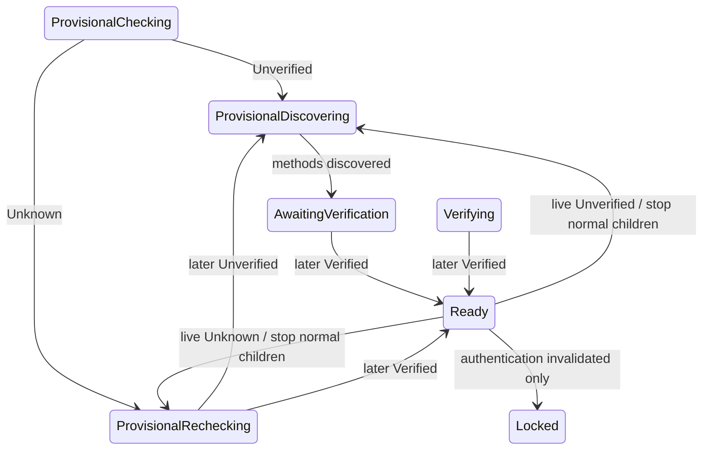

# Issue #694 Authoritative Current-Device Verification

## Scope

This is Priority 1 of issue #694 only. It removes the duplicate current-device
verification verdict and makes live trust loss return to an actionable
verification gate. Active-session account-management discovery and removal of
the in-app remote-device manager remain Priority 2 and must not be mixed into
this PR.

The matrix-rust-sdk submodule gitlink and vendored source remain unchanged. The
implementation uses the existing public
`client.encryption().verification_state()` subscriber.

## Product invariant

Koushi never admits ordinary use unless the SDK's authoritative current-device
`VerificationState` is `Verified`.

- `Verified` is the only path to `SessionState::Ready`.
- `Unverified` quarantines the SDK session, stops normal runtime children,
  clears normal session projections, and presents an actionable verification
  gate. This applies both during login/restore and after a live Ready session
  loses verification.
- `Unknown` quarantines the session in a retryable checking state. It is never
  displayed as Unverified, never starts verification-method discovery, and
  never offers destructive provisional-device cleanup.
- `Locked` is reserved for authentication/session invalidation. Current-device
  trust changes do not enter it.

A Ready session that re-enters the trust gate may retain the already-persisted
session needed for restart and recovery. Initial provisional credentials remain
unpersisted until the first authoritative Verified observation.

## State transitions

The Ready exit remains one atomic reducer action: session status becomes Idle,
normal views are cleared, sync becomes Stopped, and `StopSync` plus existing UI
change effects retain their fixed order. The AccountActor receives the exact
projection acknowledgement, stops and joins normal children, marks the session
unpromoted, and starts the restricted crypto-sync owner. Restricted and normal
sync owners never overlap.

After the restricted lane's first successful response, AccountActor reads the
same SDK verification subscriber again:

- `Unverified`: discover verification methods;
- `Unknown`: request an authoritative recheck and remain retryable;
- `Verified`: promote through the existing generation-fenced path.

A later Unverified observation after an Unknown first response starts method
discovery once the restricted lane is ready. Stale generations, duplicate
observations, and stale discovery completions remain inert.

## One verification verdict

`MatrixCurrentSessionInspection` captures the SDK subscriber's current
`CurrentDeviceTrustState` alongside supplemental device-name, cross-signing,
own-identity, sync, and backup facts. `CurrentSessionStatusDetails.verification`
uses that app-owned three-state enum directly; its constructor no longer derives
a verdict from supplemental facts.

A status refresh that observes non-Verified trust cannot publish Ready-session
diagnostics. AccountActor routes that observation through the authoritative
trust transition, and the status request is retired. Trust loss already reduced
first likewise rejects the completion through the existing promoted-session and
generation fences.

User Settings renders the authoritative verification value only. Cross-signing,
own-identity, and backup remain separate detail rows and do not form another
verification verdict. The in-app device list uses the same authoritative value
for its current-device badge; remote-device badges keep their existing peer
trust meaning until Priority 2 removes that surface.

## Unknown UX

`SessionVerificationGate` renders the existing retry action while the
provisional phase is `RecheckingTrust`. Retry dispatches the existing
`RetryCurrentDeviceTrustDiscovery` command. No cleanup action is rendered for
Unknown because `device_cleanup` remains Idle. Failures stay coarse and
private-data-free.

## Verify first

Add or flip these behavioral assertions before production edits and record each
command's own non-zero exit:

1. `cargo test -p koushi-state --test session_state`
   - Ready + Unverified enters `Provisional::DiscoveringMethods`, not Locked;
   - Ready + Unknown enters retryable `Provisional::RecheckingTrust`;
   - Unknown never offers cleanup;
   - `Ready + SessionLocked` enters the same actionable Unverified gate rather
     than creating a trust-flavored Locked state;
   - authentication `Locked + Verified` remains Locked without effects;
   - later Unverified/Verified trust-gate transitions converge correctly;
   - stale status completions cannot revive diagnostics.
2. `cargo test -p koushi-state --test session_status_state`
   - owner-cross-signed + own-identity-unverified can still carry authoritative
     `Verified`;
   - explicit Unknown remains Unknown rather than Unverified.
3. `cargo test -p koushi-core --lib account::trust_gate::tests`
   - Unknown does not discover methods;
   - gated projection acknowledgement is generation/transition fenced;
   - Unverified after restricted readiness discovers methods;
   - non-Verified status refresh routes to the gate and cannot publish status.
4. `cargo test -p koushi-core --lib authoritative_trust_runs_through_app_actor_ack_and_restarts_real_children`
   - live Unverified stops normal children and enters the verification gate;
   - later Verified restarts them;
   - stale generations remain inert.
5. `npm --prefix apps/desktop test -- src/SessionVerificationGate.test.tsx src/components/UserSettingsPanel.test.tsx`
   - Unknown shows Retry and no cleanup/verification method;
   - User Settings does not combine supplemental facts into a device-verification verdict.

SDK inspection tests that establish the exact cross-signed/unverified-identity
window may be early-green characterization before the new field is wired; label
them honestly.

## Expected implementation surfaces

- `crates/koushi-state/src/state/{session.rs,session_status.rs}`
- `crates/koushi-state/src/reducer/{mod.rs,session.rs}`
- `crates/koushi-core/src/account/{actor.rs,trust_gate.rs,runtime_children.rs}`
- `crates/koushi-core/src/runtime.rs`
- `crates/koushi-sdk/src/e2ee.rs` (adapter only; no vendor change)
- `apps/desktop/src/components/{SessionVerificationGate.tsx,UserSettingsPanel.tsx}`
- `apps/desktop/src/components/user-settings/TrustSection.tsx`
- `apps/desktop/src/domain/types.ts` changes the binary
  `CurrentSessionVerification` mirror to the same explicit
  `verified | unverified | unknown` contract; browser fake, Tauri DTO tests, and
  generated wire artifacts are updated wherever that changed enum appears
- focused tests, this plan, `docs/architecture/{overview.md,state-machine.md}`,
  and `docs/agents/plans.md`

No new session variant, timer, retry loop, SDK fork API, compatibility shim, or
parallel trust cache is required.

## Design review record

- Round 1, `reviewer-gpt`: `Not-correct-to-merge`. The plan did not explicitly
  RED-test the two remaining trust-flavored Locked paths: `SessionLocked` from
  Ready and authoritative Verified unlocking an authentication-locked session.
- Round 2, `reviewer-gpt`: `Correct-to-merge`. The plan now requires
  `Ready + SessionLocked` to enter the actionable Unverified gate and
  authentication `Locked + Verified` to remain inert; reducer/canon, actor ACK
  handoff, SDK status ownership, Unknown UX, and three-state DTO mirrors were
  accepted with no remaining findings.

## Verify-first record

Behavioral REDs recorded before production edits:

- `session_state`: 75 passed / 7 failed (live trust/SessionLocked gate entry,
  Unknown cleanup, and authentication Locked inertness);
- `session_status_state`: 9 passed / 1 failed (supplemental own-identity fact
  incorrectly overrides the device verdict);
- Core trust unit slice: 32 passed / 1 failed / 2 ignored (Unknown incorrectly
  admits method discovery);
- Core runtime trust handoff: 0 passed / 1 failed (live Unverified remains
  Locked instead of entering the gate);
- frontend gate/settings slices: 56 passed / 2 failed (Unknown lacks Retry and
  User Settings combines supplemental facts into Needs attention).

The SDK cross-signed-current-device plus unverified-own-identity
characterization was honestly early-green: 1 passed, proving upstream reports
the current device Verified in the exact window where the old diagnostic
verdict reports Unverified.

## Implementation review record

- Round 1, `reviewer-flash`: timed out without verdict after partial positive
  evidence; no acceptance was inferred.
- Round 2, `reviewer-flash`: `Not-correct-to-merge`. Found a Critical race where
  duplicate live-observer/status-refresh Gate projections used different
  transition IDs, allowing ACK mismatch to leave normal children running under
  a gated reducer. Also found restricted-sync failure could expose cleanup.
- Round 3, `reviewer-flash`: `Correct-to-merge`. Same-generation Gate projections
  now reuse one transition ID and a deterministic test proves one ACK stops
  normal children; discovery/preparation failures remain retryable with
  `device_cleanup = Idle`; Unknown→Unverified convergence and exclusive sync
  ownership were re-traced with no remaining findings.

## Verification and review

After focused GREEN, run rustfmt, the relevant Rust package/integration suites,
frontend Vitest/typecheck/lint/build, Tauri DTO/wire tests, SDK submodule guard,
agent-doc checks, `git diff --check`, and the repository CI-equivalent commands
required by the touched surfaces. Review the exact full diff with the
preflight checklist and a read-only independent reviewer from a different model
family. Fix findings and re-run affected gates before creating the PR. Monitor
all required PR checks and merge only from a green, current branch.

Final local evidence after the accepted review fixes:

- `cargo test --workspace`: 2571 passed / 13 ignored;
- frontend full Vitest: 1497 passed; focused final gate/settings/Shell: 108
  passed; Playwright: 262 passed;
- package lib gates: Core 1096 passed / 8 ignored, SDK 164 passed, Tauri 169
  passed / 1 ignored, state 40 passed;
- frontend typecheck, lint/IME/agent-docs, production build, `cargo check
  --workspace`, rustfmt check, SDK submodule guard, and `git diff --check` all
  passed;
- vendored matrix-rust-sdk gitlink and source are unchanged.
