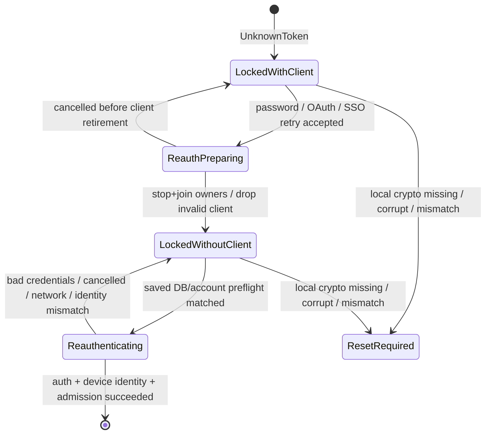
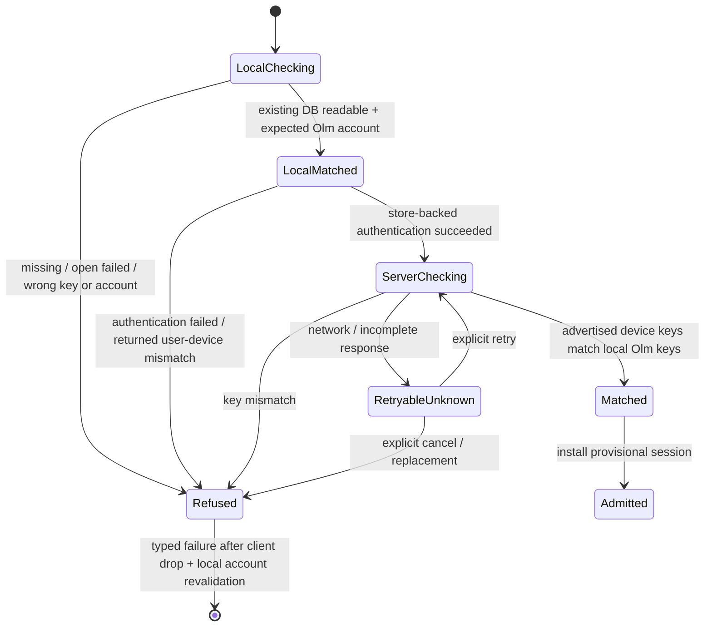
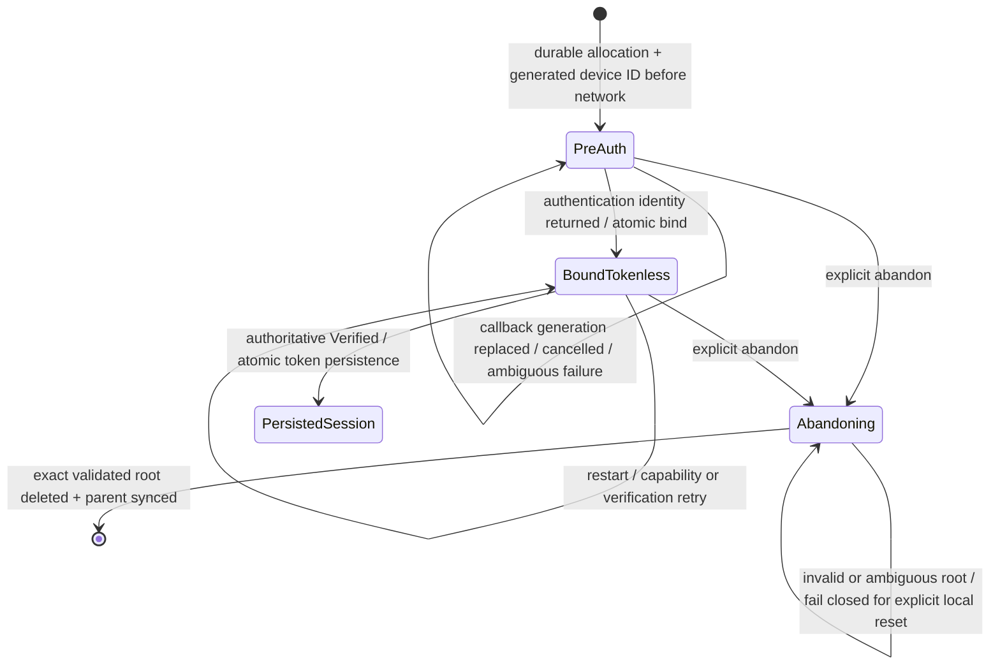

# Issue #699 — Element X-compatible login/store lifecycle

## Outcome

Koushi opens one encrypted persistent SDK store before password, OAuth, SSO,
restore, or soft-logout reauthentication can initialize E2EE. The authenticated
client is promoted directly through capability and verification admission;
Koushi never authenticates a memory-store client or transplants its session into
a second client.

A saved Matrix device is reused only after its crypto DB is proven present,
readable with the saved key, owned by the expected user/device Olm account, and
consistent with the server-advertised device keys. Missing, corrupt, wrong-key,
wrong-account, mismatched, or unknown state fails closed. No custom wire event,
plaintext fallback, blind room-key retry, or new Megolm repair path is added.

## Primary-source baseline

Pinned #699 evidence establishes the contract:

- Element X selects session directories and encrypted SQLite before login and
  authenticates on that client.
- Element X refuses restore when `matrix-sdk-crypto.sqlite3` is absent.
- Matrix Rust SDK authentication activates an `OlmMachine`; an empty store
  creates a new Olm account.
- Koushi currently authenticates password and OIDC/SSO clients without a store,
  may authenticate a second memory client for a saved device, and restores new
  login into another store-backed client after capability admission.

## Canon-first amendments

Before RED or production code, update:

- `REPOSITORY_RULES.md` and `docs/policies/engineering-rules.md` with persistent-
  store-first authentication, non-creating saved-store preflight, identity
  continuity, and bounded exact-root journal cleanup.
- `docs/architecture/overview.md` by replacing the storeless account bootstrap
  invariant.
- `docs/architecture/state-machine.md` with the client-presence Locked,
  identity-continuity, and pending-login journal machines below.
- `docs/agents/qa-lanes.md` and the QA registry with `e2ee_login_store`.
- `docs/agents/plans.md` with this plan.

## Actor-owned state machines

### Client-presence Locked



Both substates project existing reducer `SessionState::Locked`. While no client
exists, password/OAuth/SSO reauth, explicit logout, and local reset remain
admitted; every command requiring a live SDK session rejects with one correlated
typed failure. Invalidated tokens are not restored merely to recreate a Locked
client handle.

### Saved-device identity continuity



Unknown is never a match. Fresh-device login does not claim an existing server
identity; SDK activation must prove the returned device owns the newly created
local account.

### Fresh-login journal



At most one resumable allocation exists per normalized homeserver/auth method
and eight total. There is no TTL. Immediate cleanup is allowed only with closed
`NoRequestSent` or `ServerRejectedBeforeSession` evidence. Timeout, transport
failure, browser cancellation, callback loss, and token-exchange ambiguity stay
resumable. `Abandoning` is persisted before deletion and resumes after process
interruption. Broken-root forget is a separately confirmed non-deleting cap
escape.

## Local store allocation and durable identity

Add a random `LocalStoreId` with constant/redacted `Debug`. It names
`accounts/v2/<opaque>/` and never crosses CoreEvent, AppState, Tauri, React,
diagnostics, logs, or evidence. Each root preserves `store/`, `cache/`, and
`search-index/`; crypto DB is
`accounts/v2/<opaque>/store/matrix-sdk-crypto.sqlite3`.

A `LocalStoreBinding` contains the encrypted local unlock secret and store ID.
The secret derives the existing domain-separated SDK/search keys. Before fresh
network auth, persist:

```text
PreAuth { allocation_id, attempt_generation, normalized_homeserver,
          auth_method, login_identifier?, device_id, binding }
  -> BoundTokenless { allocation_id, normalized_homeserver, auth_method,
                      final_session_key_id, binding }
  -> PersistedSession
```

Password, OAuth, and SSO request the journaled generated Matrix device ID.
Authentication atomically replaces PreAuth with BoundTokenless; verified
promotion atomically persists tokens, remembers the session, and removes
BoundTokenless. Crashes before response, after bind, during capability, or during
verification therefore resume the same store/device.

OAuth/SSO process restart starts a new authorization on that store/device. PKCE,
callback state, and SDK pending handles stay process-local. Each callback carries
allocation ID and attempt generation; stale callbacks cannot bind or delete a
newer flow.

### Credential schema

Keep `credentials/credentials.v1.enc` and
`KOUSHI-CREDENTIAL-VAULT-V1` container magic. Accept decrypted JSON payload v1
and v2, always rewrite v2. V2 adds binding/journal states. OS-vault replacement
is one atomic encrypted write; file/in-memory debug backends use the same
versioned binding API and semantics. No parallel unlock-secret owner remains.

### Crash-safe abandon

Persist `Abandoning { allocation_id, store_id }`, validate and delete only the
exact root, sync the parent, then remove the record. Restart retries; an absent
root completes. Mismatch or ambiguity remains fail closed in `Abandoning` until
the existing explicitly confirmed local-data reset; no record-only escape or
speculative filesystem deletion is allowed.

## Legacy root migration

Legacy roots are the current injective
`accounts/<base64url(homeserver)>_<base64url(user)>_<base64url(device)>/` slug.
While unopened:

1. load the legacy secret and require its crypto DB;
2. persist `Migrating { store_id }` and fsync vault/parent;
3. atomically same-volume rename the whole root to `accounts/v2/<store_id>` and
   sync the accounts parent where supported;
4. validate account, persist+fsync `Ready`.

Resume `Migrating` deterministically: source-only retries rename; destination-
only validates; both/neither/collision/invalid/wrong-account fails closed.
Both-present is manual recovery. Guarantees cover process interruption and the
filesystem's documented atomic rename, not stronger sudden-power-loss behavior
where directory fsync is unavailable.

## Non-creating saved-store preflight

Normal SDK open creates a missing DB, so use a dedicated preflight through the
public `matrix_sdk::SqliteCryptoStore` re-export and
`matrix_sdk_base::crypto::store::CryptoStore`:

1. require the exact DB before open;
2. open with derived key;
3. require `load_account() == Some`;
4. compare expected user/device internally;
5. close/drop before login/restore or raced-artifact removal;
6. return only `present_matching | missing | open_failed | identity_mismatch`.

If a delete-between-check/open race creates an empty DB, `load_account == None`
fails before network. Remove DB/sidecars only after handle close and only when
none existed before open and this preflight observed their creation. Never
remove pre-existing artifacts. Missing/corrupt/wrong-key/wrong-account tests
assert zero `/login`, `/keys/upload`, and `/keys/query`.

## Authentication flows

### Password saved device

Normalize homeserver. Select without network when either the submitted full ID
exactly matches a saved session or a localpart matches exactly one saved user on
that homeserver. Zero/multiple localpart matches create one fresh device;
ambiguity never chooses a store.

Preflight first, then call an explicit store-backed adapter such as
`login_with_password_with_store(request, store, Some(saved_device_id))`. Delete
storeless `login_with_existing_device`. Require returned user/device, query and
compare server device keys, then promote the same client. Failure never falls
back fresh under that saved ID. After post-activation refusal, drop the client in
runtime context, re-preflight the original account, and settle typed failure;
never delete/replace the server device automatically.

### Password fresh device

Durably journal allocation/device, build one store-backed client, login once
requesting that device ID, atomically bind, and let NewLogin retain/promote that
client directly. Delete the NewLogin `restore_into_store` transplant branch.

### OAuth/SSO

Fresh start journals store/device before building the client. OAuth fallback to
SSO keeps that client/allocation/device. Completion enters BoundTokenless. A
restart starts a new authorization with the same store/device. Cancellation,
replacement, callback failure, shutdown, and capability rejection retire only
the process-local generation and retain resumable state unless closed
NoRequestSent/ServerRejectedBeforeSession evidence exists.

### Stored restore

Load/migrate binding, non-creating preflight, build one client, restore session,
compare the local Olm account with the persisted device view, and install it.
Offline restore remains available; the mandatory first encryption-sync
generation refreshes server device keys before encrypted send admission. Missing
state never creates crypto.

### Soft logout

Retain actor-private `LockedSessionRecord { info, key_id, persistable, binding }`,
stop/join all owners, drop invalid client, preflight, build replacement client
with the store before auth, authenticate same device once, compare identity, and
promote directly. Password uses saved device ID. OAuth follows SDK UnknownToken
documentation with `OAuth::login(..., Some(saved_device_id), ...)`; SSO uses
`SsoLoginBuilder::device_id`. Failure keeps client-free Locked record; next retry
builds another store-backed auth client. Missing/mismatch enters reset-required;
no invalid token restore.

Every directly promoted client runs existing `enable_event_cache`,
`reset_late_decryption_counters`, and `record_room_key_receive_summary` before
sync/timeline starts.

## Local/server identity check

“Server identity” means server-advertised Matrix device keys, not a second
homeserver trust system. Allocation is bound to the normalized homeserver/client
base URL; login, callback, keys query, and use stay on that client. Different
allocation/base URL completion is stale. HTTPS/discovery remain SDK-owned.

After online saved authentication/reauth and before provisional install, issue
one own-user `/keys/query`, select the exact current device internally, compare
Curve25519 and Ed25519 with the local account, and return only
match/mismatch/unknown. Offline restore uses the persisted device view; the
first encryption-sync generation refreshes it before encrypted send admission.
Mismatch drops the new token/client without deleting the device; unknown is
retryable and cannot send. No key/ID/hash is exported.

Characterize peer key replacement: prove sessions are selected by the new sender
key, fresh `/keys/claim` occurs, and old share proof is not reused. Add
invalidation only if that behavioral RED fails.

## Privacy-safe diagnostics

Closed values only:

- `auth_client_store=persistent`;
- `crypto_db=present|missing|open_failed|identity_mismatch`;
- `crypto_client_generations=one|multiple`;
- `saved_device=reused_matching_crypto|refused_missing_crypto|refused_mismatch|new_device`;
- `local_server_identity=match|mismatch|unknown`;
- existing transport wording remains
  `queued|homeserver_accepted|recipient_acceptance_unknown`.

Never export IDs, paths, keys, hashes, tokens, ciphertext, bodies, or raw errors.

## Verify first — exact RED contract

Before production edits, capture each command's own exit 101 and intended
failure (not syntax/unrelated failure).

### `crates/koushi-sdk/tests/login_store_lifecycle.rs`

- missing DB sends no network;
- corrupt/wrong-key/wrong-account sends no network;
- fresh login/reopen reports one closed identity generation;
- server identity mismatch is closed and store still preflights afterward;
- OAuth/SSO completion keeps preauth store generation;
- OAuth/SSO soft-logout uses saved store/device;
- crash/restart reuses store/device at every journal boundary;
- callback generation/base-URL fencing;
- exact full-ID, unique-localpart, zero/ambiguous selection.

Command: `cargo test -p koushi-sdk --test login_store_lifecycle`.

### `crates/koushi-core/tests/login_store_lifecycle.rs`

- fresh direct promotion has no restore/replacement;
- saved flow preflights before request with no fresh fallback;
- password/OAuth/SSO soft logout joins owners then directly promotes store-backed
  client;
- fresh OIDC interruption retains one allocation; stale callbacks are inert;
- crashes before response, after BoundTokenless, during capability/verification
  resume same allocation;
- client-free Locked command admission and typed failures.

Command: `cargo test -p koushi-core --test login_store_lifecycle`.

### `crates/koushi-core/tests/local_store_migration.rs`

- payload v1 decode/v2 rewrite;
- interruptions after marker/rename resume;
- collision/cross-account cleanup fail closed;
- documented fsync/process-interruption ordering.

Command: `cargo test -p koushi-core --test local_store_migration`.

### `crates/koushi-core/tests/pending_login_journal.rs`

- hard cap eight and occupied-slot refusal;
- invalid ID, duplicates, missing/mismatch roots, ambiguous startup fail closed;
- Abandoning interruption before/after delete resumes;
- immediate cleanup accepts only NoRequestSent/ServerRejectedBeforeSession;
- cancellation retains one allocation; stale generation cannot bind/delete.

Command: `cargo test -p koushi-core --test pending_login_journal`.

Behavioral oracles are closed values and request counts; never raw keys,
pointers, IDs, or paths. Source-text checks are inventory guards only.

## Local homeserver QA

Add `--scenario=e2ee_login_store` to typed registry, docs, runner, and contract
tests. Use synthetic users, one monotonic absolute deadline per phase, existing
cleanup guards, no fixed sleeps. Required tokens:

- `e2ee_login_store_fresh_offline_index0=ok`
- `e2ee_login_store_restore_offline_index0=ok`
- `e2ee_login_store_restart_offline_index0=ok`
- `e2ee_login_store_reauth_offline_index0=ok`
- `e2ee_login_store_online_index0=ok`
- `e2ee_login_store_group_index0=ok`
- `e2ee_login_store_identity_stable=ok`
- `e2ee_login_store=ok`

Recipient runtime is fully stopped before each offline send, then restarted and
must decrypt that exact first event. Group leg uses three users. Cleanup attempts
every owned device/room. Exact gate:

```bash
PATH=/tmp/koushi-desktop-local-qa-bin:$PATH \
  npm --prefix apps/desktop run qa:headless-local -- \
    --server=both --scenario=e2ee_login_store --core --timeout-ms=240000
```

Element X/Web/Desktop interoperability remains required approved-credential
preflight. If unavailable, record exact access blocker and do not claim or mark
the overall goal complete.

## Expected implementation surfaces

- `crates/koushi-key/src/lib.rs`
- `crates/koushi-core/src/{credential_vault.rs,store.rs,failure.rs,command.rs}`
- `crates/koushi-core/src/store/credential_backend.rs`
- `crates/koushi-core/src/account/{session_lifecycle.rs,sliding_sync.rs}`
- `crates/koushi-sdk/src/{auth.rs,client_session.rs}`
- koushi-state/core/Tauri/React command/failure mirrors for OIDC reauth only
- focused tests and `headless-core-qa` scenario/registry/docs
- remove `prefer_saved_device_for_password_login`, `login_with_existing_device`,
  and obsolete guards; update existing password/OIDC/runtime-session tests.

No dependency, vendored SDK change, custom retry loop, product setting,
plaintext fallback, or custom Matrix event is expected.

## Sequence and gates

1. Record Luna and independent different-model design verdicts.
2. Update canon before production behavior.
3. Add/run RED tests and preserve own nonzero exits.
4. Delegate implementation to Luna; parent integrates and verifies.
5. Focused GREEN, full local gates, e2ee_login_store once on both servers.
6. Preflight self-review, Luna review, independent different-model review; fix
   and re-review.
7. Rebase origin/main, push PR, monitor all checks, merge green/current head,
   verify origin/main and remove worktree/artifacts.

Required gates include rustfmt, koushi-key/sdk/core focused and full tests,
`cargo test --workspace`, QA-bin tests, `cargo check --workspace`, SDK submodule
and agent-doc guards, frontend tests/typecheck/lint/build/secret scan/Playwright,
`e2ee_login_store --server=both`, and `git diff --check`.

## Review record

- Implementation owner: `luna-implementer`, write-capable.
- Luna rounds 1–8 and reviewer-flash rounds 1–8 iteratively found and fixed:
  non-creating preflight, direct promotion, soft logout/OIDC ownership, identity
  gate, migration, exact RED/QA, obsolete guards, refusal revalidation,
  localpart selection, vault layout, callback/journal crash windows, bounded
  cleanup, client-free Locked, and canonical journal/refusal transitions.
- `reviewer-flash-opencode-go` returned no verdict due provider usage limit; no
  acceptance inferred; `reviewer-flash` is the eligible fallback.
- Reviewer-flash rounds 4, 6, 7, and 8: `Correct-to-merge`; later nonblocking
  wording notes were incorporated.
- Luna round 9: `Correct-to-merge`, no #699 findings.
- Reviewer-flash round 10: `Correct-to-merge`, no blocking #699 findings; only
  cosmetic label spelling remained.
- Canon-first drafts completed before test/production edits in
  `REPOSITORY_RULES.md`, `docs/architecture/{overview.md,state-machine.md}`,
  `docs/policies/engineering-rules.md`, and `docs/agents/{plans.md,qa-lanes.md}`.
- Final Luna review: `Correct-to-merge`, no Critical/Important findings.
- Final independent `reviewer-flash` review: `Correct-to-merge`, all prior
  findings verified fixed and no new findings.

## Final verification evidence

- `cargo test --workspace`: exit 0, 2604 tests passed across workspace suites.
- `cargo test -p koushi-core --lib`: 1101 passed, 8 ignored.
- `cargo test -p koushi-sdk --lib`: 169 passed.
- Core QA binary: 135 passed.
- Frontend Vitest: 1497 passed; typecheck, lint/IME/agent-docs, production build,
  and secret scan passed.
- Browser-headless Playwright: 263 passed.
- `cargo check --workspace`, rustfmt check, SDK submodule guard,
  agent-doc guard, and `git diff --check` passed.
- Final combined local gate
  `--server=both --scenario=e2ee_login_store --core --timeout-ms=240000`
  passed on Tuwunel and Synapse with every required token.

## Implementation record

- Luna implemented the reviewed storage/journal/migration, SDK auth/preflight,
  Core direct-promotion/restore/reauth, UI OIDC reauth, and local QA slices in
  bounded continuations; each timeout checkpoint was compiled and integrated by
  the parent rather than accepted as evidence.
- Focused GREEN: `koushi-key` 4 tests; credential-vault 10 tests; local-store
  migration 3 tests; pending-login journal 6 tests; SDK login-store lifecycle 6
  tests; Core login-store lifecycle 5 tests; existing SDK password login 31 and
  login discovery 22 tests; auth component 7 tests; QA contract 2 tests.
- Behavioral GREEN on Tuwunel: all eight `e2ee_login_store_*` tokens passed,
  including fully stopped recipient restart, sender restore/restart, soft-logout
  reauth, online recipient, three-user group, and stable device identity.
- QA discovery fixed a harness bug: multiple participants share the credential
  backend's last-session pointer, so restart must issue exact-account
  `RestoreSession`, not `RestoreLastSession`. Offline stop now explicitly stops
  and awaits the sync owner before runtime shutdown, and receive checks allow
  bounded transient UTD convergence before declaring failure.

## RED evidence

Recorded before production edits; each command's own exit was captured:

- `cargo test -p koushi-sdk --test login_store_lifecycle` — exit `101`:
  `koushi_sdk::login_store_test_support` is absent.
- `cargo test -p koushi-core --test login_store_lifecycle` — exit `101`:
  `koushi_core::login_store_test_support` is absent.
- `cargo test -p koushi-core --test local_store_migration` — exit `101`: the
  same future store/migration test-support boundary is absent.
- `cargo test -p koushi-core --test pending_login_journal` — exit `101`: the
  same future journal test-support boundary is absent.
- `cargo test -p koushi-core --features qa-bin --bin headless-core-qa
  e2ee_login_store_parses_with_exact_private_safe_tokens` — exit `101`:
  `QaScenario::E2eeLoginStore` is absent.

The failures are intentional missing-behavior/API boundaries, not syntax errors
or unrelated test failures. Fixtures and assertion messages are synthetic and
private-data-free.
