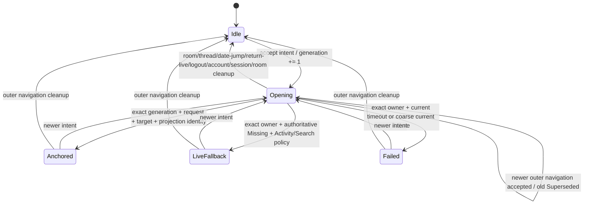

# Issue #836 Rust-owned Activity event navigation

Status: design re-review required after the 2026-09-05 GPT-6 review added cross-operation supersession requirements. Earlier reviewer-flash round 1 required F1/F2 changes and round 2 was Correct-to-merge for the narrower event-only design. Retained requirements: only SDK not-found or an exact-generation settled focused projection without the target is target-missing; new public DTO Debug output is redacted; terminal result delivery uses reliable awaited channels.

## Outcome

Replace the adapter/React `close → select → open → wait` transaction with one typed Core event-navigation intent. AppActor owns one latest-wins operation generation, publishes its coarse lifecycle in Rust state, and fences every completion by generation, request, account, room, event, and focused projection identity. Its outer navigation owner also defines mutual cancellation with ordinary room selection, thread-row navigation, date jumps, explicit return-to-live, Search, and Pinned navigation: the last accepted outer navigation intent wins even when the inner thread state machine remains separate. Activity and Search fall back to the live room only after an authoritative SDK `load_or_fetch_event` missing result or a settled focused projection without the target; Pinned reports a typed current-operation failure. Transport, timeout, storage, and SDK errors remain failures and never masquerade as target absence. React dispatches and renders only Rust state.

This change adds the normative event-navigation lifecycle and guards to `docs/architecture/state-machine.md` under Navigation and adds an Activity event-navigation ownership section to `docs/agents/state-ownership.md`; they do not yet exist on the reviewed `origin/main`. The required lifecycle grammar is:

Only the current operation generation can settle. Every terminal or clear publishes Rust state before releasing the public waiter; displaced work settles benign `Superseded` exactly once and cannot mutate presentation or ownership. Any lifecycle change updates both canonical sections in the same change.

## RED

1. Reducer tests: A starts, B supersedes A, late A commits/failures are inert, B alone reaches anchored/live-fallback/failed, and session/return-to-live cleanup resets the operation.
2. Core tests: two event commands overlap; the old lookup/projection cannot settle or fail the new state, SDK missing is distinct from lookup failure, and replaced focused timelines are unsubscribed. Add controlled event A → ordinary room B, event A → thread B, event A → date jump B, and reverse-order cases: every delayed selection, lookup, projection, timeout, or failure from the displaced owner is inert, and subscription/waiter ownership matches the last accepted outer intent. Add Activity A → Search B and Search A → Pinned B cases to prove cross-source, cross-policy last-accepted-wins behavior. Add a current-owner deadline case that reaches Rust `Failed`, followed by a stale-owner timeout that cannot overwrite it. The existing bounded AccountActor message path remains the backpressure gate.
3. Browser-headless: first reproduce the origin/main race with controlled ordering. Delayed A completion after successful B shows B with no failure; a current Rust-projected failure shows the banner for Recent and Unread. Cover event↔room, event↔thread, event↔date-jump, and Activity↔Search/Pinned ordering. Assert the final primary view, right panel, failure projection, focused subscription, and waiter owner—not only the target. The pane changes only for the current Rust `Anchored`/`LiveFallback` terminal and the banner appears only for current `Failed`; the internal room-selection `IntentLifecycle::Committed` is not settlement for this flow. Thread rows retain their separate inner state machine but participate in the outer cancellation contract.

## Minimal implementation

- Add `EventNavigationSource`, `EventNavigationFailureKind`, and a generation-bearing `EventNavigationState` to Rust navigation state. Treat it as transient when deciding whether to persist navigation preferences. Gate this specifically with the previously overflowing Core timeline/runtime tests and the full Core/state/desktop suites. Experiments that made `AppState` 208 bytes smaller than `origin/main` did not prevent build-sensitive libtest stack cliffs from moving among 174 current-thread Tokio tests in 26 files, so the product-state boxing experiment was reverted. Per-test wrappers and further product-state boxing are rejected. Set the repository Cargo environment default `RUST_MIN_STACK=4194304` with `force=false`: developers and CI may override it, Cargo-launched tests receive adequate stack, and packaged desktop processes launched outside Cargo do not inherit it. Document this test-harness constraint, run the full default debug workspace suite used by CI (CI has no release test suite), and validate production separately with the repository's release build and Linux headless smoke gates.
- Add reducer actions for start, anchored, live fallback, failure, and clear. Only the current generation can settle.
- Add one `AppCommand::NavigateToEvent` carrying source and missing-target policy. AppActor atomically supersedes the previous owner, cancels its preparation task, routes room selection and focused projection under one operation, and ignores stale preparation/projection/timeout/failure results. Ordinary room selection, thread-row navigation, date jumps, explicit return-to-live, Activity, Search, Pinned, and every other accepted outer navigation intent clear/cancel the displaced event owner through the same reducer/deferred-cleanup path before their own effects can settle; starting event navigation likewise releases any incompatible outer focused owner. No displaced path may later mutate the primary view, right panel, failure projection, subscription, or waiter. AppActor owns the focused-context deadline and publishes `Failed { current_generation, Timeline }` for a current-owner timeout before releasing its waiter; adapter/CoreConnection timeout is only a bounded transport backstop, not the product terminal owner.
- Replace the boolean cache preparation response with a coarse typed lookup result: `Located`, `Missing`, or `Failed`. `Located` is SDK `load_or_fetch_event` success; `Missing` is only the SDK's authoritative not-found response; every other error is `Failed`. Missing drives source policy; failure produces a coarse failure terminal. A settled focused projection without the target is also authoritative missing.
- Add `CoreConnection::navigate_to_event_and_wait`, bounded by the existing focused-context deadline. It waits for the exact operation generation's Rust terminal; supersession is benign, and failure kind comes from Rust state rather than promise timing. Tauri maps Activity/Search/Pinned to this API and removes its multi-step orchestration.
- React changes pane only from the current Rust `Anchored`/`LiveFallback` state and renders failure only from current `Failed`. Internal room-selection lifecycle events are ignored as event-navigation completion. Remove shared `navigationFailure` writes from `openActivityRow`, its thread branch, `openActivityRoom`, and `selectSearchResult`; their older promise completions may not change `primaryView` or `rightPanelMode`. Adapter submission failure uses only the generic transport-error path.
- Mirror the Rust state/command through `crates/koushi-protocol`, Tauri serialization/command registration, `apps/desktop/src/domain/types.ts`, `coreEvents.ts` and `coreEvents.generated.json` if their contract changes, `browserFakeApi.ts`, `tauriIpcMock.ts`, `appHarnessMain.tsx`, and `apps/desktop/src-tauri/tests/golden/frontend_app_state.json`; update DTO serialization-contract tests and regenerate the golden with `UPDATE_GOLDEN=1 cargo test --manifest-path apps/desktop/src-tauri/Cargo.toml --lib frontend_app_state_golden` when affected. Remove the non-thread Activity path's React `navigationFailure` writes; keep transport submission errors in the existing generic transport path.

## Gates

Focused tests first, including a new `crates/koushi-state/tests/event_navigation.rs` target rather than extending the generic navigation target; then `cargo test -p koushi-state --test event_navigation`, `cargo test -p koushi-core --lib navigation`, `cargo test -p koushi-core-testkit --test request_outcome_a2a`, `cargo test -p koushi-desktop --lib`, frontend typecheck/lint/Vitest, affected Playwright specs, Rust formatting, source-structure/docs checks, and `git diff --check`. Review the complete diff against repository canon before PR, then require exact submitted-state CI before merge.

## Exclusions

No React request epoch, retry, larger timeout, second navigation state machine, raw SDK failure text, or screenshot/UI fixture semantics in Core.
