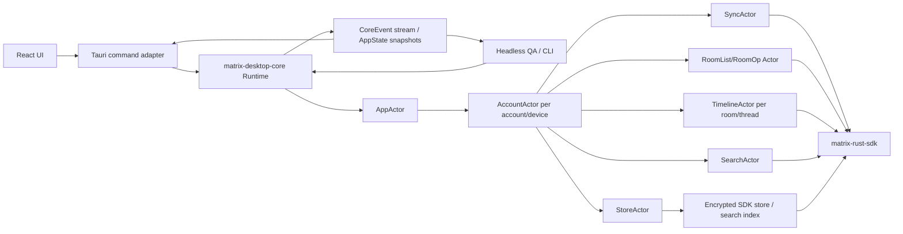
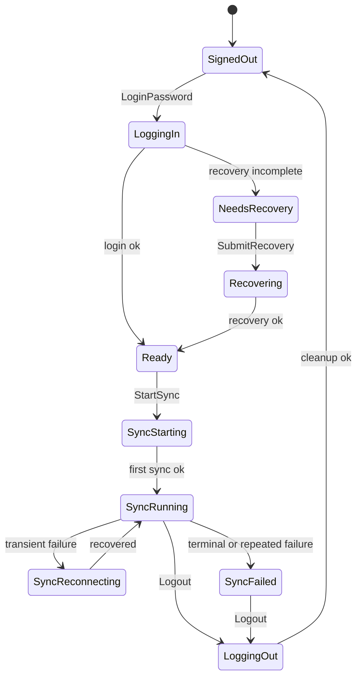

# Headless Core Runtime Design

Status: approved design direction on 2026-06-12. This is a dated migration
guide toward the normative architecture in
[docs/architecture/overview.md](../../architecture/overview.md). That overview
amends this spec's public API (TimelineKey addressing, unsubscribe lifecycle,
request_id correlation, pagination state events, diff-based timeline updates,
SDK send queue / sync service usage); where they differ, the overview wins.

## Scope

This design defines the final architecture for Matrix Desktop's non-UI runtime. It covers the in-process headless actor runtime, GUI/logic separation, command/event/state boundaries, sync lifecycle, room operations, timeline operations, local homeserver QA, real homeserver QA, and security gates.

This design does not define Element-style visual layout, shortcut mapping, settings placement, or other UI presentation details. Those should be designed on top of this runtime boundary.

## Goals

- Make Matrix behavior testable without GUI automation.
- Keep React and Tauri as transport/presentation layers, not Matrix logic owners.
- Run local Conduit/Tuwunel QA and real homeserver QA through the same runtime path used by the desktop app.
- Support login, restore, recovery, sync, room list, spaces, invite/join, timeline, send/edit/redaction, search, logout, account switch, and shutdown through typed commands and events.
- Prevent passwords, recovery material, access tokens, SDK store keys, search index keys, and raw request bodies from entering logs, Debug output, committed files, or ordinary test fixtures.

## Non-Goals

- No standalone daemon process in the first final architecture. The runtime is in-process.
- No GUI automation as the primary correctness gate.
- No production dependency on the fixture backend for real Matrix behavior.
- No broad compatibility layer for old internal APIs if it blocks the cleanup. The refactor may be source-incompatible inside this repo.

## Architecture

The final runtime is an in-process actor system exposed by `matrix-desktop-core`.



`matrix-desktop-core` owns runtime state and Matrix side effects. React sends commands and renders snapshots. Tauri adapts frontend calls to core commands and forwards core events. Headless QA starts the same runtime and asserts on the same events and snapshots.

## Crate Boundaries

`matrix-desktop-state` remains the pure state crate. It owns `AppState`, `AppAction`, reducer logic, and serializable UI snapshot DTOs. It does not know about Matrix SDK handles, Tauri, or async tasks.

`matrix-desktop-auth` remains the Matrix SDK adapter for now. It owns low-level login, restore, recovery, sync, room operation, timeline, and search primitives. It should not own app state or QA orchestration. It can later be renamed to `matrix-desktop-sdk`, but the initial refactor should avoid a rename unless it clearly reduces confusion.

`matrix-desktop-core` becomes the only production runtime owner. It owns actor lifecycle, command routing, event emission, SDK session handles, background tasks, AppState projection, and headless QA binaries.

`matrix-desktop-backend` becomes fixture/demo infrastructure only. It can keep browser fake data and UI preview behavior, but production Tauri paths should not use it to execute Matrix SDK behavior.

`apps/desktop/src-tauri` becomes a transport adapter. It should not call Matrix SDK wrappers directly after the migration. It should hold or access a `CoreRuntime`, send commands, and expose snapshots/events to the frontend.

`apps/desktop` remains presentation and interaction code. It should not contain Matrix SDK semantics beyond typed client calls and view logic.

## Public Runtime API

Core exposes commands, events, and state snapshots.

```rust
pub struct CoreRuntime {
    command_tx: CoreCommandSender,
    event_rx: CoreEventReceiver,
}

pub enum CoreCommand {
    App(AppCommand),
    Account(AccountCommand),
    Sync(SyncCommand),
    Room(RoomCommand),
    Timeline(TimelineCommand),
    Search(SearchCommand),
}

pub enum CoreEvent {
    StateChanged(AppStateSnapshot),
    Account(AccountEvent),
    Sync(SyncEvent),
    Room(RoomEvent),
    Timeline(TimelineEvent),
    Search(SearchEvent),
    OperationFailed(CoreFailure),
}
```

Commands do not normally return large results directly. The runtime emits `CoreEvent` values and updated `AppStateSnapshot` values. This makes GUI, CLI QA, and integration tests observe the same behavior.

Representative account and sync commands:

```rust
pub enum AccountCommand {
    LoginPassword(LoginRequest),
    RestoreSession { account_key: AccountKey },
    SubmitRecovery(RecoveryRequest),
    Logout,
    SwitchAccount { account_key: AccountKey },
}

pub enum SyncCommand {
    Start,
    Stop,
    Restart,
    SyncOnce,
}
```

Representative room and timeline commands:

```rust
pub enum RoomCommand {
    CreateRoom { name: String },
    CreateSpace { name: String },
    SetSpaceChild {
        space_id: String,
        child_room_id: String,
        via_server: String,
    },
    InviteUser {
        room_id: String,
        user_id: String,
    },
    JoinRoom {
        room_id: String,
    },
    SelectSpace {
        space_id: Option<String>,
    },
    SelectRoom {
        room_id: String,
    },
}

pub enum TimelineCommand {
    SubscribeRoom { room_id: String },
    SubscribeThread {
        room_id: String,
        root_event_id: String,
    },
    PaginateBackwards {
        room_id: String,
        event_count: u16,
    },
    SendText {
        room_id: String,
        transaction_id: String,
        body: String,
    },
    EditText {
        room_id: String,
        event_id: String,
        body: String,
    },
    Redact {
        room_id: String,
        event_id: String,
    },
}
```

The public API must redact `Debug` for secret-bearing commands:

- `LoginPassword` redacts username, password, and device display name.
- `SubmitRecovery` redacts recovery material.
- `SendText` and `EditText` redact body in Debug and errors.
- Access tokens and store keys never appear in public events.

## Runtime Model

`AppState` is the serializable UI snapshot. Core also maintains non-serializable runtime state.

```rust
struct CoreModel {
    app_state: AppState,
    active_account: Option<AccountKey>,
    accounts: HashMap<AccountKey, AccountRuntimeState>,
}

struct AccountRuntimeState {
    session: MatrixClientSession,
    sync_status: SyncRuntimeStatus,
    room_list: RoomListRuntimeState,
    timelines: HashMap<TimelineKey, TimelineRuntimeState>,
}
```

`AppState` is projected from events and reducer actions. SDK handles, task handles, timeline subscriptions, and store keys stay outside `AppState`.

## Actor Responsibilities

`AppActor` is the command entry point. It routes commands, owns global app state, tracks the active account, broadcasts events, and produces ordered state snapshots.

`AccountActor` owns one account/device runtime. It owns the SDK session, login/restore/recovery/logout flow, account switch behavior, and shutdown coordination for child actors.

`SyncActor` owns continuous SDK sync. It starts after login/restore, transitions through starting/running/reconnecting/failed/stopped, and stops on logout, account switch, or app shutdown. SDK sync errors are converted to redacted sync failures.

`RoomActor` owns room list and room operations. It normalizes SDK room list data into `SpaceSummary` and `RoomSummary`, handles create room, create space, set space child, invite, join, unread counts, DM classification, and space-filtered lists.

`TimelineActor` owns a room or thread timeline subscription. It handles initial items, incremental updates, backward pagination, send, edit, redaction, late events, late decryption, and stable ordering.

`SearchActor` owns encrypted search. It treats ngram search as a candidate generator, verifies canonical visible text or attachment filename before emitting results, and reindexes edits, redactions, and late decryptions.

`StoreActor` owns OS credential store access, SDK store keys, search index keys, per-account store paths, local cleanup, and debug/test secret injection policy.

## Lifecycle



Shutdown order:

1. Stop accepting new account commands.
2. Stop room and thread timeline subscriptions.
3. Stop search indexing queues.
4. Stop sync.
5. Persist final session state if needed.
6. Drop SDK session handles.
7. On logout or account removal, clear credentials and local stores.
8. Emit the final `StateChanged` event.

## State Projection

Core should preserve the reducer as the single UI state transition mechanism where practical. The actor executes side effects; successful or failed side effects produce internal events; those events project to `AppAction`; the reducer updates `AppState`.

```text
CoreCommand
  -> actor side effect
  -> CoreEvent
  -> AppAction
  -> reduce(AppState)
  -> StateChanged(AppStateSnapshot)
```

This keeps SDK work outside the reducer and keeps UI state deterministic. If some existing `AppEffect` values become redundant after actor migration, they can be removed or converted to internal actor intents.

## Headless QA

QA is layered.

Unit tests are fast and network-free. They cover command routing, redaction, unauthenticated command rejection, login/sync/logout state transitions with fake ports, room/timeline/search event normalization, and reducer compatibility.

Local homeserver integration uses disposable Conduit and Tuwunel servers. The script starts a server, registers synthetic users, runs a core QA binary, and stops the server. The QA binary must use `CoreCommand` and `CoreEvent`, not direct SDK wrapper calls.

Local QA must cover:

- login for user A and user B
- sync start and running state
- create room
- create space
- set space child
- invite user B to space and room
- join space and room
- room list contains expected room and space
- send permission check
- A to B message send and receive
- B to A message send and receive
- logout cleanup
- stdout/stderr secret redaction

Real homeserver QA is required before GUI-level confidence claims. It covers HTTPS login, recovery required/submitted, encrypted store restore, sync lifecycle, room list, selected room timeline, self/test-room send, search smoke, logout, and account switch smoke.

QA should wait for events rather than rely on fixed sleeps:

```rust
runtime.command(CoreCommand::Room(RoomCommand::CreateRoom { name })).await?;
let room_id = events.wait_for_room_created().await?;

runtime.command(CoreCommand::Timeline(TimelineCommand::SendText { ... })).await?;
events.wait_for_timeline_body(room_id, expected_body).await?;
```

## Security Policy

Never log or commit:

- access tokens
- passwords
- recovery keys or recovery codes
- raw request bodies
- SDK store keys
- search index keys
- real account private data
- real room names or real discussion content in docs/tests/mocks

Allowed only in debug/test contexts:

- synthetic local QA credentials
- local homeserver URLs
- synthetic test room IDs
- synthetic event IDs

Allowed in UI state:

- user ID
- device ID
- room ID
- event ID
- visible message body
- attachment filename

Production builds must reject environment-variable credential injection. Debug/test builds may support `.local-secrets/`, keychain, or environment injection for QA only.

## Error Policy

Public core failures are coarse and redacted.

```rust
pub enum CoreFailure {
    SessionRequired,
    LoginFailed,
    RecoveryFailed,
    SyncFailed,
    RoomOperationFailed { kind: RoomFailureKind },
    TimelineOperationFailed,
    SearchFailed,
    StoreUnavailable,
    ShutdownFailed,
}
```

Raw SDK errors may be printed only behind an explicit debug/test diagnostic switch. They must not be stored in AppState, committed logs, normal test fixtures, or release diagnostics.

## Build And QA Gates

Required local gates:

```bash
cargo test -p matrix-desktop-state
cargo test -p matrix-desktop-auth
cargo test -p matrix-desktop-core
npm --prefix apps/desktop test
npm --prefix apps/desktop run typecheck
npm --prefix apps/desktop run qa:headless-local -- --server=both
```

Real homeserver gate:

```bash
npm --prefix apps/desktop run qa:real-homeserver
```

The real homeserver gate depends on network and approved credentials, so it belongs in local preflight or release preflight rather than every ordinary CI run.

A secret scan gate must run before commits and release preflight. It should exclude `vendor/`, `.local-secrets/`, and generated artifacts.

## Migration Milestones

Milestone A: Core boundary. Create `matrix-desktop-core`, define `CoreCommand`, `CoreEvent`, `CoreRuntime`, redacted errors, and initial state ownership. Add redaction and unauthenticated command tests.

Milestone B: Headless QA port. Move `headless-local-qa` from auth to core. Replace direct SDK wrapper calls with `CoreCommand` and event waits. Re-run Conduit/Tuwunel QA.

Milestone C: Account and sync actors. Move login, restore, recovery, logout, `sync_once`, and continuous sync into core actors. Test shutdown, account switch, and sync state transitions.

Milestone D: Room actor. Move room list, create room, create space, set child, invite, and join into core. Normalize room list updates into state summaries.

Milestone E: Timeline actor. Move selected room timeline subscription, send, edit, redaction, and pagination into core. Add thread timeline using the same model.

Milestone F: Tauri integration. Replace direct SDK/Tauri effect execution with core runtime commands and events. Keep fixture backend only for dev/demo previews.

Milestone G: Real homeserver QA gate. Add debug/test credential loading, real homeserver QA script, recovery flow, restore flow, send smoke, room list, timeline, search, logout, and secret scan.

## Observability

Core diagnostics are structured and redacted. They are useful for debugging but are not the source of truth for QA.

Examples:

```text
core.account.login.started
core.account.login.succeeded
core.sync.started
core.sync.running
core.sync.failed kind=http
core.room.create.succeeded
core.timeline.send.failed kind=forbidden
```

QA should assert on `CoreEvent` and `AppStateSnapshot`, not logs.

## AGENTS.md Updates

Implementation should keep `AGENTS.md` current with:

- Conduit/Tuwunel install caveats
- macOS keychain and automation caveats
- GUI automation failure patterns
- local QA failure patterns
- secret handling rules
- private data commit prohibitions

## Design Decisions

- The final runtime is in-process, not a daemon.
- `matrix-desktop-core` owns production Matrix runtime behavior.
- GUI, Tauri, CLI, and QA all use the same command/event boundary.
- Fake backend is kept for fixture/demo use only.
- Local Conduit/Tuwunel QA and real homeserver QA are both required gates.
- UI design and Element Desktop/Web visual alignment are a later design layered on top of this runtime.
