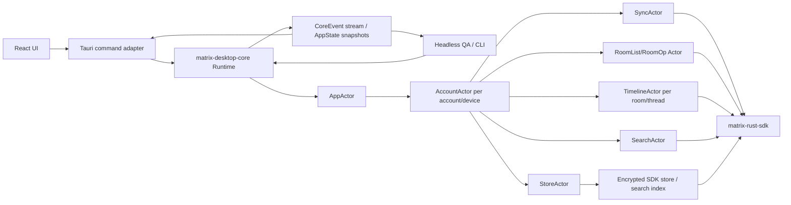
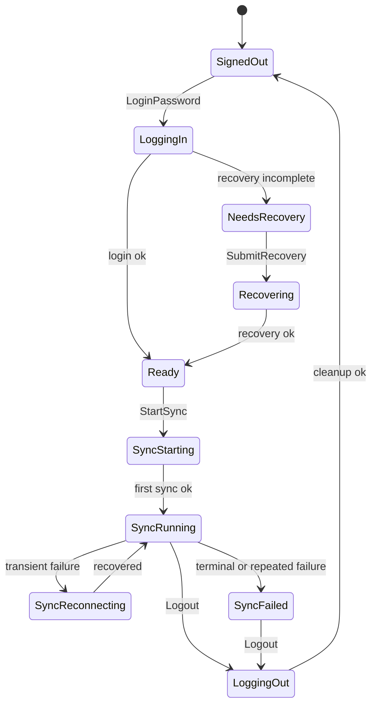

# Headless Core Runtime Design

Status: approved migration design on 2026-06-12. This spec describes how to
move the current implementation toward the normative architecture in
[docs/architecture/overview.md](../../architecture/overview.md).

## Scope

This design defines the final architecture for Matrix Desktop's non-UI runtime. It covers the in-process headless actor runtime, GUI/logic separation, command/event/state boundaries, sync lifecycle, room operations, timeline operations, local homeserver QA, real homeserver QA, and security gates.

This design does not define Element-style visual layout, shortcut mapping, settings placement, or other UI presentation details. Those should be designed on top of this runtime boundary.

## Goals

- Make Matrix behavior testable without GUI automation.
- Keep React and Tauri as transport/presentation layers, not Matrix logic owners.
- Run local Conduit/Tuwunel QA and real homeserver QA through the same runtime path used by the desktop app.
- Support login, restore, recovery, sync, room list, spaces, invite/join, timeline, send/edit/redaction, search, logout, account switch, and shutdown through typed commands and events.
- Prevent passwords, recovery material, access tokens, SDK store keys, search index keys, and raw request bodies from entering logs, Debug output, committed files, or ordinary test fixtures.

## Non-Goals

- No standalone daemon process in the first final architecture. The runtime is in-process.
- No GUI automation as the primary correctness gate.
- No production dependency on the fixture backend for real Matrix behavior.
- No broad compatibility layer for old internal APIs if it blocks the cleanup. The refactor may be source-incompatible inside this repo.

## Architecture

The final runtime is an in-process actor system exposed by `matrix-desktop-core`.



`matrix-desktop-core` owns runtime state and Matrix side effects. React sends commands and renders snapshots. Tauri adapts frontend calls to core commands and forwards core events. Headless QA starts the same runtime and asserts on the same events and snapshots.

## Crate Boundaries

`matrix-desktop-state` remains the pure state crate. It owns `AppState`, `AppAction`, reducer logic, and serializable UI snapshot DTOs. It does not know about Matrix SDK handles, Tauri, or async tasks.

`matrix-desktop-sdk` is the Matrix SDK adapter. It owns low-level login, restore, recovery, sync, room operation, timeline, and search primitives. It should not own app state or QA orchestration. The adapter rename from `matrix-desktop-auth` was completed in the Phase 9 cleanup follow-up.

`matrix-desktop-core` becomes the only production runtime owner. It owns actor lifecycle, command routing, event emission, SDK session handles, background tasks, AppState projection, and headless QA binaries.

`matrix-desktop-backend` becomes fixture/demo infrastructure only. It can keep browser fake data and UI preview behavior, but production Tauri paths should not use it to execute Matrix SDK behavior.

`apps/desktop/src-tauri` becomes a transport adapter. It should not call Matrix SDK wrappers directly after the migration. It should hold or access a `CoreRuntime`, send commands, and expose snapshots/events to the frontend.

`apps/desktop` remains presentation and interaction code. It owns viewport
state, DOM measurement, and scroll anchoring, but it does not contain Matrix SDK
semantics beyond typed client calls and view logic.

## Public Runtime API

Core exposes commands, events, and state snapshots through attached
connections. Every accepted command carries a runtime-scoped `RequestId`; every
accepted command result event carries the same full ID. The event stream is
shared by all consumers (Tauri, CLI, QA), so the ID includes both a
runtime-assigned connection ID and a connection-assigned sequence.

Attaching a consumer to the `CoreRuntime` returns a `CoreConnection` with its
`RuntimeConnectionId`. Request IDs are allocated by that attached connection,
not hand-built by untrusted caller code. The command transport wraps each
inbound command with the connection it arrived on. If a malformed command
contains a `request_id.connection_id` that does not match that transport
connection, the send call fails locally with
`CommandSubmitError::InvalidRequestId`. The command is not routed and no
`CoreEvent` is published with the forged `RequestId`.

```rust
pub struct RuntimeConnectionId(pub u64);

pub struct RequestId {
    pub connection_id: RuntimeConnectionId,
    pub sequence: u64,
}

pub struct TimelineKey {
    pub account_key: AccountKey,
    pub kind: TimelineKind,
}

pub enum TimelineKind {
    Room { room_id: String },
    Thread { room_id: String, root_event_id: String },
    Focused { room_id: String, event_id: String },
}

pub struct TimelineGeneration(pub u64);
pub struct TimelineBatchId(pub u64);

pub enum PaginationDirection {
    Backward,
    Forward,
}

pub enum PaginationState {
    Idle,
    Paginating,
    EndReached,
    Failed { kind: TimelineFailureKind },
}

pub enum TimelineFailureKind {
    InvalidDirection,
    NotSubscribed,
    Forbidden,
    Network,
    Timeout,
    Sdk,
    QueueOverflow,
}

pub struct CoreRuntime {
    // Owns the AppActor tree and creates CoreConnection handles.
}

pub struct CoreConnection {
    connection_id: RuntimeConnectionId,
    command_tx: CoreCommandSender,
    event_rx: CoreEventReceiver,
    next_sequence: u64,
}

pub enum CommandSubmitError {
    RuntimeClosed,
    InvalidRequestId,
}

pub enum CoreCommand {
    App(AppCommand),
    Account(AccountCommand),
    Sync(SyncCommand),
    Room(RoomCommand),
    Timeline(TimelineCommand),
    Search(SearchCommand),
}

pub enum CoreEvent {
    StateChanged(AppStateSnapshot),
    Account(AccountEvent),
    Sync(SyncEvent),
    Room(RoomEvent),
    Timeline(TimelineEvent),
    Search(SearchEvent),
    OperationFailed {
        request_id: RequestId,
        failure: CoreFailure,
    },
}
```

Commands do not return Matrix/domain results directly. The connection send call
may return only local submission errors such as a closed runtime or invalid
request ID. Once a command is accepted, the runtime emits `CoreEvent` values
and updated `AppStateSnapshot` values. This makes GUI, CLI QA, and integration
tests observe the same behavior.

Representative account and sync commands:

```rust
pub enum AccountCommand {
    LoginPassword {
        request_id: RequestId,
        request: LoginRequest,
    },
    RestoreSession {
        request_id: RequestId,
        account_key: AccountKey,
    },
    /// Restore whatever the last-session pointer designates (app startup).
    /// Not-found is a normal outcome (`SessionNotFound`), not an error path.
    RestoreLastSession {
        request_id: RequestId,
    },
    /// List locally saved sessions (login screen / account switcher). The
    /// result event carries only allowed UI identifiers (homeserver, user
    /// id, device id) — never tokens or key material.
    QuerySavedSessions {
        request_id: RequestId,
    },
    SubmitRecovery {
        request_id: RequestId,
        request: RecoveryRequest,
    },
    Logout {
        request_id: RequestId,
    },
    SwitchAccount {
        request_id: RequestId,
        account_key: AccountKey,
    },
}

pub enum SyncCommand {
    Start { request_id: RequestId },
    Stop { request_id: RequestId },
    Restart { request_id: RequestId },
    SyncOnce { request_id: RequestId },
}
```

Representative room and timeline commands:

```rust
pub enum RoomCommand {
    CreateRoom {
        request_id: RequestId,
        name: String,
    },
    CreateSpace {
        request_id: RequestId,
        name: String,
    },
    SetSpaceChild {
        request_id: RequestId,
        space_id: String,
        child_room_id: String,
        via_server: String,
    },
    InviteUser {
        request_id: RequestId,
        room_id: String,
        user_id: String,
    },
    JoinRoom {
        request_id: RequestId,
        room_id: String,
    },
    SelectSpace {
        request_id: RequestId,
        space_id: Option<String>,
    },
    SelectRoom {
        request_id: RequestId,
        room_id: String,
    },
}

pub enum TimelineCommand {
    Subscribe {
        request_id: RequestId,
        key: TimelineKey,
    },
    Unsubscribe {
        request_id: RequestId,
        key: TimelineKey,
    },
    Paginate {
        request_id: RequestId,
        key: TimelineKey,
        direction: PaginationDirection,
        event_count: u16,
    },
    SendText {
        request_id: RequestId,
        key: TimelineKey,
        transaction_id: String,
        body: String,
    },
    EditText {
        request_id: RequestId,
        key: TimelineKey,
        event_id: String,
        body: String,
    },
    Redact {
        request_id: RequestId,
        key: TimelineKey,
        event_id: String,
    },
}

pub enum TimelineEvent {
    InitialItems {
        request_id: Option<RequestId>,
        key: TimelineKey,
        generation: TimelineGeneration,
        items: Vec<TimelineItem>,
    },
    ItemsUpdated {
        key: TimelineKey,
        generation: TimelineGeneration,
        batch_id: TimelineBatchId,
        diffs: Vec<TimelineDiff>,
    },
    PaginationStateChanged {
        request_id: Option<RequestId>,
        key: TimelineKey,
        direction: PaginationDirection,
        state: PaginationState,
    },
    ResyncRequired {
        key: TimelineKey,
        reason: TimelineResyncReason,
    },
}
```

Pagination is directional and matches `PaginationStateChanged`. Backward
pagination is valid for every timeline kind. Forward pagination is valid only
for non-live timelines (`Focused`), where the subscription starts in the middle
of history; on `Room` and `Thread` timelines the forward edge is produced by
sync, and a forward `Paginate` fails with
`TimelineOperationFailed { kind: TimelineFailureKind::InvalidDirection }`.

The public API must redact `Debug` for secret-bearing commands:

- `LoginPassword` redacts username, password, and device display name.
- `SubmitRecovery` redacts recovery material.
- `SendText` and `EditText` redact body in Debug and errors.
- Access tokens and store keys never appear in public events.

## Runtime Model

`AppState` is the serializable UI snapshot. Core also maintains non-serializable runtime state.

```rust
struct CoreModel {
    app_state: AppState,
    active_account: Option<AccountKey>,
    accounts: HashMap<AccountKey, AccountRuntimeState>,
}

struct AccountRuntimeState {
    session: MatrixClientSession,
    sync_status: SyncRuntimeStatus,
    room_list: RoomListRuntimeState,
    timelines: HashMap<TimelineKey, TimelineRuntimeState>,
}
```

`AppState` is projected from events and reducer actions. SDK handles, task handles, timeline subscriptions, and store keys stay outside `AppState`.

## Actor Responsibilities

`AppActor` is the command entry point. It routes commands, owns global app state, tracks the active account, broadcasts events, and produces ordered state snapshots.

`AccountActor` owns one account/device runtime. It owns the SDK session, login/restore/recovery/logout flow, account switch behavior, and shutdown coordination for child actors.

Startup restore and session listing go through the command boundary like
everything else: `RestoreLastSession` resolves the credential store's
last-session pointer inside `StoreActor`/`AccountActor` (the transport
adapter never reads the credential store), and `QuerySavedSessions` answers
with `AccountEvent::SavedSessionsListed { request_id, sessions }` carrying
only allowed UI identifiers.

Login bootstraps the store in two steps (store bootstrap invariant in the
overview): the password exchange runs on a storeless client that never syncs
or initializes encryption; the session is then persisted and immediately
restored into the per-account encrypted store, and the store-backed session
replaces the login client before any sync or E2EE traffic. `SwitchAccount`
is the ordered shutdown of the current account runtime without clearing
credentials or stores, followed by a store-backed `RestoreSession` of the
target account, emitting `AccountSwitched` and a fresh `StateChanged`.

`SyncActor` owns continuous SDK sync. It starts after login/restore, transitions through starting/running/reconnecting/failed/stopped, and stops on logout, account switch, or app shutdown. SDK sync errors are converted to redacted sync failures.

`RoomActor` owns room list and room operations. It normalizes SDK room list data into `SpaceSummary` and `RoomSummary`, handles create room, create space, set space child, invite, join, unread counts, DM classification, and space-filtered lists. On the sliding-sync backend the room list comes from the single `RoomListService` owned by the running `SyncService` (handed to `RoomActor` at sync start); ad-hoc `RoomListService` instances are prohibited because they are not driven by the sync loop and miss the live service's `required_state`. On `LegacySync` the room list is normalized from base-client state per Async rule 9.

`TimelineActor` owns a room or thread timeline subscription. It handles initial items, incremental updates, backward pagination, send, edit, redaction, late events, late decryption, and stable ordering. On the sliding-sync backend, `Subscribe` also subscribes the room with the live `RoomListService` (`subscribe_to_rooms`) so the server streams the room's new timeline events; some servers (Conduit) deliver only the initial window otherwise. Edits and redactions are performed through the SDK `Timeline` handle so their diffs appear as local echoes; the actor keeps an event-id → local-echo transaction-id map for own sent events whose remote echo has not arrived (Conduit's sliding sync does not echo own events) and falls back to the transaction identity when addressing them.

Timeline event consistency is actor-owned. Matrix edits (`m.replace`) are separate events from the original message they replace. The runtime must preserve both event identities, maintain a pending edit relation when an edit arrives before the original event is visible, and reproject the visible timeline item when the original event, a later edit, a redaction, or late decryption arrives. Search indexing follows the same rule: index only canonical visible text for the original timeline item, and apply document-level index mutations only for affected visible documents when the replacement relation becomes resolvable. A replacement event whose original is missing must be exposed as an unresolved edit relation, not as an ordinary standalone message.

`SearchActor` owns encrypted search. It treats ngram search as a candidate generator, verifies canonical visible text or attachment filename before emitting results, and applies document-level index mutations for edits, redactions, and late decryptions. Search updates are keyed by the visible timeline event, not append-only event ingestion and not full reindex operations: an edit updates only the affected document by removing terms for the previous canonical text and indexing the replacement text, a redaction removes only the searchable document for that event, and an unresolved replacement event is not indexed as a standalone message.

`StoreActor` owns OS credential store access, SDK store keys, search index keys, per-account store paths, local cleanup, and debug/test secret injection policy.

Local encryption is fail-closed. If the OS credential store, SDK store encryption, or search index encryption cannot be initialized, the runtime must stop login, restore, or account startup for that account and emit a redacted `LocalEncryptionUnavailable` failure. Production builds must not continue with plaintext SDK stores or plaintext search indexes.

## Actor Deployment And Supervision

Actor boundaries define ownership, not necessarily one task per actor. The
initial implementation may colocate simple child loops under `AccountActor`, but
the command/event contracts, tests, and resource ownership remain split by
actor responsibility.

Supervision follows the ownership tree:

- `AppActor` owns account runtimes.
- `AccountActor` owns SDK session handles plus child sync, room, timeline,
  search, and store resources.
- `SyncActor` relies on the SDK's reconnect behavior for network churn.
  Unexpected task failure moves sync to `SyncFailed` and requires explicit
  restart or account restore.
- `TimelineActor` and `SearchActor` failures are isolated. The runtime drops the
  failed handle, emits a redacted failure, increments the affected generation,
  and waits for resubscribe or retry.
- `AccountActor` failure is fatal to that account runtime: children stop, SDK
  handles drop inside a runtime context, and the user must restore or log in
  again.

Commands have deadlines. Missing required progress before the deadline emits
`OperationFailed { request_id, failure }`. Idle streams are valid states and do
not count as hangs.

Bounded queues use named constants:

- command inbox per runtime: 256
- discrete core events per consumer: 1024
- timeline diff batches per subscribed timeline: 128
- search index mutation queue: 512

If a consumer falls behind, the runtime does not keep appending unbounded
events. State snapshots are latest-wins; timeline diffs switch to a
`ResyncRequired` / `InitialItems` generation reset; search queues fail the
affected operation with a redacted retryable failure.

## Timeline Viewport And Scrollback

Timeline scrollback is split between core and UI.

Core responsibilities:

- Keep SDK timeline handles and subscriptions behind `TimelineKey`.
- Emit an initial item set and FIFO `VectorDiff`-shaped batches. The batch shape
  must preserve positional operations well enough for prepend, append, update,
  remove, truncate, clear, and reset to stay distinct.
- Emit `PaginationStateChanged` with `Idle`, `Paginating`, `EndReached`, or
  `Failed(kind)`. The event carries `Option<RequestId>` because state can change
  both from a command and from SDK coalescing.
- Treat pagination as data-complete when the SDK has emitted the relevant diff,
  end state, or failure. Core never waits for React render or DOM measurement.
- Preserve stable item identity: event ID for remote events, transaction ID for
  local echo, explicit replacement when remote echo arrives, and stable
  synthetic IDs for separators.

UI responsibilities:

- Keep render lists and viewport state outside `AppState`.
- Before backward pagination affects the viewport, capture an anchor item
  (first visible stable item ID plus pixel offset, or an equivalent
  bottom-aligned strategy).
- Apply the diff, wait for React to commit, restore the anchor in a layout
  effect or `requestAnimationFrame`, and only then allow another automatic fill
  request for that timeline generation.
- Keep scroll offsets, measured heights, virtual-list cache, and overscan
  windows entirely in React. These values never affect Matrix ordering.

Headless QA validates request correlation, pagination states, diff order,
generation reset, and edit/redaction/late-decryption consistency. GUI smoke
validates the DOM contract: old messages prepend without a viewport jump, live
events do not steal the viewport while scrolled up, and `EndReached` stops
automatic pagination.

## Lifecycle



Shutdown order:

1. Stop accepting new account commands.
2. Stop room and thread timeline subscriptions.
3. Stop search indexing queues.
4. Stop sync.
5. Persist final session state if needed.
6. Drop SDK session handles.
7. On logout or account removal, clear credentials and local stores.
8. Emit the final `StateChanged` event.

## State Projection

Core should preserve the reducer as the single UI state transition mechanism where practical. The actor executes side effects; successful or failed side effects produce internal events; those events project to `AppAction`; the reducer updates `AppState`.

```text
CoreCommand
  -> actor side effect
  -> CoreEvent
  -> AppAction
  -> reduce(AppState)
  -> StateChanged(AppStateSnapshot)
```

This keeps SDK work outside the reducer and keeps UI state deterministic. If some existing `AppEffect` values become redundant after actor migration, they can be removed or converted to internal actor intents.

## Headless QA

QA is layered.

Unit tests are fast and network-free. They cover command routing, redaction, unauthenticated command rejection, login/sync/logout state transitions with fake ports, room/timeline/search event normalization, and reducer compatibility.

Timeline/search unit tests must include replacement-event ordering cases: original-before-edit, edit-before-original, redaction of original, redaction of edit, and late decryption of either side. They must assert that search no longer returns the old text after edit, no longer returns redacted messages after deletion, and does not return unresolved replacement events as standalone messages.

Local homeserver integration uses disposable Conduit and Tuwunel servers. The script starts a server, registers synthetic users, runs a core QA binary, and stops the server. The QA binary must use `CoreCommand` and `CoreEvent`, not direct SDK wrapper calls. The QA binary may run one `CoreRuntime` per synthetic user — that models two devices, which is the realistic A/B messaging topology; multi-account-in-one-runtime behavior is covered by account switch QA, not by A/B messaging QA.

Local QA must cover:

- login for user A and user B
- sync start and running state
- create room
- create space
- set space child
- invite user B to space and room
- join space and room
- room list contains expected room and space
- send permission check
- A to B message send and receive
- B to A message send and receive
- timeline subscribe, backward pagination, diff ordering, and `EndReached`
- sync backend assertion, plus a forced-`LegacySync` leg via the debug/test
  backend override (release builds must not honor the override)
- logout cleanup
- stdout/stderr secret redaction

Real homeserver QA is required before GUI-level confidence claims. It covers HTTPS login, recovery required/submitted, encrypted store restore, sync lifecycle, room list, selected room timeline, self/test-room send, search smoke, logout, and account switch smoke.

GUI smoke is limited to presentation contracts that cannot be proven headless:
scrollback anchor stability, live-event viewport behavior while scrolled up,
keyboard/focus behavior, and basic render sanity.

QA should wait for events rather than rely on fixed sleeps:

```rust
let request_id = connection.next_request_id();
connection.command(CoreCommand::Room(RoomCommand::CreateRoom {
    request_id,
    name,
})).await?;
let room_id = events.wait_for_room_created(request_id).await?;

let key = TimelineKey::room(account_key, room_id);
let send_id = connection.next_request_id();
connection.command(CoreCommand::Timeline(TimelineCommand::SendText {
    request_id: send_id,
    key,
    transaction_id,
    body,
})).await?;
events.wait_for_send_completed(send_id).await?;
```

## Security Policy

Never log or commit:

- access tokens
- passwords
- recovery keys or recovery codes
- raw request bodies
- SDK store keys
- search index keys
- real account private data
- real room names or real discussion content in docs/tests/mocks

Allowed only in debug/test contexts:

- synthetic local QA credentials
- local homeserver URLs
- synthetic test room IDs
- synthetic event IDs

Allowed in UI state:

- user ID
- device ID
- room ID
- event ID
- visible message body
- attachment filename

Production builds must reject environment-variable credential injection. Debug/test builds may support `.local-secrets/`, keychain, or environment injection for QA only.

## Error Policy

Public core failures are coarse and redacted.

```rust
pub enum CoreFailure {
    SessionRequired,
    /// The credential store is healthy but holds no stored session for the
    /// requested account (restore / switch target). UI: go to login quietly.
    SessionNotFound,
    LoginFailed { kind: LoginFailureKind },
    RecoveryFailed { kind: RecoveryFailureKind },
    SyncFailed { kind: SyncFailureKind },
    RoomOperationFailed { kind: RoomFailureKind },
    TimelineOperationFailed { kind: TimelineFailureKind },
    SearchFailed { kind: SearchFailureKind },
    LocalEncryptionUnavailable,
    StoreUnavailable,
    ShutdownFailed,
}
```

Raw SDK errors may be printed only behind an explicit debug/test diagnostic switch. They must not be stored in AppState, committed logs, normal test fixtures, or release diagnostics.

`CommandSubmitError` is separate from `CoreFailure`. It covers local submission
problems before a command is accepted by the runtime, including closed channels
and forged or mismatched request IDs. These errors are returned only to the
submitting connection and are never published as `CoreEvent`s with untrusted
correlation IDs.

## Build And QA Gates

Required local gates:

```bash
cargo test -p matrix-desktop-state
cargo test -p matrix-desktop-sdk
cargo test -p matrix-desktop-core
npm --prefix apps/desktop test
npm --prefix apps/desktop run typecheck
npm --prefix apps/desktop run qa:headless-local -- --server=both
```

Real homeserver gate:

```bash
npm --prefix apps/desktop run qa:real-homeserver
```

The real homeserver gate depends on network and approved credentials, so it belongs in local preflight or release preflight rather than every ordinary CI run.

A secret scan gate must run before commits and release preflight. It should exclude `vendor/`, `.local-secrets/`, and generated artifacts.

## Migration Milestones

Milestone A: Core boundary. Create `matrix-desktop-core`, define `CoreCommand`, `CoreEvent`, `CoreRuntime`, redacted errors, and initial state ownership. Add redaction and unauthenticated command tests.

Milestone B: Headless QA port. Move `headless-local-qa` from auth to core. Replace direct SDK wrapper calls with `CoreCommand` and event waits. Re-run Conduit/Tuwunel QA.

Milestone C: Account and sync actors. Move login, restore, recovery, logout, `sync_once`, and continuous sync into core actors. Test shutdown, account switch, and sync state transitions.

Milestone D: Room actor. Move room list, create room, create space, set child, invite, and join into core. Normalize room list updates into state summaries.

Milestone E: Timeline actor. Move selected room timeline subscription, send, edit, redaction, and pagination into core. Add thread timeline using the same model.

Milestone F: Tauri integration. Replace direct SDK/Tauri effect execution with core runtime commands and events. Keep fixture backend only for dev/demo previews.

Milestone G: Real homeserver QA gate. Add debug/test credential loading, real homeserver QA script, recovery flow, restore flow, send smoke, room list, timeline, search, logout, and secret scan.

## Observability

Core diagnostics are structured and redacted. They are useful for debugging but are not the source of truth for QA.

Examples:

```text
core.account.login.started
core.account.login.succeeded
core.sync.started
core.sync.running
core.sync.failed kind=http
core.room.create.succeeded
core.timeline.send.failed kind=forbidden
```

QA should assert on `CoreEvent` and `AppStateSnapshot`, not logs.

## AGENTS.md Updates

Implementation should keep `AGENTS.md` current with:

- Conduit/Tuwunel install caveats
- macOS keychain and automation caveats
- GUI automation failure patterns
- local QA failure patterns
- secret handling rules
- private data commit prohibitions

## Design Decisions

- The final runtime is in-process, not a daemon.
- `matrix-desktop-core` owns production Matrix runtime behavior.
- GUI, Tauri, CLI, and QA all use the same command/event boundary.
- Timeline commands are addressed by `TimelineKey`; room, thread, and focused
  timelines share the same lifecycle and pagination model.
- Timeline scrollback is data-driven in core and anchor-driven in React.
- Fake backend is kept for fixture/demo use only.
- Local Conduit/Tuwunel QA and real homeserver QA are both required gates.
- UI design and Element Desktop/Web visual alignment are a later design layered on top of this runtime.
