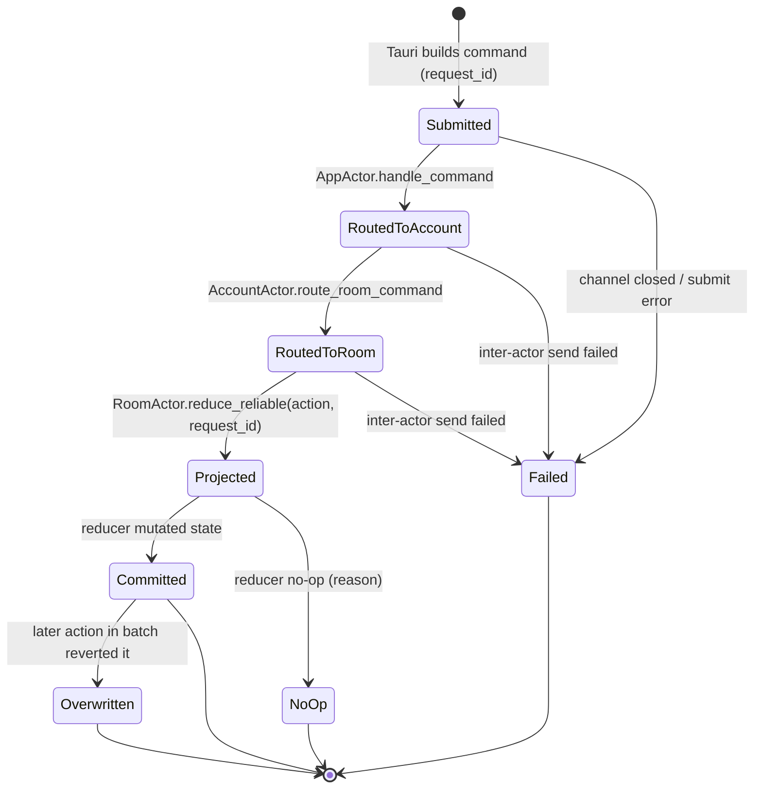

# User-Intent Observability — Correlated Intent Lifecycle, Lane/QoS Separation, Filterable Diagnostics

- Date: 2026-06-22
- Status: Pending user review
- Goal/depth: FULL. Make every user-intent command resolve to a correlated, observable terminal outcome; separate user-intent / background-projection / telemetry transport lanes; surface a step-by-step, Element-style filterable log. Motivated by blocker #116 (room selection times out on large real accounts). Behavior-preserving for success paths; the change makes *failures and no-ops observable*, it does not change product semantics.
- Branch: `codex/fix-room-transition-lag` (continue), or a fresh branch off it.
- Canon impact: amends `docs/architecture/overview.md` (channel topology + a new Observability/Intent-lifecycle section), `docs/architecture/state-machine.md` (the intent-lifecycle state machine is normative), `docs/policies/engineering-rules.md` (new Async/Observability rules), and `AGENTS.md` (diagnostics lane note). Canon-first: amend with the change.
- Delegation: this spec is the **detailed design / contract**. Implementing agents turn it into bounded subagent tasks (§9) and execute via subagent-driven-development. The main agent owns this contract, the shared enums/DTOs, and the canon edits. Brainstorm only the Open Questions (§10) with the owner; do not re-decide the architecture.

## 1. Context & current state (verified ground truth)

Blocker #116: on a large real account (~109 rooms / 5 spaces / 57 DMs, macOS, restored encrypted session) the Tauri `select_room` command times out after 10s with the opaque string `"room selection did not complete"`. It does **not** reproduce on small/conduit/headless accounts. Three independent code audits on the issue converge; this spec generalizes their conclusion.

The opaque timeout is produced by a **chain of silent no-ops with a severed correlation id**:

1. **Reducer no-op is invisible.** `handle_select_room` returns `Vec::new()` with zero mutations when (a) the session is not ready, or (b) the clicked room is absent from `state.rooms` (`crates/koushi-state/src/reducer/navigation.rs:106`, `:116`). No effect, no signal.
2. **No mutation → no delta → no event.** The action loop sets `state_changed = true` unconditionally for any non-empty batch (`crates/koushi-core/src/runtime.rs:682`) and calls `publish_state_delta`, but `build_state_delta` returns `None` when no slice changed. So neither `CoreEvent::StateDelta` nor `CoreEvent::StateChanged` is emitted. The waiter then observes `events>0, state_delta=0, active=other` and times out (`apps/desktop/src-tauri/src/commands/mod.rs:354-364`, `:406`).
3. **Navigation restore can overwrite the click.** `load_navigation_for_current_session()` runs after **every** action (`runtime.rs:679`) and wholesale-replaces `state.navigation` via `AppAction::NavigationLoaded` (`navigation.rs:38`). Under the right session-key timing this reverts the just-clicked room.
4. **The correlation id is dropped.** `RoomCommand::SelectRoom { request_id: _, .. }` discards `request_id` and projects only `AppAction::SelectRoom { room_id }` (`crates/koushi-core/src/room.rs:474-483`). Consequently the four *distinct* failure modes — never reached RoomActor, reducer no-op (not-ready), reducer no-op (room-missing), navigation overwrite — **all collapse into the same timeout string**, with no way to tell them apart from a log.
5. **Information is swallowed along the path.** `let _ = save_navigation(...)` (`runtime.rs:794`), `load_navigation(...).unwrap_or_default()` (`runtime.rs:740`), the `_ => {}` arm in `trace_room_route` that ignores `SelectRoom` (`crates/koushi-core/src/account.rs` ~`:3855`), and `try_send`-drop in the lossy `reduce` path (`room.rs:1660-1669`). Diagnostics are all-or-nothing `eprintln!` gated by `KOUSHI_SUBSCRIBE_TRACE` (17 call sites), console-only, unstructured, and not correlated by request id.

Why headless lanes miss it: every automated lane uses small accounts; no test asserts the *user-intent → observable outcome* invariant at scale. (A runtime-layer reproduction harness now exists at `crates/koushi-core/tests/runtime_room_selection_scale.rs`; see §6.)

Existing diagnostics surface (frontend): `DiagnosticLogEntry` is only `{ timestampMs, source, message }` and `VerboseDiagnostics` is only `{ enabled, security? }` (`apps/desktop/src/domain/diagnostics.ts:18`, `:34`), with no level/category/request-id and no filter UI.

Relevant existing canon: engineering-rules "Async and Runtime" #9 (state-critical actor actions are reliable, not lossy), #10 (production-meaningful reducer effects), #11 (channels sized for large-account bursts). This spec adds the *observability/correlation* dimension those rules don't yet cover.

## 2. Goals & non-goals

Goals:
- Every **user-intent command** resolves to exactly one **correlated, observable terminal outcome**: `committed` | `noop(reason)` | `overwritten(by)` | `failed(reason)`, carrying its `request_id`.
- A reducer no-op on a user-intent path is a **first-class reported outcome**, never a silent `Vec::new()`.
- A **step-by-step verbose trace** of each intent's lifecycle, on a **dedicated telemetry lane** never mixed with product `StateDelta`.
- An **Element-style filterable log viewer** keyed on `requestId` / `stage` / `category` / `level`.
- A **scale invariant test** (real-account-shaped) for user-intent commands.

Non-goals:
- No product-behavior change on success paths (navigation, room list, DM scoping unchanged).
- Not every action becomes correlated — only the **user-intent** class (§4.1). Background projections stay fire-and-forget on their own lane.
- No new framework; reuse the existing CoreEvent/diagnostics plumbing.

## 3. The unifying idea

"reproduction test", "verbose step-by-step", and "don't swallow information" are three views of one object: a **request_id-correlated intent lifecycle**. Define it once as a state machine; the test asserts its invariant, the verbose mode renders its stages, and the no-op/failure reasons are its terminal states.

## 4. Target design

### 4.1 What is a "user intent"

Foreground, one-shot, user-originated commands that the user is *waiting on*: `SelectRoom`, `SelectSpace`, send/edit/redact, open/close thread, mark read, pin/unpin, accept/decline invite, start DM, join/leave. Excluded: background projections (`RoomListUpdated`, timeline diffs, profile/avatar refresh, search-crawler progress) and persistence restore (`NavigationLoaded`, drafts, scheduled sends).

### 4.2 Intent lifecycle state machine (normative)



Terminal states: `Committed`, `NoOp(reason)`, `Overwritten(by)`, `Failed(reason)`. `NoOp` reasons for navigation: `SessionNotReady`, `RoomNotInState`, `SpaceNotInState`, `AlreadyActive`.

**Invariant (the tested contract):** every `Submitted` reaches exactly one terminal state; it must never silently vanish.

### 4.3 Threading the correlation id (the key change)

Recommended (Option 1): carry an optional correlation id on user-intent `AppAction`s so the **reducer**, which is the authority on committed/no-op, reports the outcome.

- Add a lightweight `IntentId` (newtype over `u64`) in `koushi-state` (koushi-state must stay free of koushi-core's `RequestId`; the runtime maps `RequestId ⇄ IntentId`).
- `AppAction::SelectRoom { room_id, intent: Option<IntentId> }` (and the other user-intent actions). `RoomCommand::SelectRoom` stops dropping `request_id`: it registers `RequestId→IntentId` and projects the action *with* the intent (`room.rs:474-483`).
- New reducer effect `AppEffect::IntentSettled { intent: IntentId, outcome: IntentOutcome }` emitted by `handle_select_room` on both the no-op branches and the success branch. `IntentOutcome = Committed | NoOp(NoOpReason) | Overwritten`.
- The runtime maps `AppEffect::IntentSettled` → a new telemetry-lane `CoreEvent::IntentLifecycle { request_id, stage }` **and** a structured diagnostic entry. `Failed`/`NoOp` also satisfy `wait_for_selected_room` (it returns `Err` with the *specific reason* instead of the generic timeout).

Alternative (Option 2): keep actions id-free; have the AppActor correlate post-reduce by comparing `before/after` for the targeted slice. Cleaner for koushi-state, but the AppActor must already know the intent target (still needs request_id threaded to the action). Recorded in Open Questions.

### 4.4 Emission points (SelectRoom vertical slice)

| Stage | Site | Today |
|-------|------|-------|
| Submitted | `select_room` builds command (`commands/navigation.rs:43`) | ok (has request_id) |
| RoutedToAccount | `runtime.rs` `handle_command` → AccountActor (~`:1500`) | not emitted |
| RoutedToRoom | `account.rs` `route_room_command` (`:471`) | `trace_room_route` ignores SelectRoom |
| Projected | `room.rs:483` `reduce_reliable` | request_id dropped |
| Committed/NoOp | `navigation.rs:105` `handle_select_room` | silent `Vec::new()` |
| Overwritten | `runtime.rs:679` nav restore | silent |
| Settled→waiter | `commands/mod.rs:354` `wait_for_selected_room` | generic timeout only |

Each row emits one `IntentLifecycle` stage with `request_id`. Verbose mode controls whether intermediate stages (RoutedToAccount/RoutedToRoom/Projected) are captured or only terminal ones.

### 4.5 Lane / QoS separation

Three transport lanes (start minimal; the 5-lane refinement in the issue's design memo is a later step):

1. **User-intent lane** — reliable (never dropped), prioritized, request_id-correlated; carries the one-shot intents and their lifecycle. (Builds on `reduce_reliable`, rule #9.)
2. **Background-projection lane** — `RoomListUpdated`, timeline diffs, profile/avatar/crawler; latest-wins/coalescing/drop-on-full allowed.
3. **Telemetry lane** — `IntentLifecycle` + structured diagnostics; throttle/batch allowed; **never** mixed into product `StateDelta` and never used to drive product state.

Rule: product state (`StateDelta`) and telemetry are different channels; a UI must never infer product success from a telemetry event, nor lose an intent because a telemetry buffer filled.

### 4.6 Structured diagnostics + filterable viewer

- Extend `DiagnosticLogEntry` to `{ timestampMs, level, category, source, requestId?, stage?, message }`. `level ∈ {trace, debug, info, warn, error}`; `category` e.g. `intent`, `transport`, `navigation`, `sync`, `js`. Keep `appendDiagnosticLogEntry` ring-buffer (`DEFAULT_DIAGNOSTIC_LOG_LIMIT`).
- `VerboseDiagnostics` gains `captureStages: boolean` (intermediate lifecycle stages) on top of `enabled`.
- Viewer (React): a log panel that filters by level (multi-select), category, free-text, and **request_id grouping** — click an entry to see the full ordered lifecycle of that intent (Submitted→…→terminal). Model on Element's rageshake/console filtering UX. Presentation-only over the Rust-owned structured entries; no product semantics in React.

### 4.7 Slice 1 — SelectRoom observability (first vertical slice, behavior-preserving)

Approved decisions: (i) `IntentOutcome = Committed | BenignNoOp(reason) | FailedNoOp(reason) | Overwritten` — a benign idempotent no-op (`AlreadyActive`) is **not** a failure; only `SessionNotReady` / `RoomNotInState` are `FailedNoOp` (retryable). (ii) Lanes start **minimal**: telemetry separated from product `StateDelta` + user-intent reliable; no full 3/5-lane refactor yet.

To minimize blast radius, Slice 1 derives the outcome in the **AppActor** (which already sees both the command's `request_id` and the post-reduce state), leaving `koushi-state` **untouched** (no `AppAction`/`AppEffect`/enum ripple). The reducer-authoritative `IntentSettled` design (§4.3) is a later refinement, not Slice 1.

- `koushi-core`: add `CoreEvent::IntentLifecycle { request_id, outcome }` (telemetry-lane event). In `runtime.rs`: when `handle_command` routes `CoreCommand::Room(RoomCommand::SelectRoom { request_id, room_id })`, record `pending_select[room_id] = request_id`. In the action loop, when an `AppAction::SelectRoom { room_id }` is reduced, derive the outcome from observable state (`session_ready = matches!(session, Ready|NeedsRecovery|Recovering)`; `found = state.rooms.contains(room_id)`; `already = active_room_id == room_id` before reduce; `committed = active_room_id == room_id` after), pop `pending_select[room_id]`, and emit `CoreEvent::IntentLifecycle`. Also emit the env-gated confirming trace `select_reduce found=<bool> session_ready=<bool> rooms_len=<n>` (counts/flags only).
- `commands/mod.rs`: `wait_for_selected_room` matches `CoreEvent::IntentLifecycle { request_id == select_request_id, outcome }` → `Ok` for `Committed`/`BenignNoOp`, `Err(specific reason)` for `FailedNoOp` (e.g. `"room not yet loaded"` / `"session not ready"`). Replaces the generic 10s timeout for these cases (fail-fast with a reason).
- Wire surfaces in sync: `serialize_core_event` (`src-tauri/src/lib.rs`), `domain/coreEvents.ts`, `coreEvents.generated.json`, and the `core_event_wire_format_matches_checked_in_contract_artifact` test.
- Tests: a `koushi-core` runtime test that drives the **real command path** (`conn.command(build_select_room_command(...))`, not `inject_actions`) and asserts the emitted `IntentLifecycle` outcome is `FailedNoOp(RoomNotInState)` for an absent room and `Committed` for a present one. This also exercises the full AppActor→AccountActor→RoomActor→action→reduce chain that the §6 repro test deliberately bypassed.

Slice 1 is the diagnostic + fail-fast; it does **not** make a failed selection succeed (that is the §7 (A)/(B) fix, a later slice).

## 5. Why this fixes the debuggability of #116 specifically

After this change, the same failing click prints an ordered, filterable trace such as `intent <id> Submitted → RoutedToRoom → Projected → NoOp(RoomNotInState)`, and `select_room` returns `Err("room not in state at selection time")` instead of `"room selection did not complete"`. The four collapsed failure modes become four distinct, correlated outcomes — which is what localizes the real-account trigger without needing the real account.

## 6. Test strategy

**Verified 2026-06-22 (runtime layer exonerated).** `crates/koushi-core/tests/runtime_room_selection_scale.rs` ran green 3× (deterministic, single- and multi-threaded): clicking a *present* room deep in a 110-room/5-space/57-DM list lands it (`select_room_deep_in_large_account_lands_on_clicked_room` PASS); a click for a room *absent* from the latest `state.rooms` silently vanishes (`select_room_missing_from_state_rooms_is_a_silent_noop_today` PASS, confirming the swallow); a 40-iteration re-projection storm neither starves nor reverts the click (PASS, ruling out H-storm at this layer). Conclusion: the bug is **not** in the reducer/runtime; the trigger is **upstream of the reducer**, in how `state.rooms` is populated. `normalize_rooms` (`room.rs:1923`) is a pure 1:1 map and cannot drop a room — so the suspect is the SyncService `RoomListService` entries-stream (`run_live_room_list_observation`, `room.rs:1740`; progressive `VectorDiff` entries under `new_filter_non_left()`) producing a `state.rooms` transiently/persistently missing a sidebar-visible room, OR `is_session_ready` being false during the click window on a restored encrypted session. These two produce *different* `NoOp` reasons (`RoomNotInState` vs `SessionNotReady`) — which only the §4 observability layer can disambiguate on the real account.

- **Runtime/reducer layer** (DONE, green): the harness above; keep it as a permanent regression guard.
- **Invariant test** (new, after §4.3): assert every submitted user-intent reaches a terminal `IntentLifecycle` — `NoOp(RoomNotInState)` for a missing room, `Committed` for a present one — i.e. *no silent vanishing*. This is the permanent regression guard.
- **SDK-normalization test** (conditional): if the runtime layer is exonerated, a focused test that builds a large synthetic room-list snapshot and asserts `normalize_rooms` does not drop joined rooms.
- **Reducer unit tests** (`koushi-state`): no-op branches now return `IntentSettled` outcomes.

## 7. The #116 fix (root cause CODE-CONFIRMED 2026-06-22)

Runtime layer is clean (§6). The trigger is a code-confirmed 3-link chain:

1. **`crates/koushi-sdk/src/lib.rs:4180`** — `matrix_room_list_snapshot_from_rooms` drops any room whose **live** `room.state() != RoomState::Joined`, even though the stream filter (`new_filter_non_left`) admitted it on **cached** state. On a large restored encrypted SyncService account, progressive hydration makes a genuinely-joined room momentarily report non-`Joined` → dropped from the projected vec. (Also explains "no members loaded" / "startup room loads only after a while".)
2. **`crates/koushi-state/src/reducer/room.rs:51`** — `handle_room_list_updated` wholesale-replaces `state.rooms = rooms`, so the transient drop becomes the live truth.
3. **`crates/koushi-state/src/reducer/navigation.rs:116`** — `handle_select_room` silently `Vec::new()`s for the now-absent room → no delta → 10s opaque timeout. The sidebar still shows the room (250ms-debounced snapshot at `apps/desktop/src/App.tsx`), so the user clicks a row the live `state.rooms` no longer contains.

Confirming signal on the next real-account run (after §4 observability ships): `select_reduce found=false session_ready=true rooms_len=<n>` with `rooms_len` below the sidebar count.

**Fix options (decide after observability confirms on the real account; not mutually exclusive):**
- (A) **Recoverable select** — `SelectRoom` for a room that is *known* (`known_room_ids`) but absent from the current `state.rooms` becomes a `Pending` state that triggers a room-list refresh and retries, instead of a silent no-op. Honors the user's intent the moment the room re-appears. Most user-correct; addresses the symptom regardless of (B)/(C).
- (B) **Non-destructive room-list merge** — stop wholesale-replacing `state.rooms`; merge so a previously-known joined room is not un-listed by a transient incomplete projection (explicit `Remove` semantics only). Aligns with the §111 state-transport "preserve references" philosophy.
- (C) **Projection/filter agreement** — at `lib.rs:4180`, do not drop a room that the non-left filter admitted purely because live `room.state()` is mid-hydration; align the projection's joined-check with the filter, or treat unknown/hydrating state as "keep".

Recommendation: ship §4 observability first (behavior-preserving diagnostic), confirm `RoomNotInState` on the real account, then (A)+(B) together (recoverable intent + non-destructive merge) as the durable fix, with (C) as the upstream hardening.

### 7.1 Fix A implementation (recoverable select) — DEFERRED (2026-06-22)

Status: prototyped then REVERTED out of the observability push. A working
single-recovery-intent implementation was built and proven (in-place resolution,
supersede-the-older-intent, bounded rounds), but codex review surfaced a series
of genuine concurrency races across the async actor boundaries (same-room
multi-request drain, cross-room hash-order, supersede-at-acceptance vs
action-echo timing, forwarding-failure settle). Each was fixable, but the
recurring race surface plus the fact that **Fix A is only a recovery net for the
symptom** — the root cause is Fix B (`lib.rs:4180` dropping a hydrating joined
room + the wholesale `state.rooms` replace) — argued for stepping back. If B is
fixed at the source the room never leaves `state.rooms`, the select never
no-ops, and the race-prone recovery is unnecessary. B is not headless-verifiable
(the transient is SDK-runtime), so the sequencing is: ship observability →
confirm transient-vs-persistent on the real Mac account via the Slice 1
diagnostic (`select_room` specific reason + `koushi.select_reduce rooms_len=...`)
→ implement the right fix (B at source; A as a net only if the Mac data shows it
is still needed). The recovery design below is preserved for that revisit.

The reverted design was: AppActor-side, `koushi-state` UNTOUCHED, no AppState/DTO ripple (recovery is an internal actor concern, not product state). Built on Slice 1's `pending_select` correlation.

- New internal actor messages (not exposed to Tauri/React): `AccountMessage::RefreshRoomList` → `RoomMessage::RefreshRoomList` → `RoomActor::refresh_room_list()` (`room.rs:1414`), so the AppActor can provoke a fresh room-list projection (needed for the issue's quiet periods, where no natural `RoomListUpdated` may arrive within the waiter window).
- AppActor field `recovering_select: HashMap<String, (Vec<RequestId>, u8 /*rounds_left*/)>` and `action_tx` clone for re-injection.
- When Slice 1 classification yields `FailedNoOp(RoomNotInState)` for a request popped from `pending_select`: do NOT emit. Move the request_id into `recovering_select[room_id]` (rounds_left = `RECOVER_ROUNDS`, e.g. 3) and send `AccountMessage::RefreshRoomList`.
- After an `AppAction::RoomListUpdated` is reduced (and `recovering_select` is non-empty), run a recovery pass: for each recovering room, if it is now in `state.rooms`, push its request_ids back into `pending_select[room_id]` and re-inject `AppAction::SelectRoom { room_id }` via `action_tx` (it flows through the normal loop → commits → emits `Committed`); else decrement rounds_left, and on 0 emit `FailedNoOp(RoomNotInState)` for each held request_id, otherwise send another `RefreshRoomList`.
- Scope/limits: A recovers the TRANSIENT absence. If the Mac test shows persistent `room.state()`-lag (rooms_len stays below the sidebar count across refreshes), Fix B (`lib.rs:4180` / non-destructive projection) is the root fix. Re-injection that flaps back to `RoomNotInState` re-enters recovery (bounded by `RECOVER_ROUNDS` and the waiter's 10s backstop). The proactive refresh is a no-op in headless tests (no live observation); headless tests drive recovery by injecting the next `RoomListUpdated` directly.

## 8. Rules to codify (proposed `engineering-rules.md` → "Async and Runtime")

12. **User-intent commands resolve to a correlated, observable terminal outcome.** Every foreground one-shot command carries a `request_id` end-to-end and settles as exactly one of `committed | noop(reason) | overwritten | failed(reason)`. A reducer no-op on a user-intent path returns a reported `IntentSettled` outcome, not a silent `Vec::new()`. A command waiter returns the specific reason, never a generic "did not complete".
13. **Do not swallow information on a user-intent path.** `let _ =`, `unwrap_or_default()`, `.ok()`, catch-all `_ => {}`, and `try_send`-drop are forbidden on the submit→route→project→reduce→settle chain; failures are logged and correlated.
14. **Telemetry travels on its own lane.** Diagnostics/lifecycle events are never mixed into product `StateDelta`, never drive product state, and never cause an intent to be dropped when a telemetry buffer fills.
15. **User-intent delivery is reliable and prioritized**, separate from background-projection and persistence-restore lanes.
16. **Every user-intent command class ships a real-account-shaped scale stress test** (~110 rooms / 5 spaces / 57 DMs) asserting the intent-lifecycle invariant. (This is the gap that hid #116.)

## 9. Subagent task breakdown (bounded; cost-controlled delegation)

| # | Task | Allowed files | Forbidden (main-agent integration) | Verify |
|---|------|---------------|-----------------------------------|--------|
| 1 | Repro test (runtime + normalize_rooms) | `crates/koushi-core/tests/runtime_room_selection_scale.rs` (+ a new sdk test) | product `src/` | `cargo test -p koushi-core --test runtime_room_selection_scale` |
| 2 | `IntentId`/`IntentOutcome`/`IntentSettled` + reducer no-op outcomes | `koushi-state/src/{ids or new intent.rs, effect.rs, reducer/navigation.rs}` + its tests | `reducer/mod.rs`, DTOs | `cargo test -p koushi-state` |
| 3 | request_id↔IntentId mapping; emit `IntentLifecycle`; `wait_for_selected_room` returns specific reason | `koushi-core/src/{room.rs select arm, account.rs route, runtime.rs map}`, `commands/{navigation.rs,mod.rs}` | shared DTOs done in #4 | repro + `cargo test -p koushi-core` |
| 4 | `CoreEvent::IntentLifecycle` DTO + structured `DiagnosticLogEntry` across Rust DTO / TS types / coreEvents / mocks (shared hot files — main agent coordinates) | `src-tauri/src/dto.rs`, `domain/{types.ts,coreEvents*.ts,diagnostics.ts}`, fakes, IPC mock | — | wire-contract test + `npm run typecheck` |
| 5 | Element-style filterable log viewer | `apps/desktop/src/components/<log viewer>.tsx`, tests | `App.tsx` wiring by main agent | `npm run test`, headless spec |
| 6 | #116 targeted fix (per §7) | per decision tree | — | repro now green |
| 7 | Canon: rules §8 + overview/state-machine sections | docs only | — | n/a |

## 10. Open questions (brainstorm only these)

1. Lifecycle stages (§4.2): 6 stages as drawn, or collapse intermediate routing into a single `Routed` for v1?
2. Correlation: Option 1 (intent id on the action, reducer reports) vs Option 2 (AppActor post-reduce correlation). Recommend Option 1.
3. Lanes: start with the 3-lane split (§4.5) or go straight to the issue memo's 5 lanes?
4. Sequencing: observability-first then fix (recommended), or confirm the repro and ship the minimal #116 fix first to unblock the blocker, then layer observability?

## 11. Root cause CONFIRMED on the real Mac account (2026-06-22, supersedes §7's lib.rs:4180 hypothesis)

Running the shipped observability build (`e2c5f40`) on the large real account showed the decisive trace:

```
koushi.apploop arm=command count=1421 clone_ms=1 total_ms=62371
koushi.select_reduce found=true session_ready=true rooms_len=109
```

This **exonerates both prior hypotheses**: the reducer is fine (`found=true session_ready=true rooms_len=109` — the clicked room IS in `state.rooms`), and it is NOT the `lib.rs:4180` projection drop. The real root cause is **actor head-of-line blocking / I/O starvation from a background command flood**:

- Opening Room Info on a large room makes the snapshot planner (`apps/desktop/src/domain/avatarThumbnails.ts` `planSnapshotAvatarThumbnailRequests`, driven from `App.tsx:1079`) fire one `download_avatar_thumbnail` per `profile.users` avatar — ~1421 commands at once.
- `download_avatar_thumbnail` (`account.rs:4012`) has **no cache check** — it always `get_media_content().await` + rewrites the file, even for already-downloaded avatars. The `AccountActor` processes these **inline and serially** in its message loop.
- The `AppActor` command arm coalesces (`while try_recv`) the whole flood and forwards each via `account_actor.send(...).await`; backpressure from the serial AccountActor blocks the AppActor for **62 s**, during which the `select!` cannot service `action_rx` (SelectRoom reduce) or emit `StateDelta` → freeze + room-selection timeout.
- `SelectRoom` (user intent) shares the same `command_rx` AND the same `AccountActor` inbox as the avatar flood — there is **no QoS lane separation** (the branch only sized capacities + reliable/lossy send disciplines on shared channels; it never separated user-intent from background). Pre-Room-Info congestion has the same shape, dominated by the room-list re-projection (`matrix_room_list_snapshot_from_rooms` awaits ~5 SDK calls × 109 rooms on every VectorDiff batch).

**Fix plan (replaces Fix A/B):**
- **Minimal (now):** disable avatar-thumbnail downloads by default (GUI flag, fallback colored-initial renders) → confirm room switching/freeze is resolved minimally on the real account. Diagnostic: if resolved, the avatar flood was the cause; if not, the room-list re-projection is the next target (make it incremental).
- **Proper (next):** user-intent QoS lane separation (dedicated prioritized command lane at the AppActor + AccountActor; background slow I/O dispatched to a bounded worker, never awaited inline in an actor message loop) + an **encrypted, cache-first, single-flight** avatar cache (see Privacy below) + GUI throttle/virtualize of the member list + incremental room-list projection.
- **Privacy:** avatar thumbnails are currently written **plaintext** to `data_dir/avatar_thumbnails/` and served via `file://` (the vendored matrix-rust-sdk also caches media in its own `cache_path` store, separate from the encrypted state store). Contact avatars are sensitive social-graph metadata and should be encrypted at rest. **Decision (2026-06-22): plaintext is accepted for the initial re-enable (no regression vs current behavior); encryption is tracked as a follow-up in issue #117** (serve from the SDK media store via a custom Tauri protocol, no plaintext copy, or encrypt the cache with the account store key).

**Rules to codify (extends §8):** user-intent commands travel on a dedicated prioritized lane, never sharing a FIFO with high-volume background work; slow SDK I/O (media/avatar) is served cache-first and runs on a bounded worker, never awaited inline in an actor message loop; re-fetchable sensitive assets (avatars) are cached in encrypted storage, cache-checked before any network fetch.
