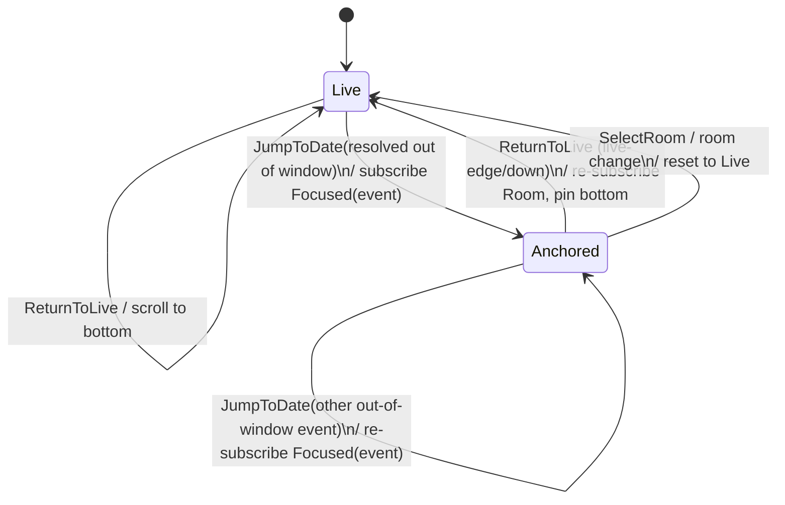

# Design: Jump to date navigates the main timeline (issue #161)

Status: proposed
Date: 2026-07-01
Issue: https://github.com/shinaoka/koushi-matrix/issues/161

## Goal

`Jump to date` must scroll the **main room timeline** to the event nearest the
selected date/time, at **arbitrary history depth**, and must never open an empty
right panel. The live-edge/down control must still return the main timeline to
the latest message and pin it to live edge.

Arbitrary-depth reach is a hard requirement: a date jump that can only reach
already-loaded events is not useful. The good news from investigation is that
the reach machinery already exists (see Context); this design re-points it from
the right panel to the main pane and adds a live-edge return.

## Context (current behavior + existing machinery)

- Frontend `timelineTransport.openAtTimestamp(roomId, ms)` calls the Tauri
  `open_timeline_at_timestamp` command and, in `App.tsx`, sets
  `rightPanelMode("focusedContext")` — the wrong product contract.
- Tauri `open_timeline_at_timestamp` (`src-tauri/src/commands/navigation.rs`)
  waits for focused-context state (`wait_for_focused_context`).
- Core `handle_open_timeline_at_timestamp` (`crates/koushi-core/src/account.rs`)
  resolves the nearest event via the Matrix `timestamp_to_event` endpoint
  (**server-side, reaches any depth**), then dispatches
  `AppAction::OpenFocusedContext` and subscribes `TimelineKind::Focused`.
- `TimelineKind::Focused` already maps to SDK `TimelineFocus::Event { target,
  num_context_events: 20, .. }` (`crates/koushi-core/src/timeline.rs`) — an
  event-centered timeline **already exists**; it is only rendered in the right
  panel today.
- The room scroll-anchor path is closer to the desired behavior for
  already-loaded events: `open_activity_event` selects the room, subscribes the
  live timeline, and updates `NavigationState.room_scroll_anchors`;
  `TimelineView.tsx` restores the anchor **only if** the target event is present
  in the loaded room items, otherwise falls back to live edge.

Root problem: the arbitrary-depth, event-centered timeline is rendered in the
right panel instead of the main pane, and only the loaded-window anchor path
targets the main pane.

## Decided approach — hybrid main-pane timeline mode

Introduce a main-pane timeline **mode** as a Rust-owned, guarded state machine.

- **`Live`** (default): main pane renders `TimelineKind::Room` (live timeline),
  live-edge return = existing scroll-to-bottom.
- **`Anchored { event_id }`**: main pane renders the event-centered
  `TimelineKind::Focused` timeline (`TimelineFocus::Event`) for that event.

Leading state placement (plan finalizes against existing subscription patterns):
a Rust-owned `NavigationState.main_timeline_anchor: Option<MainTimelineAnchor
{ event_id }>` scoped to the active room — `None` = `Live` (main pane subscribes
the `Room` key), `Some` = `Anchored` (main pane subscribes the `Focused` key).
This reuses the existing "which `TimelineKey` does the main pane render" seam
rather than adding a parallel timeline instance.

`Jump to date` flow (Rust-owned decision):

1. Resolve the nearest event via `timestamp_to_event` (any depth).
2. Rust decides **loaded vs out-of-window**:
   - If the resolved event is in the currently loaded live timeline items →
     stay `Live` and set `room_scroll_anchors[roomId]` for that event (reuse the
     `open_activity_event`-style path). The main timeline scrolls to it; live
     edge is preserved conceptually.
   - Else → transition main pane to `Anchored { event_id }`, subscribe
     `TimelineKind::Focused { room_id, event_id }`, and render the event-centered
     timeline in the **main pane**, viewport anchored around the target event.
3. Never set `rightPanelMode("focusedContext")` from `openAtTimestamp`.

Live-edge/down control:

- In `Anchored` mode it means **return to live**: re-subscribe the `Room` live
  timeline, transition back to `Live`, and pin to bottom.
- In `Live` mode it keeps the existing jump-to-bottom behavior.

### State machine (normative)

Guards: `Anchored` is only entered for a session-ready room with a resolved
event id; a room switch resets the pane to `Live`. Diff-driven navigation
(`NavigationUpdated`) is emitted after `ItemsUpdated` so GUI rows exist before a
scroll references them (existing rule).

## Ownership

- Mode transitions, the loaded-vs-out-of-window decision, nearest-event
  resolution, and anchor placement are **Rust-owned**.
- React reports viewport facts via `observe_timeline_viewport` and renders the
  snapshot/`NavigationUpdated`. React must not compute placement, decide the
  mode, or synthesize which timeline instance is active.

## DTO / wire mirror checklist (same-change)

New main-pane mode state (e.g. a `TimelinePaneState` view-mode field or a
navigation field) plus any new command (`return_to_live`) / event must update in
the same change:

- `crates/koushi-state` state + reducer + guard tests + Mermaid kept in sync.
- `apps/desktop/src-tauri/src/dto.rs` (`FrontendAppState`), `src/domain/types.ts`,
  `browserFakeApi.ts`, `tauriIpcMock.ts`, `appHarnessMain.tsx`, DTO
  serialization-contract test.
- New `CoreCommand`/`CoreEvent`: `serialize_core_event`,
  `src/domain/coreEvents.ts`, `coreEvents.generated.json`, and the
  `core_event_wire_format_matches_checked_in_contract_artifact` test.

## Testing (verify-first — RED before fix)

Rewrite the tests that encode the wrong contract:

- `apps/desktop/src/App.test.tsx` "date jump … opens focused context panel"
  (asserts `setRightPanelMode("focusedContext")`).
- `crates/koushi-core/src/runtime.rs`
  `timestamp_jump_uses_local_activity_projection_before_homeserver_fallback`
  (asserts `AppAction::OpenFocusedContext`).
- `apps/desktop/e2e/timeline-scrollback.spec.ts` date-jump spec.

New RED coverage (must fail before the fix, pass after):

- Jump to an **out-of-window** (old) date navigates the **main** timeline to the
  target event, does **not** open the right panel, and reaches the event even
  when it was not loaded.
- Jump to an in-window date scrolls the main timeline and stays `Live`.
- Live-edge/down from `Anchored` returns to live and pins bottom.
- Update the Linux lane `--scenario=local-timeline-navigation` to assert
  main-pane navigation and reject focused-context opening.

Keep all evidence private-data-free (no room/event/user ids, timestamps, bodies,
raw SDK errors); reuse the existing token-only `timeline_nav=ok`.

## Scope / non-goals

- Reuse the existing `TimelineFocus::Event` timeline; do **not** build a new SDK
  timeline mode.
- The right-panel focused-context feature is not removed; only `Jump to date`
  stops using it. The plan must verify which other callers (if any) still open
  focused context and leave them intact.

## Batch integration (#161–#163, single PR)

`TimelineView.tsx` is shared with #163. On the single implementation branch,
land #161 first, then #163, to avoid concurrent edits to that hot file. #162 is
Rust-search-internal and parallel-safe.
