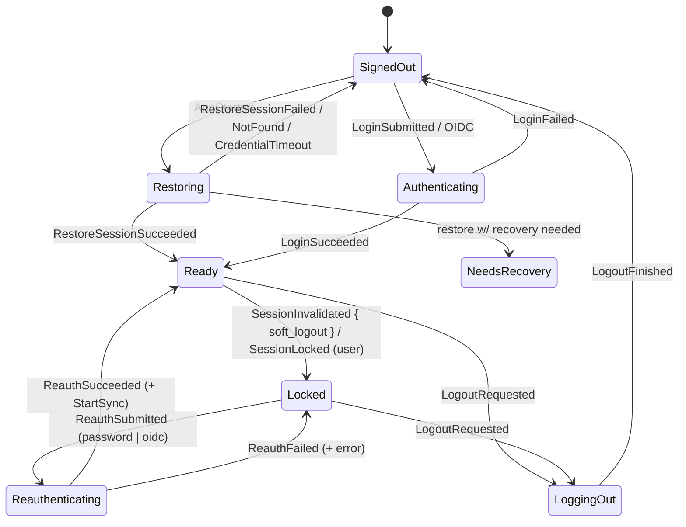

# Session / Sync Lifecycle Redesign (Login And Reconnect Root Fix)

Date: 2026-07-06
Status: Approved design, pending implementation plan
Branch context: `codex/fix-live-message-sync` (contains uncommitted diagnostic and
interim auth/sync changes from the 2026-07-06 HANDOFF; see "Working Tree
Handling" below)

## Problem

Four user-visible failures were reported against the current tree (HANDOFF
2026-07-06), and each traces to a structural cause, not an isolated bug:

1. **"Reconnecting" forever while the network is fine.** The SyncService
   observer discards the SDK error payload (`State::Error(_)` → hardcoded
   `Http`), and with `with_offline_mode()` the SDK never surfaces auth errors
   as a state at all: any sync error (including 401) enters `Offline`, the
   `/versions` probe succeeds (server is fine), sync restarts, fails again,
   loops. Auth invalidation is invisible on the SyncService path by
   construction.
2. **Pressing refresh shows "Stopped" forever.** `SyncCommand::Restart` runs
   stop→start inside the actor; the reducer sees only `SyncStopped`. The later
   `SyncStarted` is silently dropped by the reducer guard (`Stopped` is not a
   valid source state for `SyncStarted`), so the UI shows `Stopped` while sync
   is actually running. The projection never self-heals.
3. **"Sign-in required" is a dead end.** `sync_failed_auth` moves the session
   to `Locked`, whose only canon exit is logout. The existing
   `SoftLogoutReauthState` machine is gated by `is_session_ready`, which
   excludes `Locked` — the re-auth path is unreachable exactly when it is
   needed. The auth screen offers only a full re-login (new device: E2EE
   continuity lost, recovery required again).
4. **Startup hang on the macOS Keychain.** Credential store reads
   (`load_matrix_session` etc.) run synchronously on the AccountActor's async
   task with no `spawn_blocking` and no timeout. A blocking SecurityAgent
   prompt freezes the actor; the UI stays in `Restoring` with no exit.

The shared root disease behind 1–3: **two books of record for one lifecycle**.
Sync truth lives in `SyncActor` (`SyncLifecycle` + observer flags); GUI truth
lives in `AppState.sync`. They are synchronized by interpreted transition
events that can be dropped (`try_send`), reordered, or silently discarded by
reducer guards, with no reconciliation. Once the copies diverge, they diverge
forever.

A fifth symptom — the app exiting after the login screen appeared — is not yet
traced. Reproduction is the first implementation task (Phase 0), not part of
this design's causal analysis.

## Goals

- Kill the class of stuck/diverged lifecycle bugs structurally, not
  symptom-by-symptom.
- Make auth invalidation a first-class, sync-independent signal with a modeled
  recovery path that preserves the device (E2EE continuity).
- Make credential-store waits visible and bounded.
- Amend canon first (REPOSITORY_RULES.md, overview.md, engineering-rules.md,
  state-machine.md) so the same defect class cannot be reintroduced silently.

## Non-Goals

- No unification of session+sync into a single ConnectionActor (evaluated and
  rejected as over-reach for the current symptoms; revisit with the wasm port).
- No change to the `SyncMode` axis (backend capability projection stays as-is).
- No multi-account or concurrent-session semantics changes.
- Real OIDC/MAS re-auth ships last (Phase 6); the state machine models it from
  the start.

## Design 1: Lifecycle Is Projected, Not Narrated

### Sync status projection

The five interpreted sync actions (`SyncStarted`, `SyncStopped`,
`SyncReconnecting`, `SyncRecovered`, `SyncFailed`) are removed and replaced by
one latest-wins full-status projection:

```rust
AppAction::SyncStatusChanged {
    generation: u64,                  // monotonic, owned by SyncActor
    lifecycle: SyncLifecycleStatus,   // Stopped | Starting | Running
                                      // | Reconnecting { reason }
                                      // | Failed { kind }
    backend: Option<SyncBackendKind>,
}
```

- `SyncActor` is the only book of record. Every internal lifecycle change
  projects the complete current status through the **reliable** action path
  (`send().await` from the owning task) — never drop-on-full `try_send`.
- The reducer **projects**; it does not interpret. There is no transition
  table for sync in the reducer. Stale generations
  (`generation <= state.sync_generation`) are discarded.
- Session guards **normalize instead of drop**: unless the session is in a
  sync-capable state (`Ready`, `NeedsRecovery`, `Recovering` — today's
  `is_session_ready` set), any projected status renders as `Stopped`. The
  projection is still applied (generation recorded), so no stale status can
  survive a guard.
- The reducer no longer writes `AppState.sync` directly anywhere else. The
  optimistic `SyncState::Starting` writes in `handle_restore_or_login_succeeded`
  and the e2ee recovery handlers are removed; the actor projects `Starting`
  when it accepts `Start`. The brief `Ready + Stopped` window before the first
  projection is acceptable and self-healing.
- `SyncState` keeps its shape but is typed:
  `Failed { kind: SyncFailureKind }` (was `reason: String`) and
  `Reconnecting { reason: SyncReconnectReason }` (was `String`). DTO
  serialization keeps the current stable snake_case labels
  (`sync_failed_http`, `network_offline`, …) so wire drift is minimal.
- `CoreEvent::Sync` mirrors the same projection as
  `SyncEvent::StatusChanged { generation, lifecycle, backend }`, replacing the
  granular `Started/Running/Reconnecting/Stopped/Failed` events.
  `SyncEvent::ModeChanged` (the `SyncMode` axis) is unchanged. The wire
  contract artifact and all DTO mirrors update in the same change.

### Observer tasks become stateless relays

`SyncServiceObserverStatus` (a third book of record inside the observer task)
is removed. Observer tasks — the SyncService state watcher, the room-list
state watcher, and the legacy loop — translate SDK states into classified
signals and send them to the SyncActor inbox:

```rust
SyncMessage::BackendSignal(BackendSignal) // e.g. Healthy, ConnectivityLost { reason },
                                          // TerminatedBySdk, FatalError { kind }
```

The SyncActor alone updates its book (including connectivity-proof and
fallback-to-legacy decisions, which move out of the observer) and projects.
Product policy for a failure never lives inside an observer.

### Restart

`SyncCommand::Restart` remains actor-internal stop→start. Because every
intermediate state is projected fully (`Stopped` → `Starting` → `Running`),
the UI follows naturally and converges even under restart storms. No reducer
special-casing.

## Design 2: Session Validity Is A Separate Channel

### Detection

`AccountActor` subscribes to `Client::subscribe_to_session_changes()` for the
lifetime of each established session (spawned on login/restore/reauth success;
aborted on logout, account switch, shutdown — same lifecycle pattern as the
recovery and incoming-verification observers).

- `SessionChange::UnknownToken { soft_logout }` fires at the SDK HTTP layer,
  independent of sync backend and of offline mode swallowing sync errors.
  Verified against the vendored SDK: with offline mode enabled, auth errors
  never appear as `SyncService::State::Error`, so the session-change channel
  is the only reliable source.
- The legacy sync loop keeps its error classification, but an `Auth`
  classification now forwards to the AccountActor (same entry point as
  `UnknownToken`) instead of producing a terminal reducer sync failure.
  `sync_failed_auth` as a sync-level concept is deleted.
- The SyncService observer defensively classifies `State::Error(e)` via
  `classify_sdk_sync_error`; `Auth` forwards to AccountActor, everything else
  projects `Failed { kind }`. `Terminated` maps to `Stopped` when the actor
  itself requested stop, otherwise `Failed { Internal }` (the current
  unconditional-fail mapping is removed).

### Session state machine (canon replacement for the Session diagram)



- `Locked` becomes `Locked { info, reauth: ReauthCapability }` where
  `ReauthCapability` is `Password | Oidc | Unknown`, derived from the
  persisted login kind (`auth_kind` added to the persisted session metadata;
  missing field defaults to `Unknown`, which offers password reauth when the
  homeserver advertises it, plus full re-login).
- **Password reauth reuses the existing client**: `AccountCommand::ReauthSubmit
  { request_id, password: AuthSecret }` performs a device-id-preserving login
  on the current client (token refresh only — same SDK client, same stores,
  same device, E2EE continuity). No client rebuild, no SyncActor respawn;
  `ReauthSucceeded` → `Ready` + `AppEffect::StartSync`.
- OIDC reauth is a second `ReauthSubmitted` entry into the same
  `Reauthenticating` state (browser round-trip like existing OIDC login);
  implementation deferred to Phase 6.
- `SoftLogoutReauthState` (separate half-connected machine, unreachable from
  `Locked` due to its `is_session_ready` guard, no UI consumer) is **deleted**:
  state field, actions, DTO field, TS types, fake snapshots.
- Idempotency: AccountActor keeps a `session_epoch` counter incremented on
  every successful login/restore/reauth. `UnknownToken` signals stamped with
  an older epoch, or arriving while already `Locked`/`Reauthenticating`, are
  dropped. Only the `soft_logout: bool` flag crosses into state; raw
  `UnknownTokenErrorData` never does.
- Failure UX: reauth failures reuse `AuthFailureKind` and return to `Locked`
  with an error. A `forbidden` reauth failure after `soft_logout == false`
  additionally surfaces "this device was signed out by the server; log out and
  sign in again" guidance (device-deleted case).

## Design 3: Credential Store I/O Isolation

- Every `credential_backend()` call site in `StoreActor`/`AccountActor`
  (`load_last_session`, `load_matrix_session`, `save_*`, `delete_*`,
  `load_saved_sessions`) is wrapped in `spawn_blocking` with a bounded
  timeout. Direct synchronous calls on an actor loop become a rule violation
  (engineering-rules amendment below).
- Two-stage timeout for the startup restore path:
  - **T1 = 2s**: project `SessionState::Restoring { waiting_credentials: true }`
    so the GUI can render "waiting for the OS credential store".
  - **T2 = 60s**: fail the restore with
    `restore_failed(credential_store_timeout)` → `SignedOut`. The app always
    lands in an operable state even if the Keychain prompt hangs forever.
- Non-startup credential accesses (saved-session listing, persistence) keep
  their per-operation `StoreUnavailable` failure semantics; no waiting-state
  projection needed.
- The OS-credential code paths are desktop-only; using
  `tokio::task::spawn_blocking` directly there is acceptable for wasm
  portability because the whole credential backend is platform-gated (the
  transport-neutral core types are unaffected).
- QA hook: the debug/test file credential store gains an env-gated delay
  injection so headless QA can prove both waiting→recovered and
  waiting→timeout paths. Compile-time gated out of release builds like the
  existing QA overrides.

## Design 4: Canon Amendments (approved wording)

### REPOSITORY_RULES.md — "State-Machine Discipline" additions

> - **Ownership split: reducer-owned machines vs actor-owned lifecycles.**
>   State machines the reducer itself owns (login flow, pending operations,
>   view state) transition by interpreting actions, with guards. State that
>   mirrors another owner's lifecycle (sync connection, SDK service state,
>   credential-store activity, any long-lived connection) is a **projection**:
>   the owning actor holds the only book of record, and every mirror
>   (`AppState`, DTO, GUI) must be reconstructible from it at any time.
>   Interpreting another owner's lifecycle through a reducer-side transition
>   table is a defect.
> - **Lifecycle crosses ownership boundaries as latest-wins full status, not
>   as narrated transitions.** The owner projects
>   `...StatusChanged { generation, status }` carrying the complete current
>   status with a monotonic generation. Consumers apply the newest projection
>   unconditionally; stale generations are discarded. Guards may **normalize**
>   a projection for display (e.g. any sync status renders as `Stopped` while
>   signed out); they must never silently drop one. Any dropped or reordered
>   delivery must be healed by the next projection, by construction.
> - **Failure channels are separated at the boundary that exposes them.**
>   Session validity (auth invalidation, soft logout) and connectivity
>   (network reachability) are distinct channels with distinct owners. A
>   subsystem must not infer one from the other's error stream, and
>   classification happens where the SDK still exposes the underlying error —
>   never downstream where it is already erased.
> - **Every user-visible waiting state has a modeled exit.** `Reconnecting`,
>   `Restoring`, "waiting for the OS credential store", and any similar state
>   must carry at least one of: supervised retry with observable progress, a
>   bounded timeout into a terminal state, or a user-invocable recovery
>   command. A waiting state with no modeled exit is a defect, and the exit
>   must appear in `docs/architecture/state-machine.md`.

### overview.md — Async Design Rules, new rule 13

> 13. **Lifecycle status is projected, not narrated.** Actors that own a
>     connection-like lifecycle (sync backends, session/auth validity,
>     credential-store access) publish latest-wins full-status projections
>     with monotonic generations; reducers project and normalize but never
>     re-derive lifecycle transitions from event sequences. SDK state
>     observers relay classified status only — product policy for a failure
>     (lock the session, fall back, retry) is decided by the owning
>     actor/reducer, not inside the observer. Lifecycle projections use the
>     reliable action path (`send().await` from the owning task), never
>     drop-on-full `try_send`.

### engineering-rules.md — "Async and Runtime" additions

> - **Blocking OS-integration calls never run on an actor loop.** OS
>   credential store (Keychain/Secret Service/DPAPI), native dialogs, and
>   similar synchronous OS APIs run under `spawn_blocking` with a bounded
>   timeout. Long waits project an explicit waiting status (so the GUI can say
>   "waiting for the OS credential store") and time out into a terminal
>   failure state; an unbounded OS call that can freeze an actor is a defect.
> - **Connection-lifecycle QA proves convergence, not transitions.** For every
>   lifecycle projection, headless QA includes at least: a mid-stream failure
>   injection (proxy 401 / network drop), a rapid restart/refresh storm
>   asserting the projected state converges to the live state, and
>   recovery-to-live-traffic proof. Assertions read `CoreEvent`/`AppState`,
>   never logs or sleeps.

### state-machine.md

The "Session And Sync" section is rewritten: the session diagram above
completed with the full existing state set (`SwitchingAccount`, `Recovering` —
their transitions are unchanged; the diagram-matches-code rule applies), the
sync lifecycle as a projection contract (not a reducer transition table), the
normalization rules, and the credential-store waiting substate with its
timeout exits. The existing "State transitions are driven by events" rule
stays scoped to reducer-owned machines via the ownership-split bullet.

## Design 5: QA (verify-first — the failing check precedes the fix)

New/updated `headless-core-qa` scenarios (all assertions on
`CoreEvent`/`AppState`, no log or sleep assertions; local Conduit/Tuwunel;
private-data-free token output):

1. `session_reauth`: proxy-inject 401 + soft-logout mid-sync → assert
   `Locked` projection → submit password reauth → assert `Ready`, sync
   `Running`, **live receive works again**, and the device id is unchanged
   (E2EE continuity). Tokens: `session_invalidated=ok`, `reauth=ok`,
   `device_kept=ok`, `live_after_reauth=ok`.
2. `sync_status_convergence`: restart storm interleaved with proxy
   disable/enable → assert the final projected status converges to the live
   backend state (`Running`), never sticks at `Stopped`/`Reconnecting`.
   Token: `sync_converged=ok`.
3. `credential_store_waiting`: env-gated delay injection → assert
   `waiting_credentials=true` projection, then both exits: release →
   `Ready`; T2 expiry → `SignedOut` + `credential_store_timeout` error.
   Tokens: `credential_wait=ok`, `credential_timeout=ok`.
4. Existing reconnect scenario rewritten onto `SyncStatusChanged` assertions.

Unit tests: reducer projection/normalization (signed-out normalization, stale
generation discard), AccountActor `UnknownToken` idempotency (duplicate,
stale-epoch, already-locked), full `Locked`/`Reauthenticating` transition
coverage including failure and cancellation, `BackendSignal` classification
table, and the two-stage credential timeout.

GUI tier (Phase 5 only): status pill renders projected states; `Locked`
screen shows the password reauth form (device-preserving) with full re-login
as secondary; restart button storm converges. Playwright + the Linux GUI lane
(`--scenario=local-login` extension or a new focused scenario).

## Design 6: Phases And Working Tree Handling

The uncommitted HANDOFF changes (+1485 lines) mix keepers and replaced work.
**Keep**: `KOUSHI_SYNC_TRACE` diagnostics, `scripts/run.sh` trace default, the
headless reconnect scenario skeleton. **Replaced by this design**: observer
interpretation logic (`SyncServiceObserverStatus`, connectivity-proof
decisions), `sync_failed_auth` terminal handling, auth.tsx stopgaps. Phase 1
starts by committing the keepers so later phases build on a clean base.

- **Phase 0 — Crash reproduction.** Reproduce the "login screen then exit"
  symptom per HANDOFF steps (`./scripts/run.sh`, trace tokens, crash reports).
  Fix if the cause is in scope (e.g. Async rule 11 drop-outside-runtime);
  amend canon first if a rule gap is found. This phase gates nothing else.
- **Phase 1 — Canon.** Land the Design 4 amendments + state-machine.md
  rewrite; commit the diagnostic keepers from the working tree.
- **Phase 2 — Sync projection.** `SyncStatusChanged` end-to-end (action,
  reducer, CoreEvent, DTO/TS mirrors, fakes), stateless observer relays,
  restart convergence. QA: `sync_status_convergence`, reconnect rewrite.
- **Phase 3 — Session validity.** Session-change subscription,
  `SessionInvalidated`, `Locked { reauth }`, password reauth on the existing
  client, `SoftLogoutReauthState` deletion. QA: `session_reauth`.
- **Phase 4 — Credential I/O.** `spawn_blocking` + two-stage timeout +
  waiting projection + delay-injection hook. QA: `credential_store_waiting`.
- **Phase 5 — GUI.** AuthScreen reauth form, status pill, restart button,
  waiting-credentials message; Playwright + Linux GUI lane.
- **Phase 6 — OIDC reauth.** MAS re-authorization through the same
  `Reauthenticating` state; browser round-trip mirrors existing OIDC login.

Headless-first throughout: Phases 0–4 are core + local homeserver only.

## Security And Privacy

- No tokens, passwords, recovery material, Matrix IDs, or raw SDK errors in
  events, snapshots, logs, QA tokens, or Debug output. Reauth passwords are
  `AuthSecret` at the command boundary only; `ReauthSubmit` Debug is
  secret-free. Only `soft_logout: bool` from `UnknownTokenErrorData` enters
  state.
- Status/failure labels remain stable snake_case kind labels.
- `KOUSHI_SYNC_TRACE` gains `stage=status_projected generation=… lifecycle=…
  backend=…`; stays private-data-free.

## DTO / Mirror Checklist (applies to Phases 2–4)

When `AppState.session`, `AppState.sync`, commands, or `CoreEvent` change:
`apps/desktop/src-tauri/src/dto.rs`, `apps/desktop/src/domain/types.ts`,
`apps/desktop/src/domain/coreEvents.ts`, `coreEvents.generated.json`,
`browserFakeApi.ts`, `tauriIpcMock.ts`, `appHarnessMain.tsx`, and the
serialization-contract tests update in the same change.
