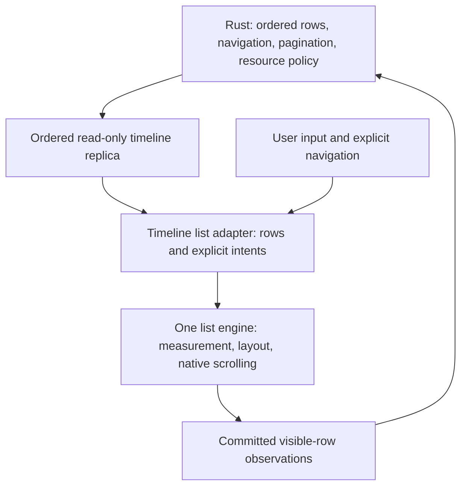

# Timeline viewport redesign

Status: design proposal; production implementation unchanged. Library selection requires the feasibility gate below.
Tracking: [#846](https://github.com/shinaoka/koushi-matrix/issues/846).
Baseline: Koushi `1684b770`. Scope: Room, Thread and Focused timeline rendering, layout, scrolling and their observation boundary. This is the replacement design for the mechanisms shipped with #837/#844, not a claim that the recurrence has been fixed.

## Decision

Use one list engine as the sole owner of row measurement, virtualization and implicit position preservation. Koushi supplies ordered Rust-projected rows and explicit presentation intents through one narrow adapter. Remove Koushi's parallel geometry correction machinery when switching engines.

Evaluate Virtua first, with React Virtuoso as the comparison candidate. Do not select by popularity or by another client using it: both must be assessed against the same mixed-update and native WebView cases. No dependency or production change is authorized by a passing toy example alone. A failed candidate is rejected or fixed at its owning library with tests; it is not surrounded with Koushi restoration timers.

Do not build a new custom coordinate engine as the default. Element Web's layout-based strategy remains an alternative if both library candidates fail the mandatory cases. That would require a separate feasibility result and an explicit revision of this decision, not an additional production fallback.

## What the investigation establishes

- The reported recurrence occurs on the latest build according to the user. Diagnostics show a large move toward the beginning immediately after a layout correction, without a corresponding list-size change. No private diagnostic log or account identifiers are included here.
- `TimelineView.tsx` marks a transaction terminal before its final write; this prevents reentrant duplication but does not prove that the browser has settled.
- Its free-scroll event handler treats an unmatched position notification as input for revision/anchor handling. `user_scroll` is a trigger name, not proof of a physical gesture.
- Current write classification depends on matching a recent absolute position. Delayed native motion, overscroll, layout clamping, and programmatic motion cannot be distinguished reliably by that comparison alone.
- The observed small list is below the current 600-row virtualization threshold. The defect cannot be attributed solely to crossing that threshold.
- These observations identify an unsafe boundary and a regression scenario. They do not establish which native or application operation caused the first large movement.

## Required user experience

1. Reading: new messages, receipts, media, pagination and repairs preserve a nearby visible stable row and its offset. A user gesture continues naturally through an update.
2. Following the live end: incoming rows stay visible until the user leaves the end. Layout shrink/growth alone cannot change this intent.
3. Explicit navigation: room re-entry, event/date/search navigation and jump-to-bottom use the Rust-provided identity or existing entry policy. New user navigation cancels obsolete positioning.
4. Short, long and threshold-crossing lists obey the same anchoring contract. No second small-list implementation.
5. A missing anchor never silently redirects the user to a distant estimate or the live end. Use a surviving nearby row in the prior ordered display; if none survives, treat it as a replaced context with an explicit entry policy.
6. DOM visual position and Core navigation completion are separate facts. A temporary renderer layout problem must not complete/retry a Matrix operation or manufacture unread state.

## Sources inspected and deliberate differences

These are source observations at pinned revisions, not claims of measured performance or correctness. References inform independently written code; no client implementation is transplanted. Follow repository licensing rules for any actual reuse.

| Reference | Observed design | Implication for Koushi |
| --- | --- | --- |
| [Element Web scrolling notes](https://github.com/element-hq/element-web/blob/fc60343257faa95cf29f5bd3b041523b376e12bc/docs/scrolling.md), [ScrollPanel](https://github.com/element-hq/element-web/blob/fc60343257faa95cf29f5bd3b041523b376e12bc/apps/web/src/components/structures/ScrollPanel.tsx) | Bottom-aligned content and explicit surface height absorb layout changes. Height rebalance waits for a short quiet interval; a tracked-row layout delta is applied with relative scrolling. The notes describe stale absolute offsets during macOS scrolling. | Preserve the principle of avoiding competing implicit writes during native motion. Merely replacing `scrollTop = ...` with `scrollBy(...)` does not recreate this layout model. |
| [Element X iOS table controller](https://github.com/element-hq/element-x-ios/blob/8262533b6df64ede18dbcdcca362b0e5f511b3c2/ElementX/Sources/Screens/Timeline/TimelineTableViewController.swift) | Native table/diffable snapshots; live timeline snapshot application waits while dragging, focused timeline application waits through inertia. Native delegate callbacks distinguish dragging and deceleration. | Separate data receipt from layout publication. A browser wheel callback is not equivalent to UIKit's gesture lifecycle. Do not emulate native certainty with a boolean consumed by the next scroll event. |
| [Element X Android timeline](https://github.com/element-hq/element-x-android/blob/99b7c758f2c5fbe37bb879ebea70ed4cd2c8c7fa/features/messages/impl/src/main/kotlin/io/element/android/features/messages/impl/timeline/TimelineView.kt) | Compose LazyColumn, stable identifiers, conditional reverse layout, list-owned scrolling state and explicit focus/end operations. | Delegate layout to one list implementation. Do not copy native reversed rendering into DOM order without accessibility proof. |
| [Sable RoomTimeline](https://github.com/SableClient/Sable/blob/1873c32984529ebac1d350933a5088873abe960c/src/app/features/room/RoomTimeline.tsx) | React/Cinny-derived client, Virtua VList, `shift`, stable rows, explicit focus/live handling. It also has client-specific delayed restoration and observers. | Virtua is a concrete candidate; Sable's surrounding retries and Matrix-JS product owners are not a blueprint for Koushi. |
| [Aurora Timeline](https://github.com/element-hq/aurora/blob/95e69fc560e31ea263f3e4d45fb9125557f49ace/src/Timeline/Timeline.tsx) | Experimental React + Matrix Rust SDK client. React Virtuoso receives rows, stable keys, first-item index, bottom alignment and pagination callback. | A useful example of a small renderer boundary, not evidence of full Room/Thread/Focused behavior or macOS momentum safety. |
| [Materix Timeline](https://github.com/DatanoiseTV/Materix/blob/a94f96994aafd5070e46e1d3bb5379b05718b0f4/src/ui/Timeline.tsx) | React/Tauri client with all items rendered; directly adjusts absolute scroll position from total-height growth. | Newness does not establish a suitable large-timeline design. Not selected as the anchoring reference. |

GitHub metadata checked on 2026-09-05: Materix repository created 2026-08-04 and pushed 2026-09-02; Sable created 2026-03-09 and pushed 2026-09-04. Repository creation is not necessarily a project's first release. Cinny itself predates these projects.

[Virtua's inspected API](https://github.com/inokawa/virtua/blob/4d8737daa91f605a3fec46e068b3dca4204fe68d/src/react/Virtualizer.tsx) limits `shift` to additions/removals at the start and warns against using it for middle/end mutations. This is a mandatory selection risk: Koushi receives mixed prepend, edit, removal and relocation batches. A boolean inferred from length change is insufficient. The source revision is not a chosen package version; pin an actual reproducible package and lockfile in the feasibility change.

Browser facts: [scrollend](https://developer.mozilla.org/en-US/docs/Web/API/Element/scrollend_event) indicates completed motion/gesture but does not fire for a nonmoving gesture, and older engines may not support it. [scrollTop](https://developer.mozilla.org/en-US/docs/Web/API/Element/scrollTop) may be fractional or outside the normal range during Safari overscroll. Detect actual host capabilities and preserve raw diagnostic geometry; normalized edge classification must not write a clamped value back into the browser.

## Final ownership

| Owner | Retains | Must not own |
| --- | --- | --- |
| Core/state/protocol | Stable display identity/order, subscriptions/generations, semantic navigation target, read state, pagination/request lifetime, resource policy | DOM pixels, wheel deltas, browser frames, measurement caches |
| Read-only replica | Correctly ordered current Rust display and revision | Alternative ordering, retry policy, independently edited timeline contents |
| Timeline list adapter | Mounted key/generation, current presentation intent, mapping stable row IDs to list indices, current committed layout revision | Matrix navigation state machine, second height model, compensating DOM writes |
| List engine | Measured heights, mounted window, implicit anchor retention, native input/scroll integration | Matrix IDs' meaning, fetching, unread semantics |
| Observation adapter | Visible IDs from the actually committed layout and settled/transition status | Treating pending data as visible, manufacturing user intent |

Keep normal chronological DOM/accessibility order. Short-list bottom alignment is a list layout option. Do not use CSS reversal as a shortcut.

## Presentation contract

Presentation intent has three meanings, not a collection of overlapping booleans:

- `reading`: no unsolicited end/event navigation. Implicit geometry preservation belongs to the list engine.
- `followingEnd`: stay at the live end through appends and geometry changes. Explicit departure changes it to reading.
- `positioning(target, token)`: realize a current Rust-provided event identity or existing room-entry anchor. A newer explicit action or user takeover invalidates the token. This is a renderer-lifetime realization token, not another Rust navigation operation.

Motion is independently observed as active or quiet by the engine/host. A `scroll` event is a position observation with unknown cause unless there is direct evidence. It may update visible rows and motion activity; it must not by itself create user authority, cancel navigation, or authorize explicit-top fetching. Wheel/key/touch/scrollbar intent is evidence of takeover, not a trustworthy measurement of pixel displacement. Accessibility/focus-driven scrolling needs an explicit tested host path rather than being rejected as an echo.

| Input | Required transition/effect |
| --- | --- |
| New key/generation | Dispose old engine callbacks/caches and observation scope; create the new entry intent from existing Core/room-entry contract. |
| User leaves the end | Following becomes reading; no queued end callback may win afterward. |
| Explicit event/end command | Replace positioning token, realize through the list API, report layout result locally; Core completion remains independent. |
| Data/height change while reading | Engine preserves local identity/offset; adapter does not issue restore calls. |
| Unknown/passive scroll | Observe only; do not convert it into gesture evidence or recapture a delayed restoration target. |
| Engine placement complete | End positioning becomes followingEnd; event/entry positioning becomes reading unless the existing entry policy specifies the end. Record a local terminal placement result; do not claim compositor settlement from a synchronous setter. |
| Anchor removed | Engine/adapter chooses a surviving adjacent row by prior display order, never a global estimate; wholly replaced context uses entry policy. |
| Unmount or account switch | Cancel listeners, frames, pending local positioning and discard geometry. No detached callbacks. |

A list engine that cannot maintain these transitions with a narrow adapter does not pass selection. The API is an ownership boundary, not permission to reconstruct the old controller inside a renamed hook.

## Updates and publication

Apply every admitted Core diff to the read-only replica in order, independently of presentation timing. Keep subscription/generation and batch admission in the existing authoritative paths. Do not infer prepend from item count, timestamps, or SDK indices.

For presentation, classify the before/after **display identity sequence** as start extension, end extension, content-only, structural replacement or scope reset. Preserve mixed batches as one logical publication. In particular, prepend plus removal/reordering must not be mislabeled as pure start extension to satisfy a library's `shift` option.

The selected engine must prove atomic stable-identity preservation for mixed updates. If it requires deferring such publication during motion, it may retain the existing committed row snapshot plus one latest pending revision; do not queue every intermediate array or copy the account. No product state is deferred. No timer may force a disruptive restore during continuing native motion. At motion completion, publish the latest replica once through the engine's own supported preservation operation. If the engine cannot provide that operation, reject it rather than implementing an extra Koushi correction path.

Any deferred presentation must retain correct visible-ID evidence for the committed revision. Removed/redacted content must cease being exposed immediately: preserve a fixed-size non-content shell only if needed for geometry, not stale message text. Anchor deletion, selection, context menus and actions must resolve against current Rust identity/permissions. This requirement is part of feasibility, not a later cleanup.

Continuous input must not cause unlimited staged pages or starvation. While a page's layout is pending, retain the existing pagination layout blocker. At the loaded edge, show loading/end/failure through fixed layout space. Native motion may reach the loaded boundary; it must not be forcibly repositioned to extend it. Resuming after publication must continue from the same nearby row. Test long gestures and nonmoving wheel input, not just eventual idle.

Reserve image/preview geometry using existing metadata/fallback boxes. Font, reaction, receipt, editing, thread-summary, panel-width and pagination-chrome changes must enter the same engine's measurement path. No row component writes an ancestor's scroll position. Portals/overlays must not unexpectedly change list height.

## Navigation, pagination and visibility

Keep the existing Rust headless contract for targets, focused context, unread markers and page terminal/diff correlation. Explicit adapter requests use stable row identity resolved at the current revision. Large event jumps may ask the engine to mount an item; all estimate-to-measure refinement belongs inside that engine, with no parallel Koushi follow-up frame.

Presentation completion is not a Core acknowledgment. A missing renderer target ends local positioning with a missing-target result; it cannot wait indefinitely, trigger a second server query or redefine the Rust navigation outcome. Scope change and subsequent genuine user takeover prevent any old local placement from applying.

**Revision consistency is a required headless boundary check.** If the committed layout lags newer Rust rows, being at the bottom of that old layout is not evidence of the current live end. The current Core navigation calculation (`crates/koushi-core/src/timeline/navigation.rs`, `newer_unread_event_count`) and display projection (`display_projection.rs`) consume `at_bottom` consequentially. During feasibility, prove that the existing observation contract can correlate the observed generation/display revision with current actor state. Merely withholding new observations may leave a previous true value stale and is not sufficient proof. If existing facts cannot express this distinction, amend the Rust protocol/state-machine canon and implement revision-scoped viewport acceptance in Phase A before enabling deferred publication. Stale positive end observations must not zero newer counts, advance read state or drive live-edge projection. React must not compensate by computing unread semantics. Add deferred append + old-bottom observation, stale observation arrival, and catch-up publication tests at the real Core boundary.

One existing pagination evaluator remains during this renderer migration. It consumes committed visible range, normalized edges and a layout-transition blocker; it does not need engine-private compensation phases. Preserve underfill/near-top behavior, explicit-input requirements, request epochs, acceptance evidence, failure fences and `GapRepairReleased` causality. Do not increase thresholds or retry rejected requests to make a renderer test pass.

The eventual toolkit-independent subscription/resource policy of #840/#839 remains a separate Rust migration. Expose facts that it can consume; do not move DOM mechanics into Rust or rebuild resource scheduling in the new adapter. Mark authoritative facts and renderer-only blockers separately so subsequent migration is explicit.

## Preserve existing tests; add only necessary evidence

The user explicitly requires retaining the existing test items and avoiding excessive defensive test additions. Keep every existing behavioral scenario and its assertions. If replacement removes a private helper/controller, migrate that test's externally meaningful scenario to the new owner rather than dropping it. Source-structure assertions may follow the new structure; they are not a reason to discard behavioral coverage. Record an old-scenario to retained-test mapping during implementation.

Add only (1) a deterministic regression for the observed correction/late-scroll ordering, and (2) a focused test for an actually changed boundary that existing tests do not cover, such as deferred-layout end observation if that feature is used. First reuse existing resize, prepend, generation, teardown and navigation tests. Do not add a Cartesian product of engines, list sizes, input kinds and platforms, generic fault injection, or tests that merely repeat implementation branches.

Large synthetic sizes should parameterize an existing suitable scenario or one focused scaling check. Long benchmarks characterize acceptance separately and must not proliferate default CI cases. The checklist below is an inventory for mapping existing coverage and exposing a material gap, not an instruction to create a new test for every entry.

## CI duration is a design constraint

The user requires tests that finish within a few minutes. The **added ordinary PR verification path targets 120 seconds and has a hard 180-second wall-clock ceiling**, including fixture generation, test-environment startup, execution and cleanup on the declared CI runner. Measure cache-miss fixture setup as well as warm runs. Do not hide seeding in another required job, split work into sequential jobs that exceed the path budget, or rely on automatic retries. Existing repository build/full-suite timings remain separately reported; this document does not claim to shorten those already-existing jobs. Candidate-specific build/setup added by this design is part of its budget.

- Use real Rust synthetic-scaling checks plus focused renderer regressions in the default path. Large counts must be cheap input generation, not 10,000 protocol account joins.
- Reuse the existing small-server integration lane when a Core/transport contract changes. Start with 4–8 accounts and 100–300 events for the focused regression, scaling down unrelated fixture features if needed. The new focused path still has to meet the total ceiling; a slow database seed is not an exemption. Do not create a new expensive server fixture for a geometry-only assertion.
- The 10,000-member/100,000-event real-server fixture, long retention/throughput benchmarks and native host qualification are separately invoked acceptance work, never prerequisites of every PR run or hidden default jobs. Run them for engine selection/major migration/release qualification as specified, and report coverage explicitly.
- Use bounded event-driven waits. Set inner test/process deadlines that leave cleanup time before the 180-second job ceiling; a killed test must not orphan homeservers. Exceeding the budget fails the CI design. Reduce redundant new work, reuse supported tiny snapshots, or move new performance characterization to the separate acceptance tier while retaining existing test items; do not loosen correctness assertions or increase timeouts to pass.
- Before making the new path required, record repeated end-to-end timing on the pinned runner (at least three runs, including fresh fixture setup), plus the scenario coverage and memory/process cleanup evidence. Until then, the 120/180-second numbers are requirements, not measured results.

## Large-room acceptance is the primary gate

The user's acceptance criterion is a room with many members and long history, not a smooth isolated list demo. A renderer replacement alone cannot establish this outcome: Core publication cost, profile fan-out, receipts, media demand, history repair and retained data all participate. Coordinate those owners with #839/#840; do not label this end-to-end goal complete while they still scale with unrelated room data.

Use these **stress dimensions** to define coverage, not claimed supported limits or a requirement to provision every dimension on every test run:

| Dimension | Small control | Large-room target |
| --- | --- | --- |
| Membership | 100 | 10,000 members |
| Server-side history | 1,000 events | 100,000 events, variable text/media sizes |
| Readers on one event | 4 | 1,500 readers |
| Client session history | Initial window | Repeated pagination through at least 10,000 events, then navigate away/back |
| Concurrent updates | Idle | Bursts of messages, receipts, profile changes, edits and history-repair results |

### Fixture cost and verification tiers

Creating and joining 10,000 real accounts may dominate test time and disk use, especially with encrypted devices. No seeding time has been measured yet. Do not build that environment merely to verify a viewport change.

- **Fast scaling tier:** construct large synthetic input at the real Rust projection/state boundary and test actual production processing. Feed resulting Rust-shaped DTO fixtures to renderer tests. Exercise the target counts independently. Do not make a JavaScript fake that implements Matrix or Rust semantics. This tier measures local algorithms and presentation, not network/sync correctness.
- **Protocol integration tier:** disposable Tuwunel/Synapse with a small real cohort (initial working budget: 4–8 accounts and 100–300 events for normal CI; a larger local calibration cohort may be used outside CI), exercising sync, encryption where applicable, pagination, receipt updates and the complete transport/renderer path. These are starting fixture sizes, subject to the ordinary CI wall-clock ceiling, not performance guarantees. Reuse deterministic fixture generation and cleanup.
- **Full-scale acceptance tier:** a separately invoked, resumable fixture for large-room opening and long-history browsing. First benchmark seeding on the small cohort; report events/joins per second, disk growth and time spent in encryption, indexing and sync. Extrapolation is planning evidence only. Set explicit elapsed-time/disk ceilings before full provisioning, stop safely at a ceiling, and retain the progress manifest. Run independent membership/history/receipt scale cases before the combined case. Do not make this the default pull-request gate.

Seed full-scale data once per fixture/server version and reuse an offline, consistent disposable server snapshot with a documented tool/version/configuration/seed manifest. Client cold-cache cases use a fresh client store against that same server; warm-cache cases use a separately prepared client snapshot. Never clone a running database casually or reuse real credentials. Test fixtures must not rewrite database tables to synthesize protocol state. Successful API-created seed snapshots or supported import paths are required for end-to-end claims. Fixture credentials stay in local test storage, not manifests or repository files.

The report distinguishes synthetic scaling, real small-cohort integration and actually achieved full-scale runs. If full-scale setup is unavailable or exceeds its cost ceiling, report that coverage as unverified; do not silently lower counts or present the cheaper tiers as equivalent evidence. Design work and engine screening can finish without that expensive environment, but the final large-room acceptance claim cannot.

Membership and history counts vary independently; run cold local cache, warm cache, room re-entry, distant focused-event opening and Room/Thread switching. Fix viewport, content distribution, device budget and network conditions when comparing scales. Report server/network latency separately from time spent processing the first usable projection. Test both one large room and a retained account with many previously visited rooms.

Required scaling properties:

- Opening the room does not enumerate/download all members, avatars or server history before showing the initial usable timeline. Core keeps the SDK's canonical owners; a second membership/event database must not be introduced for the renderer.
- Mounted rows and geometry measurements track the visible window plus a specified overscan allowance, independently of server history. The selection report must state the exact overscan/mount cap and account for pinned focus/anchor rows.
- Compact receipts are bounded by the Rust projection; full reader/member lists are explicit virtualized surfaces with visible-only image demand. Until #839 provides that contract, large-room acceptance is blocked even if the new list engine passes its own tests.
- Avatar demand follows visible identities plus explicit prefetch, deduplicated across surfaces. Record distinct queued/in-flight fetches and actual server request counts. Rendering fewer images is not network evidence. Closing/switching surfaces removes obsolete demand.
- A single receipt/profile/message update does not trigger whole-account timeline publication, recompute every retained reader label, or remeasure all history. Measure Core execution/publication, transport bytes, React commits and mounted-row measurements separately. Conformance here depends on the scoped architecture migration in #840 where current owners do not yet satisfy it.
- Repeated scrolling/switching retains at most one pending presentation revision and no obsolete observers/frames. Measure JS heap and process/Rust memory after a fixed recovery/quiescence point. An engine's bounded DOM is not proof of bounded timeline-store memory. Report retained row/profile/media counts and the owning cache/window/eviction policy; unexplained linear growth over repeated identical visit cycles fails acceptance.
- While data loads, typing in the composer, room switching and an upward gesture remain responsive. Pending pagination, repair or indexing must not monopolize the UI or Core command loop. No requirement to fetch the entire history to prove room readiness.

Before implementation acceptance, establish a reproducible reference device and baseline. The benchmark report must provide first-usable-timeline time, input-to-next-paint p50/p95/p99, frame gaps excluding suspended/background intervals, peak and retained memory, publication bytes, distinct image requests and recovery work. Record sample counts and per-scenario traces. Performance budgets are not invented as proven guarantees here: selection must define numerical budgets on the reference hardware before comparing candidates, and must reject regressions rather than loosen them after a failure. The architectural bounds above are mandatory regardless of machine speed.

## Removal and retention map

| Current mechanism | Final disposition |
| --- | --- |
| `TimelineViewportTransaction.ts` and its active/stable anchors, input/write revisions and exact-position echo evidence | Remove after replacement passes; no compatibility controller. |
| TimelineView measurement/settlement ResizeObservers and `flushSync` restoration continuation | Remove; engine measures and preserves. Keep media observers only for independent media behavior. |
| Custom height model, virtual window/spacers, 600-row mode split | Replace with selected engine, including short lists. Remove obsolete caches/helpers; migrate existing test scenarios without deleting coverage. |
| Prepend/projection/height compensation and max-defer flush owner | Remove; use one supported layout publication operation. |
| Direct `scrollTop`, `scrollIntoView`, `restoreRoomScrollAnchor` writers and delayed jump/end follow-ups | Replace with explicit calls through one list adapter; no direct writers outside engine. |
| `TimelineProjectionBoundary` | Retain only scope/revision and publication coordination actually needed; delete transaction-specific hooks. |
| Timeline viewport scheduler | Retain only independently needed renderer callbacks, with scope teardown; remove obsolete correction queues. |
| Stable event/row identity helpers, read-only timeline store, Core navigation/page lifecycle | Retain and test their boundaries; no Matrix semantic rewrite. |
| Avatar/preview visible range observers | Feed from committed list observations; no extra scroll listener that can write position. |
| Diagnostic write counters | Attribute engine vs explicit navigation; remove transaction-specific success claims. |

## Verification before implementation choice

Create one disposable synthetic conformance harness using the real production row layout/CSS, driven by the same Rust-shaped display batches. Compare the current engine and each candidate with the same input schedule and geometry oracle. No real account data, no Matrix reducer fake, no synthetic helper that already implements the desired correction.

Coverage inventory (reuse existing tests first; add only a material missing regression under the rule above):

- Short lists around 100 rows, long lists at 599/600/601 and several thousand rows; no blank regions when crossing old thresholds.
- Repeated upward gestures with prepend + edit + remove + thread-root relocation in one batch; multiple pages and delayed measurements.
- Separate browser-visible position from JavaScript-read position in a deterministic host model: delayed observations, coalesced events, rounded/fractional values, overscroll and passive clamping. This model demonstrates robustness to an ordering, not proof that the actual recurrence used it.
- Resize above/inside/below the visible anchor during input and inertia; no net-motion gesture; font/viewport width changes; short-list growth/shrink and fixed pagination chrome.
- Explicit jumps during motion, user takeover before/after placement, missing/deleted targets, generation replacement, room/thread/focused switches and teardown.
- Continuous scrolling with deferred pages, error/retry admission, underfill, no-content pages, and viewport observation during pending publication.
- Redaction/removal while publication is deferred; stale content/action is never exposed.
- Keyboard PageUp/Home/End, scrollbar dragging, focus/accessibility navigation, reduced motion, selection/copy and screen-reader order.

Oracles are visible stable row + offset and continuity relative to an equivalent gesture with no data change, not absolute scrollTop alone. Existing pixel tolerances may not be relaxed. Sample across presentation frames, not only after idle. Count unsolicited adapter writes, redundant restores, queued callbacks and retained pending revisions; assert no competing owner and bounded resources. Engine-internal writes are instrumented separately and must not break native motion; zero wrapper writes is insufficient proof.

Retain and run the existing component/browser test items. For this macOS recurrence, qualify the focused synthetic reproduction through the actual Tauri WKWebView with native wheel/trackpad inertia and application build identity recorded. Playwright WebKit and jsdom are not WKWebView equivalence evidence. Reuse existing platform verification; do not add a new exhaustive platform matrix for this work. Record unavailable relevant native evidence as unverified rather than passed. Real-account manual observation is only confirmation.

Only select a library when mixed-update preservation, native-motion continuity, lifecycle and accessibility pass without a second correction owner. Record exact package version/license, engine/OS revisions, failures and tradeoffs. If neither passes, revise the architecture explicitly. Do not choose by a smaller source file or carry unproven exceptional paths into integration.

## Development environment

Implementation and ordinary test work run on Linux, aligned with CI. Keep macOS for focused verification of the reported WKWebView/native-momentum recurrence. A Linux/browser pass alone is not evidence that the macOS defect is fixed. This division does not require a new exhaustive platform test suite.

## Delivery sequence and canon amendment

1. **Design review (this change):** agree on ownership, invariants, source comparisons, deletion map and feasibility gates. Current source remains untouched. Amend the plan index/architecture navigation to identify this replacement proposal.
2. **Feasibility:** build the bounded comparative harness and reproduce the unsafe ordering on baseline. Select/pin an engine only from the evidence above. Amend the normative viewport implementation contract before production replacement; keep behavioral and Rust ownership requirements intact.
3. **Headless boundary:** retain existing Core contract tests and both-server timeline QA. Add Rust tests first if a semantic command, projection or observation policy actually changes; do not introduce Rust DTOs merely to hold browser geometry.
4. **Renderer replacement:** integrate the selected engine for all timeline kinds in one branch, remove the old production owners, and update fixtures/diagnostics/docs together. A temporary comparison switch exists only in the harness and is removed at phase exit.
5. **Integrated verification:** retain all existing test items, add the focused recurrence regression and only necessary changed-boundary checks, run the existing affected browser/component/type/lint/build and both-server timeline gates, and collect targeted native host evidence. Perform large-room characterization separately under its fixture/time budget. Independent review of integrated diff is required. No release/merge claim from design or prototype results.

The proposed normative replacement is: **one list engine owns measurement, virtualization and implicit anchor preservation; Koushi issues explicit navigation through one adapter and publishes ordered rows/viewport facts. Unclassified scroll observations are not user authority.** This replaces the requirement to implement Koushi's particular transaction/write-generation algorithm, while preserving scope fencing, local anchors, no competing writers and renderer-only geometry. Do not silently leave both normative algorithms active.

## Review and verification record

Independent read-only design review: approved as a proposal, with library selection and implementation still gated. Two review amendments were incorporated: revision-consistent end observations across deferred publication, and explicit successful/missing-target placement terminals. Review also checked the tiered fixture cost model. Subsequent explicit user constraints are reflected in preservation of existing test items, minimal new tests, and the added ordinary CI path’s 120-second target/180-second ceiling; main-agent self-review checked that large provisioning and native qualification remain outside default PR jobs. Main-agent self-review confirms that the proposal leaves current production canon in force and does not claim the expensive fixture or native-motion tests have run.

Documentation checks: `node scripts/check-agents-docs.mjs`, `git diff --check`, and local relative-link validation. No implementation, native conformance or dependency compatibility result is claimed by this document.
